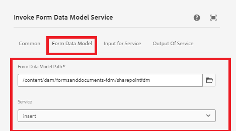

# Infoga data i SharePoint-listan med hjälp av arbetsflödessteget invecklad FDM


I den här artikeln beskrivs stegen som krävs för att infoga data i SharePoint-listan med hjälp av steget invoke FDM i AEM arbetsflöde.

I den här artikeln förutsätts att du har [konfigurerat adaptivt formulär för att skicka data till SharePoint-listan.](https://experienceleague.adobe.com/docs/experience-manager-cloud-service/content/forms/adaptive-forms-authoring/authoring-adaptive-forms-core-components/create-an-adaptive-form-on-forms-cs/configure-submit-actions-core-components.html?lang=en#connect-af-sharepoint-list)


## Skapa en formulärdatamodell baserad på SharePoint listdatakälla

* Skapa en ny formulärdatamodell baserad på SharePoint listdatakälla.
* Lägg till lämplig modell och få service för formulärdatamodellen.
* Konfigurera infogningstjänsten för att infoga modellobjektet på den översta nivån.
* Testa infogningstjänsten.


## Skapa ett arbetsflöde

* Skapa ett enkelt arbetsflöde med ett FDM-steg.
* Konfigurera steget invoke FDM för att använda formulärdatamodellen som skapades i föregående steg.
* 

## Adaptiv form baserad på kärnkomponenter

De data som skickas har följande format. Vi måste extrahera ContactUS-objektet med punktnotation i arbetsflödessteget för att anropa Form Data Model Service, vilket visas på skärmbilden

```json
{
  "ContactUS": {
    "Title": "Mr",
    "Products": "Photoshop",
    "HighNetWorth": "1",
    "SubmitterName": "John Does"
  }
}
```


* 


## Adaptiv form baserad på grundläggande komponenter

De data som skickas har följande format. Extrahera ContactUS JSON-objektet med punktnotation i arbetsflödessteget för att anropa Form Data Model Service

```json
{
    "afData": {
        "afUnboundData": {
            "data": {}
        },
        "afBoundData": {
            "data": {
                "ContactUS": {
                    "Title": "Lord",
                    "HighNetWorth": "true",
                    "SubmitterName": "John Doe",
                    "Products": "Forms"
                }
            }
        },
        "afSubmissionInfo": {
            "lastFocusItem": "guide[0].guide1[0].guideRootPanel[0].afJsonSchemaRoot[0]",
            "stateOverrides": {},
            "signers": {},
            "afPath": "/content/dam/formsanddocuments/foundationform",
            "afSubmissionTime": "20240517100126"
        }
    }
}
```


## Konfigurera anpassat formulär för att aktivera AEM arbetsflöde

* Skapa anpassat formulär med den formulärdatamodell som skapades i det tidigare steget.
* Dra och släpp fält från datakällan till formuläret.
* Konfigurera skicka-åtgärden för formuläret enligt nedan
* 


## Testa formuläret

Förhandsgranska formuläret som skapades i föregående steg. Fyll i formuläret och skicka. Informationen i blanketten ska infogas i SharePoint-listan.
