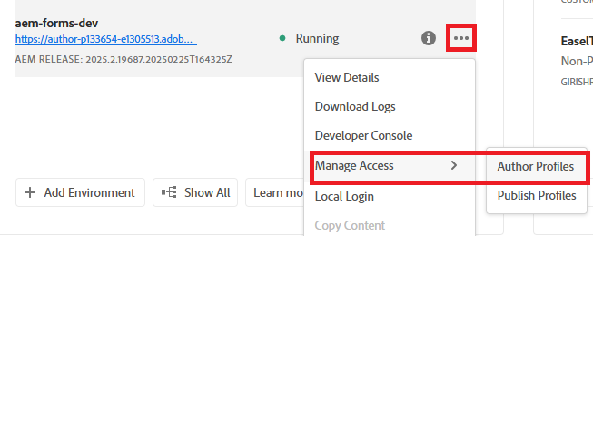

# Konfigurera OpenAPI-baserade AEM Forms Communication API:er i AEM Forms as a Cloud Service

## Förutsättningar

* Senaste instansen av AEM Forms as a Cloud Service.
* Alla nödvändiga [produktprofiler läggs till i miljön.](https://experienceleague.adobe.com/sv/docs/experience-manager-learn/cloud-service/aem-apis/invoke-openapi-based-aem-apis)

* Ge AEM API åtkomst till produktprofilen enligt nedan
  
  

## Skapa Adobe Developer Console Project

Logga in på [Adobe Developer Console](https://developer.adobe.com/console/) med din Adobe ID.
Skapa ett nytt projekt genom att klicka på lämplig ikon

Ge projektet ett beskrivande namn och klicka på ikonen Lägg till API

Välj Experience Cloud

Välj AEM Forms Communications API och klicka på Nästa

Kontrollera att du har valt server-till-server-autentisering och klicka på Nästa

Markera profilerna och klicka på knappen Spara konfigurerad API för att spara inställningarna

Klicka i OAuth Server-till-server

Kopiera klient-ID, klienthemlighet och omfång

## Konfigurera AEM-instans för att aktivera ADC-projektkommunikation

Om du redan har ett AEM Forms-projekt [följer du de här instruktionerna](https://experienceleague.adobe.com/sv/docs/experience-manager-learn/cloud-service/aem-apis/invoke-openapi-based-aem-apis) för att aktivera Adobe Developer Console Projects autentiseringscertifikat OAuth Server-to-Server ClientID för kommunikation med AEM-instansen

Om du inte har något AEM Forms-projekt skapar du ett [AEM Forms-projekt genom att följa den här dokumentationen.](https://experienceleague.adobe.com/sv/docs/experience-manager-learn/cloud-service/forms/developing-for-cloud-service/getting-started) och aktivera sedan klientens-ID:t för OAuth Server-till-Server-autentiseringsuppgifter för Adobe Developer Console Project för att kommunicera med AEM-instansen [med hjälp av den här dokumentationen.](https://experienceleague.adobe.com/sv/docs/experience-manager-learn/cloud-service/aem-apis/invoke-openapi-based-aem-apis)

## Nästa steg

[Generera åtkomsttoken](./generate-access-token.md)
