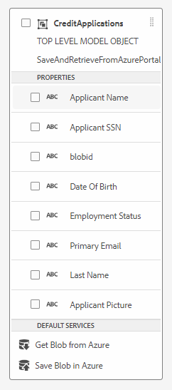

# Skapa integreringen med Azure Storage

Nästa steg är att skapa integreringen mellan AEM Forms CS och Azure Storage med hjälp av formulärdatamodellen.
I följande video får du hjälp med att skapa integreringen.

>[!VIDEO](https://video.tv.adobe.com/v/335385?quality=12&learn=on)

I den här självstudiekursen skapades en formulärdatamodell med namnet SaveAndRetrieveFromAzurePortal med entiteten CreditApplications

## Nästa steg

[Skapa anpassat formulär](./create-af.md)

