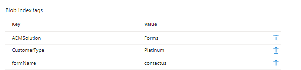

# Introduktion

I den här självstudiekursen lär du dig hur du implementerar ett enkelt användningsfall för att lagra formulärinskickade formulär i Azure-lagring med blobindextaggar. Blobindexmärkord ger datahanterings- och identifieringsfunktioner genom att använda indexmärkordsattribut för nyckelvärden. Du kan kategorisera och söka efter objekt i en enda behållare eller i alla behållare på ditt lagringskonto.

## Krav

* Upplev AEM Forms CS.
* Upplev hur man driftsätter kod med hjälp av molnhanteraren.
* Tillgång till en molnklar instans av AEM Forms CS.

För att implementera ovanstående användningsexempel i AEM Forms CS behöver du följande

* [AEM Forms CS cloud ready instance](https://experienceleague.adobe.com/docs/experience-manager-learn/cloud-service/forms/developing-for-cloud-service/intellij-and-aem-sync.html?lang=en#set-up-aem-author-instance)
* [Azure Portal-konto](https://portal.azure.com/)

### Nästa steg

[extend-choice-group-components](./extend-choice-group-components.md)
