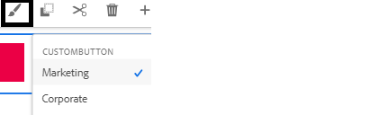

# Testa ändringarna

Skapa ett anpassat formulär baserat på mallen **&quot;Tom med kärnkomponenter&quot;**. Dra och släpp 3 knappar på formuläret och etikettera dem som&quot;Företag&quot;,&quot;Marknadsföring&quot; och&quot;Standard&quot;.
Tilldela passande stilvarianter till knapparna för företag och marknadsföring genom att välja målarpenseln som visas

## Bygg temaprojektet

Nästa steg är att skapa temaprojektet. Navigera till rotmappen för temaprojektet och kör kommandot _**npm, kör build**_ enligt skärmbilden nedan

När temaprojektet har byggts är du redo att testa ändringarna.

## Snabbt och enkelt sätt att testa din CSS

* Öppna filen tema.css under mappen dist i temaprojektet.Markera och kopiera hela filinnehållet.
* Förhandsgranska formuläret som skapades i det tidigare steget.
* Högerklicka på någon av knapparna och välj Inspect för att öppna utvecklarkonsolen.
* Klicka på temat.css i utvecklarkonsolen för att öppna temat.css
* Markera och ta bort hela innehållet i temat.css med hjälp av CTR-A och tryck på knappen Ta bort.
* Kopiera och klistra in innehållet i temat.css som du skapade i det tidigare steget.
* Knapparna bör uppdateras med rätt format enligt nedan.

