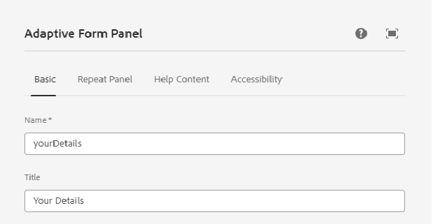

# Skapa anpassat formulär

Skapa ett grundläggande komponentbaserat adaptivt formulär och infoga en vertikal flikkomponent i formuläret.

## Konfigurera vertikal komponent

Klicka på den lodräta flikkomponenten för att öppna egenskapssidan för konfigurationen. Konfigurera följande flikar

1. Grundläggande - Ange ett beskrivande namn och en rubrik för den lodräta flikkomponenten enligt nedan
   
1. Objekt - På fliken Objekt kan du lägga till objekt i den lodräta flikkomponenten. I allmänhet lägger du till en panel som ett objekt och lägger sedan till formulärelementen på panelen. Den lodräta fliken har som standard två objekt och du kan namnge objekten enligt dina önskemål enligt nedan
   

## Konfigurera enskilda paneler

1. Din information - Välj objekt 1 under noden **Din information** och öppna egenskapssidan för konfigurationen. Ange ett beskrivande namn och en rubrik enligt nedan
   

Lägg till följande fält på panelen Dina uppgifter så som visas

1. Adress - Välj objekt 2 under noden **Din information** och öppna egenskapssidan för konfigurationen. Ange ett beskrivande namn och en rubrik enligt nedan
   

Lägg till följande två textfält på adresspanelen enligt nedan

