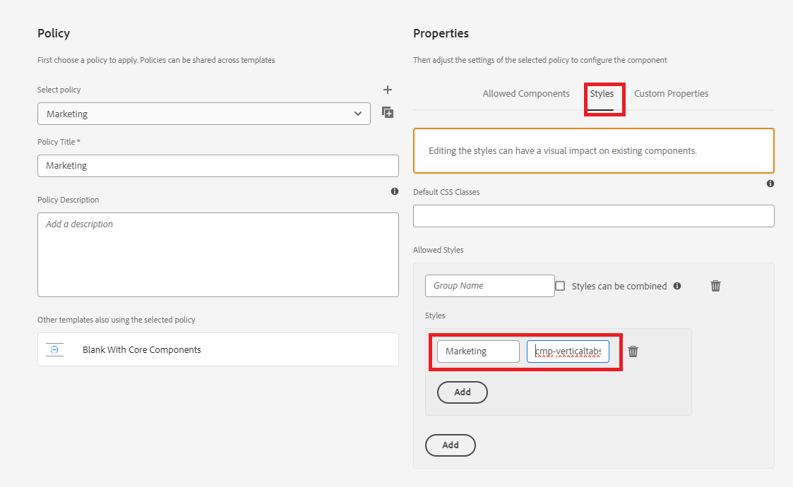

# Lägga till anpassade ikoner

Om du lägger till anpassade ikoner på flikar kan du förbättra användarupplevelsen och den visuella känslan på några sätt:

* Förbättrad användarvänlighet: Ikoner kan snabbt förmedla syftet med varje flik, vilket gör det enklare för användarna att snabbt hitta det de letar efter. Visuella ledtrådar som ikoner hjälper användarna att navigera mer intuitivt.

* Visuell hierarki och fokus: Ikoner skapar en mer distinkt separation mellan flikar, vilket förbättrar den visuella hierarkin. Detta kan hjälpa viktiga flikar att sticka ut och effektivt styra användarnas uppmärksamhet.
Genom att följa den här artikeln bör du kunna placera ikonerna så som visas nedan


## Förutsättningar

Om du vill följa den här artikeln måste du känna till Git, skapa och driftsätta ett AEM-projekt med hjälp av molnhanteraren, konfigurera en frontendpipeline i AEM molnhanterare och lite CSS. Om du inte känner till de ovannämnda ämnena kan du följa artikeln [med teman för att utforma kärnkomponenter](https://experienceleague.adobe.com/sv/docs/experience-manager-cloud-service/content/forms/adaptive-forms-authoring/authoring-adaptive-forms-core-components/create-an-adaptive-form-on-forms-cs/using-themes-in-core-components#rename-env-file-theme-folder) .

## Lägg till ikoner i temat

Öppna temaprojektet i visuell studiokod eller i en annan redigerare som du själv väljer.
Lägg till de ikoner du vill ha i mappen images.
De ikoner som är markerade med rött är de nya ikonerna som läggs till.


## Skapa ikonkarta för att lagra ikonerna

Skapa ikonmappningen i filen _variable.scss. SCSS-mappningen $icon-map är en samling nyckelvärdepar, där varje nyckel representerar ett ikonnamn (som home, family, osv.) och varje värde är sökvägen till bildfilen som är associerad med den ikonen.


```css
$icon-map: (
    home: "./resources/images/home.png",
    family: "./resources/images/icons8-family-80.png",
    pdf: "./resources/images/pdf.png",
    income: "./resources/images/income.png",
    assets: "./resources/images/assets.png",
    cars: "./resources/images/cars.png"
);
```

## Lägg till mixin

Lägg till följande kod i _mixin.scss

```css
@mixin add-icon-to-vertical-tab($image-url) {
  display: inline-flex;
  align-self: center;
  &::before {
    content: "";
    display:inline-block;
    background: url($image-url) left center / cover no-repeat;
    margin-right: 8px; /* Space between icon and text */
    height:40px;
    width:40px;
    vertical-align:middle;
    
  }
  
}
```

Den här blandningen är avsedd att lägga till en anpassad ikon bredvid texten på en lodrät flik. Du kan enkelt ta med en bild som en ikon på flikar, placera den bredvid texten och formatera den för att säkerställa konsekvens och justering.

Uppdelning av mixinen, här är vad varje del av mixinen gör:

Parametrar:

* $image-url: URL:en för ikonen eller bilden som du vill visa bredvid tabbtexten. Om du skickar den här parametern blir blandningen flexibel eftersom det går att lägga till olika ikoner på olika flikar efter behov.

* Använda format:

   * display: inline-flex: Detta gör elementet till en flex-behållare, vilket justerar kapslat innehåll (som ikonen och texten) vågrätt.
   * align-self: center: Ser till att elementet är lodrätt centrerat i sin behållare.
   * Pseudoelement (::before):
   * content: &quot;&quot;: Initierar pseudoelementet ::before, som används för att visa ikonen som en bakgrundsbild.
   * display: inline-block: Anger att pseudo-elementet ska vara textbundet, så att det beter sig som en ikon som är textbunden.
   * background: url($image-url) left center / cover no-repeat;: Lägger till bakgrundsbilden med hjälp av URL:en $image-url. Ikonen justeras åt vänster och centreras lodrätt.

## Uppdatera _verticaltabs.scss

För den här artikeln skapade jag en ny CSS-klass (cmp-verticaltabs—marketing) för att visa flikikonerna. I den här nya klassen utökar vi tabbelementet genom att lägga till ikonerna. Den fullständiga listan för CSS-klassen är följande

```css
.cmp-verticaltabs--marketing
{
  .cmp-verticaltabs
    {
      &__tab 
        {
          cursor:pointer;
            @each $name, $url in $icon-map {
            &[data-icon-name="#{$name}"]
              {
                  @include add-icon-to-vertical-tab($url);
              }
            }
        }
    }
}
```

## Ändra komponenten vertikaltabbar

Kopiera filen verticaltabs.html från ```/apps/core/fd/components/form/verticaltabs/v1/verticaltabs/verticaltabs.html``` och klistra in den under komponenten verticaltabs i projektet. Lägg till följande rad ```data-icon-name="${tab.name}"``` i den kopierade filen under den liska rollen som visas i bilden nedan

vi anger ett anpassat dataattribut med namnet data-icon-name med värdet för tabbnamnet. Om tabbnamnet matchar ett bildnamn i ikonmappningen associeras motsvarande bild med tabben.


## Testa koden

Distribuera den uppdaterade vertikaltabs-komponenten till din molninstans.
Distribuera det uppdaterade temat med hjälp av frontend-pipeline.
Skapa en formatvariant för de lodräta flikkomponenterna enligt nedan

Vi har skapat en stilvariation som kallas Marketing och som är kopplad till CSS-klassen _&#x200B;**cmp-verticaltabs—marketing**&#x200B;_ .
Skapa ett anpassat formulär med en vertikal flikkomponent. Koppla den lodräta flikkomponenten till varianten av marknadsföringsformatet.
Lägg till några flikar på de lodräta flikarna och ge dem ett namn som matchar bilderna som definieras i ikonkartan, till exempel home, family.


Om du förhandsgranskar formuläret bör du se de ikoner som är kopplade till fliken
