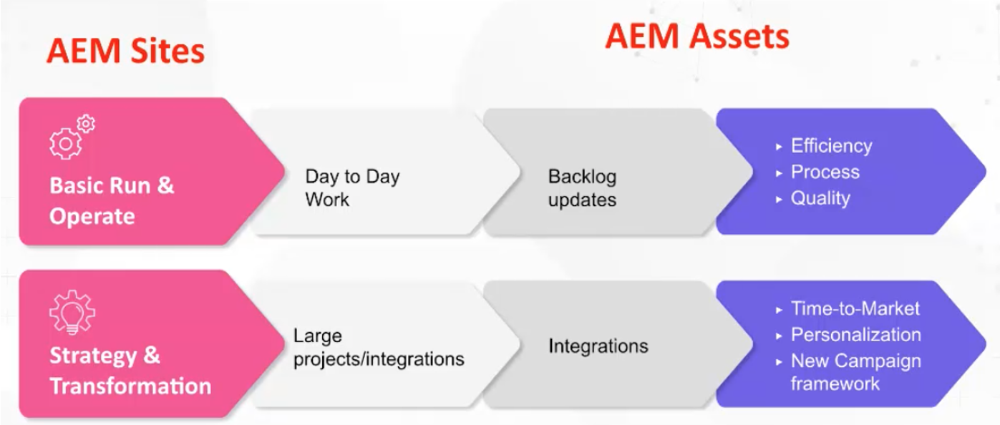

# Adobe Experience Manager (AEM) - Styrnings- och personalmodeller och arkitekter

Som ledande kund inom kundupplevelsen förstår Adobe hur utmanande det kan vara för er att se till att ni har rätt personal och styrningsramverk för att öka effektiviteten. Med Adobe branschbeprövade styrnings- och personalmodeller har ni de verktyg och den kunskap som behövs för att skapa en stabil grund för innehålls- och resurshantering. I den här artikeln diskuterar vi olika sätt att driftsätta din Adobe Experience Manager-plattform (AEM) och få ut så mycket som möjligt av dina insatser.

## Skapa en överlägsen operativ miljö

För att kunna köra och använda AEM bör du tänka på följande:

* Utför strategiska milstolpar - Det kommer att finnas många strategiska milstolpar (personalisering, flerkanalsintegrering osv.) som inte kan utföras om du inte har rätt personalmodell.
* Skapa en grund för digital omvandling - AEM används ofta som ett första steg i en organisations moderniseringsprocess. Genom att sätta en grund kan ni utnyttja AEM fulla kapacitet.
* Användarengagemang - Ha ett team på plats för att utföra taktiskt arbete (uppdateringsarbetsflöden, behörigheter, CSS osv.) Ju mer ni har glapp mellan vad användarna vill ha och vad de får, desto mer frustrerade kan de bli. Det är viktigt att användarna fortsätter att investera i systemet, investera i lösningen och att ni har rätt operativmodell.

Vad är då rätt modell? Vilken är rätt rollmatris att skapa?

Det finns inte ett enda specifikt svar, eftersom en AEM konfiguration kan variera mycket, precis som för olika organisationer, vilket gör att det behövs olika stödroller. Varje vertikalt, varje bransch, kräver olika implementeringar av teamstrukturen. Men du kan skapa en baslinje genom att etablera arketyper.

## Arkityper

Arkityper är specifika, högnivåidéer som mappar till specifika attribut. Detta kan i sin tur användas för att skapa en grundläggande förutsättning som hjälper dig att informera om vilken modell du verkligen behöver. Observera att arketyperna inte är begränsade till en person per arketyp. Ett DAM-bibliotek kan till exempel ha en viss teknisk erfarenhet.

### Driftsättningsströmmar

Det finns två operationsströmmar för [!DNL AEM Sites] och [!DNL AEM Assets]:

1. Grundläggande körning och rutinuppgifter (uppdatering av metadata)

1. Strategi- och omvandlingsarbete, t.ex. stora projekt inom flera organisationer

### AEM resursroller på hög nivå

**Allmänt mellanrum:** Denna baslinje har stöd för centraliserade och decentraliserade modeller. Om du har en decentraliserad modell kan AEM användas abstrakt. Observera att produktägarrollen måste användas kreativt, men du måste också ha en produktägare som äger de olika formaten för en typ av resurs och en annan som ansvarar för hela organisationen.

1. Grundläggande körnings- och operationsroller

   * Teknisk resurs - Någon som har AEM erfarenhet av behörighet och kan uppdatera metadatamatchemat
   * Versionshanteraren
   * Produktägare - Detta är en roll som är anpassad efter lösningen. Vissa produktägare kan vara involverade i analysen.
   * DAM-bibliotek - Det här är någon som kan hjälpa till att hantera de integrerade ramverksprocesserna. Den här kreativa rollen kan överlappa andra roller. (Obs! Detta är en roll som har utvecklats i popularitet de senaste fem åren.)
   * Kreativ

1. Strategi och omvandling

   * Utvecklingsteamet - det här teamet krävs för att engagera sig i en större strategisk milstolpe.
   * Business Architect - utvecklar krav på hjälp i tekniska milstolpar och strategiska initiativ; kan kompenseras med en extra produktägare
   * Technical Architect - någon som har förståelse på företagsnivå och som är en ständig närvaro i hela organisationen. Den här rollen fungerar som en sanningscentral för DAM.

**Exempelscenarier**

1. **Kör och använd:**

Nedan följer några exempel på hur man arbetar med ett ljust (sportklädföretag) och tungt (kosmetiskt företag) scenario:

1. Light - Sportkläder, företagsroller:

   * 2 deltidsutvecklare - deltid, offshoom
   * 1 produktägare - heltid, landskap
   * 1 DAM-bibliotek - heltid, landskap
   * 1 teknisk arkitekt - deltid, landskap
   * 1 Release Manager - deltid, landskap

1. Tung - kosmetikaföretag (Multi-Brand)

   * 3 heltidsutvecklare - heltid, offshoom
   * 4 Produktägare - 3 specifik, 1 primär
   * 1 DAM-bibliotek - heltid, landskap
   * 4 små och medelstora företag per varumärke
   * 1 teknisk arkitekt

### [!DNL AEM Sites]-roller på hög nivå

1. Baskörning och drift

   **Allmänt mellanrum:** CSS-utvecklare skapar nya skal för komponenter. Adobe Sr Business Consultant, Joseph Van Buskirk, rekommenderar att man&quot;Get uncorked components and style systems. Det är den roll som ger besparingar. 80 % av de upplevelser som skapas bör göras med hjälp av tidigare skapade komponenter eller kärnkomponenter.&quot; Målet är att återanvända kärnkomponenter eller anpassade komponenter med nya format med hjälp av en CSS-utvecklare (eller utvecklingsgrupp).

   Exempel på roller:

   * CSS-utveckling - skapar upplevelseartefakter genom att återanvända komponenter med nya format.
   * Backend-utveckling - skapar nya komponenter eller kan utöka en kärnkomponent. Om det görs på rätt sätt bör den här rollen inte ha mer än en person, såvida det inte finns ett behov av stora animeringsuppgifter.
   * Versionshantering - ansvarar för koddistributionen och fungerar som kontoteamet för Adobe.
   * Produktägare - samarbetar med BU när det gäller att genomföra tekniska och strategiska visioner, skapar underhållsuppgifter och förbättringar och fungerar som lösningens företagsägare.
   * Administratörsförfattare - uppdaterar CSS-skalet och ger vägledning till författare som uppdaterar och använder innehåll. Den här rollen fungerar på arbetsflödeskonfigurationer och skapar vägledningsdokumentation som författarna kan använda. Obs! I version 6.5 rekommenderar Adobe att du använder redigerbara mallar.
   * Innehållsförfattare - lägger in innehåll, nivåindelad äganderätt och levererar kommunikationsproblem och frågor allt eftersom de uppstår med CSM.

1. Strategi och omvandling

   Exempel på roller:

   * Utvecklingsteamet - tillhandahåller AEM kunskap och utför nya transformativa milstolpar med den tekniska arkitekten.
   * Teknikarkitekt - ger integreringskunskaper, arbetar tillsammans med produktägaren för att kartlägga tekniska milstolpar och ger djupgående tekniska kunskaper om AEM.
   * Affärsarkitekt - skapar användarberättelser och hjälper produktägaren att hantera tekniska och affärsmässiga milstolpar.

### Exempelscenarier

Nedan följer några exempel på roller för ett lätt och tungt kundscenario:

1. Ljus

   * 2 CSS-utvecklare - på land
   * 1 Produktägare - heltid, landskap
   * 1 backend-utvecklare - offshoom
   * 1 teknisk arkitekt - landbaserad
   * 1 Versionshanterare - deltid, landskap

1. Tung (kampanjcentrerad)

   * 4 CSS-utvecklare - heltid, landskap
   * 2 backend-utvecklare - heltid, landskap
   * 1 teknisk arkitekt - landbaserad
   * 1 Produktägare
   * 2 Affärsarkitekter - offline

### Viktiga uppgifter

**Förstå arkitekterna** - Börja sakta, förstå och analysera arkitekterna. Var kreativ och flexibel, tänk på att det inte finns en korrekt modell att följa.

**Förstå din färdplan** - Vissa organisationer har många milstolpar som de vill köra. Var beredd att tilldela mer tekniska resurser än du tror.

**Utnyttja interna resurser** - Mellanrum kan komma oväntat. Du kanske kan fylla i dem snabbare genom att skaffa interna teammedlemmar, i stället för att söka utanför organisationen.

Om du vill ha en mer ingående diskussion om styrnings- och personalmodeller och arkitekttyper kan du lyssna på den här entimmars paneldiskussionen: [Rollarkityper och Skapa ett användningsramverk för [!DNL AEM Assets] och [!DNL Sites]](https://adobecustomersuccess.adobeconnect.com/p8ml5nmy0758mp4/)

Läs mer om strategi och tankeledarskap på navet [Nöjda kunder](https://experienceleague.adobe.com/docs/customer-success/customer-success/overview.html?lang=sv-SE).
