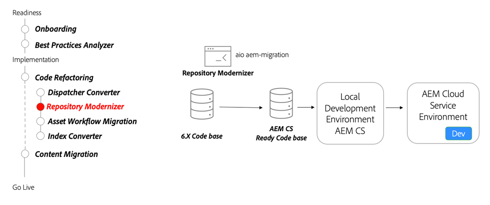

# Databasmodernisering

Lär dig mer om databasmodernisering, ändringsbart och oföränderligt innehåll, paketstruktur och CLI-verktyget för databasmodernisering.

>[!VIDEO](https://video.tv.adobe.com/v/336958/?quality=12&learn=on)

## Repository Modernizer Tool

Använd [Verktyget Databasmodernisering](https://experienceleague.adobe.com/docs/experience-manager-cloud-service/moving/refactoring-tools/repo-modernizer.html) för att strukturera om en 6.x-kodbas till en mer modern struktur.

## Viktiga aktiviteter

* Använd [Adobe I/O Repository Modernizer](https://github.com/adobe/aio-cli-plugin-aem-cloud-service-migration#command-aio-aem-migrationrepository-modernizer) för att strukturera om ett projekt så att det matchar den förväntade strukturen i ett AEM as a Cloud Service projekt.
* Justera och åtgärda eventuella byggfel manuellt i den uppdaterade kodbasen.
* Konfigurera en [lokal utvecklingsmiljö](https://experienceleague.adobe.com/docs/experience-manager-learn/cloud-service/local-development-environment-set-up/overview.html) och distribuera den uppdaterade kodbasen. Iterera tills projektet är i ett stabilt tillstånd.
* Distribuera den uppdaterade kodbasen till en AEM as a Cloud Service utvecklingsmiljö och fortsätt att validera.
