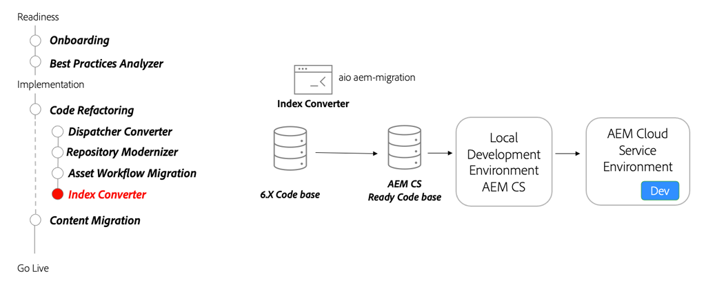

# Söka och indexera

Lär dig mer om AEM as a Cloud Service sökindex, hur du konverterar AEM 6-indexdefinitioner till AEM as a Cloud Service kompatibla och hur du distribuerar index till AEM as a Cloud Service.

>[!VIDEO](https://video.tv.adobe.com/v/336963/?quality=12&learn=on)

## Indexkonverterare

Använd [Indexkonverteringsverktyg](https://github.com/adobe/aio-cli-plugin-aem-cloud-service-migration#command-aio-aem-migrationindex-converter) om du vill konvertera anpassade indexdefinitioner för ekv till AEM as a Cloud Service kompatibla indexdefinitioner.

### Viktiga aktiviteter

* Använd [Adobe I/O Workflow Migrator](https://github.com/adobe/aio-cli-plugin-aem-cloud-service-migration#command-aio-aem-migrationindex-converter) verktyg för att migrera arbetsflöden för bearbetning av resurser så att de kan använda Asset compute mikrotjänster.
* Konfigurera en [lokal utvecklingsmiljö](https://experienceleague.adobe.com/docs/experience-manager-learn/cloud-service/local-development-environment-set-up/overview.html) och driftsätta anpassade index. Se till att de uppdaterade indexen är uppdaterade.
* Distribuera den uppdaterade kodbasen till en AEM as a Cloud Service utvecklingsmiljö och fortsätt att validera.
* Om du ändrar ett utanför rutans index **ALLTID** kopiera den senaste indexdefinitionen från en AEM as a Cloud Service miljö som körs i den senaste versionen. Ändra den kopierade indexdefinitionen efter dina behov.