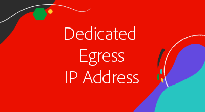

# Avancerade nätverk

AEM as a Cloud Service har tre alternativ för hantering av anslutning med externa tjänster. Ett Cloud Manager-program och dess AEM as a Cloud Service miljöer kan bara använda en enda typ av avancerad nätverkskonfiguration åt gången, så se till att den mest lämpliga typen väljs.

|  | HTTP/HTTPS på standardportar | HTTP/HTTPS på portar som inte är standard | Icke-HTTP/HTTPS-anslutningar | Dedikerad IP-adress för utgångar | Listan&quot;Icke-proxyvärdar&quot; | Anslut till VPN-skyddade tjänster | Begränsa AEM-publiceringstrafik efter IP |
|-----------------------------------|:----------------------------:|:--------------------------------:|:--------------------------:|:-------------------:|:-------------------------------------:|:-------------------------------------:|:----:|
| __Inga avancerade nätverk__ | ✔ | ✘ | ✘ | ✘ | ✘ | ✘ | ✘ |
| [__Flexibel portutgång__](./flexible-port-egress.md) | ✔ | ✔ | ✔ | ✘ | ✘ | ✘ | ✘ |
| [__Dedikerad IP-adress för utgångar__](./dedicated-egress-ip-address.md) | ✔ | ✔ | ✔ | ✔ | ✔ | ✘ | ✘ |
| [__Virtuellt privat nätverk__](./vpn.md) | ✔ | ✔ | ✔ | ✔ | ✔ | ✔ | ✔ |

Mer information om vad du bör tänka på när du väljer lämplig avancerad nätverkstyp finns i [dokumentation för avancerat nätverk](https://experienceleague.adobe.com/docs/experience-manager-cloud-service/security/configuring-advanced-networking.html).

## Avancerade självstudiekurser för nätverk

När det lämpligaste avancerade nätverksalternativet baserat på organisationens behov har identifierats kan du klicka i motsvarande självstudiekurs nedan för att få stegvisa instruktioner och kodexempel.

<table>
  <tr>
   <td>
      
      
<strong><a href="./flexible-port-egress.md">Flexibel portutgång</a></strong>

      

          Tillåt utgående AEM as a Cloud Service trafik på icke-standardportar.
      

    </td>   
   <td>
      
      
<strong><a href="./dedicated-egress-ip-address.md">Dedikerad IP-adress för utgångar</a></strong>

      

        Ursprunglig utgående AEM as a Cloud Service trafik från en dedikerad IP-adress.
      

    </td>   
   <td>
      
      
<strong><a href="./vpn.md">VPN (Virtual Private Network)</a></strong>

      

        Säker trafik mellan en kund- eller leverantörsinfrastruktur och AEM as a Cloud Service.
      

    </td>   
  </tr>
</table>
