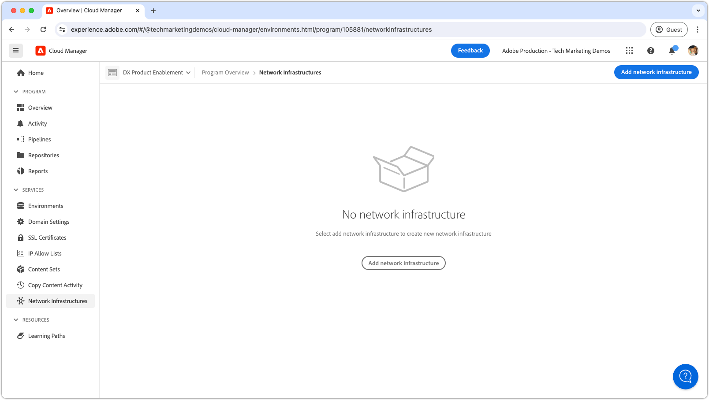

# Dedikerad IP-adress för utgångar

Lär dig hur du konfigurerar och använder en dedikerad IP-adress för utgående anslutningar från AEM som kan komma från en dedikerad IP-adress.

## Vad är en dedikerad IP-adress för egress?

Med en dedikerad IP-adress för utgångar kan förfrågningar från AEM as a Cloud Service använda en dedikerad IP-adress, vilket gör att externa tjänster kan filtrera inkommande förfrågningar efter den här IP-adressen. Precis som med [flexibla utgångsportar](./flexible-port-egress.md) kan du med dedikerad IP-adress gå ut på portar som inte är standard.

Ett Cloud Manager-program kan bara ha en __enskild__ nätverksinfrastrukturtyp. Kontrollera att den dedikerade IP-adressen för utgångar är den [lämpligaste typen av nätverksinfrastruktur](./advanced-networking.md) för din AEM as a Cloud Service innan du kör följande kommandon.

>[!MORELIKETHIS]
>
> Läs AEM as a Cloud Service [dokumentation om avancerad nätverkskonfiguration](https://experienceleague.adobe.com/en/docs/experience-manager-cloud-service/content/security/configuring-advanced-networking) om du vill ha mer information om dedikerad IP-adress för utgångar.

## Förutsättningar

Följande krävs när du konfigurerar en dedikerad IP-adress för utgångar med Cloud Manager API:er:

+ Cloud Manager API med [Cloud Manager Business Owner-behörigheter](https://developer.adobe.com/experience-cloud/cloud-manager/guides/getting-started/permissions/)
+ Åtkomst till [autentiseringsuppgifter för Cloud Manager API](https://developer.adobe.com/experience-cloud/cloud-manager/guides/getting-started/create-api-integration/)
   + Organisations-ID (även IMS Org-ID)
   + Klient-ID (även API-nyckel)
   + Åtkomsttoken (även Bearer Token)
+ Cloud Manager program-ID
+ Cloud Manager miljö-ID:n

Mer information finns i följande genomgång om hur du konfigurerar, konfigurerar och hämtar API-autentiseringsuppgifter för Cloud Manager och hur du använder dem för att göra ett Cloud Manager API-anrop.

>[!VIDEO](https://video.tv.adobe.com/v/342235?quality=12&learn=on)

I den här självstudien används `curl` för att skapa Cloud Manager API-konfigurationer. De `curl`-kommandon som tillhandahålls förutsätter en Linux/macOS-syntax. Om du använder kommandotolken i Windows ersätter du radbrytningstecknet `\` med `^`.

## Aktivera dedikerad IP-adress för egress i programmet

Börja med att aktivera och konfigurera den dedikerade IP-adressen för utgångar på AEM as a Cloud Service.

>[!BEGINTABS]

>[!TAB Cloud Manager]

Dedikerad IP-adress för utgångar kan aktiveras med Cloud Manager. I följande steg beskrivs hur du aktiverar dedikerad IP-adress för utgångar på AEM as a Cloud Service med Cloud Manager.

1. Logga in på [Adobe Experience Manager Cloud Manager](https://experience.adobe.com/cloud-manager/) som Cloud Manager Business Owner.
1. Navigera till önskat program.
1. Navigera till __Tjänster > Nätverksinfrastrukturer__ på den vänstra menyn.
1. Välj knappen __Lägg till nätverksinfrastruktur__.

   

1. I dialogrutan __Lägg till nätverksinfrastruktur__ markerar du alternativet __Dedikerad IP-adress för utgångar__ och väljer __Region__ för att skapa den dedikerade IP-adressen för utgångar.

   

1. Välj __Spara__ för att bekräfta att den dedikerade IP-adressen för utgångar har lagts till.

   

1. Vänta tills nätverksinfrastrukturen har skapats och markerats som __Ready__. Den här processen kan ta upp till 1 timme.

   

När den dedikerade IP-adressen för utgångar har skapats kan du nu konfigurera den med Cloud Manager API:er enligt beskrivningen nedan.

>[!TAB Cloud Manager API:er]

Dedikerad IP-adress för utgångar kan aktiveras med Cloud Manager API:er. I följande steg beskrivs hur du aktiverar dedikerad IP-adress för utgångar på AEM as a Cloud Service med Cloud Manager API.


1. Ta först reda på i vilken region det avancerade nätverket behövs genom att använda Cloud Manager API-åtgärden [listRegions](https://developer.adobe.com/experience-cloud/cloud-manager/reference/api/). `region name` krävs för efterföljande Cloud Manager API-anrop. Normalt används regionen där produktionsmiljön finns.

   Hitta AEM as a Cloud Service-miljöns region i [Cloud Manager](https://my.cloudmanager.adobe.com) under [miljöns information](https://experienceleague.adobe.com/en/docs/experience-manager-cloud-service/content/implementing/using-cloud-manager/manage-environments). Regionnamnet som visas i Cloud Manager kan [mappas till regionkoden](https://developer.adobe.com/experience-cloud/cloud-manager/guides/api-usage/creating-programs-and-environments/#creating-aem-cloud-service-environments) som används i Cloud Manager API.

   __listRegions HTTP request__

   ```shell
   $ curl -X GET https://cloudmanager.adobe.io/api/program/{programId}/regions \
       -H 'x-gw-ims-org-id: <ORGANIZATION_ID>' \
       -H 'x-api-key: <CLIENT_ID>' \
       -H 'Authorization: Bearer <ACCESS_TOKEN>' \
       -H 'Content-Type: application/json' 
   ```

2. Aktivera dedikerad IP-adress för utgångar för ett Cloud Manager-program med Cloud Manager API-åtgärden [createNetworkInfrastructure](https://developer.adobe.com/experience-cloud/cloud-manager/reference/api/). Använd rätt `region`-kod som hämtats från Cloud Manager API `listRegions` -åtgärden.

   __createNetworkInfrastructure HTTP-begäran__

   ```shell
   $ curl -X POST https://cloudmanager.adobe.io/api/program/{programId}/networkInfrastructures \
       -H 'x-gw-ims-org-id: <ORGANIZATION_ID>' \
       -H 'x-api-key: <CLIENT_ID>' \
       -H 'Authorization: Bearer <ACCESS_TOKEN>' \
       -H 'Content-Type: application/json' \
       -d '{ "kind": "dedicatedEgressIp", "region": "va7" }'
   ```

   Vänta i 15 minuter tills Cloud Manager-programmet tillhandahåller nätverksinfrastrukturen.

3. Kontrollera att programmet har slutfört konfigurationen av __dedikerad IP-adress__ med Cloud Manager API [getNetworkInfrastructure](https://developer.adobe.com/experience-cloud/cloud-manager/reference/api/#operation/getNetworkInfrastructure) med hjälp av `id` som returnerades från HTTP-begäran `createNetworkInfrastructure` i föregående steg.

   __getNetworkInfrastructure HTTP-begäran__

   ```shell
   $ curl -X GET https://cloudmanager.adobe.io/api/program/{programId}/networkInfrastructure/{networkInfrastructureId} \
       -H 'x-gw-ims-org-id: <ORGANIZATION_ID>' \
       -H 'x-api-key: <CLIENT_ID>' \
       -H 'Authorization: Bearer <ACCESS_TOKEN>' \
       -H 'Content-Type: application/json'
   ```

   Kontrollera att HTTP-svaret innehåller __status__ av __ready__. Om du inte är klar ännu kontrollerar du statusen var några minut.

När den dedikerade IP-adressen för utgångar har skapats kan du nu konfigurera den med Cloud Manager API:er enligt beskrivningen nedan.

>[!ENDTABS]


## Konfigurera IP-adressproxy för dedikerad egress per miljö

1. Konfigurera IP-adresskonfigurationen __för den dedikerade IP-adressen__ i varje AEM as a Cloud Service-miljö med Cloud Manager API-åtgärden [enableEnvironmentAdvancedNetworkingConfiguration](https://developer.adobe.com/experience-cloud/cloud-manager/reference/api/) .

   __enableEnvironmentAdvancedNetworkingConfiguration HTTP-begäran__

   ```shell
   $ curl -X PUT https://cloudmanager.adobe.io/api/program/{programId}/environment/{environmentId}/advancedNetworking \
       -H 'x-gw-ims-org-id: <ORGANIZATION_ID>' \
       -H 'x-api-key: <CLIENT_ID>' \
       -H 'Authorization: Bearer <ACCESS_TOKEN>' \
       -H 'Content-Type: application/json' \
       -d @./dedicated-egress-ip-address.json
   ```

   Definiera JSON-parametrarna i en `dedicated-egress-ip-address.json` och tillhandahåll för att rulla via `... -d @./dedicated-egress-ip-address.json`.

   [Hämta exemplet dedikerad-egress-ip-address.json](./assets/dedicated-egress-ip-address.json). Filen är bara ett exempel. Konfigurera filen efter behov baserat på de valfria/obligatoriska fälten som beskrivs i [enableEnvironmentAdvancedNetworkingConfiguration](https://developer.adobe.com/experience-cloud/cloud-manager/reference/api/).

   ```json
   {
       "nonProxyHosts": [
           "example.net",
           "*.example.org",
       ],
       "portForwards": [
           {
               "name": "mysql.example.com",
               "portDest": 3306,
               "portOrig": 30001
           },
           {
               "name": "smtp.sendgrid.net",
               "portDest": 465,
               "portOrig": 30002
           }
       ]
   }
   ```

   Den dedikerade IP-adresskonfigurationens HTTP-signatur skiljer sig bara från [flexibel utgångsport](./flexible-port-egress.md#enable-dedicated-egress-ip-address-per-environment) på så sätt att den även stöder den valfria `nonProxyHosts`-konfigurationen.

   `nonProxyHosts` deklarerar en uppsättning värdar för vilka port 80 eller 443 ska dirigeras via de delade standardadressintervallen i stället för den dedikerade IP-adressen. `nonProxyHosts` kan vara användbart eftersom trafik som trycks ned via delade IP-adresser optimeras automatiskt av Adobe.

   För varje `portForwards`-mappning definierar det avancerade nätverket följande vidarebefordringsregel:

   | Proxyvärd | Proxyport |  | Extern värd | Extern port |
   |---------------------------------|----------|----------------|------------------|----------|
   | `AEM_PROXY_HOST` | `portForwards.portOrig` | → | `portForwards.name` | `portForwards.portDest` |

1. Verifiera egresreglerna för varje miljö med Cloud Manager API-åtgärden [getEnvironmentAdvancedNetworkingConfiguration](https://developer.adobe.com/experience-cloud/cloud-manager/reference/api/).

   __getEnvironmentAdvancedNetworkingConfiguration HTTP-begäran__

   ```shell
   $ curl -X GET https://cloudmanager.adobe.io/api/program/{programId}/environment/{environmentId}/advancedNetworking \
       -H 'x-gw-ims-org-id: <ORGANIZATION_ID>' \
       -H 'x-api-key: <CLIENT_ID>' \
       -H 'Authorization: <YOUR_TOKEN>' \
       -H 'Content-Type: application/json'
   ```

1. IP-adresskonfigurationer för dedikerade utgångar kan uppdateras med Cloud Manager API-åtgärden [enableEnvironmentAdvancedNetworkingConfiguration](https://developer.adobe.com/experience-cloud/cloud-manager/reference/api/) . Kom ihåg att `enableEnvironmentAdvancedNetworkingConfiguration` är en `PUT`-åtgärd, så alla regler måste anges med varje anrop av den här åtgärden.

1. Hämta den __dedikerade IP-adressen för utgångar__ med en DNS-matchare (till exempel [DNSChecker.org](https://dnschecker.org/)) på värden: `p{programId}.external.adobeaemcloud.com` eller genom att köra `dig` från kommandoraden.

   ```shell
   $ dig +short p{programId}.external.adobeaemcloud.com
   ```

   Värdnamnet kan inte vara `pinged` eftersom det är en utgång och _inte_ och en ingress.

   Observera att den dedikerade IP-adressen för utgångar delas av alla AEM as a Cloud Service-miljöer i programmet.

1. Nu kan du använda den dedikerade IP-adressen för utgångar i din anpassade AEM och konfiguration. När du använder dedikerad IP-adress för utgångar är de externa tjänster som AEM as a Cloud Service ansluter till ofta konfigurerade så att endast trafik från den här dedikerade IP-adressen tillåts.

## Ansluta till externa tjänster via dedikerad IP-adress

När den dedikerade IP-adressen för utgångar är aktiverad kan AEM kod och konfiguration använda den dedikerade IP-adressen för utgångar för att ringa till externa tjänster. Det finns två varianter av externa anrop som AEM behandlar på olika sätt:

1. HTTP/HTTPS-anrop till externa tjänster
   + Innehåller HTTP/HTTPS-anrop till tjänster som körs på andra portar än standardportarna 80 eller 443.
1. icke-HTTP/HTTPS-anrop till externa tjänster
   + Inkluderar alla icke-HTTP-anrop, till exempel anslutningar med e-postservrar, SQL-databaser eller tjänster som körs på andra icke-HTTP/HTTPS-protokoll.

HTTP/HTTPS-begäranden från AEM på standardportar (80/443) tillåts som standard, men de använder inte den dedikerade IP-adressen för utgångar om de inte är korrekt konfigurerade enligt beskrivningen nedan.

>[!TIP]
>
> I dokumentationen för AEM as a Cloud Service dedikerade IP-adresser finns [en fullständig uppsättning routningsregler](https://experienceleague.adobe.com/en/docs/experience-manager-cloud-service/content/security/configuring-advanced-networking).


### HTTP/HTTPS

När du skapar HTTP/HTTPS-anslutningar från AEM, när du använder en dedikerad IP-adress för utgående IP-adresser, proxiceras HTTP/HTTPS-anslutningar automatiskt ut från AEM med den dedikerade IP-adressen för utgående IP-adressen. Ingen ytterligare kod eller konfiguration krävs för att stödja HTTP/HTTPS-anslutningar.

#### Exempel på koder

<table>
<tr>
<td>
    <a  href="./examples/http-dedicated-egress-ip-vpn.md"></a>
    <div><strong><a href="./examples/http-dedicated-egress-ip-vpn.md">HTTP/HTTPS</a></strong></div>
    <p>
        Exempel på Java™-kod som skapar HTTP/HTTPS-anslutning från AEM as a Cloud Service till en extern tjänst med HTTP/HTTPS-protokoll.
    </p>
</td>   
<td></td>   
<td></td>   
</tr>
</table>

### Icke-HTTP/HTTPS-anslutningar till externa tjänster

När anslutningar som inte är HTTP/HTTPS skapas (t.ex. SQL, SMTP och så vidare) från AEM måste anslutningen upprättas via ett särskilt värdnamn som AEM anger.

| Variabelnamn | Använd | Java™-kod | OSGi-konfiguration |
| - |  - | - | - |
| `AEM_PROXY_HOST` | Proxyvärd för icke-HTTP/HTTPS-anslutningar | `System.getenv("AEM_PROXY_HOST")` | `$[env:AEM_PROXY_HOST]` |


Anslutningar till externa tjänster anropas sedan via `AEM_PROXY_HOST` och den mappade porten (`portForwards.portOrig`), som AEM sedan dirigeras till det mappade externa värdnamnet (`portForwards.name`) och porten (`portForwards.portDest`).

| Proxyvärd | Proxyport |  | Extern värd | Extern port |
|---------------------------------|----------|----------------|------------------|----------|
| `AEM_PROXY_HOST` | `portForwards.portOrig` | → | `portForwards.name` | `portForwards.portDest` |

#### Exempel på koder

<table><tr>
   <td>
      <a  href="./examples/sql-datasourcepool.md"></a>
      <div><strong><a href="./examples/sql-datasourcepool.md">SQL-anslutning med JDBC DataSourcePool</a></strong></div>
      <p>
            Exempel på Java™-kod som ansluter till externa SQL-databaser genom att konfigurera AEM JDBC-datakällpool.
      </p>
    </td>   
   <td>
      <a  href="./examples/sql-java-apis.md"></a>
      <div><strong><a href="./examples/sql-java-apis.md">SQL-anslutning med Java™ API:er</a></strong></div>
      <p>
            Exempel på Java™-kod som ansluter till externa SQL-databaser med Java™ SQL API:er.
      </p>
    </td>   
   <td>
      <a  href="./examples/email-service.md"></a>
      <div><strong><a href="./examples/email-service.md">E-posttjänst</a></strong></div>
      <p>
        Exempel på OSGi-konfiguration som använder AEM för att ansluta till externa e-posttjänster.
      </p>
    </td>   
</tr></table>
