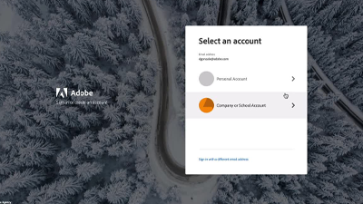

# Översikt {#overview}

Adobe Experience Manager (AEM) finns nu som en molntjänst. AEM som Cloud Service introducerar nästa generation av produktlinjen Experience Manager, som bygger på tidigare investeringar och innovationer och bevarar och utökar alla användningsfall och funktioner.

>[!VIDEO](https://video.tv.adobe.com/v/31085/?quality=12&learn=on)

## Nyheter

* **[Utbyggbarhet för Asset compute-mikrotjänster (självstudiekurs)](./asset-compute/overview.md)**

   *Lär dig hur du utvecklar Asset compute-arbetare för att generera anpassade resursåtergivningar*

* **[Konfigurera åtkomst till AEM som Cloud Service (självstudiekurs)](./accessing/overview.md)**

   *Lär dig hur du konfigurerar IMS-användare i Adobe Admin Console så att de kan komma åt AEM*

* **[Felsöka AEM som en Cloud Service (självstudiekurs)](./debugging/cloud-service/overview.md)**

   *Utforska hur du felsöker AEM som en Cloud Service*

* **[Felsöka AEM SDK (självstudiekurs)](./debugging/aem-sdk-local-quickstart/overview.md)**

   *Utforska de olika verktyg som används för att felsöka programmet på AEM som en Cloud Service-SDK:s lokala snabbstart*

* **[Installation av lokal utvecklingsmiljö (självstudiekurs)](./local-development-environment/overview.md)**

   *Lär dig hur du konfigurerar din lokala utvecklingsdator för AEM som en Cloud Service-utveckling*

## Personalval

<table>
   <td>
      
      

         <a href="./accessing/overview.md">
         <strong>Konfigurera åtkomst till AEM</strong>
         </a>
      

      

         <em>Konfigurera IMS-användare i Adobe Admin Console för att få åtkomst till AEM.</em>
      

   </td>   
   <td>
      
      

         <a href="./local-development-environment/overview.md">
         <strong>Konfigurera självstudiekurs för lokal utvecklingsmiljö</strong>
         </a>
      

      

         <em>Gör din lokala dev-dator redo för AEM som en Cloud Service-utveckling!</em>
      

   </td>   
   <td>
      
      

         <a href="./debugging/aem-sdk-local-quickstart/overview.md">
         <strong>Felsöka AEM SDK</strong>
         </a>
      

      

         <em>Utforska verktyg som används för att felsöka programmet på AEM som en Cloud Service-SDK:s lokala snabbstart.</em>
      

   </td>
</table>

## Ytterligare resurser

* [Experience League - Utforska Adobe Experience Manager](https://experienceleague.adobe.com/#recommended/solutions/experience-manager)
* [Adobe Experience Manager som Cloud Service Documentation](https://docs.adobe.com/content/help/en/experience-manager-cloud-service/landing/home.html)
