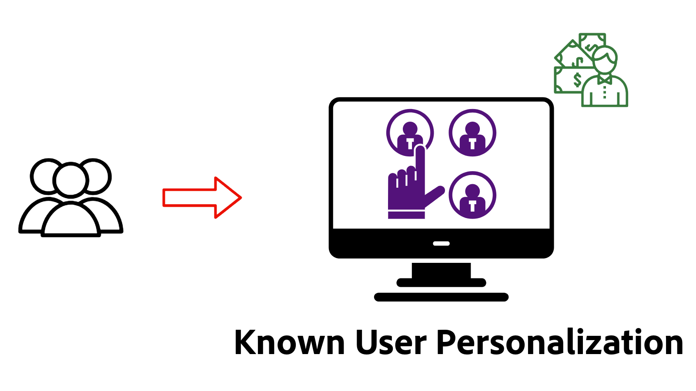

# Personalization - översikt

Läs om hur AEM as a Cloud Service (AEMCS) integreras med Adobe Target och Adobe Experience Platform (AEP) för att leverera personaliserade upplevelser. Använd Experience Fragments som personaliserat innehåll, upptäck hur man kör A/B-tester, målgruppsanpassar användare baserat på beteende i realtid eller personaliserar innehåll med hjälp av enhetliga kundprofiler som bygger på data mellan olika system.

## Förutsättningar

I den här självstudien används [AEM WKND](https://github.com/adobe/aem-guides-wknd/) -exempelprojektet för att demonstrera olika personaliseringsscenarier. För att följa med i utvecklingen behöver du:

- En Adobe-organisation med tillgång till:
   - **AEM as a Cloud Service-miljö** - för att skapa och hantera innehåll
   - **Adobe Target** - skapa och leverera personaliserade upplevelser
   - **Adobe Experience Platform-program** - för att hantera kundprofiler och målgrupper
   - **Taggar (tidigare Launch) i AEP** - för att distribuera Web SDK och anpassade JavaScript för datainsamling och personalisering

- En grundläggande förståelse för AEM komponenter och Experience Fragments

- [AEM WKND](https://github.com/adobe/aem-guides-wknd/)-projektet som distribueras till din AEM as a Cloud Service-miljö.

## Live Demo av användningsexempel från Personalization

Upplev personalisering i praktiken på webbplatsen [WKND Enablement](https://wknd.enablementadobe.com/us/en.html){target="wknd"}. Demonstrationssajten visar tre typer av personalisering: A/B-testning, beteendeanpassning och känd användarpersonalisering.

>[!TIP]
>
> Genom att titta på live-demonstrationen först får ni en förståelse för värdet och funktionerna i varje personaliseringsteknik innan ni lägger tid på konfiguration och implementering.

<!-- CARDS
{target = _self}

* ./live-demo.md
  {title = Live Demo of Personalization Use Cases}
  {description = Experience personalization in action on the [WKND Enablement website](https://wknd.enablementadobe.com/us/en.html). The demo site demonstrates three types of personalization: A/B testing, behavioral targeting, and known-user personalization.}
  {image = ./assets/live-demo/live-demo.png}
  {cta = Live Demo}
-->
<!-- START CARDS HTML - DO NOT MODIFY BY HAND -->

    

        

            

                <figure class="image x-is-16by9">
                    
                </figure>
            

            

                

                    

                        <a href="./live-demo.md" target="_self" rel="referrer" title="Live Demo av användningsexempel från Personalization">Live Demo av Personalization-användningsexempel</a>
                    

                    
Upplev personalisering i praktiken på WKND Enablement-webbplatsen. Demonstrationssajten visar tre typer av personalisering: A/B-testning, beteendeanpassning och känd användarpersonalisering.

                

                <a href="./live-demo.md" target="_self" rel="referrer" class="spectrum-Button spectrum-Button--outline spectrum-Button--primary spectrum-Button--sizeM" style="align-self: flex-start; margin-top: 1rem;">
                     Live Demo 
                </a>
            

        

    

<!-- END CARDS HTML - DO NOT MODIFY BY HAND -->

## Kom igång

Innan du utforskar specifika användningsfall måste du först konfigurera AEM as a Cloud Service för personalisering. Börja med att integrera Adobe Target och taggar för att möjliggöra personalisering på klientsidan med Web SDK. Med dessa grundläggande steg kan era AEM-sidor experimentera, målinrikta och personalisera i realtid.

<!-- CARDS
{target = _self}

* ./setup/integrate-adobe-target.md
  {title = Integrate Adobe Target}
  {description = Integrate AEMCS with Adobe Target to activate personalized content, such as Experience Fragments, as offers.}
  {image = ./assets/setup/integrate-target.png}
  {cta = Integrate Target}

* ./setup/integrate-adobe-tags.md
  {title = Integrate Tags}
  {description = Integrate AEMCS with Tags to inject the Web SDK and custom JavaScript for data collection and personalization.}
  {image = ./assets/setup/integrate-tags.png}
  {cta = Integrate Tags}
  
-->
<!-- START CARDS HTML - DO NOT MODIFY BY HAND -->

    

        

            

                <figure class="image x-is-16by9">
                    
                </figure>
            

            

                

                    

                        <a href="./setup/integrate-adobe-target.md" target="_self" rel="referrer" title="Integrera Adobe Target">Integrera Adobe Target</a>
                    

                    
Integrera AEMCS med Adobe Target för att aktivera personaliserat innehåll, som Experience Fragments, som erbjudanden.

                

                <a href="./setup/integrate-adobe-target.md" target="_self" rel="referrer" class="spectrum-Button spectrum-Button--outline spectrum-Button--primary spectrum-Button--sizeM" style="align-self: flex-start; margin-top: 1rem;">
                     Integrera mål 
                </a>
            

        

    

    

        

            

                <figure class="image x-is-16by9">
                    
                </figure>
            

            

                

                    

                        <a href="./setup/integrate-adobe-tags.md" target="_self" rel="referrer" title="Integrera taggar">Integrera taggar</a>
                    

                    
Integrera AEMCS med taggar för att lägga in Web SDK och JavaScript för datainsamling och personalisering.

                

                <a href="./setup/integrate-adobe-tags.md" target="_self" rel="referrer" class="spectrum-Button spectrum-Button--outline spectrum-Button--primary spectrum-Button--sizeM" style="align-self: flex-start; margin-top: 1rem;">
                     Integrera taggar 
                </a>
            

        

    

<!-- END CARDS HTML - DO NOT MODIFY BY HAND -->

## Användningsexempel

Utforska följande vanliga användningsexempel för personalisering som stöds av AEMCS, Adobe Target och Adobe Experience Platform.

<!-- CARDS
{target = _self}

* ./use-cases/experimentation.md
    {title = Experimentation (A/B Testing)}
    {description = Learn how to test different content variations on an AEMCS website using Adobe Target for A/B testing.}
    {image = ./assets/use-cases/experiment/experimentation.png}
    {cta = Learn Experimentation}

* ./use-cases/behavioral-targeting.md
    {title = Behavioral Targeting}
    {description = Learn how to personalize content based on user behavior using Adobe Experience Platform and Adobe Target.}
    {image = ./assets/use-cases/behavioral-targeting/behavioral-targeting.png}
    {cta = Learn Behavioral Targeting}

* ./use-cases/known-user-personalization.md
    {title = Known-user personalization}
    {description = Learn how to personalize content based on known user data by stitching information from multiple systems into a complete customer profile.}
    {image = ./assets/use-cases/known-user-personalization/known-user-personalization.png}
    {cta = Learn Known-user personalization}
-->
<!-- START CARDS HTML - DO NOT MODIFY BY HAND -->

    

        

            

                <figure class="image x-is-16by9">
                    
                </figure>
            

            

                

                    

                        <a href="./use-cases/experimentation.md" target="_self" rel="referrer" title="Experimentation (A/B-testning)">Experimentation (A/B-testning)</a>
                    

                    
Lär dig hur du testar olika innehållsvariationer på en AEMCS-webbplats med Adobe Target för A/B-testning.

                

                <a href="./use-cases/experimentation.md" target="_self" rel="referrer" class="spectrum-Button spectrum-Button--outline spectrum-Button--primary spectrum-Button--sizeM" style="align-self: flex-start; margin-top: 1rem;">
                     Lär dig experimentera 
                </a>
            

        

    

    

        

            

                <figure class="image x-is-16by9">
                    
                </figure>
            

            

                

                    

                        <a href="./use-cases/behavioral-targeting.md" target="_self" rel="referrer" title="Beteendeanpassning">Beteendeanpassning</a>
                    

                    
Lär dig hur du anpassar innehåll baserat på användarbeteende med Adobe Experience Platform och Adobe Target.

                

                <a href="./use-cases/behavioral-targeting.md" target="_self" rel="referrer" class="spectrum-Button spectrum-Button--outline spectrum-Button--primary spectrum-Button--sizeM" style="align-self: flex-start; margin-top: 1rem;">
                     Lär dig beteendeanpassning 
                </a>
            

        

    

    

        

            

                <figure class="image x-is-16by9">
                    
                </figure>
            

            

                

                    

                        <a href="./use-cases/known-user-personalization.md" target="_self" rel="referrer" title="Känd personalisering för användare">Känd användaranpassning</a>
                    

                    
Lär dig att personalisera innehåll baserat på kända användardata genom att sammanfoga information från flera system till en komplett kundprofil.

                

                <a href="./use-cases/known-user-personalization.md" target="_self" rel="referrer" class="spectrum-Button spectrum-Button--outline spectrum-Button--primary spectrum-Button--sizeM" style="align-self: flex-start; margin-top: 1rem;">
                    Lär dig mer om användaranpassning
                </a>
            

        

    

<!-- END CARDS HTML - DO NOT MODIFY BY HAND -->
