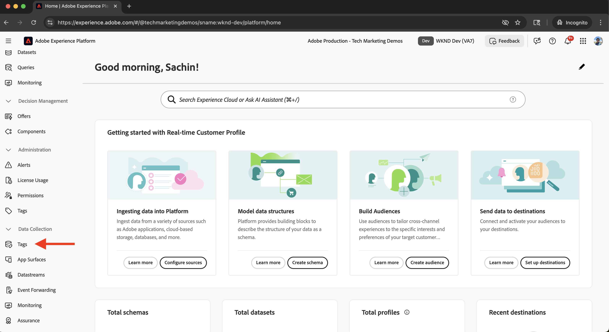

# Integrera taggar i Adobe Experience Platform

Lär dig integrera AEM as a Cloud Service (AEMCS) med taggar i Adobe Experience Platform. Tack vare integreringen med Taggar (även kallad Launch) kan du driftsätta Adobe Web SDK och lägga in anpassade JavaScript för datainsamling och personalisering på dina AEM-sidor.

Tack vare integreringen kan ert marknadsförings- eller utvecklingsteam hantera och driftsätta JavaScript för personalisering och datainsamling - utan att behöva driftsätta AEM-kod på nytt.

## Steg på hög nivå

Integreringsprocessen omfattar fyra huvudsteg som upprättar anslutningen mellan AEM och Taggar:

1. **Skapa, konfigurera och publicera en taggegenskap i Adobe Experience Platform**
2. **Verifiera en Adobe IMS-konfiguration för taggar i AEM**
3. **Skapa en taggkonfiguration i AEM**
4. **Tillämpa taggkonfigurationen på dina AEM-sidor**

## Skapa, konfigurera och publicera en taggegenskap i Adobe Experience Platform

Börja med att skapa en taggegenskap i Adobe Experience Platform. Den här egenskapen hjälper dig att hantera distributionen av Adobe Web SDK och alla anpassade JavaScript som krävs för personalisering och datainsamling.

1. Gå till [Adobe Experience Platform](https://experience.adobe.com/platform), logga in med din Adobe ID och navigera till **Taggar** på den vänstra menyn.\
   

2. Klicka på **Ny egenskap** om du vill skapa en ny taggegenskap.\
   

3. Ange följande i dialogrutan **Skapa egenskap**:
   - **Egenskapsnamn**: Ett namn för taggegenskapen
   - **Egenskapstyp**: Välj **Webb**
   - **Domän**: Domänen där du distribuerar egenskapen (till exempel `.adobeaemcloud.com`)

   Klicka på **Spara**.

   

4. Öppna den nya egenskapen. Tillägget **Core** ska redan inkluderas. Senare kommer du att lägga till tillägget **Web SDK** när du konfigurerar användningsfallet Experimentation, eftersom det kräver ytterligare konfiguration, till exempel **DataStream ID**.\
   

5. Publicera taggegenskapen genom att gå till **Publiceringsflöde** och klicka på **Lägg till bibliotek** för att skapa ett distributionsbibliotek.
   

6. Ange följande i dialogrutan **Skapa bibliotek**:
   - **Namn**: Ett namn för ditt bibliotek
   - **Miljö**: Välj **Utveckling**
   - **Resursändringar**: Välj **Lägg till alla ändrade resurser**

   Klicka på **Spara och skapa till utveckling**.

   

7. Om du vill publicera biblioteket i produktion klickar du på **Godkänn och publicera i produktion**. När publiceringen är klar är egenskapen klar att användas i AEM.\
   

## Verifiera en Adobe IMS-konfiguration för taggar i AEM

När en AEMCS-miljö etableras innehåller den automatiskt en Adobe IMS-konfiguration för taggar, tillsammans med ett motsvarande Adobe Developer Console-projekt. Den här konfigurationen säkerställer säker API-kommunikation mellan AEM och taggar.

1. I AEM går du till **Verktyg** > **Säkerhet** > **Adobe IMS-konfigurationer**.\
   

2. Leta reda på **Adobe Launch** -konfigurationen. Om den är tillgänglig markerar du den och klickar på **Kontrollera hälsa** för att verifiera anslutningen. Du borde se ett lyckat svar.\
   

## Skapa en taggkonfiguration i AEM

Skapa en taggkonfiguration i AEM för att ange de egenskaper och inställningar som behövs för webbplatssidorna.

1. I AEM går du till **Verktyg** > **Cloud-tjänster** > **Adobe Launch Configurations**.\
   

2. Markera platsens rotmapp (till exempel WKND-plats) och klicka på **Skapa**.\
   

3. Ange följande i dialogrutan:
   - **Titel**: Till exempel&quot;Adobe-taggar&quot;
   - **IMS-konfiguration**: Välj den verifierade **IMS-konfigurationen för Adobe Launch**
   - **Företag**: Välj det företag som är länkat till din taggegenskap
   - **Egenskap**: Välj taggegenskapen som skapades tidigare

   Klicka på **Nästa**.

   

4. I demonstrationssyfte bör du behålla standardvärdena för **Förproduktion**- och **Produktion**-miljöer. Klicka på **Skapa**.\
   

5. Markera den nyligen skapade konfigurationen och klicka på **Publicera** för att göra den tillgänglig för webbplatsens sidor.\
   

## Använda taggkonfigurationen på din AEM-plats

Använd tagg-konfigurationen för att mata in Web SDK och anpassningslogiken på webbplatsens sidor.

1. Gå till **Webbplatser** i AEM, markera din rotwebbplatsmapp (till exempel WKND-plats) och klicka på **Egenskaper**.\
   

2. Öppna fliken **Avancerat** i dialogrutan **Webbplatsegenskaper** . Under **Konfigurationer** kontrollerar du att `/conf/wknd` är markerat för **molnkonfiguration**.\
   

## Verifiera integreringen

För att bekräfta att taggkonfigurationen fungerar som den ska kan du:

1. Kontrollera vykällan för en AEM-publiceringssida eller inspektera den med hjälp av webbläsarutvecklarverktygen
2. Använd [Adobe Experience Platform Debugger](https://chromewebstore.google.com/detail/adobe-experience-platform/bfnnokhpnncpkdmbokanobigaccjkpob) för att validera Web SDK- och JavaScript-injektionen

## Ytterligare resurser

- [Adobe Experience Platform Debugger - översikt](https://experienceleague.adobe.com/en/docs/experience-platform/debugger/home)
- [Översikt över taggar](https://experienceleague.adobe.com/en/docs/experience-platform/tags/home)
