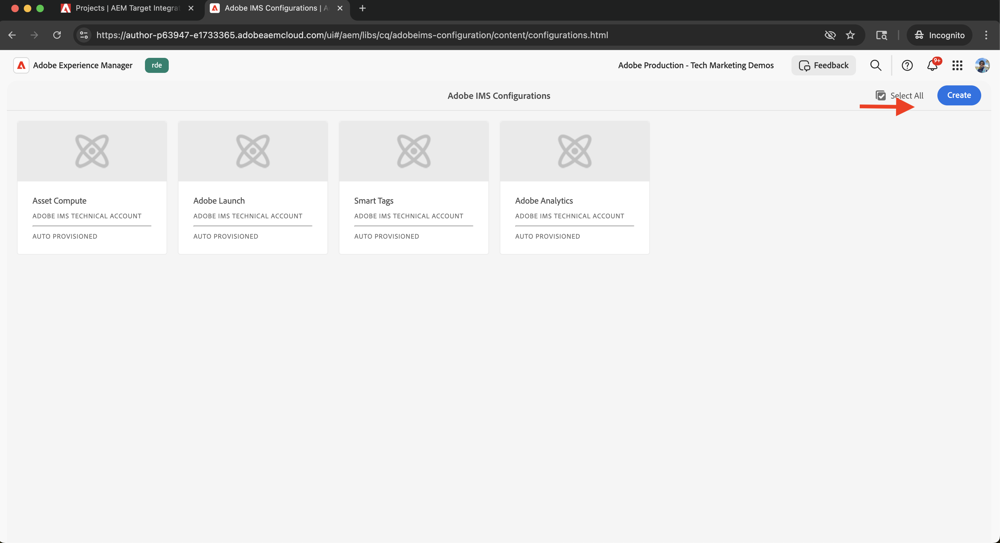
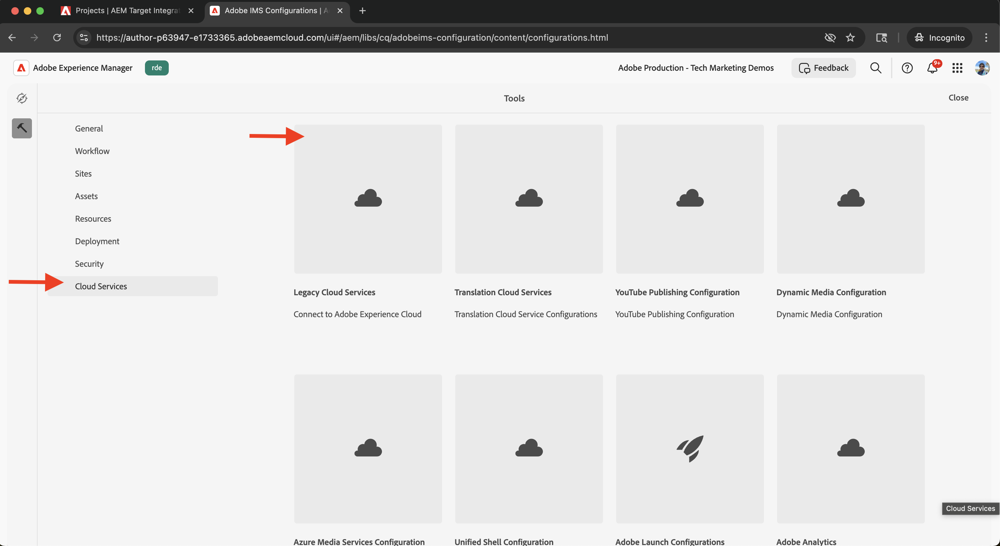
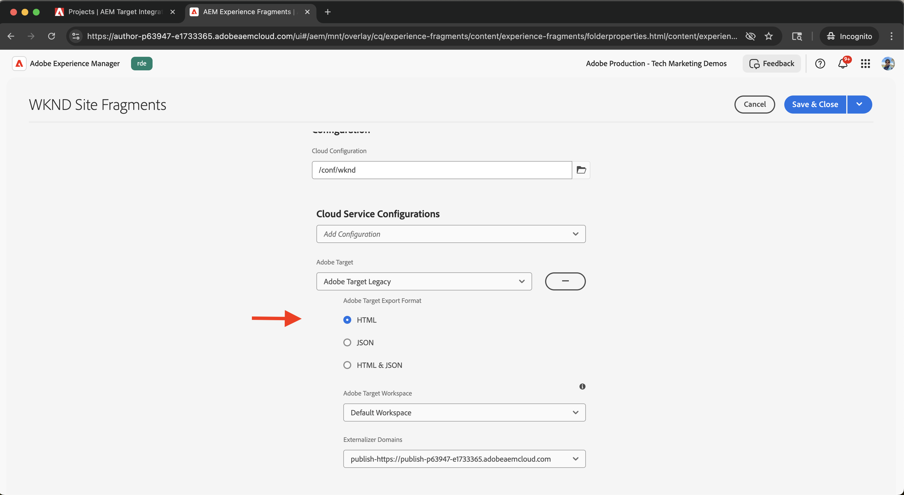

# Integrera Adobe Target

Lär dig hur du integrerar AEM as a Cloud Service (AEMCS) med Adobe Target för att aktivera personaliserat innehåll, som Experience Fragments, som erbjudanden i Adobe Target.

Tack vare integreringen kan ert marknadsföringsteam skapa och hantera personaliserat innehåll centralt i AEM. Det här innehållet kan sedan aktiveras utan problem som i Adobe Target.

>[!IMPORTANT]
>
>Integreringssteget är valfritt om ditt team föredrar att hantera erbjudanden helt inom Adobe Target, utan att använda AEM som ett centralt innehållsarkiv.

## Steg på hög nivå

Integreringsprocessen omfattar fyra huvudsteg som upprättar anslutningen mellan AEM och Adobe Target:

1. **Skapa och konfigurera ett Adobe Developer Console-projekt**
2. **Skapa en Adobe IMS-konfiguration för Target i AEM**
3. **Skapa en äldre Adobe Target-konfiguration i AEM**
4. **Använd Adobe Target-konfigurationen på Experience Fragments**

## Skapa och konfigurera ett Adobe Developer Console-projekt

Om du vill att AEM ska kunna kommunicera säkert med Adobe Target måste du konfigurera ett Adobe Developer Console-projekt med OAuth server-till-server-autentisering. Du kan använda ett befintligt projekt eller skapa ett nytt.

1. Gå till [Adobe Developer Console](https://developer.adobe.com/console) och logga in med din Adobe ID.

2. Skapa ett nytt projekt eller välj ett befintligt.\
   

3. Klicka på **Lägg till API**. I dialogrutan **Lägg till ett API** filtrerar du med **Experience Cloud**, väljer **Adobe Target** och klickar på **Nästa**.\
   

4. I dialogrutan **Konfigurera API** väljer du autentiseringsmetoden **OAuth Server-to-Server** och klickar på **Nästa**.\
   

5. I steget **Välj produktprofiler** väljer du **Workspace** som standard och klickar på **Spara konfigurerat API**.\
   

6. Välj **OAuth Server-to-Server** i den vänstra navigeringen och granska konfigurationsinformationen. Observera klient-ID och klienthemlighet - du behöver dessa värden för att konfigurera IMS-integreringen i AEM.
   

## Skapa en Adobe IMS-konfiguration för Target i AEM

I AEM skapar du en Adobe IMS-konfiguration för Target med hjälp av inloggningsuppgifterna från Adobe Developer Console. Med den här konfigurationen kan AEM autentisera med Adobe Target API:er.

1. I AEM går du till **Verktyg** > **Säkerhet** och väljer **Adobe IMS-konfigurationer**.\
   

2. Klicka på **Skapa**.\
   

3. Ange följande på sidan **Konfiguration av Adobe IMS-konto**:
   - **Molnlösning**: Adobe Target
   - **Titel**: En etikett för konfigurationen, till exempel&quot;Adobe Target&quot;
   - **Auktoriseringsserver**: `https://ims-na1.adobelogin.com`
   - **Klient-ID**: Från Adobe Developer Console
   - **Klienthemlighet**: Från Adobe Developer Console
   - **Omfång**: Från Adobe Developer Console
   - **Organisations-ID**: Från Adobe Developer Console

   Klicka sedan på **Skapa**.

   

4. Markera konfigurationen och klicka på **Kontrollera hälsa** för att verifiera anslutningen. Ett meddelande bekräftar att AEM kan ansluta till Adobe Target.\
   

## Skapa en äldre Adobe Target-konfiguration i AEM

Om du vill exportera Experience Fragments som erbjudanden till Adobe Target skapar du en äldre Adobe Target-konfiguration i AEM.

1. I AEM går du till **Verktyg** > **Molntjänster** och väljer **Äldre molntjänster**.\
   

2. Klicka på **Konfigurera nu** i avsnittet **Adobe Target**.\
   

3. I dialogrutan **Skapa konfiguration** anger du ett namn som t.ex. &quot;Adobe Target Legacy&quot; och klickar på **Skapa**.\
   

4. Ange följande på sidan **Äldre konfiguration** för Adobe Target:
   - **Autentisering**: IMS
   - **Klientkod**: Din Adobe Target-klientkod (finns i Adobe Target under **Administration** > **Implementering**)
   - **IMS-konfiguration**: IMS-konfigurationen som du skapade tidigare

   Klicka på **Anslut till Adobe Target** för att verifiera anslutningen.

   

## Använd Adobe Target-konfigurationen på Experience Fragments

Koppla Adobe Target-konfigurationen till dina Experience Fragments så att de kan exporteras och användas som erbjudanden i Target.

1. Gå till **Experience Fragments** i AEM.\
   

2. Markera rotmappen som innehåller dina Experience Fragments (till exempel `WKND Site Fragments`) och klicka på **Properties**.\
   

3. Öppna fliken **Cloud-tjänster** på sidan **Egenskaper**. I avsnittet **Cloud Service Configurations** väljer du din Adobe Target-konfiguration.\
   

4. Fyll i följande i avsnittet **Adobe Target** som visas:
   - **Adobe Target-exportformat**: HTML
   - **Adobe Target Workspace**: Markera arbetsytan som ska användas (till exempel &quot;Standard Workspace&quot;)
   - **Externalizer-domäner**: Ange domäner för generering av externa URL:er

   

5. Klicka på **Spara och stäng** för att använda konfigurationen.

## Verifiera integreringen

Testa exportfunktionen för att bekräfta att integreringen fungerar som den ska:

1. Skapa ett nytt Experience Fragment i AEM eller öppna ett befintligt. Klicka på **Exportera till Adobe Target** i verktygsfältet.\
   

2. I Adobe Target går du till avsnittet **Erbjudanden** och kontrollerar att Experience Fragment visas som ett erbjudande.\
   

## Ytterligare resurser

- [Översikt över mål-API](https://experienceleague.adobe.com/en/docs/target-dev/developer/api/target-api-overview)
- [Målerbjudande](https://experienceleague.adobe.com/en/docs/target/using/experiences/offers/manage-content)
- [Adobe Developer Console](https://developer.adobe.com/developer-console/docs/guides/)
- [Upplevelsefragment i AEM](https://experienceleague.adobe.com/en/docs/experience-manager-learn/sites/experience-fragments/experience-fragments-feature-video-use)