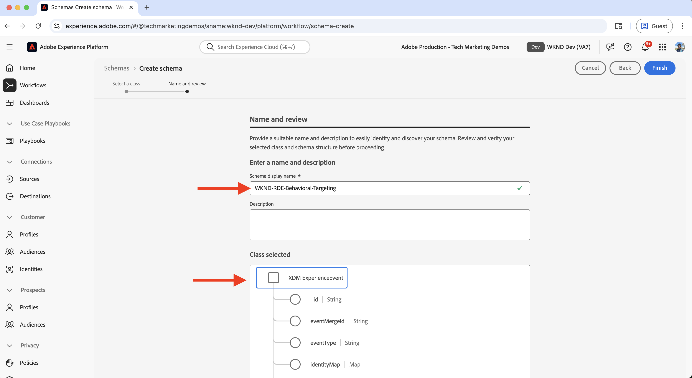
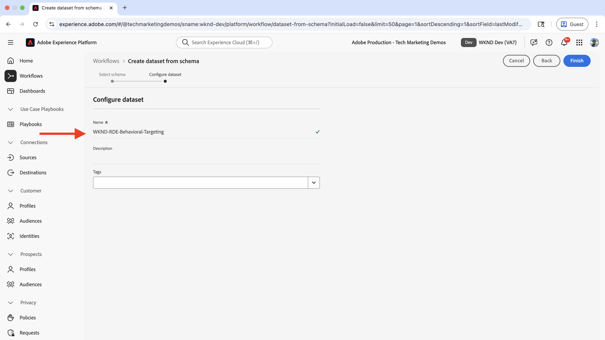
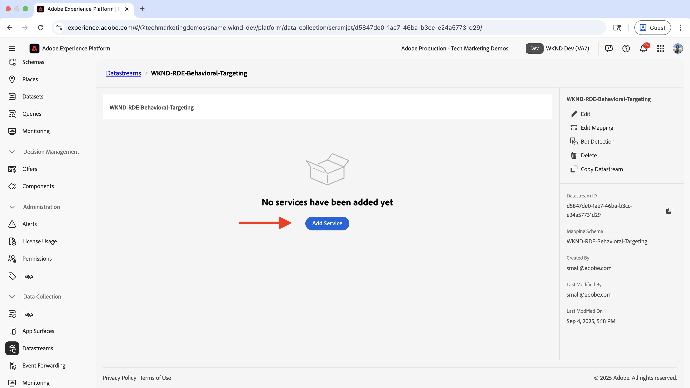
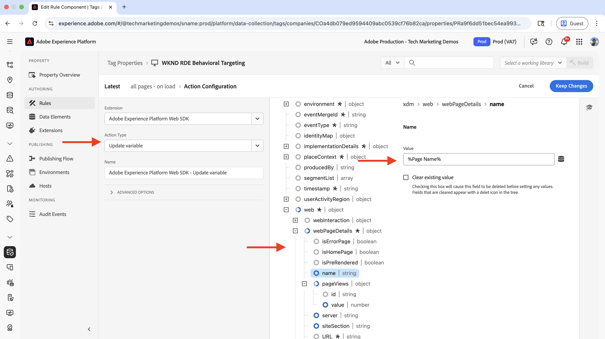
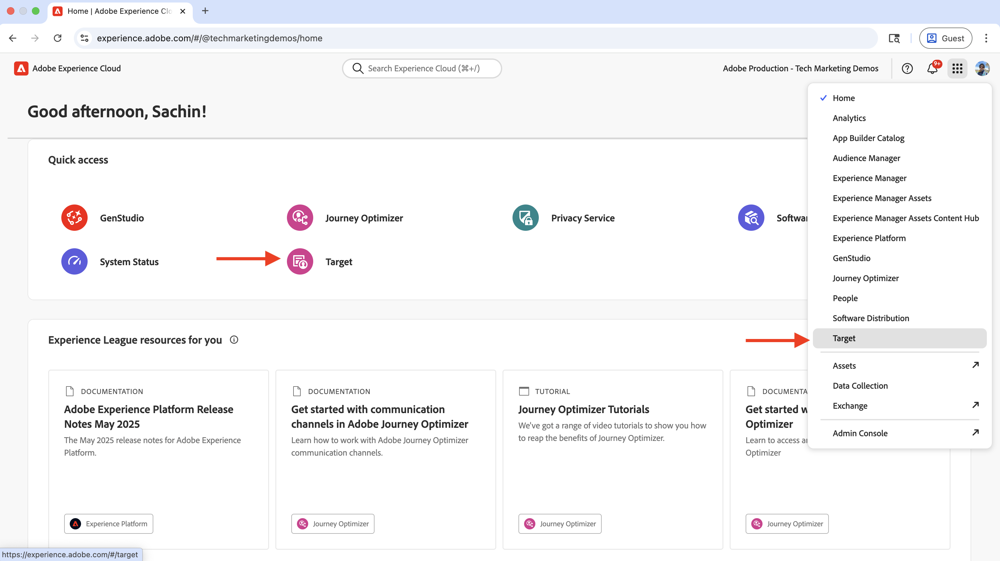

# Beteendeanpassning

Lär dig hur du anpassar innehåll baserat på användarbeteende med Adobe Experience Platform (AEP) och Adobe Target.

Beteendeanpassning hjälper er att leverera personalisering på nästa sida baserat på användarbeteende som vilka sidor de har besökt, vilka produkter eller kategorier de har besökt. Vanliga scenarier:

- **Hero Section Personalization**: Visa anpassat hjälteinnehåll på nästa sida baserat på användarens webbläsaraktivitet
- **Anpassning av innehållselement**: Ändra rubriker, bilder eller call-to-action-knappar baserat på användarens webbläsaraktivitet
- **Anpassa sidinnehåll**: Ändra hela sidinnehållet baserat på användarens webbläsaraktivitet

## Användningsfall för demo

I den här självstudiekursen visas hur **anonyma användare** som har besökt antingen _Bali Surf Camp_, _Riverside Camping_ eller _Tahoe Skiing_ -äventyrssidor kan se en personlig hjälte som visas ovanför avsnittet **Nästa annonser** på WKND-startsidan.


I demosyfte kategoriseras användare med det här surfbeteendet som **Family Travelers**-målgrupp.

### Livedemo

Besök webbplatsen [WKND Enablement](https://wknd.enablementadobe.com/us/en.html) om du vill se beteendeanpassning i praktiken. Webbplatsen har tre olika beteendebaserade upplevelser:

- **Hemsida**: När användare besöker hemsidan efter att ha bläddrat på någon av _äventyrssidorna Bali Surf Camp_, _Riverside Camping_ eller _Tahoe Skiing_ kategoriseras de som målgruppen **Familjeresenärer** och ser en personlig hjältedel ovanför _Nästa-annonser&lbrace;11_ -avsnitt.

- **Äventsida**: När användare visar _Bali Surf Camp_ eller _Surf Camp i Costa Rica_ äventyrssidor kategoriseras de som **Surfing Interest** -målgrupp och en personlig hjältedel visas på annonssidan.

- **Tidskriftssida**: När användare läser _tre eller fler_ artiklar kategoriseras de som **Tidskriftsläsare** och ser en personlig hjältedel på tidningssidan.

>[!VIDEO](https://video.tv.adobe.com/v/3474005/?captions=swe&learn=on&enablevpops)

>[!TIP]
>
>Den första målgruppen använder **Edge**-utvärdering för personalisering i realtid, medan den andra och tredje målgruppen använder **Batch**-utvärdering för personalisering, vilket är idealiskt för att returnera besökare.

## Förutsättningar

Innan du fortsätter med beteendestyrd användning måste du kontrollera att du har slutfört följande:

- [Integrera Adobe Target](../setup/integrate-adobe-target.md): Gör det möjligt för team att skapa och hantera personaliserat innehåll centralt i AEM och aktivera det som erbjudanden i Adobe Target.
- [Integrera taggar i Adobe Experience Platform](../setup/integrate-adobe-tags.md): Gör att team kan hantera och distribuera JavaScript för personalisering och datainsamling utan att behöva distribuera om AEM-kod.

Du bör också känna till [Adobe Experience Cloud Identity Service (ECID)](https://experienceleague.adobe.com/sv/docs/id-service/using/home) och [Adobe Experience Platform](https://experienceleague.adobe.com/sv/docs/experience-platform/landing/home) -koncept, till exempel Schema, Datastream, Publiker, Identiteter och Profiler.

Du kan skapa enkla målgrupper i Adobe Target, men i Adobe Experience Platform (AEP) är det moderna sättet att skapa och hantera målgrupper och bygga kompletta kundprofiler med hjälp av olika datakällor som beteendedata och transaktionsdata.

## Steg på hög nivå

Konfigurationsprocessen för beteendeanpassning innefattar steg i Adobe Experience Platform, AEM och Adobe Target.

1. **I Adobe Experience Platform:**
   1. Skapa och konfigurera ett schema
   2. Skapa och konfigurera en datauppsättning
   3. Skapa och konfigurera ett dataflöde
   4. Skapa och konfigurera en taggegenskap
   5. Konfigurera sammanfogningsprincip för profilen
   6. Konfigurera (V2) Adobe Target Destination
   7. Skapa och konfigurera en målgrupp

2. **I AEM:**
   1. Skapa personaliserade erbjudanden med Experience Fragment
   2. Integrera och mata in egenskapen Taggar på AEM-sidor
   3. Integrera Adobe Target och exportera skräddarsydda erbjudanden till Adobe Target

3. **I Adobe Target:**
   1. Verifiera målgrupper och erbjudanden
   2. Skapa och konfigurera en aktivitet

4. **Verifiera implementeringen av beteendeanpassning på dina AEM-sidor**

AEP olika lösningar används för att samla in, hantera och skörda beteendedata för att skapa målgrupper. Dessa målgrupper aktiveras sedan i Adobe Target. Med hjälp av aktiviteter i Adobe Target får användarna personaliserade upplevelser som matchar målgruppskriterierna.

## Adobe Experience Platform Steps

Om du vill skapa målgrupper baserat på beteendedata måste du samla in och lagra data när användarna besöker eller interagerar med din webbplats. I det här exemplet måste sidvisningsdata samlas in för att kategorisera en användare som **Familjeresenärer** . Processen börjar i Adobe Experience Platform med att konfigurera de komponenter som krävs för att samla in dessa data.

Logga in på [Adobe Experience Cloud](https://experience.adobe.com/) och navigera till **Experience Platform** från appväxlaren eller snabbåtkomstavsnittet.


### Skapa och konfigurera ett schema

Ett schema definierar strukturen och formatet för data som du samlar in i Adobe Experience Platform. Det säkerställer datakonsekvens och gör det möjligt att skapa meningsfulla målgrupper baserat på standardiserade datafält. För beteendeanpassning behövs ett schema som kan fånga sidvyhändelser och användarinteraktioner.

Skapa ett schema för att samla in sidvisningsdata för beteendeanpassning.

- Klicka på **Scheman** i den vänstra navigeringen på hemsidan **Adobe Experience Platform** och klicka på **Skapa schema**.

  

- I guiden **Skapa schema** för steget **Schemainformation** väljer du alternativet **Experience Event** och klickar på **Next**.

  

- Ange följande för steget **Namn och granskning**:
   - **Visningsnamn för schema**: WKND-RDE-Behavioral-Targeting
   - **Klassen vald**: XDM ExperienceEvent

  

- Uppdatera schemat enligt följande:
   - **Lägg till fältgrupp**: AEP Web SDK ExperienceEvent
   - **Profil**: Aktivera

  

- Klicka på **Spara** för att skapa schemat.

### Skapa och konfigurera en datauppsättning

En datauppsättning är en behållare för data som följer ett specifikt schema. Det fungerar som en lagringsplats där beteendedata samlas in och organiseras. Datauppsättningen måste aktiveras för profilen för att målgrupper ska kunna skapas och personaliseras.

Låt oss skapa en datauppsättning för att lagra sidvisningsdata.

- I **Adobe Experience Platform** klickar du på **Datauppsättningar** i den vänstra navigeringen och klickar på **Skapa datauppsättning**.
  

- I steget **Skapa datauppsättning** väljer du alternativet **Skapa datauppsättning från schema** och klickar på **Nästa**.
  

- I guiden **Skapa datauppsättning från schema** väljer du schemat **Välj schema** och sedan schemat **WKND-RDE-Behavioral-Targeting** och klickar på **Nästa**.
  

- Ange följande för **Konfigurera datauppsättning**-steget:
   - **Namn**: WKND-RDE-Behavioral-Targeting
   - **Beskrivning**: Datauppsättning för lagring av sidvisningsdata

  

  Klicka på **Slutför** för att skapa datauppsättningen.

- Uppdatera datauppsättningen enligt följande:
   - **Profil**: Aktivera

  

### Skapa och konfigurera ett dataflöde

En datastream är en konfiguration som definierar hur data flödar från din webbplats till Adobe Experience Platform via Web SDK. Den fungerar som en bro mellan er webbplats och plattformen och ser till att data är korrekt formaterade och dirigerade till rätt datauppsättningar. För beteendeanpassning måste vi aktivera specifika tjänster som Edge Segmentation och Personalization Destinations.

Låt oss skapa ett datastream för att skicka sidvisningsdata till Experience Platform via Web SDK.

- I **Adobe Experience Platform** klickar du på **Datastreams** i den vänstra navigeringen och klickar på **Skapa datastream**.

- Ange följande i steget **Ny datastream**:
   - **Namn**: WKND-RDE-Behavioral-Targeting
   - **Beskrivning**: Datastream för att skicka sidvisningsdata till Experience Platform
   - **Mappningsschema**: WKND-RDE-Behavioral-Targeting
Klicka på **Spara** för att skapa dataströmmen.

  

- När dataströmmen har skapats klickar du på **Lägg till tjänst**.

  

- I steget **Lägg till tjänst** väljer du **Adobe Experience Platform** i listrutan och anger följande:
   - **Händelsedatauppsättning**: WKND-RDE-behavior-Targeting
   - **Profildatauppsättning**: WKND-RDE-behavior-Targeting
   - **Offer Decisioning**: Aktivera
   - **Edge-segmentering**: Aktivera
   - **Personalization-mål**: Aktivera

  Klicka på **Spara** för att lägga till tjänsten.

  

- I steget **Lägg till tjänst** väljer du **Adobe Target** i listrutan och anger **Målmiljö-ID**. Du kan hitta målmiljö-ID:t i Adobe Target under **Administration** > **Miljö**. Klicka på **Spara** för att lägga till tjänsten.
  

### Skapa och konfigurera en taggegenskap

Egenskapen Tags är en behållare för JavaScript-kod som samlar in data från din webbplats och skickar dem till Adobe Experience Platform. Det fungerar som datainsamlingslager som samlar in användarinteraktioner och sidvyer. För beteendeanpassning samlar vi in specifik sidinformation som sidnamn, URL-adress, webbplatsavsnitt och värdnamn för att skapa meningsfulla målgrupper.

Låt oss skapa en taggegenskap som hämtar sidvisningsdata när användare besöker din webbplats.

I det här fallet samlas sidinformation som sidnamn, URL-adress, webbplatsavsnitt och värdnamn in. Dessa detaljer används för att skapa beteendemålgrupper.

Du kan uppdatera taggegenskapen som du skapade i steget [Integrera Adobe-taggar](../setup/integrate-adobe-tags.md). Men för att det ska vara enkelt skapas en ny taggegenskap.

#### Skapa taggegenskap

Så här skapar du en taggegenskap:

- I **Adobe Experience Platform** klickar du på **Taggar** i den vänstra navigeringen och sedan på knappen **Ny egenskap** .
  

- Ange följande i dialogrutan **Skapa egenskap**:
   - **Egenskapsnamn**: WKND-RDE-Behavioral-Targeting
   - **Egenskapstyp**: Välj **Webb**
   - **Domän**: Domänen där du distribuerar egenskapen (till exempel `.adobeaemcloud.com`)

  Klicka på **Spara** för att skapa egenskapen.

  

- Öppna den nya egenskapen och klicka på **Tillägg** i den vänstra navigeringen och klicka på fliken **Katalog** . Sök efter **Web SDK** och klicka på knappen **Installera**.
  

- I dialogrutan **Installera tillägg** väljer du **Datastream** som du skapade tidigare och klickar på **Spara**.
  

#### Lägg till dataelement

Dataelement är variabler som samlar in specifika datapunkter från din webbplats och gör dem tillgängliga för användning i regler och andra taggar-konfigurationer. De fungerar som byggstenar för datainsamling och gör det möjligt att extrahera meningsfull information från användarinteraktioner och sidvyer. För beteendeanpassning måste sidinformation som värdnamn, webbplatsavsnitt och sidnamn samlas in för att skapa målgruppssegment.

Skapa följande dataelement för att hämta viktig sidinformation.

- Klicka på **Dataelement** i den vänstra navigeringen och klicka på knappen **Skapa nytt dataelement** .
  

- Ange följande i dialogrutan **Skapa nytt dataelement**:
   - **Namn**: Värdnamn
   - **Tillägg**: Välj **kärna**
   - **Dataelementtyp**: Välj **Anpassad kod**
   - **Öppna redigeraren** och ange följande kodfragment:

     ```javascript
     if(window && window.location && window.location.hostname) {
         return window.location.hostname;
     }
     ```

  

- Du kan också skapa följande dataelement:

   - **Namn**: Platsavsnitt
   - **Tillägg**: Välj **kärna**
   - **Dataelementtyp**: Välj **Anpassad kod**
   - **Öppna redigeraren** och ange följande kodfragment:

     ```javascript
     if(event && event.component && event.component.hasOwnProperty('repo:path')) {
         let pagePath = event.component['repo:path'];
     
         let siteSection = '';
     
         //Check for html String in URL.
         if (pagePath.indexOf('.html') > -1) { 
         siteSection = pagePath.substring(0, pagePath.lastIndexOf('.html'));
     
         //replace slash with colon
         siteSection = siteSection.replaceAll('/', ':');
     
         //remove `:content`
         siteSection = siteSection.replaceAll(':content:','');
         }
     
         return siteSection 
     }        
     ```

   - **Namn**: Sidnamn
   - **Tillägg**: Välj **kärna**
   - **Dataelementtyp**: Välj **Anpassad kod**
   - **Öppna redigeraren** och ange följande kodfragment:

     ```javascript
     if(event && event.component && event.component.hasOwnProperty('dc:title')) {
         // return value of 'dc:title' from the data layer Page object, which is propagated via 'cmp:show' event
         return event.component['dc:title'];
     }        
     ```

- Skapa sedan ett dataelement av typen **Variabel**. Det här dataelementet fylls i med sidinformationen innan det skickas till Experience Platform.

   - **Namn**: XDM-variabel sidvy
   - **Tillägg**: Välj **Adobe Experience Platform Web SDK**
   - **Dataelementtyp**: Välj **variabel**

  I den högra panelen

   - **Sandbox**: Välj din sandlåda
   - **Schema**: Välj schemat **WKND-RDE-Behavioral-Targeting**

  Klicka på **Spara** för att skapa dataelementet.

  

- I listan **Dataelement** bör du ha fyra dataelement:

  

#### Lägg till regler

Reglerna definierar när och hur data samlas in och skickas till Adobe Experience Platform. De fungerar som det logiska lager som avgör vad som händer när specifika händelser inträffar på webbplatsen. För beteendeanpassning skapas regler som fångar sidvyhändelser och fyller i dataelement med den insamlade informationen innan de skickas till plattformen.

Skapa en regel för att fylla i dataelementet **XDM-Variable Pageview** med hjälp av andra dataelement innan du skickar det till Experience Platform. Regeln aktiveras när en användare bläddrar på WKND-webbplatsen.

- Klicka på **Regler** i den vänstra navigeringen och klicka på knappen **Skapa ny regel** .
  

- Ange följande i dialogrutan **Skapa ny regel**:

   - **Namn**: alla sidor - vid inläsning

   - Klicka på **Lägg till** för avsnittet **Händelser** för att öppna guiden **Händelsekonfiguration**.
      - **Tillägg**: Välj **kärna**
      - **Händelsetyp**: Välj **Egen kod**
      - **Öppna redigeraren** och ange följande kodfragment:

        ```javascript
        var pageShownEventHandler = function(evt) {
            // defensive coding to avoid a null pointer exception
            if(evt.hasOwnProperty("eventInfo") && evt.eventInfo.hasOwnProperty("path")) {
                //trigger Launch Rule and pass event
                console.debug("cmp:show event: " + evt.eventInfo.path);
                var event = {
                    //include the path of the component that triggered the event
                    path: evt.eventInfo.path,
                    //get the state of the component that triggered the event
                    component: window.adobeDataLayer.getState(evt.eventInfo.path)
                };
        
                //Trigger the Launch Rule, passing in the new 'event' object
                // the 'event' obj can now be referenced by the reserved name 'event' by other Launch data elements
                // i.e 'event.component['someKey']'
                trigger(event);
            }
        }
        
        //set the namespace to avoid a potential race condition
        window.adobeDataLayer = window.adobeDataLayer || [];
        
        //push the event listener for cmp:show into the data layer
        window.adobeDataLayer.push(function (dl) {
            //add event listener for 'cmp:show' and callback to the 'pageShownEventHandler' function
            dl.addEventListener("cmp:show", pageShownEventHandler);
        });
        ```

   - Klicka på **Lägg till** för avsnittet **Villkor** för att öppna guiden **Villkorskonfiguration**.
      - **Logiktyp**: Välj **Normal**
      - **Tillägg**: Välj **kärna**
      - **Villkorstyp**: Välj **Egen kod**
      - **Öppna redigeraren** och ange följande kodfragment:

        ```javascript
        if(event && event.component && event.component.hasOwnProperty('@type') && event.component.hasOwnProperty('xdm:template')) {
            console.log('The cmp:show event is from PAGE HANDLE IT');
            return true;
        }else{
            console.log('The cmp:show event is NOT from PAGE IGNORE IT');
            return false;
        }            
        ```

   - För avsnittet **Åtgärder** klickar du på **Lägg till** för att öppna guiden **Åtgärdskonfiguration**.
      - **Tillägg**: Välj **Adobe Experience Platform Web SDK**
      - **Åtgärdstyp**: Välj **Uppdatera variabel**
      - Mappa **web** > **webPageDetails** > **name** till dataelementet **Page Name**

        

      - Mappa på samma sätt **server** till dataelementet **Värdnamn** och **platsSection** till dataelementet **Platsavsnitt**. För **pageView** > **value** anger du `1` för att ange en sidvisningshändelse.

      - Klicka på **Behåll ändringar** om du vill spara åtgärdskonfigurationen.

   - Klicka på **Lägg till** igen om du vill lägga till en annan åtgärd och öppna guiden **Åtgärdskonfiguration**.
      - **Tillägg**: Välj **Adobe Experience Platform Web SDK**
      - **Åtgärdstyp**: Välj **Skicka händelse**
      - Mappa dataelementet **XDM-Variable Pageview** i den högra panelens **Data** till typen **Sidinformation för webbsidor**.

     

      - I den högra panelens **Personalization** -avsnitt ska du även kontrollera alternativet **Återge visuella personaliseringsbeslut**.  Klicka sedan på **Behåll ändringar** för att spara åtgärden.

     

   - Klicka på **Behåll ändringar** för att spara regeln.

- Din regel ska se ut så här:

  

Stegen för att skapa regeln ovan har ett stort antal detaljer, så var försiktig när du skapar regeln. Det kan låta komplicerat men kom ihåg de här konfigurationsstegen så att det kan kopplas in och spelas upp utan att du behöver uppdatera AEM-koden och distribuera om programmet.

#### Lägg till bibliotek och publicera det

Ett bibliotek är en samling med alla taggar (dataelement, regler, tillägg) som skapas och distribueras till din webbplats. Den paketerar allt så att datainsamlingen fungerar som den ska. För beteendeanpassning publiceras biblioteket för att aktivera datainsamlingsreglerna på din webbplats.

- Klicka på **Publiceringsflöde** i den vänstra navigeringen och klicka på knappen **Lägg till bibliotek** .
  

- Ange följande i dialogrutan **Lägg till bibliotek**:
   - **Namn**: 1.0
   - **Miljö**: Välj **Utveckling**
   - Klicka på **Lägg till alla ändrade resurser** för att välja alla resurser.

  Klicka på **Spara och skapa till utveckling** för att skapa biblioteket.

  

- När biblioteket har byggts för simbanan **Utveckling** klickar du på ellipserna (tre punkter) och väljer alternativet **Godkänn och publicera till produktion** .
  

Grattis! Du har skapat egenskapen Tags med regeln för att samla in sidinformation och skicka dem till Experience Platform. Detta är det grundläggande steget för att skapa beteendemålgrupper.

### Konfigurera sammanfogningsprincip för profilen

En sammanfogningspolicy definierar hur kunddata från flera källor samlas i en enda profil. Det avgör vilka data som prioriteras när konflikter uppstår och ser till att ni får en fullständig och konsekvent bild av varje kund när det gäller beteendeanpassning.

I det här fallet skapas eller uppdateras en sammanfogningsprincip som är:

- **Standardprincip för sammanslagning**: Aktivera
- **Aktiv-på-Edge-sammanslagningsprincip**: Aktivera

Så här skapar du en sammanfogningsprincip:

- I **Adobe Experience Platform** klickar du på **Profiler** i den vänstra navigeringen och sedan på fliken **Sammanfogningsprofiler** .

  

- Du kan använda en befintlig sammanfogningsprincip, men i den här självstudiekursen skapas en ny sammanfogningsprincip med följande konfiguration:

  

- Se till att aktivera både alternativen **Standardprincip för sammanslagning** och **Aktiv-på-Edge-princip**. Dessa inställningar säkerställer att era beteendedata är enhetliga och tillgängliga för målgruppsutvärdering i realtid.

### Konfigurera (V2) Adobe Target Destination

Med Adobe Target Destination (V2) kan du aktivera beteendemålgrupper som skapats i Experience Platform direkt i Adobe Target. Med den här anslutningen kan era beteendemålgrupper användas för personaliseringsaktiviteter i Adobe Target.

- I **Adobe Experience Platform** klickar du på **Destinationer** i den vänstra navigeringen och klickar på fliken **Katalog** och filtrerar efter **Personalization** och väljer **(v2) Adobe Target** -mål.

  

- Ange ett namn för målet i steget **Aktivera mål** och klicka på knappen **Anslut till mål**.
  

- Ange följande i avsnittet **Målinformation**:
   - **Namn**: WKND-RDE-Behavioral-target-destination
   - **Beskrivning**: Mål för beteendeinriktade målgrupper
   - **Datastream**: Markera **Datastream** som du skapade tidigare
   - **Workspace**: Välj din Adobe Target-arbetsyta

  

- Klicka på **Nästa** och slutför målkonfigurationen.

När destinationen har konfigurerats kan du aktivera beteendemålgrupper från Experience Platform till Adobe Target för användning i personaliseringsaktiviteter.

### Skapa och konfigurera en målgrupp

En målgrupp definierar en specifik grupp användare baserat på deras beteendemönster och egenskaper. I det här steget skapas en&quot;Family Travelers&quot;-målgrupp med reglerna för beteendedata.

Så här skapar du en målgrupp:

- I **Adobe Experience Platform** klickar du på **Publiker** i den vänstra navigeringen och klickar på knappen **Skapa publik** .
  

- I dialogrutan **Skapa publik** markerar du alternativet **Skapa regel** och klickar på knappen **Skapa** .
  

- Ange följande i steget **Skapa**:
   - **Namn**: Familjeresenärer
   - **Beskrivning**: Användare som har besökt familjevänliga äventyrssidor
   - **Utvärderingsmetod**: Välj **Edge** (för målgruppsutvärdering i realtid)

  

- Klicka sedan på fliken **Händelser** och navigera till **Webben** > **Webbsidesinformation** och dra och släpp fältet **URL** till avsnittet **Händelseregler**. Dra fältet **URL** två gånger till avsnittet **Händelseregler** . Ange följande värden:
   - **URL**: Välj **innehåller** alternativ och ange `riverside-camping-australia`
   - **URL**: Välj **innehåller** alternativ och ange `bali-surf-camp`
   - **URL**: Välj **innehåller** alternativ och ange `gastronomic-marais-tour`

  

- I avsnittet **Händelser** väljer du alternativet **Idag** . Din publik bör se ut så här:

  

- Granska målgruppen och klicka på knappen **Aktivera till mål**.

  

- I dialogrutan **Aktivera till mål** väljer du det Adobe Target-mål som du skapade tidigare och följer stegen för att aktivera målgruppen.

  

- Det finns inga data i AEP ännu, så antalet är 0. När användarna börjar besöka webbplatsen samlas data in och antalet besökare ökar.

  

Grattis! Du har skapat målgruppen och aktiverat den på Adobe Target-målet.

Detta avslutar Adobe Experience Platform steg och processen är klar att skapa den personaliserade upplevelsen i AEM och använda den i Adobe Target.

## AEM Steps

I AEM är taggegenskapen integrerad för att samla in sidvisningsdata och skicka dem till Experience Platform. Adobe Target är också integrerat och personaliserade erbjudanden skapas för målgruppen **Familjeresenärer**. Med dessa steg kan AEM arbeta med beteendeanpassning som har skapats i Experience Platform.

Vi börjar med att logga in på AEM Author-tjänsten för att skapa och konfigurera det anpassade innehållet.

- Logga in på [Adobe Experience Cloud](https://experience.adobe.com/) och navigera till **Experience Manager** från appväxlaren eller snabbåtkomstavsnittet.

  

- Navigera till din AEM Author-miljö och klicka på knappen **Platser** .
  

### Integrera och mata in taggegenskap i AEM Pages

I det här steget integreras taggegenskapen som skapades tidigare med dina AEM-sidor, vilket gör att datainsamling kan användas för beteendeanpassning. Egenskapen Tags hämtar automatiskt sidvisningsdata och skickar dem till Experience Platform när användare besöker din webbplats.

Följ stegen från [Integrera taggar i Adobe Experience Platform](../setup/integrate-adobe-tags.md) om du vill integrera taggegenskapen i AEM-sidor.

Använd taggegenskapen **WKND-RDE-Behavioral-Targeting** som skapades tidigare, inte en annan egenskap.


När taggegenskapen är integrerad börjar den samla in beteendedata från dina AEM-sidor och skicka dem till Experience Platform för att skapa en målgrupp.

### Integrera Adobe Target och exportera skräddarsydda erbjudanden till Adobe Target

Detta steg integrerar Adobe Target med AEM och möjliggör export av personaliserat innehåll (Experience Fragments) till Adobe Target. Med den här anslutningen kan Adobe Target använda innehåll som skapats i AEM för personaliseringsaktiviteter med de beteendemålgrupper som skapats i Experience Platform.

Följ stegen från **Integrera Adobe Target i Adobe Experience Platform** om du vill integrera Adobe Target och exportera [Family Travelers](../setup/integrate-adobe-target.md) -erbjudanden till Adobe Target.

Se till att Target-konfigurationen tillämpas på Experience Fragments så att de kan exporteras till Adobe Target för användning i personaliseringsaktiviteter.


När de är integrerade kan ni exportera Experience Fragments från AEM till Adobe Target, där de används som personaliserade erbjudanden för de beteendemässiga målgrupperna.

### Skapa personaliserade erbjudanden för målgrupper

Experience Fragments är återanvändbara innehållskomponenter som kan exporteras till Adobe Target som personaliserade erbjudanden. För beteendeanpassning skapas innehåll specifikt utformat för målgruppen **Familjeresenärer** som visas när användarna matchar beteendekriterierna.

Skapa en ny Experience Fragment med personaliserat innehåll för familjerelärarna.

- Klicka på **Upplevelsefragment** i AEM

  

- Navigera till mappen **WKND-platsfragment**, gå till undermappen **Aktuellt** och klicka på knappen **Skapa**.

  

- I dialogrutan **Skapa Experience Fragment** väljer du Webbvariationsmall och klickar på **Nästa**.

  

- Ta fram den nya Experience Fragment-lösningen genom att lägga till en Teaser-komponent och anpassa den med innehåll som är relevant för familjeresegment. Lägg till en intressant rubrik, beskrivning och call-to-action som tilltalar familjer som är intresserade av äventyrsresor.

  

- Markera det skapade Experience Fragment-objektet och klicka på knappen **Exportera till Adobe Target** .

  

Grattis! Du har skapat och exporterat **Family Travelers**-erbjudanden till Adobe Target. Experience Fragment är nu tillgängligt i Adobe Target som ett personaliserat erbjudande som kan användas i personaliseringsaktiviteter.

## Adobe Target Steps

I Adobe Target är de beteendemålgrupper som skapats i Experience Platform och de personaliserade erbjudanden som exporterats från AEM korrekt tillgängliga. Sedan skapas en aktivitet som kombinerar målgruppsanpassningen med det personaliserade innehållet för att leverera beteendestyrd målinriktning.

- Logga in på [Adobe Experience Cloud](https://experience.adobe.com/) och navigera till **Adobe Target** från appväxlaren eller snabbåtkomstavsnittet.

  

### Verifiera publiker och erbjudanden

Innan personaliseringsaktiviteten skapas kontrolleras de beteendemässiga målgrupperna från Experience Platform och de personaliserade erbjudandena från AEM vara korrekt tillgängliga i Adobe Target. Detta garanterar att alla komponenter som behövs för beteendeanpassning finns på plats.

- I Adobe Target klickar du på **Publiker** och kontrollerar att målgruppen Familjeresenärer har skapats.

  

- Genom att klicka på målgruppen kan du se målgruppsinformationen och verifiera att den är korrekt konfigurerad.

  

- Klicka sedan på **Erbjudanden** och kontrollera att AEM exporterade erbjudande finns. I mitt fall kallas erbjudandet (eller Experience Fragment) **En smaksättning av äventyr för hela familjen**.

  

### Skapa och konfigurera en aktivitet

En aktivitet i Adobe Target är en personaliseringskampanj som definierar när och hur personaliserat innehåll levereras till specifika målgrupper. För beteendeanpassning skapas en aktivitet som visar det personaliserade erbjudandet för användare som matchar målgruppskriterierna för Familjeresenärer.

Nu skapas en aktivitet för att leverera den personaliserade upplevelsen till hemsidan för målgruppen **Familjeresenärer**.

- I Adobe Target klickar du på **Aktiviteter** och sedan på knappen **Skapa aktivitet** och väljer aktivitetstypen **Upplevelsemål**.
  

- I dialogrutan **Skapa aktivitet för målmiljö** väljer du alternativet **Web** och **Visual** och anger URL:en för WKND-webbplatsens hemsida. Klicka på knappen **Skapa** för att skapa aktiviteten.

  

- I redigeraren väljer du målgruppen **Familjeresenärer** och lägger till **A Taste of Adventure för hela familjen** före avsnittet **Nästa äventyr** . Se skärmbilden nedan för referens.

  

- Klicka på **Nästa** och konfigurera avsnittet **Mål och inställningar** med lämpliga mål och mätvärden. Aktivera sedan avsnittet så att ändringarna aktiveras.

  

Grattis! Du har skapat och startat aktiviteten för att leverera den anpassade upplevelsen till målgruppen **Familjeresenärer** på WKND-webbplatsens hemsida. Aktiviteten är nu aktiv och visar personaliserat innehåll för användare som matchar beteendekriterierna.

## Verifiera beteendeanpassning på era AEM-sidor

Nu när det fullständiga beteendestyrda arbetsflödet har ställts in är det säkert att allt fungerar som det ska. Denna verifieringsprocess säkerställer att datainsamling, målgruppsutvärdering och personalisering fungerar som förväntat.

Verifiera beteendeanpassning på era AEM-sidor.

- Besök den publicerade webbplatsen (till exempel webbplatsen [WKND Enablement](https://wknd.enablementadobe.com/us/en.html)) och bläddra antingen mellan _Bali Surf Camp_ eller _Riverside Camping_ eller _Tahoe Skiing_ -äventyrssidorna. Se till att tillbringa minst 30 sekunder på sidan för att utlösa sidvisningshändelsen och tillåta att data samlas in.

- Gå sedan tillbaka till startsidan och se den personliga upplevelsen för målgruppen **Familjeresenärer** före avsnittet **Nästa äventyr**.

  

- Öppna webbläsarens utvecklarverktyg och kontrollera fliken **Nätverk**. Filtrera efter `interact` för att hitta Web SDK-begäran. Begäran ska innehålla information om Web SDK-händelsen.

  

- Svaret ska innehålla de personaliseringsbeslut som Adobe Target har fattat, vilket anger att du är i målgruppen **Familjeresenärer**.

  

Grattis! Du har verifierat beteendeanpassning på dina AEM-sidor. Det fullständiga flödet från datainsamling till målgruppsutvärdering till personalisering fungerar nu korrekt.

## Livedemo

Om du vill se hur beteendeanpassning fungerar går du till webbplatsen [WKND Enablement](https://wknd.enablementadobe.com/us/en.html). Det finns tre olika beteendebaserade upplevelser:

- **Hemsida**: För Family Travelers-målgrupper visas ett personligt hjälteerbjudande ovanför avsnittet _Nästa annonsering_. När en användare besöker hemsidan och har besökt någon av äventyrssidorna _Bali Surf Camp_ eller _Riverside Camping_ eller _Tahoe Skiing_ kategoriseras användaren som målgrupp för **Familjeresenärer** . Målgruppstypen är **Edge**, så utvärderingen utförs i realtid.

- **Äventsida**: För Surfing-entusiaster visas äventyrssidan med en personlig hjältesektion. När en användare tittar på _Bali Surf Camp_ - eller _Surf Camp i Costa Rica_ -äventyrssidor kategoriseras användaren som **Surfing Interest** -målgrupp. Målgruppstypen är **Batch**, så utvärderingen sker inte i realtid utan under en tidsperiod som en dag. Det är användbart för att returnera besökare.

  

- **Tidskriftssida**: För tidskriftsläsare visas tidskriftssidan med ett anpassat hjälteavsnitt. När en användare läser _tre eller fler_ artiklar kategoriseras användaren som målgrupp i **Tidskriftsläsaren**. Målgruppstypen är **Batch**, så utvärderingen sker inte i realtid utan under en tidsperiod som en dag. Det är användbart för att returnera besökare.

  

Den första målgruppen använder **Edge**-utvärdering för personalisering i realtid, medan den andra och tredje målgruppen använder **Batch**-utvärdering för personalisering, vilket är idealiskt för att returnera besökare.


## Ytterligare resurser

- [Adobe Experience Platform Web SDK](https://experienceleague.adobe.com/sv/docs/experience-platform/web-sdk/home)
- [Översikt över dataströmmar](https://experienceleague.adobe.com/sv/docs/experience-platform/datastreams/overview)
- [Visual Experience Composer (VEC)](https://experienceleague.adobe.com/sv/docs/target/using/experiences/vec/visual-experience-composer)
- [Edge-segmentering](https://experienceleague.adobe.com/sv/docs/experience-platform/segmentation/methods/edge-segmentation)
- [Målgruppstyper](https://experienceleague.adobe.com/sv/docs/experience-platform/segmentation/types/overview)
- [Adobe Target-anslutning](https://experienceleague.adobe.com/sv/docs/experience-platform/destinations/catalog/personalization/adobe-target-connection)
