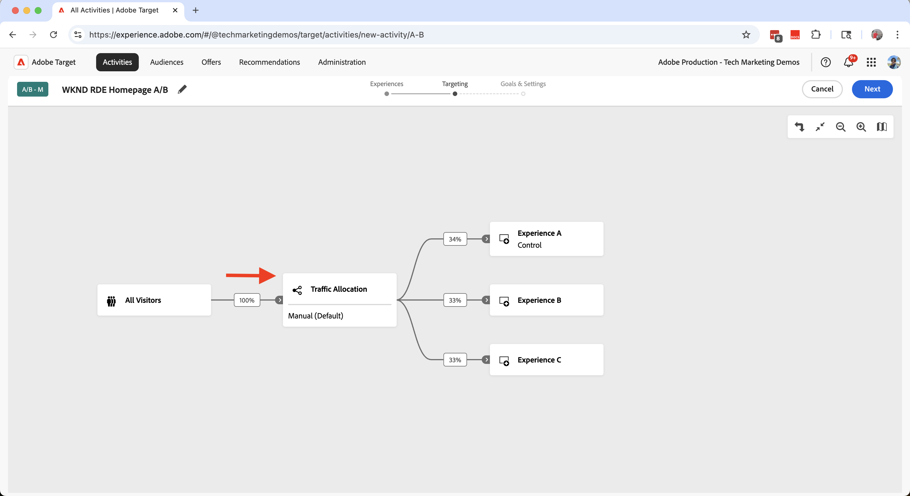
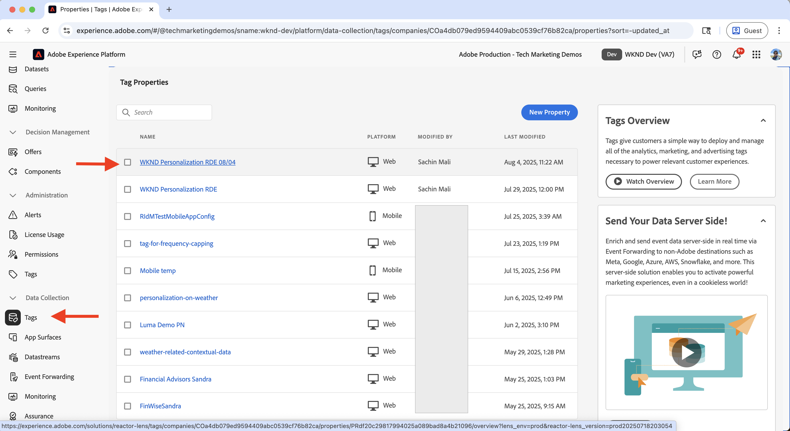
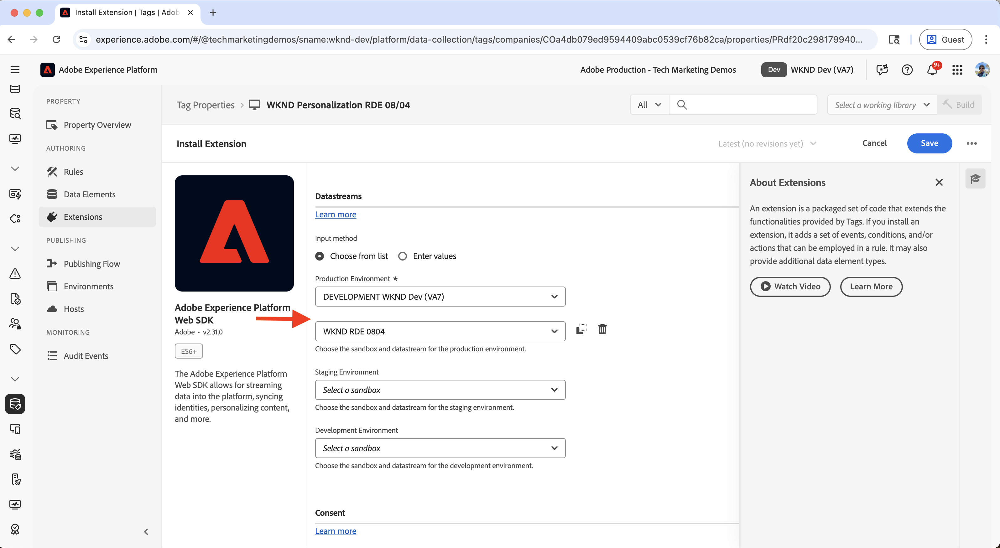
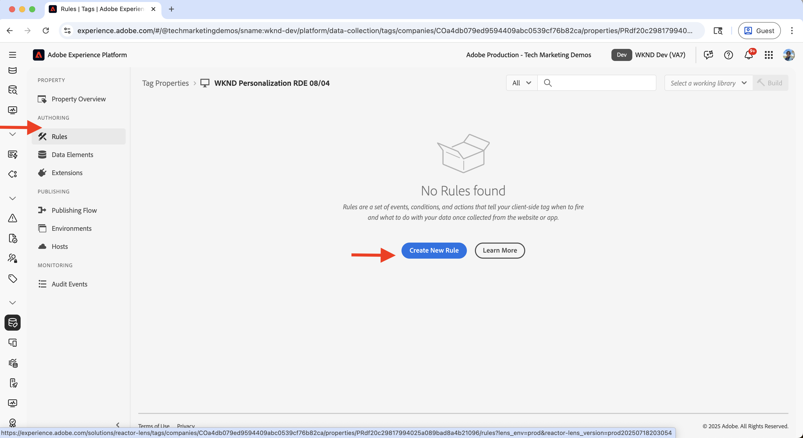

# Experimentation (A/B-testning)

Lär dig hur du testar olika innehållsvariationer på en AEM as a Cloud Service-webbplats (AEMCS) med Adobe Target.

A/B-tester hjälper er att jämföra olika versioner av innehåll för att avgöra vilka som fungerar bättre för att uppnå era affärsmål. Vanliga scenarier:

- Testa olika rubriker, bilder eller call-to-action-knappar på en landningssida
- Jämföra olika layouter eller designer för en produktinformationssida
- Utvärdera kampanjerbjudanden eller rabattstrategier

## Användningsfall för demo

I den här självstudien konfigurerar du A/B-testning för **Camping i Western Australia** Experience Fragment (XF) på WKND-webbplatsen. Du skapar tre XF-variationer och hanterar A/B-testet via Adobe Target.

Variationerna visas på WKND-hemsidan, vilket gör att du kan mäta prestanda och avgöra vilken version som ger bättre engagemang och konverteringar.

### Livedemo

Besök webbplatsen [WKND Enablement](https://wknd.enablementadobe.com/us/en.html) för att se hur A/B-testet fungerar. I videon nedan visas alla tre variationerna av **Camping i Western Australia** på hemsidan via olika webbläsare.

>[!VIDEO](https://video.tv.adobe.com/v/3473005/?learn=on&enablevpops)

## Förutsättningar

Kontrollera att du har slutfört följande innan du fortsätter med testet:

- [Integrera Adobe Target](../setup/integrate-adobe-target.md): Gör att ditt team kan skapa och hantera personaliserat innehåll centralt i AEM och aktivera det som erbjudanden i Adobe Target.
- [Integrera taggar i Adobe Experience Platform](../setup/integrate-adobe-tags.md): Gör att ditt team kan hantera och distribuera JavaScript för personalisering och datainsamling utan att behöva distribuera om AEM-kod.

## Steg på hög nivå

Konfigurationsprocessen för A/B-testning omfattar sex huvudsteg som skapar och konfigurerar experimentet:

1. **Skapa innehållsvariationer i AEM**
2. **Exportera variationerna som erbjudanden till Adobe Target**
3. **Skapa en A/B-testaktivitet i Adobe Target**
4. **Skapa och konfigurera ett datastam i Adobe Experience Platform**
5. **Uppdatera taggegenskapen med Web SDK-tillägget**
6. **Verifiera A/B-testimplementeringen på dina AEM-sidor**

## Skapa innehållsvariationer i AEM

I det här exemplet använder du **Camping i Western Australia** Experience Fragment (XF) från AEM WKND-projektet för att skapa tre varianter, som kommer att användas på WKND-webbplatsens hemsida för A/B-testning.

1. Klicka på **Experience Fragments**-kortet i AEM, navigera till **Camping i Western Australia** och klicka på **Edit**.
   

1. Klicka på **Skapa** under avsnittet **Variationer** i redigeraren och välj **Variation**.\
   

1. I dialogrutan **Skapa variation**:
   - **Mall**: Experience Fragment Web Variation Template
   - **Titel**: Till exempel &quot;Från stödrastret&quot;

   Klicka på **Klar**.

   

1. Skapa variationen genom att kopiera **Teaser** -komponenten från huvudvarianten och anpassa sedan innehållet (t.ex. uppdatera titeln och bilden).\
   

   >[!TIP]
   >Du kan använda [Generera variationer](https://experience.adobe.com/aem/generate-variations/) för att snabbt skapa nya variationer från huvud-XF.

1. Upprepa stegen för att skapa en annan variant (t.ex. &quot;Wandering the Wild&quot;).\
   

   Du har nu tre Experience Fragment-variationer för A/B-testning.

1. Innan du kan visa variationer med Adobe Target måste du ta bort det befintliga statiska lagret från hemsidan. Det förhindrar att innehåll dupliceras, eftersom Experience Fragment-variationerna injiceras dynamiskt via Target.

   - Navigera till den **engelska** hemsidan `/content/wknd/language-masters/en`
   - Ta bort teaserkomponenten **Camping i Western Australia** i redigeraren.\
     

1. Fyll i ändringarna av **US > English**-hemsidan (`/content/wknd/us/en`) för att sprida uppdateringarna.\
   

1. Publicera hemsidan **USA > engelska** för att göra uppdateringarna tillgängliga.\
   

## Exportera variationerna som erbjudanden till Adobe Target

Exportera Experience Fragment-variationerna så att de kan användas som erbjudanden i Adobe Target för A/B-testet.

1. I AEM går du till **Camping i Western Australia**, markerar de tre varianterna och klickar på **Exportera till Adobe Target**.\
   

2. I Adobe Target går du till **Erbjudanden** och bekräftar att variationerna har importerats.\
   

## Skapa en A/B-testaktivitet i Adobe Target

Skapa nu en A/B-testaktivitet för att köra experimentet på hemsidan.

1. Installera tillägget [Adobe Experience Cloud Visual Editing Helper](https://chromewebstore.google.com/detail/adobe-experience-cloud-vi/kgmjjkfjacffaebgpkpcllakjifppnca) Chrome.

1. I Adobe Target går du till **Aktiviteter** och klickar på **Skapa aktivitet**.\
   

1. I dialogrutan **Skapa A/B-testaktivitet** anger du följande:
   - **Typ**: Webb
   - **Disposition**: Visuell
   - **Aktivitets-URL**: t.ex. `https://wknd.enablementadobe.com/us/en.html`

   Klicka på **Skapa**.

   

1. Byt namn på aktiviteten till något meningsfullt (t.ex. &quot;WKND Homepage A/B Test&quot;).\
   

1. I **Upplevelse A** lägger du till komponenten **Upplevelsefragment** ovanför avsnittet **Senaste artiklar** .\
   

1. Klicka på **Välj ett erbjudande** i komponentdialogrutan.\
   

1. Välj varianten **Camping i Western Australia** och klicka på **Lägg till**.\
   

1. Upprepa för **Upplevelsen B** och **C** och välj **Av stödrastret** respektive **Vill du visa Wild**.\
   

1. I avsnittet **Mål** bekräftar du att trafiken är jämnt fördelad över alla upplevelser.\
   

1. I **Mål och inställningar** definierar du dina framgångsmått (t.ex. CTA klickar på Experience Fragment).\
   

1. Klicka på **Aktivera** i det övre högra hörnet för att starta testet.\
   

## Skapa och konfigurera ett datastream i Adobe Experience Platform

Om du vill ansluta Adobe Web SDK till Adobe Target skapar du ett dataflöde i Adobe Experience Platform. Datastream fungerar som ett routningslager mellan Web SDK och Adobe Target.

1. I Adobe Experience Platform går du till **Datastreams** och klickar på **Skapa datastream**.\
   

1. I dialogrutan **Skapa dataström** anger du ett **namn** för dataströmmen och klickar på **Spara**.\
   

1. När dataströmmen har skapats klickar du på **Lägg till tjänst**.\
   

1. I steget **Lägg till tjänst** väljer du **Adobe Target** i listrutan och anger **Målmiljö-ID**. Du kan hitta målmiljö-ID:t i Adobe Target under **Administration** > **Miljö**. Klicka på **Spara** för att lägga till tjänsten.\
   

1. Granska dataströmsinformationen för att verifiera att Adobe Target-tjänsten är listad och korrekt konfigurerad.\
   

## Uppdatera taggegenskapen med Web SDK Extension

Om du vill skicka personaliserings- och datainsamlingshändelser från AEM-sidor lägger du till Web SDK-tillägget i taggegenskapen och konfigurerar en regel som utlöser sidinläsning.

1. I Adobe Experience Platform går du till **Taggar** och öppnar den egenskap du skapade i steget [Integrera Adobe-taggar](../setup/integrate-adobe-tags.md).
   

1. Klicka på **Tillägg** på den vänstra menyn, växla till fliken **Katalog** och sök efter **Web SDK**. Klicka på **Installera** på den högra panelen.\
   

1. I dialogrutan **Installera tillägg** väljer du **Datastream** som du skapade tidigare och klickar på **Spara**.\
   

1. Efter installationen bör du kontrollera att både **Adobe Experience Platform Web SDK** och **Core** visas under fliken **Installed**.\
   

1. Konfigurera sedan en regel för att skicka Web SDK-händelsen när biblioteket läses in. Navigera till **Regler** på den vänstra menyn och klicka på **Skapa ny regel**.

   

   >[!TIP]
   >
   >Med en regel kan du definiera när och hur taggar ska aktiveras baserat på användarinteraktioner eller webbläsarhändelser.

1. Ange ett regelnamn (till exempel **) på skärmen** Skapa regel`All Pages - Library Loaded - Send Event` och klicka på **+ Lägg till** under avsnittet **Händelser**.
   

1. I dialogrutan **Händelsekonfiguration**:
   - **Tillägg**: Välj **kärna**
   - **Händelsetyp**: Välj **Bibliotek inläst (sidan överst)**
   - **Namn**: Ange `Core - Library Loaded (Page Top)`

   Klicka på **Behåll ändringar** för att spara händelsen.

   

1. Under avsnittet **Åtgärder** klickar du på **+ Lägg till** för att definiera den åtgärd som ska utföras när händelsen utlöses.

1. I dialogrutan **Åtgärdskonfiguration**:
   - **Tillägg**: Välj **Adobe Experience Platform Web SDK**
   - **Åtgärdstyp**: Välj **Skicka händelse**
   - **Namn**: Välj **AEP Web SDK - skicka händelse**

   

1. Gå till den högra panelens **Personalization**-avsnitt och kontrollera alternativet **Återge visuella personaliseringsbeslut**. Klicka sedan på **Behåll ändringar** för att spara åtgärden.\
   

   >[!TIP]
   >
   >   Den här åtgärden skickar en AEP Web SDK-händelse när sidan läses in så att Adobe Target kan leverera personaliserat innehåll.

1. Granska den slutförda regeln och klicka på **Spara**.
   

1. Om du vill använda ändringarna går du till **Publiceringsflöde** och lägger till den uppdaterade regeln i ett **bibliotek**.\
   

1. Upphöj slutligen biblioteket till **Produktion**.
   

## Verifiera A/B-testimplementeringen på dina AEM-sidor

När aktiviteten är live och taggbiblioteket har publicerats i produktion kan du verifiera A/B-testet på dina AEM-sidor.

1. Besök den publicerade webbplatsen (till exempel [WKND-aktiveringswebbplatsen](https://wknd.enablementadobe.com/us/en.html)) och observera vilken variation som visas. Försök att komma åt den från en annan webbläsare eller mobil enhet för att se alternativa varianter.
   

1. Öppna webbläsarens utvecklarverktyg och kontrollera fliken **Nätverk**. Filtrera efter `interact` för att hitta Web SDK-begäran. Begäran ska innehålla information om Web SDK-händelsen.

   

Svaret bör omfatta de personaliseringsbeslut som Adobe Target har fattat och ange vilken variation som delgetts.\

1. Du kan också använda tillägget [Adobe Experience Platform Debugger](https://chromewebstore.google.com/detail/adobe-experience-platform/bfnnokhpnncpkdmbokanobigaccjkpob) Chrome för att kontrollera Web SDK-händelser.
   

## Livedemo

Om du vill se hur A/B-testet fungerar går du till webbplatsen [WKND-aktivering](https://wknd.enablementadobe.com/us/en.html) och ser hur olika varianter av Experience Fragment visas på hemsidan.

## Ytterligare resurser

- [Översikt över A/B-test](https://experienceleague.adobe.com/en/docs/target/using/activities/abtest/test-ab)
- [Adobe Experience Platform Web SDK](https://experienceleague.adobe.com/en/docs/experience-platform/web-sdk/home)
- [Översikt över dataströmmar](https://experienceleague.adobe.com/en/docs/experience-platform/datastreams/overview)
- [Visual Experience Composer (VEC)](https://experienceleague.adobe.com/en/docs/target/using/experiences/vec/visual-experience-composer)
