# Känd personalisering för användare

Lär dig anpassa innehåll baserat på kända användardata som inköpshistorik, CRM-data eller andra data som samlas in om användaren.

Känd användarpersonalisering hjälper er att leverera personaliserade upplevelser till användarna baserat på data som ni har samlat in om dem. Användardata för _kan ha samlats in via olika system_ eller kanaler, till exempel en webbplats, en mobilapp eller ett callcenter. Dessa _data sammanfogas sedan för att skapa en fullständig användarprofil_ och används för att personalisera upplevelserna.

Vanliga scenarier:

- **Innehållspersonalisering**: Visa personaliserade upplevelser baserat på användarens profildata. Du kan till exempel visa en personlig hjälte på hemsidan baserat på användarens inköpshistorik.
- **Merförsäljning och korsförsäljning**: Visa personliga rekommendationer för merförsäljning och korsförsäljning baserat på användarens inköpshistorik. Visa t.ex. en anpassad merförsäljningsrekommendation för användarens inköpshistorik.
- **Bonusprogram**: Visa anpassade bonusprogram baserat på användarens inköpshistorik. Du kan till exempel visa en anpassad förmån för kundens inköpshistorik.

Din organisation kan ha olika användningsområden för en känd användarpersonalisering. Ovanstående är bara några exempel.

## Exempel

I den här självstudiekursen, med [WKND-exempelwebbplatsen](https://github.com/adobe/aem-guides-wknd), visar processen hur **inloggade användare** som har köpt ett **Ski**-äventyr ser en personlig hjälte på **WKND-hemsidan**.

Hjälteupplevelsen försöker _merförsäljning_ av den oumbärliga skidutrustningen till de användare som har köpt något **skidäventyr**. De användare som inte har köpt något **Ski**-äventyr ser standardhjälteinnehållet. Hjälteupplevelsen är därför anpassad efter användarna utifrån deras inköpshistorik och inloggningsstatus. För att möjliggöra den här personaliseringen sammanfogas data från olika system till en fullständig kundprofil och används för personaliseringsaktiviteter.


### Hantering av användardata i olika system

För demoändamål bör du anta att WKND-användardata finns i följande system. Varje system lagrar olika typer av data som kan klassificeras i två kategorier:

- **Beteendedata**: Hämtar användarinteraktioner och aktiviteter i digitala kanaler (sidvyer, klickningar, webbplatsnavigering, inloggningsstatus, surfmönster)
- **Transaktionsdata**: Registrerar slutförda affärstransaktioner och kundprofilinformation (inköp, orderhistorik, profilinformation, inställningar)

| System | Syfte | Vilka data lagras? | Datatyp |
|------|------|------|------|
| AEM | Content Management System (CMS), Adventure-listor och -bokningar samt inloggningsfunktioner | Användarinteraktioner: sidvy, inloggningsstatus, webbplatsnavigering. Minimala användaridentifierare som användar-ID, namn, e-postadress. | Beteendedata |
| Andra system | Användarprofil och inköpstransaktionsposter som ett komplett arkivsystem. | Fullständiga kundprofiler: användar-ID, namn, adress, telefonnummer, inköpshistorik, orderinformation, inställningar. | Transaktionsdata |

Det andra systemet kan vara ett Order Management-system (OMS), CRM-system (Customer Relationship Management), MDM-system (Master Data Management) eller något annat system som lagrar transaktionsdata.

Det antas också att WKND-webbplatsen har ett användargränssnitt (UI) som tillåter användare att köpa/boka **annonserna**. AEM är integrerat med det andra systemet för lagring av reklaminköpsdata. Dessutom har användaren skapat ett konto på WKND-webbplatsen före eller under köpet.

I det logiska diagrammet visas användarinteraktionen med WKND-webbplatsen och hur beteendedata och transaktionsdata samlas in och matas in i Experience Platform.


Det här är en alltför förenklad version som demonstrerar konceptet med kända användarpersonaliseringar. I ett verkligt scenario kan du ha flera system där beteendedata och transaktionsdata samlas in och lagras.

### Viktiga uppgifter

- **Distribuerad datalagring**: Användardata lagras över flera system - AEM lagrar minimala användardata (användar-ID, namn, e-postadress) för inloggningsfunktioner, medan andra system (OMS, CRM, MDM) behåller fullständig användarprofil och transaktionsdata som inköpshistorik.
- **Identitetssammanfogning**: Systemen länkas med en gemensam identifierare (WKND-användar-ID - `wkndUserId`) som unikt identifierar användare på olika plattformar och i olika kanaler.
- **Fullständigt skapande av profiler**: Målet är att sammanfoga användardata från dessa distribuerade system till en enhetlig kundprofil, som sedan används för att leverera personaliserade upplevelser.

Användningssättet kan ha olika system och datalagring. Nyckeln är att identifiera en gemensam identifierare som unikt identifierar användare på olika plattformar och i olika kanaler.

## Förutsättningar

Kontrollera att du har slutfört följande innan du fortsätter med användningsexemplet för användaranpassning:

- [Integrera Adobe Target](../setup/integrate-adobe-target.md): Gör det möjligt för team att skapa och hantera personaliserat innehåll centralt i AEM och aktivera det som erbjudanden i Adobe Target.
- [Integrera taggar i Adobe Experience Platform](../setup/integrate-adobe-tags.md): Gör att team kan hantera och distribuera JavaScript för personalisering och datainsamling utan att behöva distribuera om AEM-kod.

Lär dig även känna till [Adobe Experience Cloud Identity Service (ECID)](https://experienceleague.adobe.com/en/docs/id-service/using/home)- och [Adobe Experience Platform](https://experienceleague.adobe.com/en/docs/experience-platform/landing/home)-koncept, till exempel Schema, Datauppsättning, Datastream, Publiker, Identiteter och Profiler.

I den här självstudiekursen får du lära dig mer om hur du sätter ihop identiteter och bygger en kundprofil i Adobe Experience Platform. Genom att kombinera beteendedata med transaktionsdata skapas således en fullständig kundprofil.

## Stegen på hög nivå

Konfigurationsprocessen för användaranpassning innefattar steg i Adobe Experience Platform, AEM och Adobe Target.

1. **I Adobe Experience Platform:**
   1. Skapa _Identitetsnamnområde_ för WKND-användar-ID (`wkndUserId`)
   1. Skapa och konfigurera två XDM-scheman (Experience Data Model) - standardiserade datastrukturer som definierar hur data ordnas och valideras - en för beteendedata och en för transaktionsdata
   1. Skapa och konfigurera två datauppsättningar, en för beteendedata och en för transaktionsdata
   1. Skapa och konfigurera ett dataflöde
   1. Skapa och konfigurera en taggegenskap
   1. Konfigurera sammanfogningsprincip för profilen
   1. Konfigurera (V2) Adobe Target Destination

2. **I AEM:**
   1. Förbättra WKND-webbplatsens inloggningsfunktion för att lagra användar-ID:t i webbläsarens sessionslagring.
   1. Integrera och mata in egenskapen Taggar på AEM-sidor
   1. Verifiera datainsamling på AEM-sidor
   1. Integrera Adobe Target
   1. Skapa personaliserade erbjudanden

3. **I Adobe Experience Platform:**
   1. Verifiera att beteendedata och profiler har skapats
   1. Infoga transaktionsdata
   1. Verifiera sammanfogning av beteendedata och transaktionsdata
   1. Skapa och konfigurera en målgrupp
   1. Aktivera målgruppen för Adobe Target

4. **I Adobe Target:**
   1. Verifiera målgrupper och erbjudanden
   1. Skapa och konfigurera en aktivitet

5. **Verifiera den kända användaranpassningen på dina AEM-sidor**

Adobe Experience Platform (AEP) olika lösningar används för att samla in, hantera, identifiera och sammanfoga användardata i olika system. Med hjälp av sammanfogade användardata skapas och aktiveras målgrupperna i Adobe Target. Med hjälp av aktiviteter i Adobe Target får användarna personaliserade upplevelser som matchar målgruppskriterierna.

## Adobe Experience Platform

Om du vill skapa en fullständig kundprofil måste du samla in och lagra både beteendedata (sidvisningsdata) och transaktionsdata (WKND Adventure-köp). Beteendedata samlas in med egenskapen Tags och transaktionsdata samlas in med WKND Adventure-inköpssystemet.

Transaktionsdata hämtas sedan in i Experience Platform och sammanfogas med beteendedata för att skapa en komplett kundprofil.

I det här exemplet behövs sidvisningsdata tillsammans med äventyrsinköpsdata för att kategorisera en användare som har köpt ett **Ski** -äventyr. Data sammanfogas med WKND-användar-ID (`wkndUserId`), som är en gemensam identifierare för alla system.

Vi börjar med att logga in på Adobe Experience Platform för att konfigurera de komponenter som behövs för att samla in och sammanfoga data.

Logga in på [Adobe Experience Cloud](https://experience.adobe.com/) och navigera till **Experience Platform** från appväxlaren eller snabbåtkomstavsnittet.


### Skapa namnområde för identitet

Ett identitetsnamnutrymme är en logisk behållare som ger kontext till identiteter, vilket hjälper Experience Platform att förstå vilket ID-system som används (till exempel e-post, CRM-ID eller lojalitets-ID). Om du vill relatera två eller flera separata delar av profildata används ett ID-namnutrymme. När båda dessa separata profildata har samma värde för ett attribut och delar samma namnutrymme sammanfogas de. Om du vill kvalificera ett attribut som ett identitetssammanfogningsattribut måste det vara av samma namnutrymme.

I det här exemplet är WKND-användar-ID (`wkndUserId`) den vanliga identifieraren för beteendedata och transaktionsdata. Med hjälp av den här gemensamma identifieraren sammanfogas data för att skapa en fullständig kundprofil.

Låt oss skapa ett identitetsnamnutrymme för WKND-användar-ID (`wkndUserId`).

- I **Adobe Experience Platform** klickar du på **Identiteter** i den vänstra navigeringen. Klicka sedan på knappen **Skapa ID-namnområde** längst upp till höger.

  

- Ange följande i dialogrutan **Skapa ID-namnområde**:
   - **Visningsnamn**: WKND-användar-ID
   - **Beskrivning**: Användar-ID eller användarnamn för den inloggade WKND-användaren
   - **Välj en typ**: Enskilt enhets-ID

  Klicka på **Skapa** för att skapa identitetsnamnområdet.

  

### Skapa scheman

Ett schema definierar strukturen och formatet för data som du samlar in i Adobe Experience Platform. Det säkerställer datakonsekvens och gör det möjligt att skapa meningsfulla målgrupper baserat på standardiserade datafält. För kända användarpersonaliseringar krävs två scheman, ett för beteendedata och ett för transaktionsdata.

#### Beteendedataschema

Skapa först ett schema för att samla in beteendedata som sidvyhändelser och användarinteraktioner.

- I **Adobe Experience Platform** klickar du på **Scheman** i den vänstra navigeringen och klickar på knappen **Skapa schema** i det övre högra hörnet. Välj sedan alternativet **Manuell** och klicka på knappen **Markera** .

  

- I guiden **Skapa schema** för steget **Schemainformation** väljer du alternativet **Experience Event** (för tidsseriedata som sidvyer, klickningar och användarinteraktioner) och klickar på **Nästa**.

  

- Ange följande för steget **Namn och granskning**:
   - **Schemats visningsnamn**: WKND-RDE-Known-User-Personalization-Behavioral
   - **Klassen vald**: XDM ExperienceEvent

  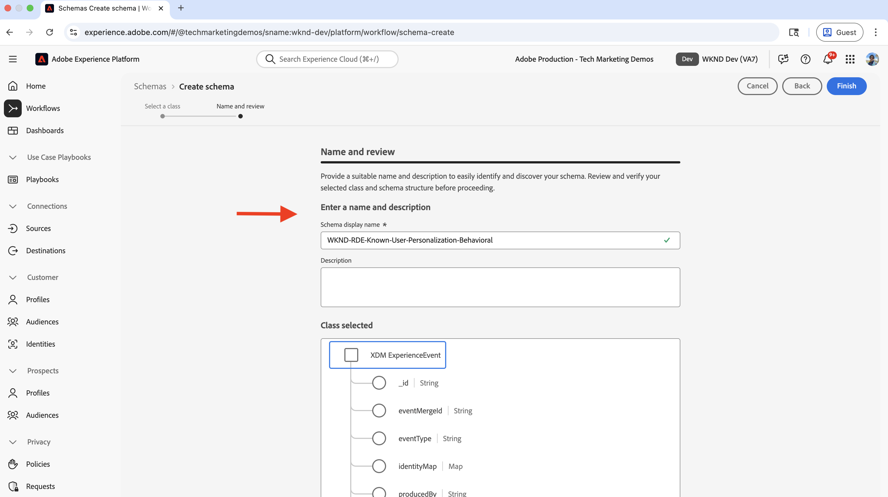

- Uppdatera schemat enligt följande:
   - **Lägg till fältgrupp**: AEP Web SDK ExperienceEvent
   - **Profil**: Aktivera

  Klicka på **Spara** för att skapa schemat.

  

- Om du vill veta om användaren är inloggad (autentiserad) eller anonym lägger du till ett anpassat fält i schemat. I det här fallet är målet att anpassa innehållet för kända användare som har köpt ett **SKI** -äventyr. Det är därför viktigt att identifiera om användaren är inloggad (autentiserad) eller anonym.


   - Klicka på knappen **+** bredvid schemanamnet.
   - Ange följande i avsnittet **Fältegenskaper**:
      - **Fältnamn**: wkndLoginStatus
      - **Visningsnamn**: WKND-inloggningsstatus
      - **Typ**: Sträng
      - **Tilldela till**: Fältgrupp > `wknd-user-details`

     Bläddra nedåt och klicka på knappen **Använd**.

     

- Det slutliga beteendedataschemat ska se ut så här:

  

#### Transactional Data Schema

Skapa sedan ett schema för att samla in transaktionsdata som WKND Adventure-inköp.

- I guiden **Skapa schema** för steget **Schemainformation** väljer du alternativet **Individuell profil** (för postbaserade data som kundattribut, inställningar och inköpshistorik) och klickar på **Nästa**.

  

- Ange följande för steget **Namn och granskning**:
   - **Schemats visningsnamn**: WKND-RDE-Known-User-Personalization-Transactional
   - **Klassen vald**: XDM individuell profil

  

- Om du vill lagra en användares WKND Adventure-inköpsinformation måste du först lägga till ett anpassat fält som fungerar som identifierare för köpet. Kom ihåg att WKND-användar-ID (`wkndUserId`) är den vanliga identifieraren i alla system.
   - Klicka på knappen **+** bredvid schemanamnet.
   - Ange följande i avsnittet **Fältegenskaper**:
      - **Fältnamn**: wkndUserId
      - **Visningsnamn**: WKND-användar-ID
      - **Typ**: Sträng
      - **Tilldela till**: Fältgrupp > `wknd-user-purchase-details`

  

   - Bläddra nedåt, kontrollera **Identitet**, kontrollera **Primär identitet** (den huvudsakliga identifieraren som används för att sammanfoga data från olika källor till en enhetlig profil) och välj **WKND-användar-ID** i listrutan **Identitetsnamn** . Klicka slutligen på knappen **Använd**.

  

- När du har lagt till det anpassade primära identitetsfältet ska schemat se ut så här:

  

- Lägg också till följande fält för att lagra ytterligare information om användar- och äventyrsköp:

  | Fältnamn | Visningsnamn | Typ | Tilldela till |
  |----------|------------|----|---------|
  | adventurePurchased | Inköpt äventyr | Sträng | Fältgrupp > `wknd-user-purchase-details` |
  | adventurePurchaseAmount | Inköpsbelopp för äventyr | Dubbel | Fältgrupp > `wknd-user-purchase-details` |
  | adventurePurchaseQuantity | Antal inköp av äventyr | Heltal | Fältgrupp > `wknd-user-purchase-details` |
  | adventurePurchaseDate | Inköpsdatum för äventyr | Datum | Fältgrupp > `wknd-user-purchase-details` |
  | adventureStartDate | Startdatum för äventyr | Datum | Fältgrupp > `wknd-user-purchase-details` |
  | adventureEndDate | Slutdatum för äventyr | Datum | Fältgrupp > `wknd-user-purchase-details` |
  | firstName | Förnamn | Sträng | Fältgrupp > `wknd-user-purchase-details` |
  | lastName | Efternamn | Sträng | Fältgrupp > `wknd-user-purchase-details` |
  | e-post | E-post | E-postadress | Fältgrupp > `wknd-user-purchase-details` |
  | telefon | Telefon | Objekt | Fältgrupp > `wknd-user-purchase-details` |
  | kön | Kön | Sträng | Fältgrupp > `wknd-user-purchase-details` |
  | age | Ålder | Heltal | Fältgrupp > `wknd-user-purchase-details` |
  | adress | Adress | Sträng | Fältgrupp > `wknd-user-purchase-details` |
  | stad | Ort | Sträng | Fältgrupp > `wknd-user-purchase-details` |
  | läge | Läge | Sträng | Fältgrupp > `wknd-user-purchase-details` |
  | land | Land | Sträng | Fältgrupp > `wknd-user-purchase-details` |
  | zipCode | Postnummer | Sträng | Fältgrupp > `wknd-user-purchase-details` |

  

- Aktivera profil för schemat.

  

Du har nu skapat båda scheman för beteendedata och transaktionsdata.

### Skapa och konfigurera datauppsättningar

En datauppsättning är en behållare för data som följer ett specifikt schema. I det här exemplet skapar du två datauppsättningar, en för beteendedata och en för transaktionsdata.

#### Datauppsättning för beteendedata

- I **Adobe Experience Platform** klickar du på **Datauppsättningar** i den vänstra navigeringen och klickar på knappen **Skapa datauppsättning** längst upp till höger. Välj sedan alternativet **Schemabaserad** och klicka på **Nästa**.

  

- För steget **Välj schema** väljer du schemat **WKND-RDE-Known-User-Personalization-Behavioral** och klickar på **Nästa**.

  

- Ange följande för **Konfigurera datauppsättning**-steget:
   - **Namn**: WKND-RDE-Known-User-Personalization-Behavioral
   - **Beskrivning**: Datauppsättning för beteendedata, till exempel sidvyer med inloggningsstatus för användare.

  

  Klicka på **Slutför** för att skapa datauppsättningen.

- Aktivera datauppsättningen för profilen genom att växla **Profil**.

  

#### Transaktionsdatauppsättning

- Upprepa samma steg för transaktionsdatamängden. Den enda skillnaden är schemats och datauppsättningens namn.

   - **Schema**: WKND-RDE-Known-User-Personalization-Transactional
   - **Datauppsättning**: WKND-RDE-Known-User-Personalization-Transactional
   - **Beskrivning**: Datauppsättning för transaktionsdata som exempelvis WKND Adventure-köp.
   - **Profil**: Aktivera

  Den slutliga datauppsättningen för transaktionsdata ska se ut så här:

  

Med båda datauppsättningarna på plats kan du nu skapa ett datastream som möjliggör dataflöde från din webbplats till Experience Platform.

### Skapa och konfigurera ett dataflöde

En datastream är en konfiguration som definierar hur data flödar från din webbplats till Adobe Experience Platform via Web SDK. Den fungerar som en Bridge mellan er webbplats och plattformen och ser till att data är korrekt formaterade och dirigerade till rätt datauppsättningar. Aktivera t.ex. Edge Segmentation och Personalization Destinations för att skapa kända användarprofiler.

Låt oss skapa en datastream för att skicka _beteendedata_ (och inte transaktionsdata) till Experience Platform via Web SDK.

- I **Adobe Experience Platform** klickar du på **Datastreams** i den vänstra navigeringen och klickar på **Skapa datastream**.

  

- Ange följande i steget **Ny datastream**:

   - **Namn**: WKND-RDE-Known-User-Personalization-Behavioral
   - **Beskrivning**: Datastream för att skicka beteendedata till Experience Platform
   - **Mappningsschema**: WKND-RDE-Known-user-Personalization-Behavioral

  

  Klicka på **Spara** för att skapa dataströmmen.

- När dataströmmen har skapats klickar du på **Lägg till tjänst**.

  

- I steget **Lägg till tjänst** väljer du **Adobe Experience Platform** i listrutan och anger följande:
   - **Händelsedatauppsättning**: WKND-RDE-known-user-Personalization-behavior
   - **Profildatauppsättning**: WKND-RDE-Known-user-Personalization-Behavioral
   - **Offer Decisioning**: Aktivera (tillåter Adobe Target att begära och leverera personaliserade erbjudanden i realtid)
   - **Edge-segmentering**: Aktivera (utvärderar målgrupper i realtid i gränsnätverket för omedelbar personalisering)
   - **Personalization-mål**: Aktivera (tillåter målgruppsdelning med personaliseringsverktyg som Adobe Target)

  Klicka på **Spara** för att lägga till tjänsten.

  

- I steget **Lägg till tjänst** väljer du **Adobe Target** i listrutan och anger **Målmiljö-ID**. Du kan hitta målmiljö-ID:t i Adobe Target under **Administration** > **Miljö**. Klicka på **Spara** för att lägga till tjänsten.
  

- Den sista datastream bör se ut så här:

  

Datastream har nu konfigurerats för att skicka beteendedata till Experience Platform via Web SDK.

Observera att _transaktionsdata_ hämtas till Experience Platform med batchinmatning (en metod för att överföra stora datamängder med schemalagda intervall i stället för i realtid). WKND Adventure-inköpsdata samlas in på WKND-platsen och lagras i det andra systemet (till exempel OMS, CRM eller MDM). Data importeras sedan till Experience Platform via batchintag.

Det går också att importera data direkt från webbplatsen till Experience Platform, som inte ingår i kursen. Användningsexemplet vill framhäva processen med att sammanfoga användardata mellan olika system och skapa en komplett kundprofil.

## Skapa och konfigurera en taggegenskap

Egenskapen Tags är en behållare för JavaScript-kod som samlar in data från din webbplats och skickar dem till Adobe Experience Platform. Det fungerar som datainsamlingslager som samlar in användarinteraktioner och sidvyer. För kända användare och sidvisningsdata (till exempel sidnamn, URL, webbplatsavsnitt och värdnamn) samlas även användarens inloggningsstatus och WKND-användar-ID in. WKND-användar-ID (`wkndUserId`) skickas som en del av identitetskartobjektet.

Låt oss skapa en taggegenskap som hämtar sidvydata och inloggningsstatus + användar-ID (om inloggad) när användare besöker WKND-webbplatsen.

Du kan uppdatera taggegenskapen som du skapade i steget [Integrera Adobe-taggar](../setup/integrate-adobe-tags.md). Men för att det ska vara enkelt skapas en ny taggegenskap.

### Skapa taggegenskap

- I **Adobe Experience Platform** klickar du på **Taggar** i den vänstra navigeringen och sedan på knappen **Ny egenskap** .

  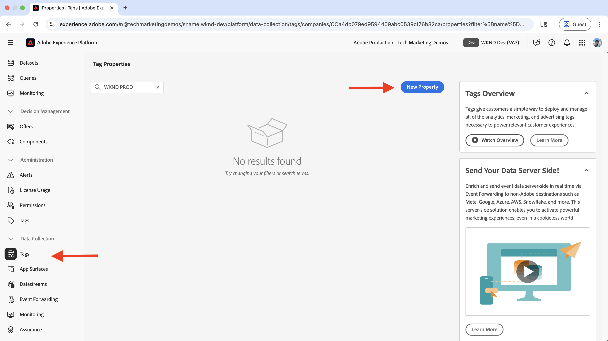

- Ange följande i dialogrutan **Skapa egenskap**:
   - **Egenskapsnamn**: WKND-RDE-Known-User-Personalization
   - **Egenskapstyp**: Välj **Webb**
   - **Domän**: Domänen där du distribuerar egenskapen (till exempel `adobeaemcloud.com`)

  Klicka på **Spara** för att skapa egenskapen.

  

- Öppna den nya egenskapen och klicka på **Tillägg** i den vänstra navigeringen och klicka på fliken **Katalog** . Sök efter **Web SDK** och klicka på knappen **Installera**.
  

- I dialogrutan **Installera tillägg** väljer du **Datastream** som du skapade tidigare och klickar på **Spara**.
  

#### Lägg till dataelement

Dataelement är variabler som samlar in specifika datapunkter från din webbplats och gör dem tillgängliga för användning i regler och andra taggar-konfigurationer. De fungerar som byggstenar för datainsamling och gör det möjligt att extrahera meningsfull information från användarinteraktioner och sidvyer. För att personaliseringen ska vara känd måste sidinformation som värdnamn, webbplatsavsnitt och sidnamn hämtas för att skapa målgruppssegment. Dessutom måste användarens inloggningsstatus och användar-ID (om det är inloggat) för WKND hämtas.

Skapa följande dataelement för att hämta viktig sidinformation.

- Klicka på **Dataelement** i den vänstra navigeringen och klicka på knappen **Skapa nytt dataelement** .
  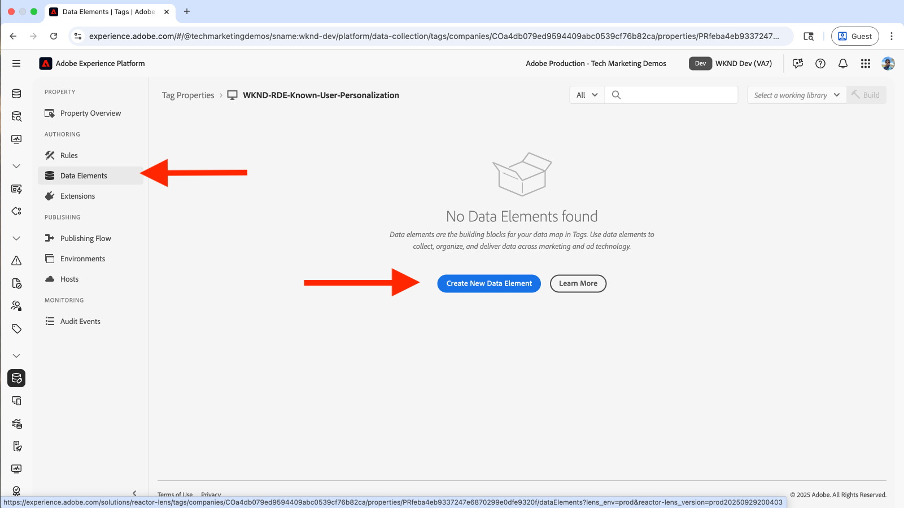

- Ange följande i dialogrutan **Skapa nytt dataelement**:
   - **Namn**: Värdnamn
   - **Tillägg**: Välj **kärna**
   - **Dataelementtyp**: Välj **Anpassad kod**
   - **Öppna redigeraren** och ange följande kodfragment:

     ```javascript
     if(window && window.location && window.location.hostname) {
         return window.location.hostname;
     }        
     ```

  

- Du kan också skapa följande dataelement:

   - **Namn**: Platsavsnitt
   - **Tillägg**: Välj **kärna**
   - **Dataelementtyp**: Välj **Anpassad kod**
   - **Öppna redigeraren** och ange följande kodfragment:

     ```javascript
     if(event && event.component && event.component.hasOwnProperty('repo:path')) {
         let pagePath = event.component['repo:path'];
     
         let siteSection = '';
     
         //Check of html String in URL.
         if (pagePath.indexOf('.html') > -1) { 
         siteSection = pagePath.substring(0, pagePath.lastIndexOf('.html'));
     
         //replace slash with colon
         siteSection = siteSection.replaceAll('/', ':');
     
         //remove `:content`
         siteSection = siteSection.replaceAll(':content:','');
         }
     
         return siteSection 
     }        
     ```

  

   - **Namn**: Sidnamn
   - **Tillägg**: Välj **kärna**
   - **Dataelementtyp**: Välj **Anpassad kod**
   - **Öppna redigeraren** och ange följande kodfragment:

     ```javascript
     if(event && event.component && event.component.hasOwnProperty('dc:title')) {
         // return value of 'dc:title' from the data layer Page object, which is propogated via 'cmp:show' event
         return event.component['dc:title'];
     }
     ```

  


   - **Namn**: WKND-användar-ID
   - **Tillägg**: Välj **kärna**
   - **Dataelementtyp**: Välj **Anpassad kod**
   - **Öppna redigeraren** och ange följande kodfragment:

     ```javascript
     // Data element for WKND User ID
     if(event && event.user && event.user.userId) {
         console.log('UserID:', event.user.userId);
         return event.user.userId;
     } else {
         console.log('UserID:');
         return "";
     }        
     ```

  


   - **Namn**: WKND-användarstatus
   - **Tillägg**: Välj **kärna**
   - **Dataelementtyp**: Välj **Anpassad kod**
   - **Öppna redigeraren** och ange följande kodfragment:

     ```javascript
     // Data element for user login status
     if(event && event.user && event.user.status) {
         console.log('User status:', event.user.status);
         return event.user.status;
     } else {
         console.log('User status:anonymous');
         return 'anonymous';
     }        
     ```

  

- Skapa sedan ett dataelement av typen **Identitetskarta**. Identitetskartan är en XDM-standardstruktur som lagrar flera användaridentifierare och länkar dem samman, vilket möjliggör identitetssammanfogning mellan system. Det här dataelementet används för att lagra användar-ID:t för WKND (om det är inloggat) som en del av identitetskartan.

   - **Namn**: IdentityMap-WKND användar-ID
   - **Tillägg**: Välj **Adobe Experience Platform Web SDK**
   - **Dataelementtyp**: Välj **Identitetskarta**

  I den högra panelen
   - **Namespace**: Välj **wkndUserId**
   - **ID**: Välj dataelementet **WKND, användar-ID**
   - **Autentiseringstillstånd**: Välj **Autentiserad**
   - **Primär**: Välj **true**


  Klicka på **Spara** för att skapa dataelementet.

  

- Skapa sedan ett dataelement av typen **Variabel**. Det här dataelementet fylls i med sidinformationen innan det skickas till Experience Platform.

   - **Namn**: XDM-variabel sidvy
   - **Tillägg**: Välj **Adobe Experience Platform Web SDK**
   - **Dataelementtyp**: Välj **variabel**

  I den högra panelen
   - **Sandbox**: Välj din sandlåda
   - **Schema**: Välj schemat **WKND-RDE-Known-User-Personalization**

  Klicka på **Spara** för att skapa dataelementet.

  

   - De slutliga dataelementen ska se ut så här:

     

#### Lägg till regler

Reglerna definierar när och hur data samlas in och skickas till Adobe Experience Platform. De fungerar som det logiska lager som avgör vad som händer när specifika händelser inträffar på webbplatsen. Om du vill anpassa en känd användare skapar du regler för att hämta sidvydata och inloggningsstatus + användar-ID (om du är inloggad) när användare besöker WKND-webbplatsen.

Skapa en regel för att fylla i dataelementet **XDM-Variable Pageview** med hjälp av andra dataelement innan du skickar det till Experience Platform. Regeln aktiveras när en användare bläddrar på WKND-webbplatsen.

- Klicka på **Regler** i den vänstra navigeringen och klicka på knappen **Skapa ny regel** .
  

- Ange följande i dialogrutan **Skapa ny regel**:
   - **Namn**: alla sidor - vid inläsning - med användardata

   - Klicka på **Lägg till** för avsnittet **Händelser** för att öppna guiden **Händelsekonfiguration**.
      - **Tillägg**: Välj **kärna**
      - **Händelsetyp**: Välj **Egen kod**
      - **Öppna redigeraren** och ange följande kodfragment:

     ```javascript
     var pageShownEventHandler = function(evt) {
         // defensive coding to avoid a null pointer exception
         if(evt.hasOwnProperty("eventInfo") && evt.eventInfo.hasOwnProperty("path")) {
             //trigger Launch Rule and pass event
             console.debug("cmp:show event: " + evt.eventInfo.path);
     
             // Get user data from session storage
             var userData = getUserDataFromSession();
     
             var event = {
                 //include the path of the component that triggered the event
                 path: evt.eventInfo.path,
                 //get the state of the component that triggered the event
                 component: window.adobeDataLayer.getState(evt.eventInfo.path),
                 //include user data in the event
                 user: userData
             };
     
             //Trigger the Launch Rule, passing in the new 'event' object
             trigger(event);
         }
     }
     
     /**
      * Get user data from session storage
     */
     function getUserDataFromSession() {
         var userData = {
             userId: null,
             status: 'anonymous'
         };
     
         try {
             var cachedUserState = sessionStorage.getItem('wknd_user_state');
     
             if (cachedUserState) {
                 var userState = JSON.parse(cachedUserState);
                 var userInfo = userState.data;
     
                 // Validate user data structure before transformation
                 if (userInfo && typeof userInfo === 'object' && userInfo.hasOwnProperty('authorizableId')) {
                     // Transform AEM user data to minimal AEP format
                     userData = {
                         userId: userInfo.authorizableId !== 'anonymous' ? userInfo.authorizableId : null,
                         status: userInfo.authorizableId === 'anonymous' ? 'anonymous' : 'authenticated',
                     };
     
                     //console.log('User details from session storage:', userData.username || 'Anonymous');
                 } else {
                     console.warn('Invalid user data structure in session storage');
                     console.log('Using anonymous user data');
                 }
             } else {
                 console.log('No user data in session storage, using anonymous');
             }
         } catch (e) {
             console.warn('Failed to read user data from session storage:', e);
             console.log('Using anonymous user data');
         }
     
         return userData;
     }
     
     //set the namespace to avoid a potential race condition
     window.adobeDataLayer = window.adobeDataLayer || [];
     
     //push the event listener for cmp:show into the data layer
     window.adobeDataLayer.push(function (dl) {
         //add event listener for 'cmp:show' and callback to the 'pageShownEventHandler' function
         dl.addEventListener("cmp:show", pageShownEventHandler);
     });
     ```

     Observera att funktionen `getUserDataFromSession` används för att hämta användarinloggningsstatus och WKND-användar-ID (om det är inloggat) från sessionslagringen. AEM-koden fyller i sessionslagringen med användarens inloggningsstatus och WKND-användar-ID. I det specifika steget för AEM har du förbättrat inloggningsfunktionen för WKND-webbplatsen så att användar-ID lagras i webbläsarens sessionslagring.

   - Klicka på **Lägg till** för avsnittet **Villkor** för att öppna guiden **Villkorskonfiguration**.
      - **Logiktyp**: Välj **Normal**
      - **Tillägg**: Välj **kärna**
      - **Villkorstyp**: Välj **Egen kod**
      - **Öppna redigeraren** och ange följande kodfragment:

     ```javascript
     if(event && event.component && event.component.hasOwnProperty('@type') && event.component.hasOwnProperty('xdm:template')) {
         console.log('The cmp:show event is from PAGE HANDLE IT');
         return true;
     } else {
         console.log('The event is NOT from PAGE - IGNORE IT');
         return false;
     }
     ```

   - För avsnittet **Åtgärder** klickar du på **Lägg till** för att öppna guiden **Åtgärdskonfiguration**.
      - **Tillägg**: Välj **Adobe Experience Platform Web SDK**
      - **Åtgärdstyp**: Välj **Uppdatera variabel**

      - Mappa XDM-fälten till dataelementen:

        | XDM-fält | Dataelement |
        |----------|------------|
        | web.webPageDetails.name | Sidnamn |
        | web.webPageDetails.server | Värdnamn |
        | web.webPageDetails.siteSection | Platsavsnitt |
        | web.webPageDetails.value | 1 |
        | identityMap | Användar-ID för IdentityMap-WKND |
        | _$YOUR_NAMESPACE$.wkndLoginStatus | WKND-användarstatus |

     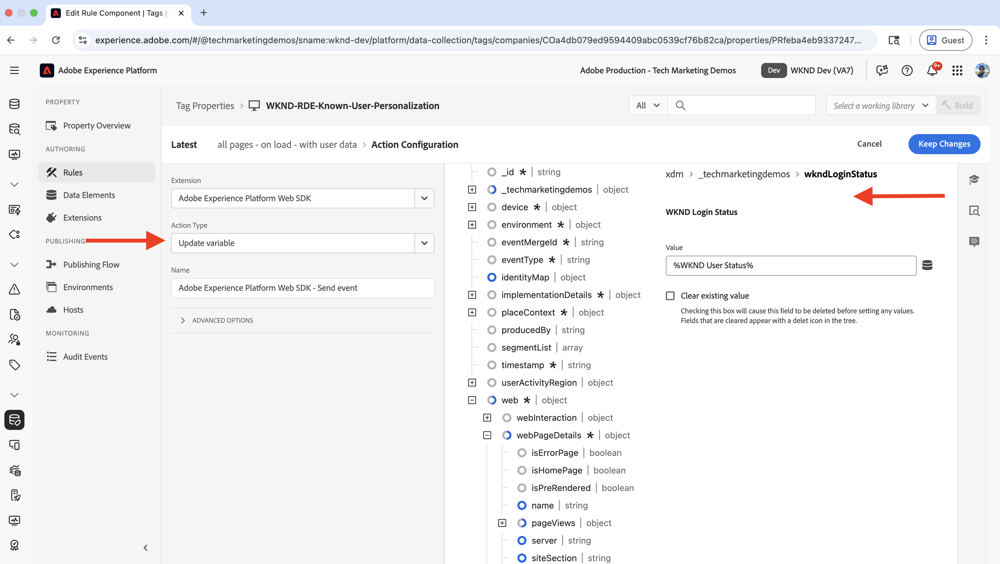

      - Klicka på **Behåll ändringar** om du vill spara åtgärdskonfigurationen.

   - Klicka på Lägg till igen för att lägga till ytterligare en åtgärd och öppna guiden för åtgärdskonfiguration.

      - **Tillägg**: Välj **Adobe Experience Platform Web SDK**
      - **Åtgärdstyp**: Välj **Skicka händelse**
      - Mappa dataelementet **XDM-Variable Pageview** i den högra panelens **Data** till typen **Sidinformation för webbsidor**.

     

   - I den högra panelens **Personalization** -avsnitt ska du även kontrollera alternativet **Återge visuella personaliseringsbeslut**. Klicka sedan på **Behåll ändringar** för att spara åtgärden.

     

- Din regel ska se ut så här:

  

Regeln är nu konfigurerad att skicka sidvydata och inloggningsstatus + användar-ID (om du är inloggad) till Experience Platform.

Stegen för att skapa regeln ovan har ett stort antal detaljer, så var försiktig när du skapar regeln. Det kan låta komplicerat men kom ihåg de här konfigurationsstegen så att det kan kopplas in och spelas upp utan att du behöver uppdatera AEM-koden och distribuera om programmet.

#### Lägga till och publicera taggbibliotek

Ett bibliotek är en samling med alla taggar (dataelement, regler, tillägg) som skapas och distribueras till din webbplats. Den paketerar allt så att datainsamlingen fungerar som den ska. För att personalisera kända användare publiceras biblioteket så att datainsamlingsreglerna är aktiva på din webbplats.

- Klicka på **Publiceringsflöde** i den vänstra navigeringen och klicka på knappen **Lägg till bibliotek** .
  

- Ange följande i dialogrutan **Lägg till bibliotek**:
   - **Namn**: 1.0
   - **Miljö**: Välj **Utveckling**
   - Klicka på **Lägg till alla ändrade resurser** för att välja alla resurser.

  Klicka på **Spara och skapa till utveckling** för att skapa biblioteket.

  

- Om du vill publicera biblioteket i produktion klickar du på **Godkänn och publicera i produktion**. När publiceringen är klar är egenskapen klar att användas i AEM.
  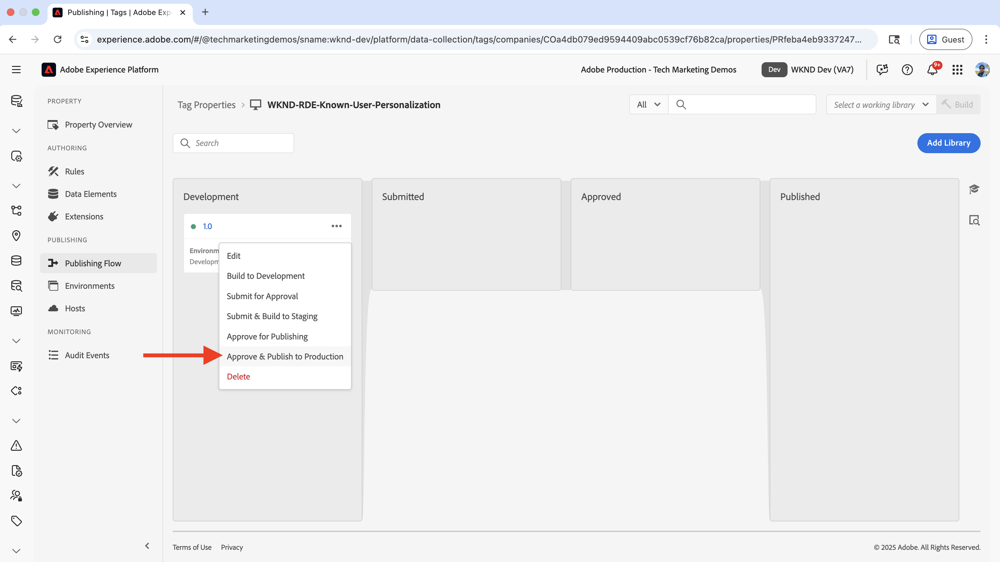

Biblioteket är nu publicerat och klart att användas för att samla in data från dina AEM-sidor.

### Konfigurera sammanfogningsprincip för profilen

En sammanfogningspolicy definierar hur kunddata från flera källor samlas i en enda profil. Det avgör vilka data som prioriteras när konflikter uppstår och ser till att ni får en fullständig och konsekvent bild av varje kund för att kunna personalisera kända användare.

- I **Adobe Experience Platform** klickar du på **Profiler** i den vänstra navigeringen och sedan på fliken **Sammanfogningsprofiler** .

  

I det här fallet skapas en sammanfogningsprincip. Du kan dock använda en befintlig kopplingsprofil om du har en sådan. Se till att aktivera både alternativen **Standardsammanslagningsprincip** och **Aktiv-på-Edge-sammanslagningsprincip** (vilket gör att profildata kan vara tillgängliga i gränsnätverket för personaliseringsbeslut i realtid).

Dessa inställningar säkerställer att era beteendedata och transaktionsdata är enhetliga och tillgängliga för målgruppsutvärdering i realtid.


### Konfigurera (V2) Adobe Target Destination

Med Adobe Target Destination (V2) kan du aktivera målgrupper som skapats i Experience Platform direkt i Adobe Target. Med den här anslutningen kan era målgrupper användas för personaliseringsaktiviteter i Adobe Target.

- I **Adobe Experience Platform** klickar du på **Destinationer** i den vänstra navigeringen och sedan på fliken **Katalog** . Sök efter **Personalization** och välj **(v2) Adobe Target**-mål.

  

- Ange ett namn för målet i steget **Aktivera mål** och klicka på knappen **Anslut till mål**.
  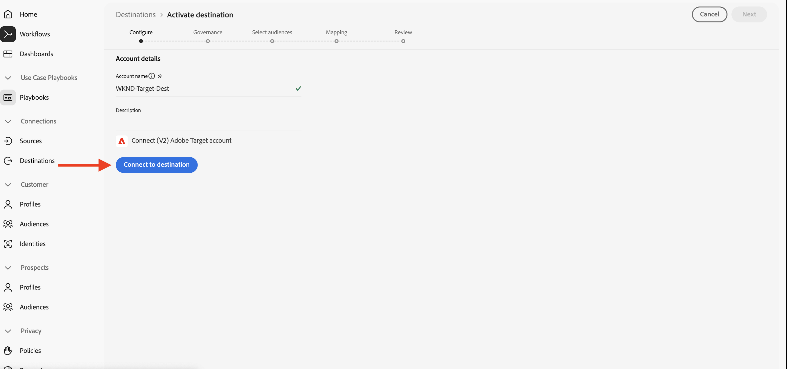

- Ange följande i avsnittet **Målinformation**:
   - **Namn**: WKND-RDE-Known-User-Personalization-Destination
   - **Beskrivning**: Mål för den kända användarpersonaliseringen
   - **Datastream**: Markera **Datastream** som du skapade tidigare
   - **Workspace**: Välj din Adobe Target-arbetsyta

  

- Klicka på **Nästa** och slutför målkonfigurationen.

  

När destinationen är konfigurerad kan du aktivera målgrupper som skapats i Experience Platform till Adobe Target för användning i personaliseringsaktiviteter.

## AEM

I följande steg förbättrar du inloggningsfunktionen för WKND-webbplatsen så att användar-ID lagras i webbläsarens sessionslagring och så att Tags-egenskapen kan integreras och injiceras på AEM-sidor.

Taggegenskapen matas in på AEM sidor för att samla in sidvydata och inloggningsstatus + användar-ID (om du är inloggad) när användare besöker WKND-webbplatsen. Tack vare integreringen med Adobe Target kan ni exportera personaliserade erbjudanden till Adobe Target.

### Förbättra inloggningsfunktionen för WKND-webbplatser

Om du vill förbättra WKND-webbplatsens inloggningsfunktion klonar du [WKND-webbplatsprojektet](https://github.com/adobe/aem-guides-wknd) från GitHub, skapar en ny funktionsgren och öppnar den i din favoritutvecklingsmiljö.

```shell
$ mkdir -p ~/Code
$ git clone git@github.com:adobe/aem-guides-wknd.git
$ cd aem-guides-wknd
$ git checkout -b feature/known-user-personalization
```

- Navigera till modulen `ui.frontend` och öppna filen `ui.frontend/src/main/webpack/components/form/sign-in-buttons/sign-in-buttons.js`. Granska koden, när du har gjort ett AJAX-anrop till `currentuser.json`, visar den antingen inloggnings- eller utloggningsknappen baserat på användarens inloggningsstatus.

- Uppdatera koden för att lagra användar-ID:t i webbläsarens sessionslagring och optimera även koden för att undvika att göra flera AJAX-anrop till `currentuser.json`.

  ```javascript
  import jQuery from "jquery";
  
  jQuery(function($) {
      "use strict";
  
      (function() {
          const currentUserUrl = $('.wknd-sign-in-buttons').data('current-user-url'),
              signIn = $('[href="#sign-in"]'),
              signOut = $('[href="#sign-out"]'),
              greetingLabel = $('#wkndGreetingLabel'),
              greetingText = greetingLabel.text(),
              body = $('body');
  
          // Cache configuration
          const CACHE_KEY = 'wknd_user_state';
          const CACHE_DURATION = 5 * 60 * 1000; // 5 minutes in milliseconds
  
          /**
           * Get cached user state from session storage
           */
          function getCachedUserState() {
              try {
                  const cached = sessionStorage.getItem(CACHE_KEY);
                  if (cached) {
                      const userState = JSON.parse(cached);
                      const now = Date.now();
  
                      // Check if cache is still valid
                      if (userState.timestamp && (now - userState.timestamp) < CACHE_DURATION) {
                          return userState.data;
                      } else {
                          // Cache expired, remove it
                          sessionStorage.removeItem(CACHE_KEY);
                      }
                  }
              } catch (e) {
                  console.warn('Failed to read cached user state:', e);
                  sessionStorage.removeItem(CACHE_KEY);
              }
              return null;
          }
  
          /**
           * Cache user state in session storage
           */
          function cacheUserState(userData) {
              try {
                  const userState = {
                      data: userData,
                      timestamp: Date.now()
                  };
                  sessionStorage.setItem(CACHE_KEY, JSON.stringify(userState));
              } catch (e) {
                  console.warn('Failed to cache user state:', e);
              }
          }
  
          /**
           * Clear cached user state
           */
          function clearCachedUserState() {
              try {
                  sessionStorage.removeItem(CACHE_KEY);
              } catch (e) {
                  console.warn('Failed to clear cached user state:', e);
              }
          }
  
          /**
           * Update UI based on user state
           */
          function updateUI(userData) {
              const isAnonymous = 'anonymous' === userData.authorizableId;
  
              if(isAnonymous) {
                  signIn.show();
                  signOut.hide();
                  greetingLabel.hide();
                  body.addClass('anonymous');
              } else {
                  signIn.hide();
                  signOut.show();
                  greetingLabel.text(greetingText + ", " + userData.name);
                  greetingLabel.show();
                  body.removeClass('anonymous');
              }
          }
  
          /**
           * Fetch user data from AEM endpoint
           */
          function fetchUserData() {
              return $.getJSON(currentUserUrl + "?nocache=" + new Date().getTime())
                  .fail(function(xhr, status, error) {
                      console.error('Failed to fetch user data:', error);
                      updateUI({ authorizableId: 'anonymous' });
                  });
          }
  
          /**
           * Initialize user state (check cache first, then fetch if needed)
           */
          function initializeUserState() {
              const cachedUserState = getCachedUserState();
  
              if (cachedUserState) {
                  updateUI(cachedUserState);
              } else {
                  fetchUserData().done(function(currentUser) {
                      updateUI(currentUser);
                      cacheUserState(currentUser);
                  });
              }
          }
  
          // Initialize user state
          initializeUserState();
  
          // Clear cache on sign-in/sign-out clicks
          $(document).on('click', '[href="#sign-in"], [href="#sign-out"]', function() {
              clearCachedUserState();
          });
  
          // Clear cache when modal is shown
          $('body').on('wknd-modal-show', function() {
              clearCachedUserState();
          });
  
          // Clear cache when on dedicated sign-in page
          if (window.location.pathname.includes('/sign-in') || window.location.pathname.includes('/errors/sign-in')) {
              clearCachedUserState();
          }
  
          // Clear cache when sign-in form is submitted
          $(document).on('submit', 'form[id*="sign-in"], form[action*="login"]', function() {
              clearCachedUserState();
          });
  
          // Clear cache on successful login redirect
          const urlParams = new URLSearchParams(window.location.search);
          if (urlParams.has('login') || urlParams.has('success') || window.location.hash === '#login-success') {
              clearCachedUserState();
          }
  
          // Debug function for testing
          window.debugUserState = function() {
              console.log('Cache:', sessionStorage.getItem('wknd_user_state'));
              clearCachedUserState();
              initializeUserState();
          };
  
      })();
  });
  ```

  Observera att taggegenskapsregeln är beroende av det användar-ID som lagras i webbläsarens sessionslagring. Nyckeln `wknd_user_state` är ett vanligt kontrakt mellan AEM-koden och taggegenskapsregeln för lagring och hämtning av användar-ID.

- Verifiera ändringarna lokalt genom att bygga projektet och köra det lokalt.

  ```shell
  $ mvn clean install -PautoInstallSinglePackage
  ```

  Logga in med autentiseringsuppgifterna `asmith/asmith` (eller någon annan användare som du har skapat). De är [inkluderade](https://github.com/adobe/aem-guides-wknd/blob/main/ui.content.sample/src/main/content/jcr_root/home/users/wknd/l28HasMYWAMHAaGkv-Lj/.content.xml) i projektet `aem-guides-wknd`.

  

  I mitt fall skapade jag en ny användare med ID:t `teddy` för testning.

- När du har bekräftat att användar-ID:t lagras i webbläsarens sessionslagring (med hjälp av webbläsarens utvecklingsverktyg) implementerar och överför du ändringarna till Adobe Cloud Manager fjärrdatabas.

  ```shell
  $ git add .
  $ git commit -m "Enhance the WKND site Login functionality to store the user ID in browser's session storage"
  $ git push adobe-origin feature/known-user-personalization
  ```

- Distribuera ändringarna i AEM as a Cloud Service-miljön antingen med Cloud Manager-pipelines eller med AEM RDE-kommandot.

### Integrera och mata in taggegenskap på AEM-sidor

I det här steget integreras taggegenskapen som skapades tidigare med dina AEM-sidor, vilket gör att datainsamling kan användas för att anpassa kända användare. Egenskapen Tags hämtar automatiskt sidvydata och inloggningsstatus + användar-ID (om du är inloggad) när användare besöker WKND-webbplatsen.

Följ stegen från [Integrera taggar i Adobe Experience Platform](../setup/integrate-adobe-tags.md) om du vill integrera taggegenskapen i AEM-sidor.

Använd taggegenskapen **WKND-RDE-Known-User-Personalization** som skapades tidigare, inte en annan egenskap.


När taggegenskapen är integrerad börjar den samla in data om användaranpassning från era AEM-sidor och skicka dem till Experience Platform för målgruppsframställning.

### Verifiera datainsamling på AEM-sidor

Om du vill verifiera datainsamlingen från AEM-sidor kan du använda webbläsarens utvecklarverktyg för att inspektera nätverksförfrågningar och se vilka data som skickas till Experience Platform. Du kan också använda [Experience Platform Debugger](https://chromewebstore.google.com/detail/adobe-experience-platform/bfnnokhpnncpkdmbokanobigaccjkpob) för att verifiera datainsamlingen.

- I webbläsaren går du till WKND-webbplatsen som är distribuerad till din AEM as a Cloud Service-miljö. Eftersom du är anonym bör du se liknande förfrågningar om datainsamling.

  

- Logga in med autentiseringsuppgifterna `asmith/asmith`. Du bör se liknande datainsamlingsbegäranden.

  

Observera att variablerna `identityMap` och `_YOUR_NAMESPACE.wkndLoginStatus` är inställda på användar-ID respektive inloggningsstatus.

### Integrera Adobe Target

Detta steg integrerar Adobe Target med AEM och möjliggör export av personaliserat innehåll (Experience Fragments) till Adobe Target. Med den här anslutningen kan Adobe Target använda innehåll som skapats i AEM för personaliseringsaktiviteter med kända målgrupper som skapats i Experience Platform.

Om du vill integrera Adobe Target och exportera målgruppserbjudandena **WKND-RDE-Known-User-Personalization** till Adobe Target följer du stegen från [Integrera Adobe Target i Adobe Experience Platform](../setup/integrate-adobe-target.md).

Se till att Target-konfigurationen tillämpas på Experience Fragments så att de kan exporteras till Adobe Target för användning i personaliseringsaktiviteter.


När de är integrerade kan ni exportera Experience Fragments från AEM till Adobe Target, där de används som personaliserade erbjudanden för de kända målgrupperna.

### Skapa personaliserade erbjudanden

Experience Fragments är återanvändbara innehållskomponenter som kan exporteras till Adobe Target som personaliserade erbjudanden. Om du är en känd användare kan vi _sälja upp_ skidutrustningen genom att skapa en ny Experience Fragment.

- I AEM klickar du på **Experience Fragments** och navigerar till mappen **WKND Site Fragments**. Skapa ett nytt Experience Fragment på önskad plats.

  

- Skapa Experience Fragment genom att lägga till en Teaser-komponent och anpassa den med innehåll som är relevant för att sälja skidutrustningen.

  

- Exportera Experience Fragment till Adobe Target.

  

Ditt personaliserade erbjudande finns nu i Adobe Target och kan användas i aktiviteter.

## Adobe Experience Platform

Besök Adobe Experience Platform igen för att verifiera att beteendedata samlas in och relaterade profiler skapas. Importera sedan transaktionsdata, verifiera sammanfogning av beteendedata och transaktionsdata, skapa och konfigurera en målgrupp och aktivera målgruppen för Adobe Target.

### Verifiera beteendedata och skapande av profiler

Låt oss kontrollera att beteendedata samlas in och relaterade profiler skapas.

- Klicka på **Datauppsättningar** i Adobe Experience Platform och öppna datamängden **WKND-RDE-Known-User-Personalization-Behavioral** . Kontrollera att inmatad datastatus är giltig.

  

- Verifiera att profilerna har skapats genom att klicka på **Profiler** i den vänstra navigeringen. Navigera sedan till fliken **Bläddra** och filtrera med följande villkor:
   - **Sammanslagningsprincip**: $YOUR_MERGE_POLICY_NAME
   - **Identitetsnamnrymd**: ECID (Experience Cloud ID, en unik identifierare som automatiskt tilldelas av Adobe till varje besökares webbläsare)
   - **Identitetsvärde**: Sök med hjälp av webbläsarens utvecklarverktyg eller Experience Platform Debugger. Det är cookie-värdet för AMCV_$NAMESPACE$ utan prefixet `MCMID|`.

  

- Klicka på knappen **Visa**.
  

- Klicka på profilen så ser du detaljerna om profilen.
  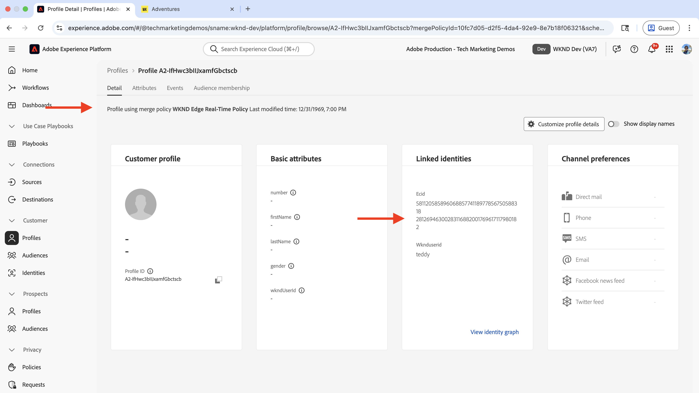

  I mitt fall kom jag åt min WKND-webbplats från två olika webbläsare, så jag har två ECID:n som är kopplade till användaren `teddy`. Data från båda dessa ECID sammanfogas för att skapa profilen. Ni har börjat inse kraften i identitetssammanfogning och hur den används för att skapa en fullständig kundprofil. Snart sammanfogas transaktionsdata med beteendedata för att skapa en komplett kundprofil.

- Klicka på fliken **Händelser** för att se händelser som är relaterade till profilen.
  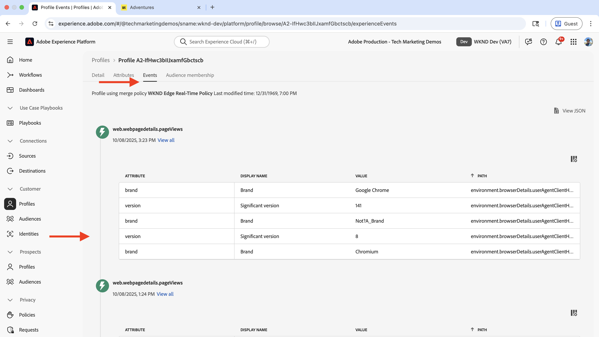

### Infoga transaktionsdata

Sedan importerar du dummy-transaktionsdata till Experience Platform. I det här exemplet lagras transaktionsdata i det andra systemet (t.ex. OMS eller CRM eller MDM) och hämtas till Experience Platform med hjälp av batchintaget. Transaktionsdata innehåller användar-ID:t för WKND, som används för att sammanfoga beteendedata och transaktionsdata.

- I Adobe Experience Platform klickar du på **Datauppsättningar** och öppnar datauppsättningen **WKND-RDE-Known-User-Personalization-Transactional**.

  

- I den högra panelen letar du efter avsnittet **ADD DATA** och drar filen [ski-adventure-purchase-data.json](../assets/use-cases/known-user-personalization/ski-adventure-purchase-data.json) till den. Den här filen innehåller dummy-transaktionsdata för WKND Adventure-inköp. I ett verkligt scenario hämtas dessa data från det andra systemet (t.ex. OMS eller CRM eller MDM) med hjälp av batch- eller direktuppspelningsintaget.

  

- Vänta tills databearbetningen är klar.

  

- Uppdatera datauppsättningssidan när databearbetningen är klar.

  

### Verifiera sammanfogning av beteendedata och transaktionsdata

Därefter kontrollerar ni sammanfogningen av beteendedata och transaktionsdata, den viktigaste delen av det kända användarpersonaliseringsexemplet. Kom ihåg att användar-ID:t för WKND-webbplatsen är den vanliga identifieraren i olika system och används för att sammanfoga data. I det här exemplet används användar-ID:t `teddy` för att sammanfoga data.

- Klicka på **Profiler** i den vänstra navigeringen. Navigera sedan till fliken **Bläddra** och filtrera med följande villkor:
   - **Sammanslagningsprincip**: $YOUR_MERGE_POLICY_NAME
   - **Identitetsnamnområde**: ECID
   - **Identitetsvärde**: Använd samma ECID-värde som du använde för att filtrera beteendedata och associerad profil.

  

- Klicka på profilen så ser du detaljerna om profilen. Transaktionsdata sammanfogas med beteendedata för att skapa en fullständig kundprofil.

  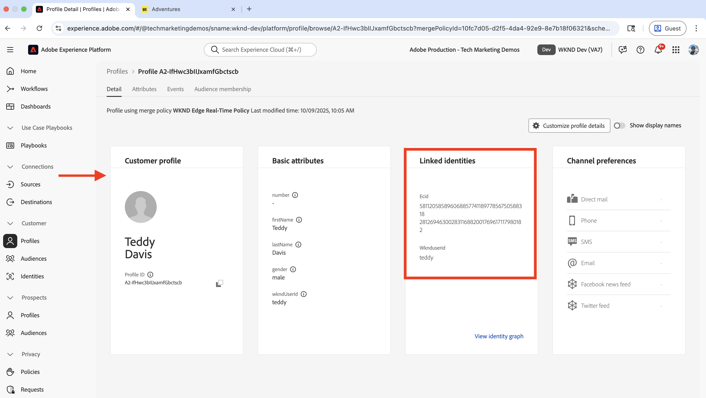

- Klicka på fliken **Attribut** så ser du de transaktions- och beteendedata som är associerade med profilen.
  

- Klicka på länken **Visa identitetsdiagram** för att visa profilens identitetsdiagram.
  

Grattis! Ni har sammanfogat beteendedata och transaktionsdata för att skapa en fullständig kundprofil.

Identitetssammanfogning är en kraftfull funktion som skapar en komplett kundprofil genom att kombinera data från flera system. För demoändamål används endast två system för att sammanfoga data. I ett verkligt scenario kan du ha flera system som t.ex. Mobile App, Call Center, Chatbot och Point of Sale. som samlar in uppgifterna och lagrar dem i sina respektive system. Med hjälp av den gemensamma identifieraren sammanfogas data till en fullständig kundprofil och används för personaliseringsaktiviteter. Detta tillvägagångssätt moderniserar kundupplevelsen genom att leverera personaliserade upplevelser till användarna, och ersätter statiskt innehåll som passar alla med skräddarsydda upplevelser baserade på individuella kundprofiler.

#### Profilsökning med WKND-användar-ID

Det går att slå upp profilen med WKND-användar-ID (inte ECID) i Experience Platform.

- Klicka på **Profiler** i den vänstra navigeringen. Navigera sedan till fliken **Bläddra** och filtrera med följande villkor:
   - **Sammanslagningsprincip**: $YOUR_MERGE_POLICY_NAME
   - **Identitetsnamnrymd**: WKND-användar-ID
   - **Identitetsvärde**: `teddy` eller `asmith` eller något annat användar-ID som du har använt.

  

- Om du klickar på profilen bör du se samma profildetaljer som i föregående steg.
  

### Skapa och konfigurera en målgrupp

En målgrupp definierar en specifik grupp användare baserat på deras beteendedata och transaktionsdata. I det här exemplet skapas en målgrupp som kvalificerar användare som har köpt ett **Ski**-äventyr och är inloggad på WKND-webbplatsen.

Så här skapar du en målgrupp:

- Klicka på **Publiker** i den vänstra navigeringen i Adobe Experience Platform och klicka på knappen **Skapa publik** . Välj sedan alternativet **Skapa regel** och klicka på knappen **Skapa** .
  

- Ange följande i steget **Skapa**:
   - **Namn**: UpSell-Ski-Equipment-To-Authenticated
   - **Beskrivning**: Användare som är inloggade och har köpt ett skidäventyr
   - **Utvärderingsmetod**: Välj **Edge** (utvärderar målgruppsmedlemskap i realtid när användarna bläddrar, vilket möjliggör omedelbar personalisering)

  

- Klicka sedan på fliken **Attribut** och navigera till fältgruppen **Techmarketingdemos** (eller $NAMESPACE$). Dra och släpp fältet **Äventyr inköpt** till avsnittet **Början**. Ange följande information:

  **Äventyr köpt**: Välj **Innehåller** och ange värdet **ski**.

  

- Växla sedan till fliken **Händelser** och navigera till fältgruppen **techmarketingdemos** (eller $NAMESPACE$). Dra och släpp fältet **WKND-inloggningsstatus** till avsnittet **Händelser**. Ange följande information:

  **WKND-inloggningsstatus**: Välj **Lika med** och ange värdet **authenticated**.

  Välj även alternativet **Idag**.

  

- Granska målgruppen och klicka på knappen **Aktivera till mål**.

  

- I dialogrutan **Aktivera till mål** väljer du det Adobe Target-mål som du skapade tidigare och följer stegen för att aktivera målgruppen. Klicka på **Nästa** och slutför målkonfigurationen.

  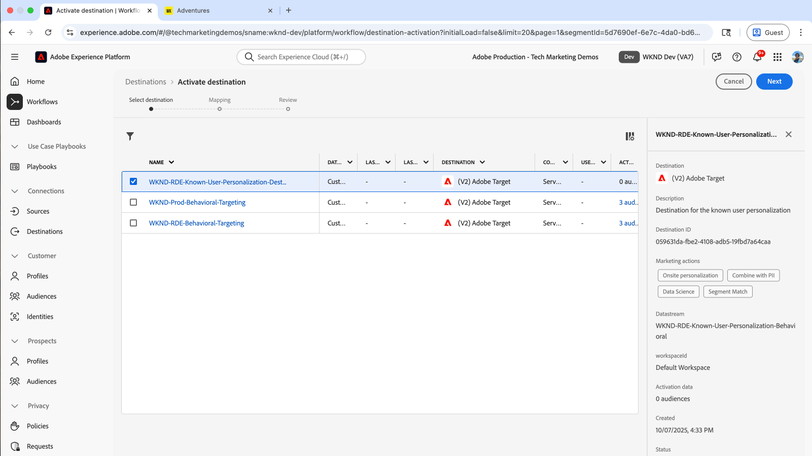

Grattis! Du har skapat målgruppen och aktiverat den på Adobe Target-målet.

## Adobe Target

I Adobe Target har de målgrupper som skapats i Experience Platform och de anpassade erbjudanden som exporterats från AEM verifierats vara korrekt tillgängliga. Sedan skapas en aktivitet som kombinerar målgruppsanpassningen med det personaliserade innehållet för att leverera en känd användarpersonaliseringsupplevelse.

- Logga in på Adobe Experience Cloud och gå till **Adobe Target** från appväxlaren eller snabbåtkomstavsnittet.

  

### Verifiera målgrupper och erbjudanden

Låt oss verifiera att målgrupperna och erbjudandena är korrekt tillgängliga i Adobe Target.

- I Adobe Target klickar du på **Publiker** och kontrollerar att målgruppen **UpSell-Ski-Equipment-To-Authenticated** har skapats.

  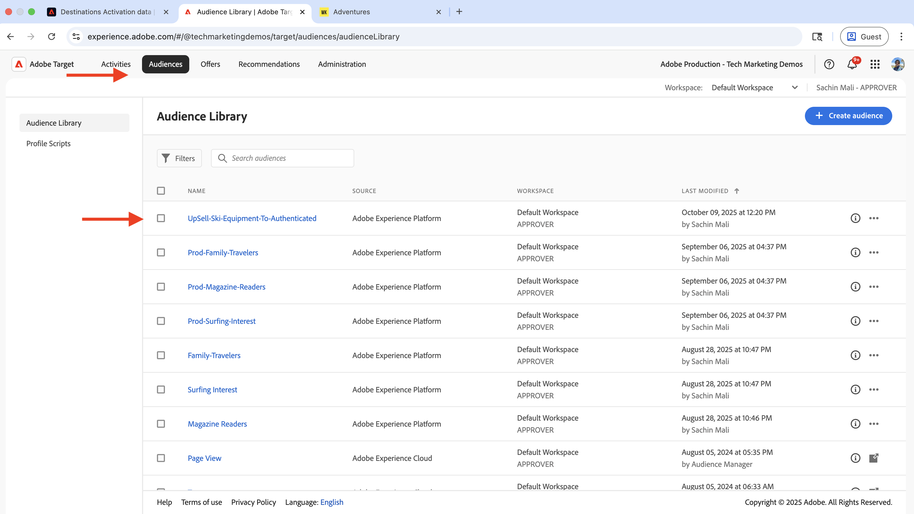

- Genom att klicka på målgruppen kan du se målgruppsinformationen och verifiera att den är korrekt konfigurerad.

  

- Klicka på **Erbjudanden** och kontrollera att det exporterade AEM-erbjudandet finns. I mitt fall kallas erbjudandet (eller Experience Fragment) **Måste ha objekt för SKI**.

  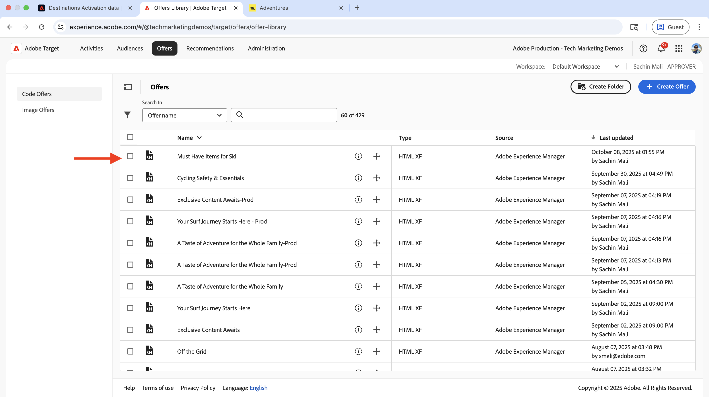

  Detta validerar integreringsåtgärderna i Adobe Experience Platform, AEM och Adobe Target.

### Skapa och konfigurera en aktivitet

En aktivitet i Adobe Target är en personaliseringskampanj som definierar när och hur personaliserat innehåll levereras till specifika målgrupper. För en känd användarpersonalisering skapas en aktivitet som visar skidställets merförsäljning till de användare som är inloggade och har köpt ett skidäventyr.

- I Adobe Target klickar du på **Aktiviteter** och sedan på knappen **Skapa aktivitet** och väljer aktivitetstypen **Upplevelsemål**.
  

- I dialogrutan **Skapa aktivitetsmål för upplevelse** väljer du alternativet **Webb** och **Visual** Composer (en WYSIWYG-redigerare där du kan skapa och testa personaliserade upplevelser direkt på webbplatsen) och anger URL:en till WKND-webbplatsens hemsida. Klicka på knappen **Skapa** för att skapa aktiviteten.

  

- I redigeraren väljer du målgruppen **UpSell-Ski-Equipment-To-Authenticated** och lägger till erbjudandet **Must Have Items for Ski** i stället för det främsta hjälteinnehållet. Se skärmbilden nedan för referens.

  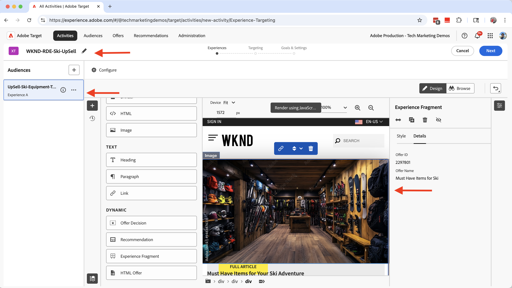

- Klicka på **Nästa** och konfigurera avsnittet **Mål och inställningar** med lämpliga mål och mätvärden. Aktivera sedan avsnittet så att ändringarna aktiveras.

  

Grattis! Ni är alla redo att leverera en användarvänlig personalisering till de användare som är inloggade och som har köpt ett skidäventyr.

## Verifiera implementeringen av den kända användarpersonaliseringen

Det är dags att verifiera den kända användaranpassningen på WKND-webbplatsen.

- Besök WKND-webbplatsens hemsida. Om du inte är inloggad bör du se standardhjälteinnehållet.

  

- Logga in med `teddy/teddy` (eller `asmith/asmith`) inloggningsuppgifter och se det personliga hjälteinnehållet.

  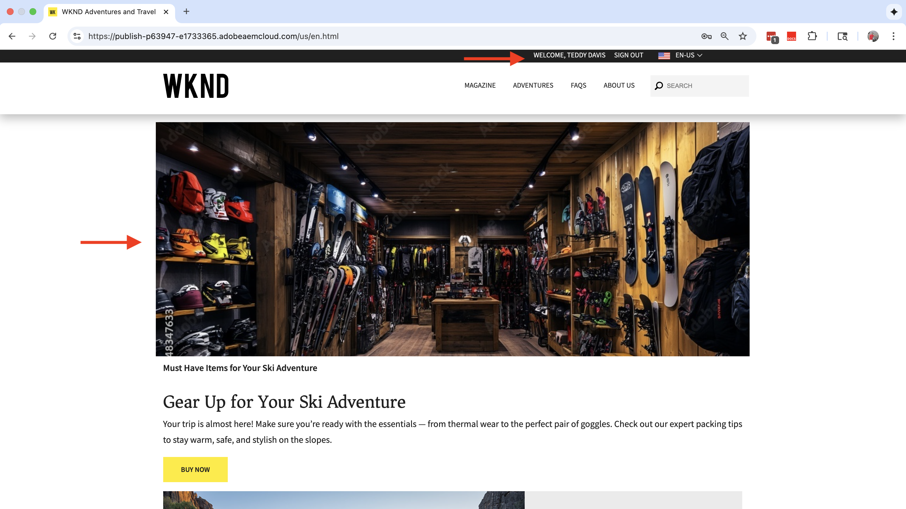

- Öppna webbläsarens utvecklarverktyg och kontrollera fliken **Nätverk**. Filtrera efter `interact` för att hitta Web SDK-begäran. Begäran/svar ska innehålla information om Web SDK-event och Adobe Target-beslut.

  Begäranutdata ska se ut så här:
  

  Svarsutdata bör se ut så här:

  

Grattis! Ni är en expert på att leverera den kända användarpersonaliseringsupplevelsen genom att skapa en komplett kundprofil med sammanfogade data mellan system.

## Ytterligare resurser

- [Adobe Experience Platform Web SDK](https://experienceleague.adobe.com/en/docs/experience-platform/web-sdk/home)
- [Översikt över dataströmmar](https://experienceleague.adobe.com/en/docs/experience-platform/datastreams/overview)
- [Visual Experience Composer (VEC)](https://experienceleague.adobe.com/en/docs/target/using/experiences/vec/visual-experience-composer)
- [Edge-segmentering](https://experienceleague.adobe.com/en/docs/experience-platform/segmentation/methods/edge-segmentation)
- [Målgruppstyper](https://experienceleague.adobe.com/en/docs/experience-platform/segmentation/types/overview)
- [Adobe Target-anslutning](https://experienceleague.adobe.com/en/docs/experience-platform/destinations/catalog/personalization/adobe-target-connection)
