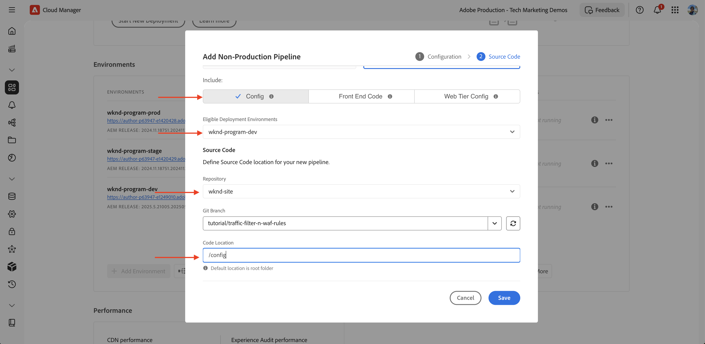
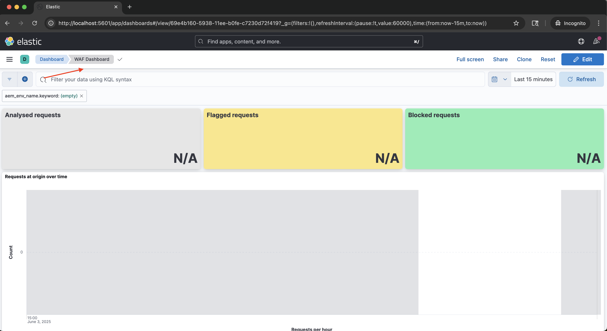
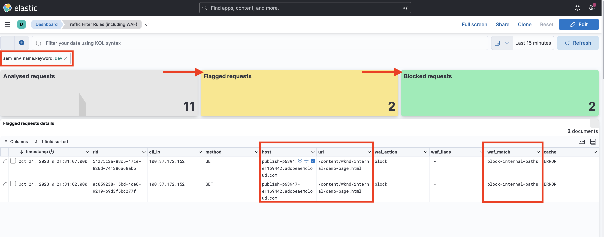

# Konfigurera trafikfilterregler inklusive WAF-regler

Lär dig **hur du konfigurerar** trafikfilterregler, inklusive WAF-regler (Web Application Firewall). I den här självstudiekursen skapar vi grunden för efterföljande självstudiekurser, där du konfigurerar och distribuerar regler, följt av testning och analys av resultaten.

I självstudiekursen används [AEM WKND Sites Project](https://github.com/adobe/aem-guides-wknd) för att demonstrera konfigurationsprocessen.

>[!VIDEO](https://video.tv.adobe.com/v/3469395/?quality=12&learn=on)

## Installationsöversikt

Grundmaterialet för självstudiekurser omfattar följande steg:

- _Skapa regler_ i ditt AEM-projekt i mappen `config`
- _Distribuerar regler_ med konfigurationsflödet för Adobe Cloud Manager.
- _Testa regler_ med verktyg som Curl, Vegeta och Nikto
- _Analyserar resultat_ med AEMCS CDN Log Analysis Tooling

## Skapa regler i ditt AEM-projekt

Så här definierar du trafikfilterreglerna **standard** och **WAF** i ditt AEM-projekt:

1. Skapa en mapp med namnet `config` på den översta nivån i ditt AEM-projekt.

2. I mappen `config` skapar du en fil med namnet `cdn.yaml`.

3. Använd följande metadatastruktur i `cdn.yaml`:

```yaml
kind: "CDN"
version: "1"
metadata:
  envTypes: ["dev", "stage", "prod"]
data:
  trafficFilters:
    rules:
```


I [nästa självstudiekurs](#next-steps) får du lära dig hur du lägger till **rekommenderat standardtrafikfilter och WAF-regler** i filen ovan som en stabil grund för implementeringen.

## Distribuera regler med Adobe Cloud Manager

Följ de här stegen när du ska distribuera reglerna:

1. Logga in på [my.cloudmanager.adobe.com](https://my.cloudmanager.adobe.com/) och välj ditt program.

2. Gå till kortet **Pipelines** på sidan **Programöversikt** och klicka på **+Lägg till** för att skapa en ny pipeline.

   

3. I pipeline-guiden:

   - **Typ**: Distributionsförlopp
   - **Pipelinenamn**: Dev-Config

   

4. Source Code-konfiguration:

   - **Kod för distribution**: Måldistribution
   - **Inkludera**: Konfiguration
   - **Distributionsmiljö**: till exempel `wknd-program-dev`
   - **Databas**: Git-repo (till exempel `wknd-site`)
   - **Git-grenen**: Din arbetsgren
   - **Kodplats**: `/config`

   

5. Granska pipelinekonfigurationen och klicka på **Spara**.

I [nästa självstudiekurs](#next-steps) får du lära dig hur du distribuerar pipeline till din AEM-miljö.

## Testa regler med verktyg

För att testa hur effektivt ert standardtrafikfilter och WAF regler är kan ni använda olika verktyg för att simulera förfrågningar och analysera hur era regler fungerar.

Kontrollera att du har följande verktyg installerade på den lokala datorn eller följ instruktionerna för att installera dem:

- [Klipp](https://curl.se/): Testa flödet för begäran/svar.
- [Vegeta](https://github.com/tsenart/vegeta): Simulera hög begäranbelastning (DoS-testning).
- [Nikto](https://github.com/sullo/nikto/wiki): Sök efter sårbarheter.

Du kan verifiera installationen med följande kommandon:

```shell
# Curl version check
$ curl --version

# Vegeta version check
$ vegeta -version

# Nikto version check
$ cd <PATH-OF-CLONED-REPO>/program
$ ./nikto.pl -Version
```

I [nästa självstudiekurs](#next-steps) får du lära dig hur du använder de här verktygen för att simulera stora begäraninläsningar och skadliga begäranden för att testa hur effektivt ditt trafikfilter och WAF-regler är.

## Analysera resultaten

Följ de här stegen för att förbereda analysen av resultaten:

1. Installera **AEMCS CDN Log Analysis Tooling** för att visualisera och analysera mönstren med hjälp av färdiga instrumentpaneler.

2. Utför **CDN-loggar in** genom att hämta loggar från Cloud Manager användargränssnitt. Du kan också vidarebefordra loggar direkt till ett värdbaserat loggningsmål som stöds, till exempel Splunk eller Elasticsearch.

### AEMCS CDN Log Analysis Tooling

Om du vill analysera resultatet av ditt trafikfilter och WAF-regler kan du använda **AEMCS CDN Log Analysis Tooling**. Detta verktyg innehåller färdiga kontrollpaneler för att visualisera CDN-trafik och WAF-aktivitet genom att utnyttja loggar som samlats in från AEMCS CDN.

AEMCS CDN Log Analysis Tooling har stöd för två observerbarhetsplattformar, **ELK** (Elasticsearch, Logstash, Kibana) och **Splunk**.

Du kan använda funktionen för loggvidarebefordran för att strömma loggarna till en värdbaserad ELK- eller Splunk-loggningstjänst, där du kan installera en kontrollpanel för att visa och analysera standardtrafikfiltret och WAF trafikfilterregler. I den här självstudiekursen kommer du dock att konfigurera instrumentpanelen på en lokal ELK-instans som är installerad på datorn.

1. Klona [AEMCS-CDN-Log-Analysis-Tooling](https://github.com/adobe/AEMCS-CDN-Log-Analysis-Tooling) -databasen.

2. Följ installationsguiden för [ELK Docker-behållaren](https://github.com/adobe/AEMCS-CDN-Log-Analysis-Tooling/blob/main/ELK/README.md) för att installera och konfigurera ELK-stacken lokalt.

3. Med hjälp av ELK-kontrollpaneler kan du utforska mätvärden som IP-begäranden, blockerad trafik, URI-mönster och säkerhetsvarningar.

   

>[!NOTE]
> 
> Om loggarna ännu inte har importerats från AEMCS CDN visas instrumentpanelerna tomma.

### CDN loggar

Så här importerar du CDN-loggar till ELK-stacken:

- Hämta CDN-loggarna för AEMCS [Publish](https://my.cloudmanager.adobe.com/)-tjänsten från **Cloud Manager** s **Environmental**-kort.

  

  >[!TIP]
  >
  > Det kan ta upp till 5 minuter innan de nya förfrågningarna visas i CDN-loggarna.

- Kopiera den hämtade loggfilen (till exempel `publish_cdn_2025-06-06.log` i skärmbilden nedan) till mappen `logs/dev` i det Elastic Dashboard-verktygsprojektet.

  {width="800" zoomable="yes"}

- Uppdatera sidan med verktyget Elastic Dashboard.
   - I det övre avsnittet **Global filter** redigerar du filtret `aem_env_name.keyword` och väljer miljövärdet `dev` .

     

   - Om du vill ändra tidsintervallet klickar du på kalenderikonen i det övre högra hörnet och väljer önskat tidsintervall.

- I [nästa självstudiekurs](#next-steps) får du lära dig hur du analyserar resultatet av standardtrafikfiltret och WAF trafikfilterregler med hjälp av de fördefinierade kontrollpanelerna i ELK-stacken.

  

## Sammanfattning

Du har nu konfigurerat grunden för implementering av trafikfilterregler, inklusive WAF-regler i AEM as a Cloud Service. Du har skapat en konfigurationsfilstruktur, en pipeline för distribution och förberedda verktyg för testning och analys av resultaten.

## Nästa steg

Lär dig implementera Adobe rekommenderade regler med hjälp av följande självstudiekurser:

<!-- CARDS
{target = _self}

* ./use-cases/using-traffic-filter-rules.md
  {title = Protecting AEM websites using standard traffic filter rules}
  {description = Learn how to protect AEM websites from DoS, DDoS and bot abuse using Adobe-recommended standard traffic filter rules in AEM as a Cloud Service.}
  {image = ./assets/use-cases/using-traffic-filter-rules.png}
  {cta = Apply Rules}

* ./use-cases/using-waf-rules.md
  {title = Protecting AEM websites using WAF traffic filter rules}
  {description = Learn how to protect AEM websites from sophisticated threats including DoS, DDoS, and bot abuse using Adobe-recommended Web Application Firewall (WAF) traffic filter rules in AEM as a Cloud Service.}
  {image = ./assets/use-cases/using-waf-rules.png}
  {cta = Activate WAF}
-->
<!-- START CARDS HTML - DO NOT MODIFY BY HAND -->
<div class="columns">
    <div class="column is-half-tablet is-half-desktop is-one-third-widescreen" aria-label="Protecting AEM websites using standard traffic filter rules">
        <div class="card" style="height: 100%; display: flex; flex-direction: column; height: 100%;">
            <div class="card-image">
                <figure class="image x-is-16by9">
                    <a href="./use-cases/using-traffic-filter-rules.md" title="Skydda AEM webbplatser med standardregler för trafikfilter" target="_self" rel="referrer">
                        
                    </a>
                </figure>
            </div>
            <div class="card-content is-padded-small" style="display: flex; flex-direction: column; flex-grow: 1; justify-content: space-between;">
                <div class="top-card-content">
                    <p class="headline is-size-6 has-text-weight-bold">
                        <a href="./use-cases/using-traffic-filter-rules.md" target="_self" rel="referrer" title="Skydda AEM webbplatser med standardregler för trafikfilter">Skydda AEM webbplatser med standardtrafikfilterregler</a>
                    </p>
                    <p class="is-size-6">Lär dig hur du skyddar AEM webbplatser från DoS-, DDoS- och robotmissbruk med de standardregler för trafikfilter som rekommenderas av Adobe i AEM as a Cloud Service.</p>
                </div>
                <a href="./use-cases/using-traffic-filter-rules.md" target="_self" rel="referrer" class="spectrum-Button spectrum-Button--outline spectrum-Button--primary spectrum-Button--sizeM" style="align-self: flex-start; margin-top: 1rem;">
                    <span class="spectrum-Button-label has-no-wrap has-text-weight-bold"> Använd regler </span>
                </a>
            </div>
        </div>
    </div>
    <div class="column is-half-tablet is-half-desktop is-one-third-widescreen" aria-label="Protecting AEM websites using WAF traffic filter rules">
        <div class="card" style="height: 100%; display: flex; flex-direction: column; height: 100%;">
            <div class="card-image">
                <figure class="image x-is-16by9">
                    <a href="./use-cases/using-waf-rules.md" title="Skydda AEM webbplatser med WAF trafikfilterregler" target="_self" rel="referrer">
                        
                    </a>
                </figure>
            </div>
            <div class="card-content is-padded-small" style="display: flex; flex-direction: column; flex-grow: 1; justify-content: space-between;">
                <div class="top-card-content">
                    <p class="headline is-size-6 has-text-weight-bold">
                        <a href="./use-cases/using-waf-rules.md" target="_self" rel="referrer" title="Skydda AEM webbplatser med WAF trafikfilterregler">Skydda AEM webbplatser med trafikfilterregler från WAF</a>
                    </p>
                    <p class="is-size-6">Lär dig hur du skyddar AEM webbplatser från avancerade hot som DoS, DDoS och robotmissbruk med trafikfilterreglerna i Adobe rekommenderade Web Application Firewall (WAF) i AEM as a Cloud Service.</p>
                </div>
                <a href="./use-cases/using-waf-rules.md" target="_self" rel="referrer" class="spectrum-Button spectrum-Button--outline spectrum-Button--primary spectrum-Button--sizeM" style="align-self: flex-start; margin-top: 1rem;">
                    <span class="spectrum-Button-label has-no-wrap has-text-weight-bold"> Aktivera WAF </span>
                </a>
            </div>
        </div>
    </div>
</div>
<!-- END CARDS HTML - DO NOT MODIFY BY HAND -->

## Avancerade användningsfall

Utöver Adobe rekommenderade standardtrafikfilter och WAF regler kan ni implementera avancerade scenarier för att uppnå specifika affärskrav. Dessa scenarier omfattar:

<!-- CARDS
{target = _self}

* ./how-to/request-logging.md

* ./how-to/request-blocking.md

* ./how-to/request-transformation.md
-->
<!-- START CARDS HTML - DO NOT MODIFY BY HAND -->
<div class="columns">
    <div class="column is-half-tablet is-half-desktop is-one-third-widescreen" aria-label="Monitoring sensitive requests">
        <div class="card" style="height: 100%; display: flex; flex-direction: column; height: 100%;">
            <div class="card-image">
                <figure class="image x-is-16by9">
                    <a href="./how-to/request-logging.md" title="Övervaka känsliga begäranden" target="_self" rel="referrer">
                        
                    </a>
                </figure>
            </div>
            <div class="card-content is-padded-small" style="display: flex; flex-direction: column; flex-grow: 1; justify-content: space-between;">
                <div class="top-card-content">
                    <p class="headline is-size-6 has-text-weight-bold">
                        <a href="./how-to/request-logging.md" target="_self" rel="referrer" title="Övervaka känsliga begäranden">Övervaka känsliga begäranden</a>
                    </p>
                    <p class="is-size-6">Lär dig övervaka känsliga begäranden genom att logga dem med trafikfilterregler i AEM as a Cloud Service.</p>
                </div>
                <a href="./how-to/request-logging.md" target="_self" rel="referrer" class="spectrum-Button spectrum-Button--outline spectrum-Button--primary spectrum-Button--sizeM" style="align-self: flex-start; margin-top: 1rem;">
                    <span class="spectrum-Button-label has-no-wrap has-text-weight-bold">Läs mer</span>
                </a>
            </div>
        </div>
    </div>
    <div class="column is-half-tablet is-half-desktop is-one-third-widescreen" aria-label="Restricting access">
        <div class="card" style="height: 100%; display: flex; flex-direction: column; height: 100%;">
            <div class="card-image">
                <figure class="image x-is-16by9">
                    <a href="./how-to/request-blocking.md" title="Begränsa åtkomst" target="_self" rel="referrer">
                        
                    </a>
                </figure>
            </div>
            <div class="card-content is-padded-small" style="display: flex; flex-direction: column; flex-grow: 1; justify-content: space-between;">
                <div class="top-card-content">
                    <p class="headline is-size-6 has-text-weight-bold">
                        <a href="./how-to/request-blocking.md" target="_self" rel="referrer" title="Begränsa åtkomst">Begränsar åtkomst</a>
                    </p>
                    <p class="is-size-6">Lär dig hur du begränsar åtkomsten genom att blockera specifika begäranden med trafikfilterregler i AEM as a Cloud Service.</p>
                </div>
                <a href="./how-to/request-blocking.md" target="_self" rel="referrer" class="spectrum-Button spectrum-Button--outline spectrum-Button--primary spectrum-Button--sizeM" style="align-self: flex-start; margin-top: 1rem;">
                    <span class="spectrum-Button-label has-no-wrap has-text-weight-bold">Läs mer</span>
                </a>
            </div>
        </div>
    </div>
    <div class="column is-half-tablet is-half-desktop is-one-third-widescreen" aria-label="Normalizing requests">
        <div class="card" style="height: 100%; display: flex; flex-direction: column; height: 100%;">
            <div class="card-image">
                <figure class="image x-is-16by9">
                    <a href="./how-to/request-transformation.md" title="Normalisera begäranden" target="_self" rel="referrer">
                        
                    </a>
                </figure>
            </div>
            <div class="card-content is-padded-small" style="display: flex; flex-direction: column; flex-grow: 1; justify-content: space-between;">
                <div class="top-card-content">
                    <p class="headline is-size-6 has-text-weight-bold">
                        <a href="./how-to/request-transformation.md" target="_self" rel="referrer" title="Normalisera begäranden">Normaliserar begäranden</a>
                    </p>
                    <p class="is-size-6">Lär dig hur du normaliserar begäranden genom att omforma dem med trafikfilterregler i AEM as a Cloud Service.</p>
                </div>
                <a href="./how-to/request-transformation.md" target="_self" rel="referrer" class="spectrum-Button spectrum-Button--outline spectrum-Button--primary spectrum-Button--sizeM" style="align-self: flex-start; margin-top: 1rem;">
                    <span class="spectrum-Button-label has-no-wrap has-text-weight-bold">Läs mer</span>
                </a>
            </div>
        </div>
    </div>
</div>
<!-- END CARDS HTML - DO NOT MODIFY BY HAND -->

## Ytterligare resurser

- [Trafikfilterregler inklusive WAF-regler](https://experienceleague.adobe.com/en/docs/experience-manager-cloud-service/content/security/traffic-filter-rules-including-waf)
