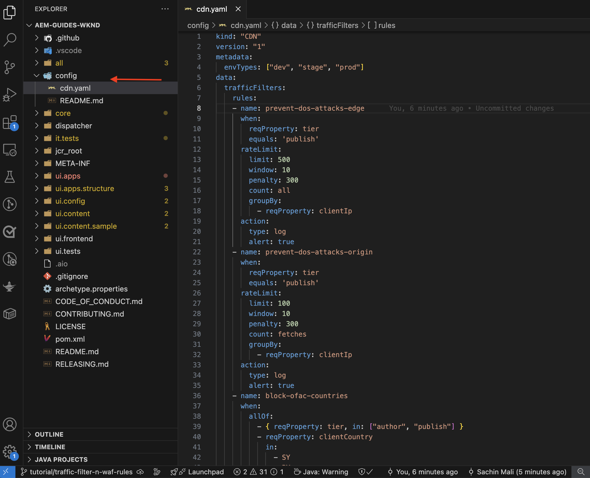
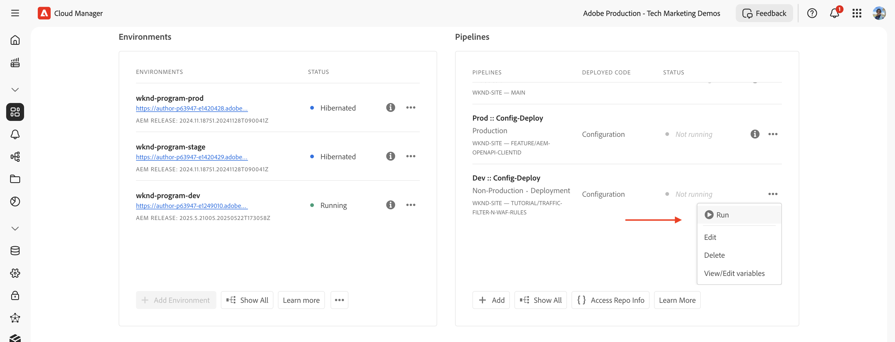

# Skydda AEM webbplatser med standardregler för trafikfilter

Lär dig hur du skyddar AEM webbplatser från denial of service-attacker (DoS), DoS (Distributed Denial of Service) och robotmissbruk med _Adobe-rekommenderade_ **standardregler för trafikfilter** i AEM as a Cloud Service.


>[!VIDEO](https://video.tv.adobe.com/v/3469396/?quality=12&learn=on)

## Utbildningsmål

- Granska de standardregler för trafikfilter som rekommenderas av Adobe.
- Definiera, driftsätt, testa och analysera regelresultaten.
- Förstå när och hur reglerna ska förfinas baserat på trafikmönster.
- Lär dig hur du använder AEM Actions Center för att granska varningar som genererats av reglerna.

### Implementeringsöversikt

Implementeringsstegen omfattar:

- Lägger till standardtrafikfilterreglerna i AEM WKND-projektets `/config/cdn.yaml`-fil.
- Implementera och skicka ändringarna till Cloud Manager Git-databasen.
- Distribuera ändringarna i AEM-miljön med Cloud Manager konfigurationsflöde.
- Testa reglerna genom att simulera DoS-attack med [Vegeta](https://github.com/tsenart/vegeta)
- Analysera resultaten med hjälp av AEMCS CDN-loggarna och ELK-kontrollpanelen.

## Förutsättningar

Innan du fortsätter bör du kontrollera att du har slutfört det nödvändiga grundarbetet enligt beskrivningen i självstudiekursen [Så här konfigurerar du trafikfilter och WAF regler](../setup.md). Du har också klonat och distribuerat [AEM WKND Sites Project](https://github.com/adobe/aem-guides-wknd) till din AEM-miljö.

## Viktiga åtgärder för reglerna

Innan vi börjar fördjupa oss i detaljerna om trafikfilterreglerna måste vi förstå de viktigaste åtgärder som dessa regler utför. Attributet `action` i varje regel definierar hur trafikfiltret ska svara när villkoren uppfylls. Åtgärderna omfattar:

- **Logg**: Reglerna loggar händelserna för övervakning och analys, så att du kan granska trafikmönster och justera tröskelvärden efter behov. Den anges av attributet `type: log`.

- **Varning**: Reglerna utlöser varningar när villkoren uppfylls, vilket hjälper dig att identifiera potentiella problem. Den anges av attributet `alert: true`.

- **Blockera**: Reglerna blockerar trafiken när villkoren uppfylls och förhindrar åtkomst till din AEM-webbplats. Den anges av attributet `action: block`.

## Granska och definiera regler

De standardregler för trafikfilter som rekommenderas av Adobe fungerar som ett grundläggande lager för att identifiera potentiellt skadliga trafikmönster genom att logga händelser som IP-baserade hastighetsbegränsningar som överskrids och blockera trafik från specifika länder. Dessa loggar hjälper team att validera tröskelvärden och fatta välgrundade beslut för att i slutändan **gå över till blockläge** utan att störa legitim trafik.

Låt oss granska de tre standardtrafikfilterreglerna som du bör lägga till i AEM WKND-projektets `/config/cdn.yaml`-fil:

- **Förhindra DoS vid Edge**: Den här regeln identifierar potentiella DoS-attacker (Denial of Service) vid CDN-kanten genom att övervaka förfrågningar per sekund (RPS) från klient-IP-adresser.
- **Förhindra DoS vid ursprung**: Den här regeln identifierar potentiella DoS-attacker (Denial of Service) vid ursprung genom att övervaka hämtningsbegäranden från klient-IP:n.
- **Blockera OFAC-länder**: Den här regeln blockerar åtkomst från specifika länder som omfattas av OFAC-restriktioner (Office of Foreign Assets Control).

### &#x200B;1. Förhindra DoS på Edge

Den här regeln **skickar en varning** när den upptäcker en potentiell denial of service-attack (DoS) vid CDN. Kriteriet för att aktivera den här regeln är när en klient överskrider **500 begäranden per sekund** (genomsnitt över 10 sekunder) per CDN POP (Point of Presence) vid kanten.

Den räknar **alla** förfrågningar och grupperar dem per klient-IP.

```yaml
kind: "CDN"
version: "1"
metadata:
  envTypes: ["dev", "stage", "prod"]
data:
  trafficFilters:
    rules:
    - name: prevent-dos-attacks-edge
      when:
        reqProperty: tier
        equals: 'publish'
      rateLimit:
        limit: 500
        window: 10
        penalty: 300
        count: all
        groupBy:
          - reqProperty: clientIp
      action:
        type: log
        alert: true
```

Attributet `action` anger att regeln ska logga händelserna och utlösa en varning när villkoren uppfylls. Det hjälper er att övervaka potentiella DoS-attacker utan att blockera legitim trafik. Målet är dock att så småningom övergå den här regeln till blockläge när du har validerat trafikmönstren och justerat tröskelvärdena.

### &#x200B;2. Förhindra DoS vid ursprung

Den här regeln **skickar en avisering** när den upptäcker en potentiell denial of service-attack (DoS) vid ursprungsläget. Kriteriet för att aktivera den här regeln är när en klient överskrider **100 begäranden per sekund** (genomsnitt över 10 sekunder) per klient-IP vid startpunkten.

Den räknar **hämtningar** (begäranden om att kringgå cache) och grupperar dem efter klient-IP.

```yaml
...
    - name: prevent-dos-attacks-origin
      when:
        reqProperty: tier
        equals: 'publish'
      rateLimit:
        limit: 100
        window: 10
        penalty: 300
        count: fetches
        groupBy:
          - reqProperty: clientIp
      action:
        type: log
        alert: true
```

Attributet `action` anger att regeln ska logga händelserna och utlösa en varning när villkoren uppfylls. Det hjälper er att övervaka potentiella DoS-attacker utan att blockera legitim trafik. Målet är dock att så småningom övergå den här regeln till blockläge när du har validerat trafikmönstren och justerat tröskelvärdena.

### &#x200B;3. Blockera OFAC-länder

Den här regeln blockerar åtkomst från specifika länder som omfattas av [OFAC](https://ofac.treasury.gov/sanctions-programs-and-country-information) -begränsningar.
Du kan granska och ändra landslistan efter behov.

```yaml
...
    - name: block-ofac-countries
      when:
        allOf:
          - { reqProperty: tier, in: ["author", "publish"] }
          - reqProperty: clientCountry
            in:
              - SY
              - BY
              - MM
              - KP
              - IQ
              - CD
              - SD
              - IR
              - LR
              - ZW
              - CU
              - CI
      action: block
```

Attributet `action` anger att regeln ska blockera åtkomst från de angivna länderna. Detta hjälper dig att förhindra åtkomst till din AEM-webbplats från områden som kan utgöra säkerhetsrisker.

Den fullständiga `cdn.yaml`-filen med ovanstående regler ser ut så här:



## Distribuera regler

Så här distribuerar du ovanstående regler:

- Verkställ och skicka ändringarna till Cloud Manager Git-databasen.

- Distribuera ändringarna i AEM-miljön med Cloud Manager konfigurationspipeline [som skapades tidigare](../setup.md#deploy-rules-using-adobe-cloud-manager).

  

## Testregler

För att verifiera att standardtrafikfilterreglerna är effektiva simulerar du, både vid **CDN Edge** och **Origin**, högbegärandetrafik med [Vegeta](https://github.com/tsenart/vegeta), ett mångsidigt HTTP-lasttestningsverktyg.

- Testa DoS-regeln på Edge (gräns på 500 rps). Följande kommando simulerar 200 begäranden per sekund i 15 sekunder, vilket överskrider Edge tröskelvärde (500 rps).

  ```shell
  $echo "GET https://publish-p63947-e1249010.adobeaemcloud.com/us/en.html" | vegeta attack -rate=200 -duration=15s | vegeta report
  ```

  

  >[!IMPORTANT]
  >
  >  Observera statuskoderna *100%* Success och _200_ i rapporten ovan. Eftersom reglerna är inställda på `log` och `alert` blockeras _inte förfrågningarna_, men de loggas för övervaknings-, analys- och aviseringsändamål.

- Test DoS-regel vid ursprung (gräns 100 rps). Följande kommando simulerar 110 hämtningsbegäranden per sekund i 1 sekund, vilket överskrider tröskelvärdet för origo (100 rps). Om du vill simulera begäranden om att kringgå cache skapas filen `targets.txt` med unika frågeparametrar för att säkerställa att varje begäran behandlas som en hämtningsbegäran.

  ```shell
  # Create targets.txt with unique query parameters
  $for i in {1..110}; do
    echo "GET https://publish-p63947-e1249010.adobeaemcloud.com/us/en.html?ts=$(date +%s)$i"
  done > targets.txt
  
  # Use the targets.txt file to simulate fetch requests
  $vegeta attack -rate=110 -duration=1s -targets=targets.txt | vegeta report
  ```

  

  >[!IMPORTANT]
  >
  >  Observera statuskoderna *100%* Success och _200_ i rapporten ovan. Eftersom reglerna är inställda på `log` och `alert` blockeras _inte förfrågningarna_, men de loggas för övervaknings-, analys- och aviseringsändamål.

- För enkelhetens skull testas inte OFAC-regeln här.

## Granska aviseringar

Varningar genereras när trafikfilterreglerna aktiveras. Du kan granska dessa varningar i [AEM Actions Center](https://experience.adobe.com/aem/actions-center).


## Analysera resultaten

Om du vill analysera resultatet av trafikfilterreglerna kan du använda AEMCS CDN-loggarna och ELK-kontrollpanelen. Följ instruktionerna från inställningsavsnittet [CDN-loggar ](../setup.md#ingest-cdn-logs) för att importera CDN-loggarna till ELK-stacken.

På följande skärmbild ser du CDN-loggarna i AEM Dev-miljön som är inkapslade i ELK-stacken.


I ELK-programmet ska **CDN Traffic Dashboard** visa toppen på **Edge** och **Origin** under de simulerade DoS-attackerna.

De två panelerna, _Edge RPS per klient-IP och POP_ och _Ursprunglig RPS per klient-IP och POP_, visar förfrågningar per sekund (RPS) vid kanten och ursprunget, grupperade efter klientens IP-adress och närvaropunkt (POP).


Du kan också använda andra paneler i CDN Traffic Dashboard för att analysera trafikmönstren, till exempel _Top Client IPs_, _Top countries_ och _Top User Agents_. Panelerna hjälper dig att identifiera potentiella hot och justera trafikfilterreglerna därefter.

### Splunk-integrering

Kunder som har [Splunk Log-vidarebefordran aktiverad](https://experienceleague.adobe.com/sv/docs/experience-manager-cloud-service/content/implementing/developing/logging#splunk-logs) kan skapa nya instrumentpaneler för att analysera trafikmönstren.

Om du vill skapa kontrollpaneler i Splunk följer du stegen [Splunk dashboards för AEMCS CDN Log Analysis](https://github.com/adobe/AEMCS-CDN-Log-Analysis-Tooling/blob/main/Splunk/README.md#splunk-dashboards-for-aemcs-cdn-log-analysis).

På följande skärmbild visas ett exempel på en Splunk-kontrollpanel som visar det maximala antalet förfrågningar om ursprung och kant per IP, som kan hjälpa dig att identifiera potentiella DoS-attacker.


## När och hur du förfinar regler

Ert mål är att undvika att blockera legitim trafik samtidigt som ni skyddar er AEM webbplats från potentiella hot. Standardreglerna för trafikfilter är utformade för att varna och logga (och så småningom blockera när läget växlas) hot utan att blockera legitim trafik.

Om du vill förfina reglerna gör du så här:

- **Övervaka trafikmönster**: Använd CDN-loggarna och ELK-kontrollpanelen för att övervaka trafikmönster och identifiera eventuella avvikelser eller toppar i trafiken.
- **Justera tröskelvärden**: Justera tröskelvärdena (öka eller minska hastighetsgränserna) i reglerna utifrån trafikmönstren så att de bättre passar dina specifika behov. Om du till exempel märker att legitim trafik utlöste varningarna kan du öka hastighetsgränserna eller justera grupperingarna.
I följande tabell visas riktlinjer för hur du väljer tröskelvärden:

  | Variation | Värde |
  | :--------- | :------- |
  | Ursprung | Använd det högsta värdet för Max Origin Requests per IP/POP under **normala** trafikförhållanden (d.v.s. inte hastigheten vid tidpunkten för ett DDoS) och öka den med flera |
  | Edge | Ta det högsta värdet av Max Edge-begäranden per IP/POP under **normala** trafikförhållanden (d.v.s. inte hastigheten vid tidpunkten för ett DDoS) och öka den med flera |

  Se även avsnittet [Välja tröskelvärden](../../blocking-dos-attack-using-traffic-filter-rules.md#choosing-threshold-values) för mer information.

- **Flytta till blockeringsregler**: När du har validerat trafikmönstren och justerat tröskelvärdena bör du övergå reglerna till blockläge.

## Sammanfattning

I den här självstudiekursen lärde du dig att skydda AEM webbplatser från DoS (Denial of Service), DoS (Distributed Denial of Service) och bot-missbruk med de standardregler för trafikfilter som rekommenderas av Adobe i AEM as a Cloud Service.

## Rekommenderade WAF-regler

Lär dig hur du implementerar Adobe rekommenderade WAF-regler för att skydda dina AEM webbplatser från avancerade hot som använder avancerade tekniker för att kringgå traditionella säkerhetsåtgärder.

<!-- CARDS
{target = _self}

* ./using-waf-rules.md
  {title = Protecting AEM websites using WAF traffic filter rules}
  {description = Learn how to protect AEM websites from sophisticated threats including DoS, DDoS, and bot abuse using Adobe-recommended Web Application Firewall (WAF) traffic filter rules in AEM as a Cloud Service.}
  {image = ../assets/use-cases/using-waf-rules.png}
  {cta = Activate WAF}
-->
<!-- START CARDS HTML - DO NOT MODIFY BY HAND -->
<div class="columns">
    <div class="column is-half-tablet is-half-desktop is-one-third-widescreen" aria-label="Protecting AEM websites using WAF traffic filter rules">
        <div class="card" style="height: 100%; display: flex; flex-direction: column; height: 100%;">
            <div class="card-image">
                <figure class="image x-is-16by9">
                    <a href="./using-waf-rules.md" title="Skydda AEM webbplatser med WAF trafikfilterregler" target="_self" rel="referrer">
                        
                    </a>
                </figure>
            </div>
            <div class="card-content is-padded-small" style="display: flex; flex-direction: column; flex-grow: 1; justify-content: space-between;">
                <div class="top-card-content">
                    <p class="headline is-size-6 has-text-weight-bold">
                        <a href="./using-waf-rules.md" target="_self" rel="referrer" title="Skydda AEM webbplatser med WAF trafikfilterregler">Skydda AEM webbplatser med trafikfilterregler från WAF</a>
                    </p>
                    <p class="is-size-6">Lär dig hur du skyddar AEM webbplatser från avancerade hot som DoS, DDoS och robotmissbruk med trafikfilterreglerna i Adobe rekommenderade Web Application Firewall (WAF) i AEM as a Cloud Service.</p>
                </div>
                <a href="./using-waf-rules.md" target="_self" rel="referrer" class="spectrum-Button spectrum-Button--outline spectrum-Button--primary spectrum-Button--sizeM" style="align-self: flex-start; margin-top: 1rem;">
                    <span class="spectrum-Button-label has-no-wrap has-text-weight-bold"> Aktivera WAF </span>
                </a>
            </div>
        </div>
    </div>
</div>
<!-- END CARDS HTML - DO NOT MODIFY BY HAND -->


## Användningsexempel - mer än standardregler

För mer avancerade scenarier kan du utforska följande exempel som visar hur du implementerar anpassade trafikfilterregler baserat på specifika affärskrav:

<!-- CARDS
{target = _self}

* ../how-to/request-logging.md

* ../how-to/request-blocking.md

* ../how-to/request-transformation.md
-->
<!-- START CARDS HTML - DO NOT MODIFY BY HAND -->
<div class="columns">
    <div class="column is-half-tablet is-half-desktop is-one-third-widescreen" aria-label="Monitoring sensitive requests">
        <div class="card" style="height: 100%; display: flex; flex-direction: column; height: 100%;">
            <div class="card-image">
                <figure class="image x-is-16by9">
                    <a href="../how-to/request-logging.md" title="Övervaka känsliga begäranden" target="_self" rel="referrer">
                        
                    </a>
                </figure>
            </div>
            <div class="card-content is-padded-small" style="display: flex; flex-direction: column; flex-grow: 1; justify-content: space-between;">
                <div class="top-card-content">
                    <p class="headline is-size-6 has-text-weight-bold">
                        <a href="../how-to/request-logging.md" target="_self" rel="referrer" title="Övervaka känsliga begäranden">Övervaka känsliga begäranden</a>
                    </p>
                    <p class="is-size-6">Lär dig hur du övervakar känsliga begäranden genom att logga dem med trafikfilterregler i AEM as a Cloud Service.</p>
                </div>
                <a href="../how-to/request-logging.md" target="_self" rel="referrer" class="spectrum-Button spectrum-Button--outline spectrum-Button--primary spectrum-Button--sizeM" style="align-self: flex-start; margin-top: 1rem;">
                    <span class="spectrum-Button-label has-no-wrap has-text-weight-bold">Läs mer</span>
                </a>
            </div>
        </div>
    </div>
    <div class="column is-half-tablet is-half-desktop is-one-third-widescreen" aria-label="Restricting access">
        <div class="card" style="height: 100%; display: flex; flex-direction: column; height: 100%;">
            <div class="card-image">
                <figure class="image x-is-16by9">
                    <a href="../how-to/request-blocking.md" title="Begränsa åtkomst" target="_self" rel="referrer">
                        
                    </a>
                </figure>
            </div>
            <div class="card-content is-padded-small" style="display: flex; flex-direction: column; flex-grow: 1; justify-content: space-between;">
                <div class="top-card-content">
                    <p class="headline is-size-6 has-text-weight-bold">
                        <a href="../how-to/request-blocking.md" target="_self" rel="referrer" title="Begränsa åtkomst">Begränsar åtkomst</a>
                    </p>
                    <p class="is-size-6">Lär dig hur du begränsar åtkomsten genom att blockera specifika begäranden med trafikfilterregler i AEM as a Cloud Service.</p>
                </div>
                <a href="../how-to/request-blocking.md" target="_self" rel="referrer" class="spectrum-Button spectrum-Button--outline spectrum-Button--primary spectrum-Button--sizeM" style="align-self: flex-start; margin-top: 1rem;">
                    <span class="spectrum-Button-label has-no-wrap has-text-weight-bold">Läs mer</span>
                </a>
            </div>
        </div>
    </div>
    <div class="column is-half-tablet is-half-desktop is-one-third-widescreen" aria-label="Normalizing requests">
        <div class="card" style="height: 100%; display: flex; flex-direction: column; height: 100%;">
            <div class="card-image">
                <figure class="image x-is-16by9">
                    <a href="../how-to/request-transformation.md" title="Normalisera begäranden" target="_self" rel="referrer">
                        
                    </a>
                </figure>
            </div>
            <div class="card-content is-padded-small" style="display: flex; flex-direction: column; flex-grow: 1; justify-content: space-between;">
                <div class="top-card-content">
                    <p class="headline is-size-6 has-text-weight-bold">
                        <a href="../how-to/request-transformation.md" target="_self" rel="referrer" title="Normalisera begäranden">Normaliserar begäranden</a>
                    </p>
                    <p class="is-size-6">Lär dig hur du normaliserar begäranden genom att omforma dem med trafikfilterregler i AEM as a Cloud Service.</p>
                </div>
                <a href="../how-to/request-transformation.md" target="_self" rel="referrer" class="spectrum-Button spectrum-Button--outline spectrum-Button--primary spectrum-Button--sizeM" style="align-self: flex-start; margin-top: 1rem;">
                    <span class="spectrum-Button-label has-no-wrap has-text-weight-bold">Läs mer</span>
                </a>
            </div>
        </div>
    </div>
</div>
<!-- END CARDS HTML - DO NOT MODIFY BY HAND -->


## Ytterligare resurser

- [Rekommenderade startregler](https://experienceleague.adobe.com/sv/docs/experience-manager-cloud-service/content/security/traffic-filter-rules-including-waf#recommended-starter-rules)
