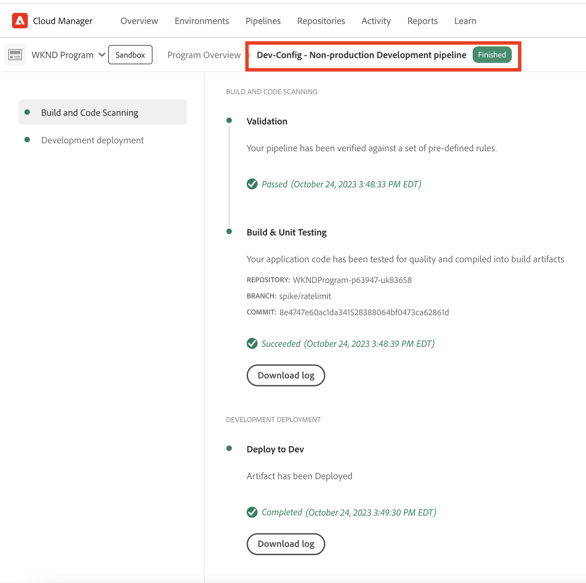
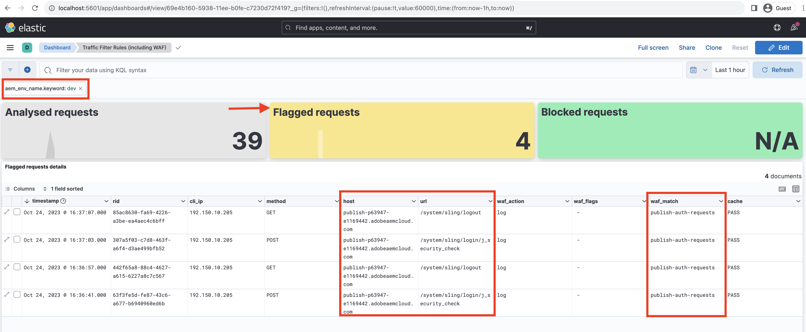
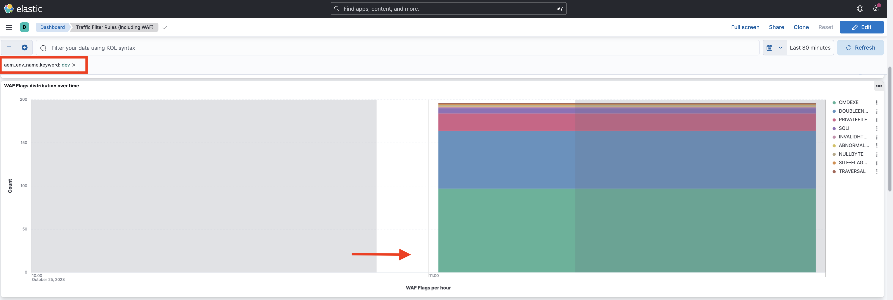

# Exempel och resultatanalys av trafikfilterregler inklusive WAF-regler

Lär dig hur du deklarerar olika typer av trafikfilterregler och analyserar resultaten med hjälp av CDN-loggar och kontrollpanelsverktyg i Adobe Experience Manager as a Cloud Service (AEMCS).

I det här avsnittet kommer du att utforska praktiska exempel på trafikfilterregler, inklusive WAF-regler. Du får lära dig hur du loggar, tillåter och blockerar begäranden baserat på URI (eller sökväg), IP-adress, antalet begäranden och olika typer av attacker med hjälp av [AEM WKND Sites Project](https://github.com/adobe/aem-guides-wknd#aem-wknd-sites-project).

Dessutom kommer du att upptäcka hur du kan använda kontrollpanelsverktyg som importerar AEMCS CDN-loggar för att visualisera viktiga mätvärden via kontrollpaneler som tillhandahålls av Adobe.

Om du vill anpassa dig efter dina specifika krav kan du förbättra och skapa anpassade instrumentpaneler och på så sätt få djupare insikter och optimera regelkonfigurationerna för dina AEM.

>[!VIDEO](https://video.tv.adobe.com/v/3425404?quality=12&learn=on)

## Exempel

Låt oss utforska olika exempel på trafikfilterregler, inklusive WAF-regler. Kontrollera att du har slutfört den nödvändiga konfigurationsprocessen enligt beskrivningen i det tidigare [kapitlet ](./how-to-setup.md) om hur du konfigurerar och att du har klonat [AEM WKND Sites Project](https://github.com/adobe/aem-guides-wknd#aem-wknd-sites-project).

### Förfrågningar om loggning

Börja med **att logga förfrågningar från WKND-inloggnings- och utloggningssökvägar** mot AEM Publish-tjänsten.

- Lägg till följande regel i WKND-projektets `/config/cdn.yaml`-fil.

```yaml
kind: CDN
version: '1'
metadata:
  envTypes:
    - dev
    - stage
    - prod
data:
  trafficFilters:
    rules:
    # On AEM Publish service log WKND Login and Logout requests
      - name: publish-auth-requests
        when:
          allOf:
            - reqProperty: tier
              matches: publish
            - reqProperty: path
              in:
                - /system/sling/login/j_security_check
                - /system/sling/logout
        action: log
```

- Verkställ och skicka ändringarna till Cloud Manager Git-databasen.

- Distribuera ändringarna i AEM Dev-miljön med Cloud Manager `Dev-Config`-konfigurationspipeline [som skapades tidigare](how-to-setup.md#deploy-rules-through-cloud-manager).

  

- Testa regeln genom att logga in och logga ut från programmets WKND-webbplats på Publish-tjänsten (till exempel `https://publish-pXXXX-eYYYY.adobeaemcloud.com/us/en.html`). Du kan använda `asmith/asmith` som användarnamn och lösenord.

  

#### Analyserar{#analyzing}

Låt oss analysera resultatet av regeln `publish-auth-requests` genom att hämta AEMCS CDN-loggarna från Cloud Manager och använda [instrumentpanelsverktyget](how-to-setup.md#analyze-results-using-elk-dashboard-tool) som du konfigurerade i det tidigare kapitlet.

- Hämta CDN-loggarna för AEMCS **Publish**-tjänsten från [Cloud Manager](https://my.cloudmanager.adobe.com/)s **Environment**-kort.

  

  >[!TIP]
  >
  >    Det kan ta upp till 5 minuter innan de nya förfrågningarna visas i CDN-loggarna.

- Kopiera den hämtade loggfilen (till exempel `publish_cdn_2023-10-24.log` i skärmbilden nedan) till mappen `logs/dev` i det Elastic Dashboard-verktygsprojektet.

  {width="800" zoomable="yes"}

- Uppdatera sidan med verktyget Elastic Dashboard.
   - I det övre avsnittet **Global filter** redigerar du filtret `aem_env_name.keyword` och väljer miljövärdet `dev` .

     

   - Om du vill ändra tidsintervallet klickar du på kalenderikonen i det övre högra hörnet och väljer önskat tidsintervall.

     

- Granska den uppdaterade instrumentpanelens **Analyserade förfrågningar**, **Flaggade förfrågningar** och **Flaggade förfrågningar**. För matchande CDN-loggposter bör värdena för varje posts klient-IP (cli_ip), host, url, action (waf_action) och rule-name (waf_match) visas.

  


### Blockera förfrågningar

I det här exemplet lägger vi till en sida i en _intern_-mapp på sökvägen `/content/wknd/internal` i det distribuerade WKND-projektet. Deklarera sedan en trafikfilterregel som **blockerar trafik** till undersidor från andra platser än en angiven IP-adress som matchar din organisation (till exempel ett VPN för företag).

Du kan antingen skapa en egen intern sida (till exempel `demo-page.html`) eller använda det [bifogade paketet](./assets/demo-internal-pages-package.zip).

- Lägg till följande regel i WKND-projektets `/config/cdn.yaml`-fil:

```yaml
kind: CDN
version: '1'
metadata:
  envTypes:
    - dev
    - stage
    - prod
data:
  trafficFilters:
    rules:
    ...

    # Block requests to (demo) internal only page/s from public IP address but allow from internal IP address.
    # Make sure to replace the IP address with your own IP address.
      - name: block-internal-paths
        when:
          allOf:
            - reqProperty: path
              matches: /content/wknd/internal
            - reqProperty: clientIp
              notIn: [192.150.10.0/24]
        action: block
```

- Verkställ och skicka ändringarna till Cloud Manager Git-databasen.

- Distribuera ändringarna i AEM Dev-miljön med konfigurationsflödet [som skapades](how-to-setup.md#deploy-rules-through-cloud-manager) `Dev-Config` i Cloud Manager.

- Testa regeln genom att gå till WKND-platsens interna sida, till exempel `https://publish-pXXXX-eYYYY.adobeaemcloud.com/content/wknd/internal/demo-page.html`, eller genom att använda CURL-kommandot nedan:

  ```bash
  $ curl -I https://publish-pXXXX-eYYYY.adobeaemcloud.com/content/wknd/internal/demo-page.html
  ```

- Upprepa ovanstående steg från både IP-adressen som du använde i regeln och sedan en annan IP-adress (till exempel med mobiltelefonen).

#### Analyserar

Om du vill analysera resultatet av regeln `block-internal-paths` följer du samma steg som beskrivs i [tidigare exempel](#analyzing).

Den här gången ska du dock se **Blockerade begäranden** och motsvarande värden i kolumnerna klient-IP (cli_ip), värd, URL, åtgärd (waf_action) och rule-name (waf_match).


### Förhindra DoS-attacker

Låt oss **förhindra DoS-attacker** genom att blockera begäranden från en IP-adress som gör 100 förfrågningar per sekund, så att den blockeras i 5 minuter.

- Lägg till följande trafikfilterregel [för hastighetsbegränsning](https://experienceleague.adobe.com/docs/experience-manager-cloud-service/content/security/traffic-filter-rules-including-waf.html#ratelimit-structure) i WKND-projektets `/config/cdn.yaml`-fil.

```yaml
kind: CDN
version: '1'
metadata:
  envTypes:
    - dev
    - stage
    - prod
data:
  trafficFilters:
    rules:
    ...
    #  Prevent DoS attacks by blocking client for 5 minutes if they make more than 100 requests in 1 second.
      - name: prevent-dos-attacks
        when:
          reqProperty: path
          like: '*'
        rateLimit:
          limit: 100
          window: 1
          penalty: 300
          groupBy:
            - reqProperty: clientIp
        action: block
```

>[!WARNING]
>
>Samarbeta med webbsäkerhetsteamet för att fastställa lämpliga värden för `rateLimit` i din produktionsmiljö,

- Genomför, push och distribuera ändringar enligt de [tidigare exemplen](#logging-requests).

- Använd följande [Vegeta](https://github.com/tsenart/vegeta)-kommando för att simulera DoS-attacken.

  ```shell
  $ echo "GET https://publish-pXXXX-eYYYY.adobeaemcloud.com/us/en.html" | vegeta attack -rate=120 -duration=5s | vegeta report
  ```

  Med det här kommandot utförs 120 begäranden i 5 sekunder och en rapport skapas. Som du ser är antalet lyckade försök 32,5 %. En 406 HTTP-svarskod tas emot för resten, vilket visar att trafiken blockerades.

  

#### Analyserar

Om du vill analysera resultatet av regeln `prevent-dos-attacks` följer du samma steg som beskrivs i [tidigare exempel](#analyzing).

Den här gången ska du se många **Blockerade begäranden** och motsvarande värden i kolumnerna klient-IP (cli_ip), host, url, action (waf_action) och rule-name (waf_match).


Dessutom visar panelerna **Top 100-attacker av klient-IP, land och användaragent** ytterligare information, som kan användas för att optimera regelkonfigurationen ytterligare.


Mer information om hur du förhindrar DoS- och DDoS-attacker finns i självstudiekursen [Blockera DoS- och DDoS-attacker med trafikfilterregler](../blocking-dos-attack-using-traffic-filter-rules.md).

### WAF-regler

Trafikfilterregelexemplen hittills kan konfigureras av alla Sites- och Forms-kunder.

Sedan ska vi utforska upplevelsen för en kund som har köpt en licens för Förbättrad säkerhet eller WAF-DDoS-skydd, som låter dem konfigurera avancerade regler för att skydda webbplatser från mer sofistikerade attacker.

Innan du fortsätter aktiverar du WAF-DDoS-skyddet för ditt program enligt beskrivningen i dokumentationen för [installationssteg](https://experienceleague.adobe.com/docs/experience-manager-cloud-service/content/security/traffic-filter-rules-including-waf.html?lang=en#setup) för trafikfilterregler.

#### Utan WAFFlags

Låt oss först se upplevelsen även innan WAF-reglerna har deklarerats. När WAF-DDoS är aktiverat i ditt program loggar CDN som standard alla matchningar av skadlig trafik så att du har rätt information att komma fram med rätt regler.

Låt oss börja med att angripa WKND-webbplatsen utan att lägga till en WAF-regel (eller använda egenskapen `wafFlags`) och analysera resultaten.

- Om du vill simulera en attack använder du kommandot [Nikto](https://github.com/sullo/nikto) nedan, som skickar cirka 700 skadliga förfrågningar på 6 minuter.

  ```shell
  $ ./nikto.pl -useragent "AttackSimulationAgent (Demo/1.0)" -D V -Tuning 9 -ssl -h https://publish-pXXXX-eYYYY.adobeaemcloud.com/us/en.html
  ```

  

  Om du vill lära dig mer om attacksimulering kan du läsa dokumentationen för [Nikto - skannerjustering](https://github.com/sullo/nikto/wiki/Scan-Tuning) som innehåller information om hur du anger vilken typ av testattacker som ska inkluderas eller exkluderas.

##### Analyserar

Om du vill analysera resultatet av attacksimulering följer du de steg som beskrivs i [tidigare exemplet](#analyzing).

Den här gången ska du dock se **Flaggade begäranden** och motsvarande värden i kolumnerna klient-IP (cli_ip), host, url, action (waf_action) och rule-name (waf_match). Med den här informationen kan du analysera resultaten och optimera regelkonfigurationen.


Observera hur panelerna **WAF Flags distribution** och **Top attack** visar ytterligare information, som kan användas för att optimera regelkonfigurationen ytterligare.




#### Med WAFFlags

Nu ska vi lägga till en WAF-regel som innehåller egenskapen `wafFlags` som en del av egenskapen `action` och **blockera simulerade attackförfrågningar**.

Ur syntaxperspektiv liknar WAF-reglerna dem som tidigare sågs, men egenskapen `action` refererar till ett eller flera `wafFlags` -värden. Mer information om `wafFlags` finns i avsnittet [WAF-flagglista](https://experienceleague.adobe.com/docs/experience-manager-cloud-service/content/security/traffic-filter-rules-including-waf.html#waf-flags-list).

- Lägg till följande regel i WKND-projektets `/config/cdn.yaml`-fil. Observera att regeln `block-waf-flags` innehåller några av de wafFlags som hade funnits i instrumentpanelsverktyget när den attackerades med simulerad skadlig trafik. Det är god praxis att över tiden analysera loggar för att avgöra vilka nya regler som ska deklareras, allt eftersom hotelselandskapet utvecklas.

```yaml
kind: CDN
version: '1'
metadata:
  envTypes:
    - dev
    - stage
    - prod
data:
  trafficFilters:
    rules:
    ...
    # Enable WAF protections (only works if WAF is enabled for your environment)
      - name: block-waf-flags
        when:
          reqProperty: tier
          matches: "author|publish"
        action:
          type: block
          wafFlags:
            - SANS
            - TORNODE
            - NOUA
            - SCANNER
            - USERAGENT
            - PRIVATEFILE
            - ABNORMALPATH
            - TRAVERSAL
            - NULLBYTE
            - BACKDOOR
            - LOG4J-JNDI
            - SQLI
            - XSS
            - CODEINJECTION
            - CMDEXE
            - NO-CONTENT-TYPE
            - UTF8
```

- Genomför, push och distribuera ändringar enligt de [tidigare exemplen](#logging-requests).

- Om du vill simulera en attack använder du samma [Nikto](https://github.com/sullo/nikto)-kommando som tidigare.

  ```shell
  $ ./nikto.pl -useragent "AttackSimulationAgent (Demo/1.0)" -D V -Tuning 9 -ssl -h https://publish-pXXXX-eYYYY.adobeaemcloud.com/us/en.html
  ```

##### Analyserar

Upprepa samma steg som beskrivs i [tidigare exempel](#analyzing).

Den här gången ska du se poster under **Blockerade begäranden** och motsvarande värden i kolumnerna klient-IP (cli_ip), host, url, action (waf_action) och rule-name (waf_match).


Dessutom visar panelerna **WAF-flaggdistribution** och **Top-attacker** ytterligare information.


### Omfattande analys

I de ovanstående _analyserna_ lärde du dig att analysera resultaten av specifika regler med kontrollpanelsverktyget. Du kan utforska hur du analyserar resultaten med andra paneler på kontrollpanelen, bland annat:


- Analyserade, flaggade och blockerade begäranden
- WAF Flaggar distributionen över tid
- Regler för utlöst trafikfilter över tid
- De vanligaste attackerna av WAF-flagga-ID
- Topputlöst trafikfilter
- De 100 bästa angriparna per klient-IP, land och användaragent


## Nästa steg

Bekanta dig med [bästa praxis](./best-practices.md) som rekommenderas för att minska risken för säkerhetsöverträdelser.

## Ytterligare resurser

[Regelsyntax för trafikfilter](https://experienceleague.adobe.com/docs/experience-manager-cloud-service/content/security/traffic-filter-rules-including-waf.html#rules-syntax)

[CDN-loggformat](https://experienceleague.adobe.com/docs/experience-manager-cloud-service/content/security/traffic-filter-rules-including-waf.html#cdn-log-format)

