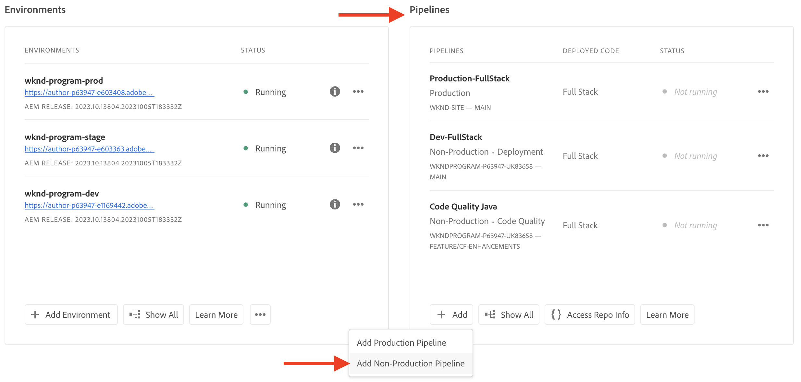
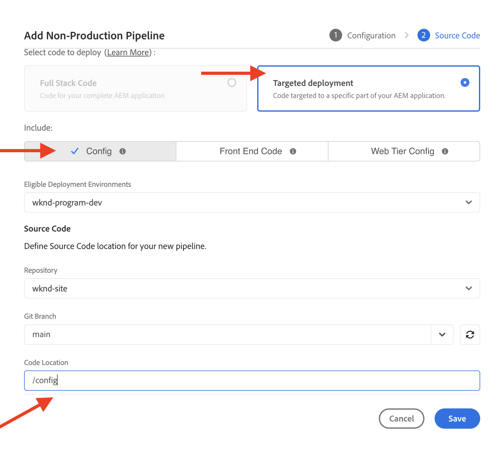

# Konfigurera trafikfilterregler inklusive WAF-regler

Läs **konfigurera** trafikfilterregler, inklusive WAF-regler. Läs om hur du skapar, distribuerar, testar och analyserar resultat.

>[!VIDEO](https://video.tv.adobe.com/v/3425407?quality=12&learn=on)

## Inställningar

Installationsprocessen omfattar följande:

- _skapa regler_ med en lämplig AEM projektstruktur och konfigurationsfil.
- _distribuera regler_ med Adobe Cloud Managers konfigurationsflöde.
- _testregler_ med olika verktyg för att generera trafik.
- _analysera resultaten_ med hjälp av AEMCS CDN-loggar och instrumentpanelsverktyg.

### Skapa regler i ditt AEM projekt

Så här skapar du regler:

1. Skapa en mapp på den översta nivån i AEM `config`.

1. I `config` mapp, skapa en ny fil med namnet `cdn.yaml`.

1. Lägg till följande metadata i `cdn.yaml` fil:

```yaml
kind: CDN
version: '1'
metadata:
  envTypes:
    - dev
    - stage
    - prod
data:
  trafficFilters:
    rules:
```

Se ett exempel på `cdn.yaml` i AEM Guides WKND Sites Project:

{width="800" zoomable="yes"}

### Distribuera regler via Cloud Manager {#deploy-rules-through-cloud-manager}

Så här distribuerar du reglerna:

1. Logga in i Cloud Manager på [my.cloudmanager.adobe.com](https://my.cloudmanager.adobe.com/) och välja lämplig organisation och lämpligt program.

1. Navigera till _Pipelines_ från _Programöversikt_ och klickar på **+Lägg till** och välj önskad pipeline-typ.

   

   I exemplet ovan, för demonstrationssyften _Lägg till icke-produktionsförlopp_ har valts eftersom en dev-miljö används.

1. I _Lägg till icke-produktionsförlopp_ väljer du och anger följande information:

   1. Konfigurationssteg:

      - **Typ**: Distributionsförlopp
      - **Pipelinenamn**: Dev-Config

      

   2. Källkodsteg:

      - **Kod att distribuera**: Målinriktad distribution
      - **Inkludera**: Konfig
      - **Distributionsmiljö**: Namnet på miljön, till exempel wknd-program-dev.
      - **Databas**: Git-databasen varifrån pipelinen ska hämta koden, till exempel `wknd-site`
      - **Git-gren**: Namnet på Git-databasgrenen.
      - **Kodplats**: `/config`motsvarar den konfigurationsmapp på den översta nivån som skapades i föregående steg.

      

### Testa regler genom att generera trafik

För att testa regler finns det olika tredjepartsverktyg att tillgå, och din organisation kan ha ett verktyg som du föredrar. För demosyftet använder vi följande verktyg:

- [Rullning](https://curl.se/) för grundläggande tester, som att anropa en URL och kontrollera svarskoden.

- [Vegeta](https://github.com/tsenart/vegeta) för att utföra denial of service (DOS). Följ installationsanvisningarna på [Vegeta GitHub](https://github.com/tsenart/vegeta#install).

- [Nikto](https://github.com/sullo/nikto/wiki) för att hitta potentiella problem och säkerhetsluckor som XSS, SQL injection med mera. Följ installationsanvisningarna från [Nikto GitHub](https://github.com/sullo/nikto).

- Kontrollera att verktygen är installerade och tillgängliga i terminalen genom att köra kommandona nedan:

  ```shell
  # Curl version check
  $ curl --version
  
  # Vegeta version check
  $ vegeta -version
  
  # Nikto version check
  $ cd <PATH-OF-CLONED-REPO>/program
  ./nikto.pl -Version
  ```

### Analysera resultaten med kontrollpanelsverktygen

När du har skapat, distribuerat och testat reglerna kan du analysera resultaten med **CDN** loggar **AEMCS-CDN-Log-Analysis-Tooling**. Verktyget innehåller en uppsättning instrumentpaneler för att visualisera resultatet för Splunk- och ELK-stacken (Elasticsearch, Logstash och Kibana).

Verktyget kan klonas från [AEMCS-CDN-Log-Analysis-Tooling](https://github.com/adobe/AEMCS-CDN-Log-Analysis-Tooling) GitHub-databas. Följ sedan instruktionerna för att installera och läsa in **Kontrollpanel för CDN-trafik** och **WAF-instrumentpanel** instrumentpaneler för det observerbarhetsverktyg du föredrar.

I den här självstudiekursen använder vi ELK-stacken. Följ [ELK Docker container for AEMCS CDN Log Analysis](https://github.com/adobe/AEMCS-CDN-Log-Analysis-Tooling/blob/main/ELK/README.md) instruktioner för att ställa in ELK-stacken.

- När du har läst in exempelinstrumentpanelen bör sidan med verktyget Elastic Dashboard se ut så här:

  

>[!NOTE]
>
>    Instrumentpanelen är tom eftersom det ännu inte finns några AEMCS CDN-loggar.


## Nästa steg

Lär dig hur du deklarerar trafikfilterregler inklusive WAF-regler i [Exempel och resultatanalys](./examples-and-analysis.md) -kapitel med hjälp av AEM WKND Sites Project.
