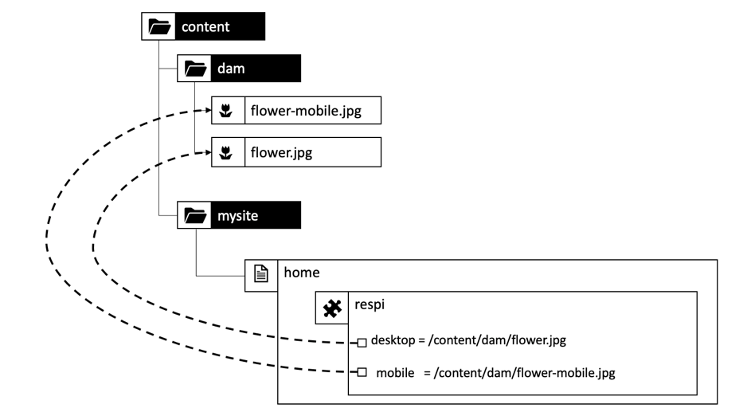
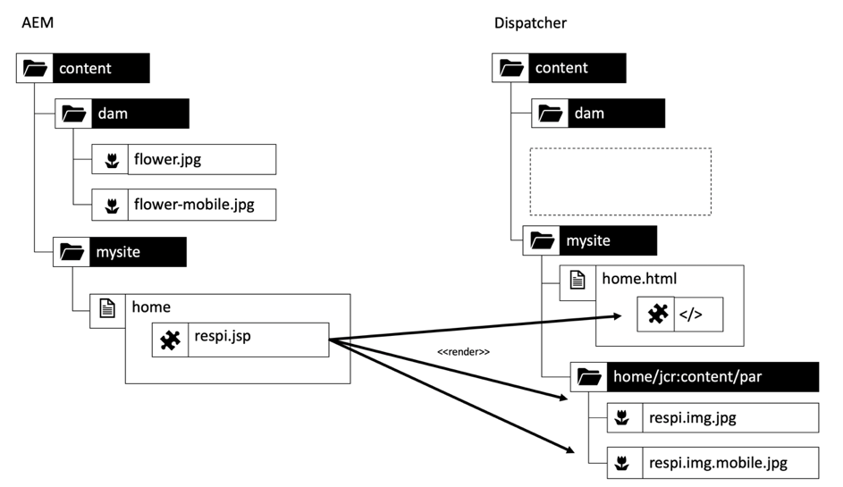
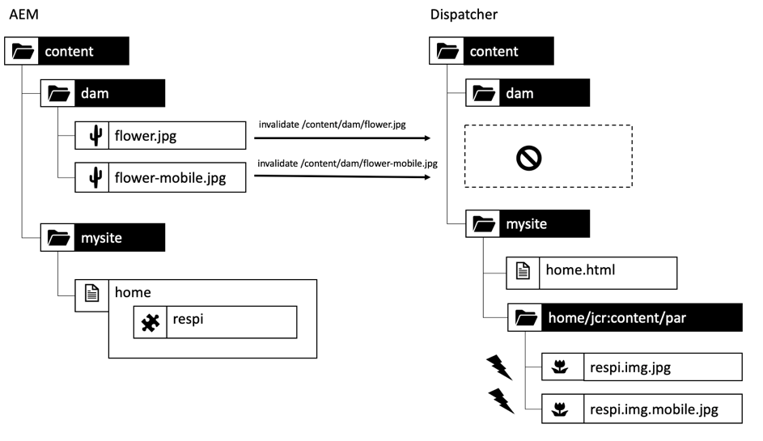
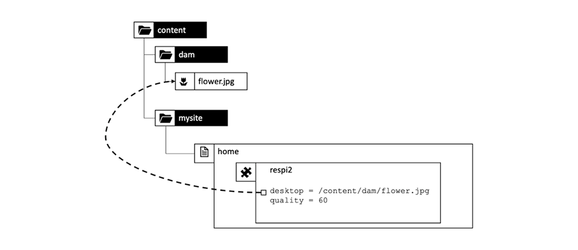
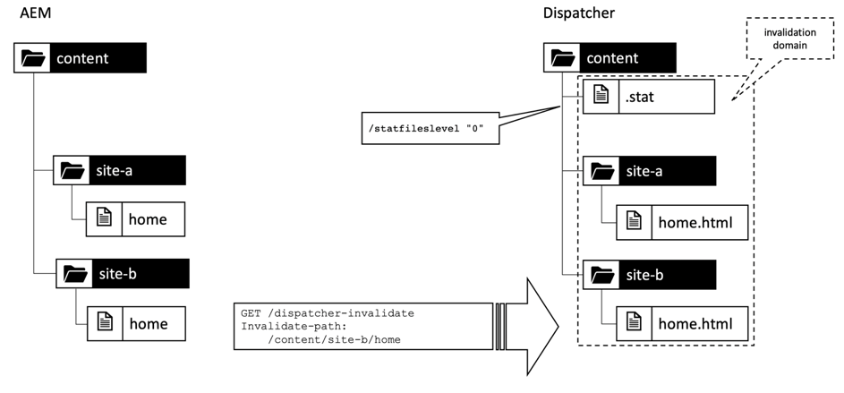
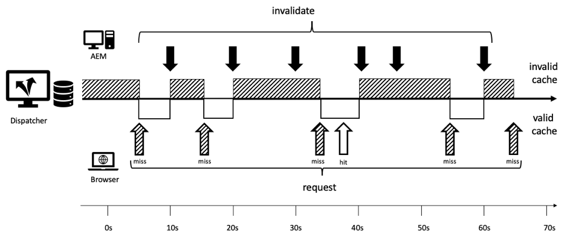

# Kapitel 1 - Dispatcher Conceptions, Patterns and Antipatterns

## Ökning

I detta kapitel ges en kort introduktion om Dispatcher historia och mekaniker och vi diskuterar hur en AEM utvecklare skulle kunna utforma sina komponenter.

## Varför utvecklare ska bry sig om infrastruktur

Dispatcher är en viktig del av de flesta - kanske inte alla AEM. Det finns många artiklar om hur du konfigurerar Dispatcher, samt tips och tricks.

Dessa bitar och delar av information börjar dock alltid på en mycket teknisk nivå - förutsatt att du redan vet vad du vill göra och därmed bara ger information om hur du ska uppnå det du vill ha. Vi har aldrig hittat några konceptuella rapporter som beskriver _vad som är och varför_ när det gäller vad du kan och inte kan göra med dispatchern.

### Antipattern: Dispatcher as an Afterthought

Denna brist på grundläggande information leder till ett antal antimönster som vi har sett i ett antal AEM projekt:

1. När Dispatcher är installerat på Apache-webbservern är det jobbet för &quot;Unix-gudarna&quot; i projektet som konfigurerar det. En&quot;dödlig java-utvecklare&quot; behöver inte bekymra sig om den.

2. Java-utvecklaren måste se till att koden fungerar.. så kommer dispatchern att göra det snabbt. Avsändaren är alltid en eftertanke. Detta fungerar dock inte. Utvecklaren måste utforma koden med avsändaren i åtanke. Och han behöver veta de grundläggande begreppen för att göra det.

### &quot;Först får det att fungera - sedan snabbt&quot; är inte alltid rätt

Du kanske har hört programmeringsråden _&quot;Låt det först fungera - och sedan snabbt.&quot;_. Det är inte helt fel. Utan rätt sammanhang brukar det emellertid feltolkas och inte tillämpas korrekt.

De bör hindra utvecklaren från att i förtid optimera kod, som kanske aldrig kommer att köras - eller så sällan körs, att en optimering inte skulle ha tillräcklig effekt för att motivera den insats som gjorts för optimeringen. Optimering kan dessutom leda till mer komplex kod och därmed medföra fel. Om du är utvecklare ska du alltså inte lägga alltför mycket tid på att mikrooptimera varje kodrad. Se bara till att du väljer rätt datastruktur, algoritmer och bibliotek och vänta på en profilerares hotspot-analys för att se var en mer detaljerad optimering kan öka den totala prestandan.

### Arkitektbeslut och artefakter

Men råden&quot;Först får det att fungera - sedan snabbt&quot; är helt fel när det gäller&quot;arkitektoniska&quot; beslut. Vad är arkitektoniska beslut? Det vill säga: det är de beslut som är dyra, svåra och/eller omöjliga att ändra i efterhand. Tänk på att&quot;dyr&quot; ibland är detsamma som&quot;omöjligt&quot;.  När budgeten håller på att ta slut är det till exempel omöjligt att genomföra kostsamma ändringar. De största förändringarna inom infrastrukturen är förändringar inom denna kategori som de flesta kommer att tänka på. Men det finns också en annan typ av &quot;arkitektoniska&quot; artefakter som kan bli mycket otrevliga att förändra:

1. Koddelar i ett programs&quot;mitt&quot;, som många andra delar är beroende av. Om du ändrar dessa måste alla beroenden ändras och testas på nytt samtidigt.

2. Artefakter, som ingår i vissa asynkrona, tidsberoende scenarier där indata - och därmed systemets beteende - kan variera mycket slumpmässigt. Ändringar kan ha oförutsägbara effekter och kan vara svåra att testa.

3. Mönster som används och återanvänds om och om igen, i alla delar av systemet. Om programmönstret visar sig vara suboptimalt måste alla artefakter som använder mönstret kodas om.

Kommer du ihåg? På den här sidan sade vi att Dispatcher är en viktig del i ett AEM program. Åtkomsten till ett webbprogram är mycket slumpmässig - användarna kommer och kommer vid en oförutsägbar tidpunkt. Till slut kommer allt innehåll att (eller ska) cachas i Dispatcher. Om du har uppmärksammat detta kan du ha insett att cachning kan ses som en&quot;arkitektur&quot;-artefakt och därför bör förstås av alla teammedlemmar, utvecklare och administratörer.

Vi säger inte att en utvecklare faktiskt ska konfigurera Dispatcher. De måste känna till koncepten - särskilt gränserna - för att se till att deras kod också kan utnyttjas av Dispatcher.

Dispatcher förbättrar inte kodens hastighet på ett magiskt sätt. En utvecklare måste skapa sina komponenter med Dispatcher i åtanke. Därför måste han veta hur det fungerar.

## Dispatcher Caching - grundläggande principer

### Dispatcher som Http för cachelagring - belastningsutjämnare

Vad är Dispatcher och varför heter det &quot;Dispatcher&quot; i första hand?

Dispatcher är

* Först och främst en cache

* En omvänd proxy

* En modul för Apache httpd-webbservern, som lägger till AEM funktioner till Apache-filens mångsidighet och smidigt fungerar tillsammans med alla andra Apache-moduler (som SSL eller SSI-inkluderingar som vi kommer att se senare)

I webbens tidiga dagar förväntar du dig ett par hundra besökare på en webbplats. En installation av en Dispatcher som&quot;skickas&quot; eller balanserar antalet förfrågningar till ett antal AEM publiceringsservrar och som vanligtvis var tillräckligt - dvs. namnet&quot;Dispatcher&quot;. I dag används dock inte den här inställningen särskilt mycket längre.

Vi kommer att se olika sätt att konfigurera Dispatcher och Publish-system senare i den här artikeln. Först börjar vi med lite http-cachning-grunder.


*Grundläggande funktioner i en Dispatcher-cache*

<br> 

Här förklaras grunderna i dispatchern. Dispatchern är en enkel cachelagring av omvänd proxy med möjlighet att ta emot och skapa HTTP-begäranden. En normal process för begäran/svar ser ut så här:

1. En användare begär en sida
2. Dispatcher kontrollerar om det redan finns en återgiven version av den sidan. Låt oss anta att det är den allra första begäran för den här sidan och att Dispatcher inte kan hitta en lokal cachelagrad kopia.
3. Dispatcher begär sidan från Publish system
4. På Publish återges sidan med en JSP- eller HTML-mall
5. Sidan skickas tillbaka till Dispatcher
6. Dispatcher cachelagrar sidan
7. Dispatcher returnerar sidan till webbläsaren
8. Om samma sida begärs en andra gång kan den hanteras direkt från Dispatcher-cachen utan att den behöver återges om på Publish-instansen. Detta sparar väntetid för användar- och processorcyklerna på Publish-instansen.

Vi pratade om &quot;sidor&quot; i sista delen. Men samma schema gäller även andra resurser som bilder, CSS-filer, PDF-nedladdningar och så vidare.

#### Hur data cachelagras

Dispatcher-modulen utnyttjar de funktioner som finns på Apache-värdservern. Resurser som HTML-sidor, nedladdningar och bilder lagras som enkla filer i Apache-filsystemet. Så enkelt är det.

Filnamnet härleds av URL:en för den begärda resursen. Om du begär en fil `/foo/bar.html` lagras den till exempel under /`var/cache/docroot/foo/bar.html`.

Om alla filer cachelagras och därmed lagras statiskt i Dispatcher kan du i princip dra Publish-systemets plug-in och Dispatcher fungerar som en enkel webbserver. Men detta är bara för att illustrera principen. Det verkliga livet är mer komplicerat. Du kan inte cachelagra allt och cachen är aldrig helt&quot;full&quot; eftersom antalet resurser kan vara oändligt på grund av återgivningsprocessens dynamiska karaktär. Modellen för ett statiskt filsystem hjälper till att generera en helhetsbild av avsändarens funktioner. Och det hjälper till att förklara begränsningarna med dispatchern.

#### AEM URL-struktur och filsystemsmappning

Om du vill ha mer information om Dispatcher kan du gå igenom strukturen för en enkel exempel-URL.  Låt oss titta på exemplet nedan,

`http://domain.com/path/to/resource/pagename.selectors.html/path/suffix.ext?parameter=value&amp;otherparameter=value#fragment`

* `http` betecknar protokollet

* `domain.com` är domännamnet

* `path/to/resource` är sökvägen som resursen lagras i CRX och därefter i Apache-serverns filsystem

Härifrån skiljer det sig lite åt mellan AEM och Apache-filsystemet.

AEM

* `pagename` är resursetiketten

* `selectors` står för ett antal väljare som används i Sling för att bestämma hur resursen ska återges. En URL kan ha ett godtyckligt antal väljare. De avgränsas av en punkt. En väljarsektion kan till exempel vara &quot;french.mobile.dit&quot;. Väljarna får endast innehålla bokstäver, siffror och bindestreck.

* `html` som den sista av väljarna kallas för ett tillägg. I AEM/Sling avgör det också delvis återgivningsskriptet.

* `path/suffix.ext` är ett sökvägsliknande uttryck som kan vara ett suffix till URL:en.  Den kan användas i AEM skript för att ytterligare styra hur en resurs återges. Vi ska ha en hel sektion om den här delen senare. För tillfället bör det räcka att veta att du kan använda den som en extra parameter. Suffix måste ha ett tillägg.

* `?parameter=value&otherparameter=value` är frågeavsnittet i URL:en. Den används för att skicka godtyckliga parametrar till AEM. URL:er med parametrar kan inte cachelagras och parametrar bör därför begränsas till fall där de är absolut nödvändiga.

* `#fragment`, fragmentdelen av en URL skickas inte till AEM den bara används i webbläsaren, antingen i JavaScript-ramverk som&quot;routningsparametrar&quot; eller för att hoppa till en viss del på sidan.

I Apache (*refererar till bilden nedan*),

* `pagename.selectors.html` används som filnamn i cachens filsystem.

Om URL:en har suffixet `path/suffix.ext`,

* `pagename.selectors.html` skapas som en mapp

* `path` en mapp i mappen `pagename.selectors.html`

* `suffix.ext` är en fil i mappen `path`. Obs! Om suffixet inte har något tillägg cachelagras inte filen.


*Filsystemlayout efter hämtning av URL:er från Dispatcher*

<br> 

#### Grundläggande begränsningar

Mappningen mellan en URL-adress, resursen och filnamnet är ganska enkel.

Du kanske har märkt några svällningar

1. URL-adresser kan bli mycket långa. Om du lägger till sökvägsdelen av `/docroot` i det lokala filsystemet kan det vara enkelt att överskrida gränserna för vissa filsystem. Det kan vara svårt att köra Dispatcher i NTFS i Windows. Men du är säker med Linux.

2. URL:er kan innehålla specialtecken och omljud. Detta är vanligtvis inget problem för dispatchern. Tänk dock på att URL-adressen tolkas på många ställen i programmet. Oftast har vi sett konstiga beteenden i ett program - bara för att ta reda på att en del sällan använd (anpassad) kod inte har testats noggrant för specialtecken. Du borde undvika dem om du kan. Och om du inte kan, planera för grundliga tester.

3. I CRX har resurserna underresurser. En sida har t.ex. ett antal underordnade sidor. Detta kan inte matchas i ett filsystem eftersom filsystem har antingen filer eller mappar.

#### URL:er utan tillägg cachelagras inte

URL-adresser måste alltid ha ett tillägg. Även om du kan hantera URL:er utan tillägg i AEM. Dessa URL:er cachelagras inte i Dispatcher.

**Exempel**

`http://domain.com/home.html` är **cacheable**

`http://domain.com/home` är **inte tillgänglig**

Samma regel gäller när URL:en innehåller ett suffix. Suffixet måste ha ett tillägg för att kunna cachelagras.

**Exempel**

`http://domain.com/home.html/path/suffix.html` är **cacheable**

`http://domain.com/home.html/path/suffix` är **inte tillgänglig**

Du kanske undrar vad som händer om resursdelen inte har något tillägg, men suffixet har ett? I det här fallet har URL-adressen inget suffix alls. Titta på nästa exempel:

**Exempel**

`http://domain.com/home/path/suffix.ext`

`/home/path/suffix` är sökvägen till resursen.. så det finns inget suffix i URL:en.

**Slutsats**

Lägg alltid till tillägg till både sökvägen och suffixet. SEO-medvetna personer hävdar ibland att detta rankar dig i sökresultaten. Men en sida som inte är cachelagrad skulle bli mycket långsam och rankas ännu längre.

#### Suffix-URL i konflikt

Du kan ha två giltiga URL:er

`http://domain.com/home.html`

och

`http://domain.com/home.html/suffix.html`

De är helt giltiga i AEM. Du skulle inte se några problem på din lokala utvecklingsmaskin (utan Dispatcher). Troligen kommer du inte heller att stöta på några problem med UAT- eller inläsningstestning. Det problem vi står inför är så subtilt att det glider igenom de flesta tester.  Den kommer att drabba dig hårt när du är i toppläge och du har begränsad tid att ta itu med den, troligen inte har någon serveråtkomst eller resurser att åtgärda den. Vi har varit där..

Så.. vad är problemet?

`home.html` i ett filsystem kan vara en fil eller en mapp. Inte båda samtidigt som i AEM.

Om du begär `home.html` först skapas den som en fil.

Efterföljande begäranden till `home.html/suffix.html` returnerar giltiga resultat, men eftersom filen `home.html`&quot;blockerar&quot; positionen i filsystemet kan `home.html` inte skapas en andra gång som en mapp och `home.html/suffix.html` därför inte cachelagras.


*Filblockeringspositionen i filsystemet förhindrar att underresurser cachas*

<br> 

Om du gör det tvärtom, begär först `home.html/suffix.html`, cachelagras `suffix.html` under en mapp `/home.html` först. Den här mappen tas dock bort och ersätts av filen `home.html` när du efterfrågar `home.html` som en resurs.


*Tar bort en sökvägsstruktur när en överordnad hämtas som en resurs*

<br> 

Resultatet av det som cachelagras är alltså helt slumpmässigt och beroende på ordningen för inkommande begäranden. Det som gör det ännu svårare är det faktum att du vanligtvis har mer än en dispatcher. Och prestanda, cache-träfffrekvens och -beteende kan variera från en Dispatcher till en annan. Om du vill ta reda på varför din webbplats inte svarar måste du se till att du tittar på rätt Dispatcher med den olyckliga cachningsordningen. Om du tittar på Dispatcher som - av tur - hade ett mer fördelaktigt mönster för förfrågningar, kommer du att gå vilse när du försöker hitta problemet.

#### Undvika URL-konflikter

Du kan undvika&quot;URL-konflikter&quot;, där ett mappnamn och ett filnamn&quot;konkurrerar&quot; om samma sökväg i filsystemet, när du använder ett annat tillägg för resursen när du har ett suffix.

**Exempel**

* `http://domain.com/home.html`

* `http://domain.com/home.dir/suffix.html`

Båda är helt lättåtkomliga.


Välj en dedikerad dir för ett tillägg för en resurs när du begär ett suffix eller så undviker du att använda suffixet helt och hållet. Det finns sällsynta fall där de är användbara. Och det är enkelt att implementera dessa fall korrekt.  Som vi kommer att se i nästa kapitel när vi talar om cache-ogiltigförklaring och tömning.

#### Otillgängliga begäranden

Låt oss titta på en kort sammanfattning av det sista kapitlet plus några andra undantag. Dispatcher kan cachelagra en URL om den är konfigurerad som cacheable och om det är en GET-begäran. Den kan inte cachas med något av följande undantag.

**Cacheable-begäranden**

* Begäran är konfigurerad att vara tillgänglig i Dispatcher-konfigurationen
* Begäran är en ren GET-begäran

**Begäranden eller svar som inte kan cachelagras**

* Begäran som nekas cachelagring av konfiguration (sökväg, mönster, MIME-typ)
* Svar som returnerar rubriken&quot;Dispatcher: no-cache&quot;
* Svar som returnerar huvudet Cache-Control: no-cache|private
* Svar som returnerar rubriken &quot;Pragma: no-cache&quot;
* Begäran med frågeparametrar
* URL utan tillägg
* URL med ett suffix som inte har något tillägg
* Svar som returnerar en annan statuskod än 200
* Begäran om POST

## Invalidera och tömma cachen

### Ökning

I det sista kapitlet visas ett stort antal undantag när Dispatcher inte kan cachelagra en begäran. Men det finns fler saker att tänka på: Bara för att Dispatcher _kan_ cachelagrar en begäran behöver det inte innebära att den _ska_.

Poängen är: Cachelagring är vanligtvis enkel. Dispatcher behöver bara lagra resultatet av ett svar och returnera det nästa gång samma begäran kommer in. Eller hur? Fel!

Den svåra delen är _invalidation_ eller _tömning_ av cachen. Dispatcher måste ta reda på när en resurs har ändrats - och måste återges igen.

Det här verkar vara en enkel uppgift.. men det är det inte. Läs vidare så kommer du att få reda på några knepiga skillnader mellan enskilda och enkla resurser och sidor som är beroende av en struktur med flera olika resurser som har mycket gemensamt.

### Enkla resurser och tömning

Vi har konfigurerat vårt AEM för att dynamiskt skapa en miniatyrrendering för varje bild när det efterfrågas med en särskild&quot;tumväljare&quot;:

`/content/dam/path/to/image.thumb.png`

Och - naturligtvis - tillhandahåller vi en URL för att skicka originalbilden med en URL utan väljare:

`/content/dam/path/to/image.png`

Om vi laddar ned både miniatyrbilden och originalbilden får vi något som

```
/var/cache/dispatcher/docroot/content/dam/path/to/image.thumb.png

/var/cache/dispatcher/docroot/content/dam/path/to/image.png
```

i Dispatcher filsystem.

Nu laddar användaren upp och aktiverar en ny version av filen. I slutändan skickas en begäran om ogiltigförklaring från AEM till Dispatcher.

```
GET /invalidate
invalidate-path:  /content/dam/path/to/image

<no body>
```

Så enkelt är det att ogiltigförklara: En enkel begäran om GET till en speciell &quot;/invalidate&quot;-URL på Dispatcher. HTTP-body krävs inte, nyttolasten är bara huvudet invalidate-path. Observera också att invalidate-path i sidhuvudet är den resurs som AEM känner till - och inte den eller de filer som Dispatcher har cachelagrat. AEM känner bara till resurser. Tillägg, väljare och suffix används vid körning när en resurs begärs. AEM bokför inte vilka väljare som har använts på en resurs, så resurssökvägen är helt säker när en resurs aktiveras.

Det räcker i vårt fall. Om en resurs har ändrats kan vi anta att alla återgivningar av den resursen också har ändrats. Om bilden har ändrats återges även en ny miniatyrbild.

Dispatcher kan ta bort resursen med alla återgivningar som den har cachelagrat. Det kommer att göra något som

`$ rm /content/dam/path/to/image.*`

tar bort `image.png` och `image.thumb.png` och alla andra återgivningar som matchar mönstret.

Mycket enkelt ... så länge du bara använder en resurs för att besvara en förfrågan.

### Referenser och maskerat innehåll

#### Problem med det delade innehållet

Till skillnad från bilder eller andra binära filer som överförts till AEM är HTML sidor inte ett enda djur. De lever i flockar och de är i hög grad sammankopplade med varandra genom hyperlänkar och referenser. Den enkla länken är ofarlig, men den blir svår när vi talar om innehållsreferenser. Den vanliga toppnavigeringen eller de vanligaste scenerna på sidor är innehållsreferenser.

#### Innehållsreferenser och varför de är ett problem

Vi tar ett enkelt exempel. En resebyrå har en webbsida som marknadsför en resa till Kanada. Den här kampanjen visas i teaser-avsnittet på två andra sidor, på hemsidan och på sidan Vintern-special.

Eftersom båda sidorna har samma teaser är det onödigt att be författaren att skapa teaser flera gånger för varje sida som de ska visas på. Målsidan &quot;Canada&quot; reserverar i stället ett avsnitt i sidegenskaperna för att ge information för teaser - eller bättre för att ge en URL som återger så mycket teaser:

`<sling:include resource="/content/home/destinations/canada" addSelectors="teaser" />`

eller

`<sling:include resource="/content/home/destinations/canada/jcr:content/teaser" />`


AEM fungerar bara som charm, men om du använder en Dispatcher i Publish-instansen händer något konstigt.

Tänk dig att du har publicerat din webbplats. Titeln på din Kanadassida är &quot;Kanada&quot;. När en besökare begär din hemsida - som har en stegvis referens till den sidan - återges något som liknar det som komponenten på&quot;Kanadas&quot; sida

```
<div class="teaser">
  <h3>Canada</h3>
  
</div>
```

*till* startsidan. Hemsidan lagras av Dispatcher som en statisk HTML-fil, inklusive teaser och filens rubrik.

Nu har marknadsföraren lärt sig att det ska gå att agera med teaserrubriker. Så han bestämmer sig för att ändra titeln från &quot;Kanada&quot; till &quot;Besök Kanada&quot; och uppdaterar även bilden.

Han publicerar den redigerade&quot;Canada&quot;-sidan och går igenom den tidigare publicerade hemsidan för att se ändringarna. Men inget förändrades där. Den visar fortfarande den gamla teaser. Han dubbelkollar &quot;Winter Special&quot;. Den sidan har aldrig begärts tidigare och är därför inte statiskt cachelagrad i Dispatcher. Den här sidan renderas av Publish och den här sidan innehåller nu det nya&quot;Besök Kanada&quot;-teasret.


*Dispatcher lagrar inaktuellt innehåll på startsidan*

<br> 

Vad hände? Dispatcher lagrar en statisk version av en sida som innehåller allt innehåll och all kod som har hämtats från andra resurser vid återgivningen.

Dispatcher är en webbserver som bara är baserad på filsystem och är snabb men också ganska enkel. Om en inkluderad resurs ändras inser den inte det. Det håller fortfarande fast vid innehållet som fanns där när inkluderingssidan renderades.

Sidan&quot;Vinter special&quot; har inte renderats än, så det finns ingen statisk version på Dispatcher och den visas därför med den nya teaser som den renderas på begäran.

Du kanske tror att Dispatcher håller reda på alla resurser som den rör vid vid återgivningen och tömmer alla sidor som har använt resursen när resursen ändras. Men Dispatcher återger inte sidorna. Återgivningen utförs av Publish-systemet. Dispatcher vet inte vilka resurser som går till en återgiven HTML-fil.

Fortfarande inte övertygad? Du kanske tror att *måste finnas ett sätt att implementera någon typ av beroendespårning*. Det finns faktiskt, eller mer exakt där *var*. Communiqué 3, farfars-farfars-farfars-farfars-farfar, hade en beroendespårare implementerad i _sessionen_ som användes för att återge en sida.

Under en begäran spårades varje resurs som hämtades via den här sessionen som ett beroende av den URL som för närvarande återges.

Men det visade sig att det var väldigt dyrt att hålla reda på beroendena. Folk upptäckte snart att webbplatsen är snabbare om de stängde av funktionen för beroendespårning helt och hållet och förlitade sig på att återge alla HTML-sidor efter att en HTML-sida ändrats. Dessutom var detta system inte heller perfekt - det fanns ett antal fallgropar och undantag på vägen. I vissa fall använde du inte standardsessionen för begäranden för att hämta en resurs, utan en administratörssession för att få hjälp med att återge en begäran. Dessa beroenden spårades vanligtvis inte och ledde till huvudvärk och telefonsamtal till teamet som bad om att manuellt tömma cachen. Du hade tur om de hade en standardprocedur för att göra det. Det fanns fler saker på vägen men.. vi slutar påminna. Detta leder tillbaka till 2005. I slutändan inaktiverades funktionen som standard i Communiqué 4, och den återgick inte till den efterföljare CQ5 som sedan blev AEM.

### Automatisk invalidering

#### När fullständig tömning är billigare än beroendespårning

Sedan CQ5 förlitar vi oss helt och hållet på att göra hela webbplatsen ogiltig, i stort sett om bara en av sidorna ändras. Den här funktionen kallas &quot;Automatisk invalidering&quot;.

Men än en gång - hur kan det vara så att det är billigare att kasta bort och återge hundratals sidor än att göra en riktig beroendespårning och partiell återgivning?

Det finns två viktiga orsaker:

1. På en vanlig webbplats efterfrågas bara en liten del av sidorna ofta. Även om du slänger allt återgivet innehåll efterfrågas bara ett fåtal dussin efteråt. Återgivningen av den långa änden av sidor kan distribueras över tiden när de faktiskt efterfrågas. Det innebär att belastningen på återgivningssidor inte är så hög som du kan förvänta dig. Det finns förstås alltid undantag.. vi kommer att diskutera några trick för att hantera lika distribuerade webbplatser på större webbplatser med tomma Dispatcher-cacher senare.

2. Alla sidor är ändå sammankopplade med huvudnavigeringen. Så nästan alla sidor är beroende av varandra. Det innebär att även den smartaste beroendespåraren kommer att ta reda på vad vi redan vet: Om en av sidorna ändras måste du ogiltigförklara alla andra.

Tror du inte? Låt oss illustrera den sista punkten.

Vi använder samma argument som i det senaste exemplet med teasers som refererar till en fjärrsidas innehåll. Endast nu använder vi ett mer extremt exempel: En automatiskt återgiven huvudnavigering. Precis som med teaser ritas navigeringsrubriken från den länkade sidan eller&quot;fjärrsidan&quot; som en innehållsreferens. Fjärrnavigeringsrubrikerna lagras inte på den återgivna sidan. Du bör komma ihåg att navigeringen återges på varje sida på webbplatsen. Rubriken på en sida används alltså om och om igen på alla sidor som har en huvudnavigering. Och om du vill ändra en navigeringstitel vill du bara göra det en gång på fjärrsidan, inte på varje sida som refererar till sidan.

I vårt exempel sammanfogar navigeringen alla sidor genom att använda målsidans&quot;NavTitle&quot; för att återge ett namn i navigeringen. Navigeringsrubriken för Island ritas från&quot;Island&quot;-sidan och återges på varje sida som har en huvudnavigering.


*Huvudnavigeringen sammanfogar alltid innehållet på alla sidor genom att dra i deras&quot;NavTitles&quot;*

<br> 

Om du ändrar NavTitle på Islands sida från &quot;Island&quot; till &quot;Beautiful Island&quot; ändras titeln omedelbart på alla andra sidors huvudmeny. De sidor som återges och cachelagras före ändringen blir alltså inaktuella och måste ogiltigförklaras.

#### Så här implementeras automatisk invalidering: .stat-filen

Om du har en stor webbplats med tusentals sidor tar det en hel stund att göra en slinga genom alla sidor och ta bort dem fysiskt. Under denna period kan Dispatcher oavsiktligt leverera gammalt innehåll. Ännu värre är att vissa konflikter kan uppstå vid åtkomst av cachefilerna, en sida kanske efterfrågas medan den just tas bort eller en sida tas bort igen på grund av en andra ogiltigförklaring som inträffade efter en omedelbar efterföljande aktivering. Tänk på vilken röra det skulle vara. Som tur är är det inte så här. Dispatcher använder ett smart trick för att undvika detta: Istället för att ta bort hundratals och tusentals filer placerar den en enkel, tom fil i roten av filsystemet när en fil publiceras och därför betraktas alla beroende filer som ogiltiga. Den här filen kallas för &quot;statfile&quot;. Statusfilen är en tom fil - det viktiga med statusfilen är bara skapandedatumet.

Alla filer i dispatchern som har ett datum som är äldre än statusfilen har återgetts före den senaste aktiveringen (och ogiltigförklaringen) och betraktas därför som&quot;ogiltiga&quot;. De finns fortfarande fysiskt kvar i filsystemet, men de ignoreras av Dispatcher. De är&quot;föråldrade&quot;. När en begäran om en inaktuell resurs görs ber Dispatcher AEM att återge sidan igen. Den nya återgivna sidan lagras sedan i filsystemet - nu med ett nytt skapandedatum och den är ny igen.


*Skapad av .stat-filen definierar vilket innehåll som är inaktuellt och som är färskt*

<br> 

Du kan fråga varför det heter &quot;.stat&quot;? Och inte kanske &quot;invalidated&quot;? Du kan föreställa dig att om du har den filen i filsystemet kan Dispatcher avgöra vilka resurser som *statiskt* kan användas - precis som på en statisk webbserver. Dessa filer behöver inte längre återges dynamiskt.

Namnets verkliga karaktär är dock mindre metaforisk. Den härleds från Unix-systemanropet `stat()`, som returnerar ändringstiden för en fil (bland annat egenskaper).

#### Mixa enkel och automatisk validering

Men vänta... tidigare sa vi att enstaka resurser tas bort fysiskt. Nu säger vi att en nyare statfil i stort sett skulle göra dem ogiltiga i Dispatcher ögon. Varför då den fysiska borttagningen först?

Svaret är enkelt. Du använder vanligtvis båda strategierna parallellt, men för olika typer av resurser. Binära resurser, som bilder, är fristående. De är inte kopplade till andra resurser på ett sätt som innebär att deras information måste återges.

HTML sidor å andra sidan är mycket beroende av varandra. Du skulle alltså tillämpa automatisk ogiltigförklaring på dessa. Det här är standardinställningen i Dispatcher. Alla filer som tillhör en ogiltig resurs tas bort fysiskt. Dessutom blir filer som slutar med &quot;.html&quot; automatiskt ogiltiga.

Dispatcher beslutar om filtillägget ska tillämpas eller inte.

Filsluten för automatisk ogiltigförklaring kan konfigureras. I teorin kan du inkludera alla tillägg till automatisk ogiltigförklaring. Men tänk på att det här kommer till ett mycket högt pris. Du kommer inte att se föråldrade resurser levereras oavsiktligt, men leveransresultaten försämras avsevärt på grund av överogiltigförklaring.

Tänk dig till exempel att du implementerar ett schema där PNG-filer och JPG återges dynamiskt och är beroende av andra resurser för att göra det. Du kanske vill skala om högupplösta bilder till en mindre webbkompatibel upplösning. När du är klar ändras också komprimeringsgraden. Upplösning och komprimeringsgrad i det här exemplet är inga fasta konstanter, men konfigurerbara parametrar i komponenten som använder bilden. Om den här parametern ändras måste du göra bilderna ogiltiga.

Inga problem - vi fick just veta att vi kunde lägga till bilder till automatisk ogiltigförklaring och alltid ha återgivna bilder när något ändras.

#### Kasta ut babyn med badvattnet

Det stämmer - och det är ett stort problem. Läs det sista stycket igen. &quot;... renderade bilder när något ändras.&quot; Som du vet ändras en bra webbplats hela tiden. Om du lägger till nytt innehåll här, korrigerar ett skrivfel där, så att du kan tända på ett teaser någon annanstans. Det innebär att alla bilder blir permanent ogiltiga och måste återges på nytt. Underskatta inte det. Dynamisk återgivning och överföring av bilddata fungerar i millisekunder på den lokala utvecklingsdatorn. Din produktionsmiljö behöver göra det hundra gånger oftare - per sekund.

Och här ska vi vara tydliga: dina jpg-filer måste återges igen när en HTML-sida ändras och vice versa. Det finns bara en&quot;bucket&quot; med filer som ska ogiltigförklaras automatiskt. Den spolas som helhet. Utan någon form av indelning i ytterligare detaljerade strukturer.

Det finns en bra anledning till varför den automatiska ogiltigförklaringen behålls som standard till &quot;.html&quot;. Målet är att hålla bucket så litet som möjligt. Kasta inte ut bebisen med badvattnet genom att bara göra allting ogiltigt - bara för att vara på den säkra sidan.

Självständiga resurser ska betjänas på den resursens sökväg. Det hjälper till att ogiltigförklara mycket. Gör det enkelt, skapa inte mappningsscheman som &quot;resource /a/b/c&quot; hämtas från &quot;/x/y/z&quot;. Låt dina komponenter fungera med standardinställningarna för automatisk ogiltigförklaring av Dispatcher. Försök inte reparera en dåligt utformad komponent med överogiltigförklaring i Dispatcher.

##### Undantag för automatisk invalidering: Invalidering av endast resurs

Inaktiveringsbegäran för Dispatcher utlöses vanligtvis från Publish-system av en replikeringsagent.

Om du känner dig riktigt säker på dina beroenden kan du försöka skapa en egen ogiltig replikeringsagent.

Det skulle gå lite längre än den här guiden för att gå in på detaljerna, men vi vill ge dig åtminstone några tips.

1. Jag vet verkligen vad du gör. Det är verkligen svårt att få ogiltigförklaringen rätt. Det är en anledning till varför den automatiska ogiltigförklaringen är så rigorös, för att undvika att leverera gammalt innehåll.

2. Om din agent skickar en HTTP-rubrik `CQ-Action-Scope: ResourceOnly` innebär det att denna enda ogiltigförklaring inte utlöser en automatisk ogiltigförklaring. Den här koddelen ( [https://github.com/cqsupport/webinar-dispatchercache/tree/master/src/refetching-flush-agent/refetch-bundle](https://github.com/cqsupport/webinar-dispatchercache/tree/master/src/refetching-flush-agent/refetch-bundle)) kan vara en bra startpunkt för din egen replikeringsagent.

3. `ResourceOnly` förhindrar endast automatisk ogiltigförklaring. För att kunna utföra den nödvändiga beroendematchningen och ogiltigförklaringarna måste du själv utlösa invalideringen. Du kan kontrollera Dispatcher-penselreglerna ([https://adobe-consulting-services.github.io/acs-aem-commons/features/dispatcher-flush-rules/index.html](https://adobe-consulting-services.github.io/acs-aem-commons/features/dispatcher-flush-rules/index.html)) för att få inspiration om hur det skulle kunna hända.

Vi rekommenderar inte att du skapar ett system för beroendematchning. Det finns bara för mycket arbete och lite vinst - och som tidigare har sagts, det är för mycket som du kommer att få fel.

Du bör i stället ta reda på vilka resurser som inte är beroende av andra resurser och som kan ogiltigförklaras utan automatisk ogiltigförklaring. Du behöver dock inte använda en anpassad replikeringsagent för den delen. Skapa bara en anpassad regel i din Dispatcher-konfiguration som utesluter dessa resurser från automatisk ogiltigförklaring.

Vi sa att de viktigaste navigationsfunktionerna är en källa till beroenden. Om du läser in navigeringen och teasynkront eller inkluderar dem med ett SSI-skript i Apache, har du inte det beroendet att spåra. Vi kommer att gå vidare med asynkron inläsning av komponenter senare i det här dokumentet när vi talar om&quot;Sling Dynamic Includes&quot;.

Detsamma gäller för popup-fönster eller innehåll som läses in i en ljuslåda. De här bitarna har sällan navigering (dvs. &quot;beroenden&quot;) och kan ogiltigförklaras som en enskild resurs.

## Bygga komponenter med Dispatcher i åtanke

### Använda Dispatcher Mechanics i ett exempel

I det sista kapitlet förklarar vi hur Dispatcher grundläggande mekaniker fungerar i allmänhet och vilka begränsningar som finns.

Vi vill nu tillämpa dessa mekaniker på en typ av komponenter som du antagligen hittar i projektets krav. Vi väljer avsiktligt komponenten för att demonstrera problem som du också kommer att stöta på förr eller senare. Rädsla inte - alla komponenter behöver inte det som vi kommer att presentera. Men om du ser behovet av att bygga en sådan komponent är du väl medveten om konsekvenserna och vet hur man hanterar dem.

### Komponenten Spooling (Anti)

#### Komponenten för responsiv bild

Låt oss illustrera ett vanligt mönster (eller ett antimönster) för en komponent med sammankopplade binärfiler. Vi ska skapa en komponent som&quot;respi&quot; - för&quot;responsiv-image&quot;. Den här komponenten bör kunna anpassa den visade bilden till den enhet som den visas på. På stationära datorer och surfplattor visas bildens fullständiga upplösning, i telefoner en mindre version med en smal beskärning - eller kanske till och med ett helt annat motiv (det kallas&quot;konsthändelse&quot; i den responsiva världen).

Resurserna överförs till DAM-området för AEM och bara _refereras_ i komponenten responsiv-image.

Responskomponenten tar hand om både återgivningen av markeringen och leveransen av binära bilddata.

Det sätt vi implementerar det här är ett gemensamt mönster som vi har sett i många projekt, och till och med en av de AEM kärnkomponenterna är baserad på det mönstret. Därför är det mycket troligt att du som utvecklare kan anpassa det mönstret. Den har sina ljuvliga fläckar när det gäller inkapsling, men det kräver en hel del arbete för att göra den redo för Dispatcher. Vi kommer att diskutera flera olika alternativ för att minska problemet senare.

Vi kallar det mönster som används här för &quot;Utskriftsmönster&quot;, eftersom problemet är en del av de tidiga dagarna i Communiqué 3 där det fanns en metod som kunde anropas på en resurs för att strömma dess binära rådata till svaret.

Den ursprungliga termen &quot;mellanlagring&quot; avser egentligen delad kringutrustning som är långsam offline, som skrivare, så den används inte korrekt här. Men vi gillar termen i alla fall eftersom den sällan finns i onlinevärlden och därmed är urskiljbar. Och varje mönster ska ändå ha ett unikt namn. Det är upp till dig att bestämma om detta är ett mönster eller ett antimönster.

#### Implementering

Så här implementeras vår komponent för responsiv bild:

Komponenten består av två delar: den första delen återger bildens HTML-kod, den andra delen &quot;buffrar&quot; den refererade bildens binära data. Eftersom det här är en modern webbplats med en responsiv design renderar vi inte en enkel ``-tagg, utan en uppsättning bilder i `<picture/>`-taggen. För varje enhet överför vi två olika bilder till DAM och refererar till dem från vår bildkomponent.

Komponenten har tre återgivningsskript (implementerade i JSP, HTL eller som en servlet) som var och en är adresserad med en dedikerad väljare:

1. `/respi.jsp` - utan väljare för att återge HTML-koden
2. `/respi.img.java` för att återge skrivbordsversionen
3. `/respi.img.mobile.java` för att återge mobilversionen.


Komponenten placeras i parsys på hemsidan. Den resulterande strukturen i CRX illustreras nedan.



*Resursstruktur för den responsiva bilden i CRX*

<br> 

Komponentkoden återges så här:

```plain
  #GET /content/home.html

  <html>

  …

  <div class="responsive-image>

  <picture>
    <source src="/content/home/jcr:content/par/respi.img.mobile.jpg" …/>
    <source src="/content/home/jcr:content/par/respi.img.jpg …/>

    …

  </picture>
  </div>
  …
```

och.. vi har avslutat med vår eleganta inkapslade komponent.

#### Responsive Image Component in action

Nu begär en användare sidan - och resurserna via Dispatcher. Detta resulterar i filer i Dispatcher filsystem enligt nedan,



*Cachelagrad struktur för den inkapslade responsiva bildkomponenten*

<br> 

Överväg att en användare överför och aktiverar en ny version av de två blombilderna till DAM. AEM skickar enligt invalidiseringsbegäran för

`/content/dam/flower.jpg`

och

`/content/dam/flower-mobile.jpg`

till Dispatcher. De här förfrågningarna är dock förgäves. Innehållet har cachelagrats som filer under komponentens understruktur. De här filerna är nu inaktuella, men hanteras fortfarande på begäran.



*Strukturmatchningsfel som leder till inaktuellt innehåll*

<br> 

Det finns en annan grovlek på den här metoden. Du bör använda samma blomma.jpg på flera sidor. Sedan kan du cachelagra samma resurs under flera URL:er eller filer,

```
/content/home/products/jcr:content/par/respi.img.jpg

/content/home/offers/jcr:content/par/respi.img.jpg

/content/home/specials/jcr:content/par/respi.img.jpg

…
```

Varje gång en ny och icke cachelagrad sida begärs hämtas resurserna från AEM på olika URL:er. Ingen cachelagring från Dispatcher och ingen cachelagring av webbläsare kan snabba upp leveransen.

#### Där mönstret Spooler lyser

Det finns ett naturligt undantag där mönstret även i sin enkla form är användbart: Om binärfilen lagras i själva komponenten - och inte i DAM. Detta är emellertid bara användbart för bilder som används en gång på webbplatsen, och om du inte lagrar resurser i DAM innebär det att du har svårt att hantera dina resurser. Tänk dig bara att din användningslicens tar slut för en viss mediefil. Hur får du reda på vilka komponenter du har använt resursen?

Ser du? &quot;M&quot; i DAM står för &quot;Management&quot; - som i Digital Asset Management. Du vill inte ge bort den funktionen.

#### Slutsats

Ur AEM perspektiv såg mönstret superelegant ut. Men när Dispatcher har tagit hänsyn till ekvationen kanske du håller med om att det naiva tillvägagångssättet kanske inte är tillräckligt.

Vi låter dig bestämma om det är ett mönster eller ett antimönster för tillfället. Och du kanske redan har bra idéer i åtanke om hur du kan mildra problemen som beskrivs ovan? Bra. Då ska du vara angelägen om att se hur andra projekt har löst dessa problem.

### Lösa vanliga Dispatcher-problem

#### Ökning

Låt oss prata om hur det kunde ha implementerats lite mer cachevänligt. Det finns flera alternativ. Ibland kan man inte välja den bästa lösningen. Du kanske kommer i ett projekt som redan körs och du har begränsad budget för att bara åtgärda det aktuella cacheproblemet och inte tillräckligt för att utföra en fullständig omfaktorisering. Eller så har du ett problem som är mer komplext än exempelbildkomponenten.

Vi kommer att beskriva principerna och taktiken i följande avsnitt.

Återigen baseras detta på verkliga erfarenheter. Vi har redan sett alla dessa mönster i naturen så det är inte en akademisk övning. Det är därför vi visar dig några antimönster, så du har chansen att lära dig av misstag som andra redan har gjort.

#### Cachemördare

>[!WARNING]
>
>Det här är ett antimönster. Använd den inte. Någonsin.

Har du någonsin sett frågeparametrar som `?ck=398547283745`? De kallas cachelagring (&quot;ck&quot;). Tanken är att om du lägger till en frågeparameter kommer resursen inte att cachelagras. Om du dessutom lägger till ett slumpmässigt tal som parameterns värde (till exempel &quot;398547283745&quot;) blir URL-adressen unik och du ser till att ingen annan cache mellan AEM och skärmen kan cachelagra något. Vanligtvis är mellanliggande misstänkta ett&quot;varnish&quot;-cache framför Dispatcher, ett CDN eller till och med webbläsarens cache. Gör inte det igen. Du vill verkligen att dina resurser ska cachas så mycket och så länge som möjligt. Cacheminnet är din vän. Dödar inte vänner.

#### Automatisk invalidering

>[!WARNING]
>
>Det här är ett antimönster. Undvik att använda det för digitala resurser. Försök att behålla standardkonfigurationen för Dispatcher, som > är automatisk ogiltigförklaring endast för &quot;.html&quot;-filer

På kort sikt kan du lägga till&quot;.jpg&quot; och&quot;.png&quot; i konfigurationen för automatisk ogiltigförklaring i Dispatcher. Det innebär att när en ogiltigförklaring inträffar måste alla&quot;.jpg&quot;,&quot;.png&quot; och&quot;.html&quot; återges på nytt.

Det här mönstret är superenkelt att implementera om företagsägare klagar över att deras ändringar inte syns tillräckligt snabbt på den publicerade webbplatsen. Men det här kan bara ge dig lite tid att komma på en mer sofistikerad lösning.

Se till att ni förstår de enorma prestandaeffekterna. Detta kommer att göra webbplatsen betydligt långsammare och kan till och med påverka stabiliteten - om webbplatsen är en högbelastad webbplats med ofta förekommande ändringar, till exempel en nyhetsportal.

#### URL-fingeravtryck

Ett URL-fingeravtryck ser ut som ett cacheminneri. Men det är det inte. Det är inte ett slumpmässigt tal utan ett värde som karakteriserar resursens innehåll. Detta kan vara en hash av resursens innehåll eller - ännu enklare - en tidsstämpel när resursen överfördes, redigerades eller uppdaterades.

En Unix-tidsstämpel är tillräckligt bra för en implementering i verkligheten. För bättre läsbarhet använder vi ett mer läsbart format i den här självstudien: `2018 31.12 23:59 or fp-2018-31-12-23-59`.

Fingeravtrycket får inte användas som frågeparameter, som URL-adresser med frågeparametrar   kan inte cachelagras. Du kan använda en väljare eller suffixet för fingeravtrycket.

Låt oss anta att filen `/content/dam/flower.jpg` har datumet `jcr:lastModified` den 31 december 2018, 23:59. URL:en med fingeravtrycket är `/content/home/jcr:content/par/respi.fp-2018-31-12-23-59.jpg`.

Den här URL:en är stabil så länge som den refererade resursfilen (`flower.jpg`) inte ändras. Det kan cachas på obestämd tid och är ingen cacheminnesmördare.

Observera att den här URL:en måste skapas och hanteras av den responsiva bildkomponenten. Det är inte en körklar AEM.

Det är det grundläggande konceptet. Det finns dock några detaljer som lätt kan förbises.

I vårt exempel renderades och cachelagrades komponenten vid 23:59. Nu har bilden ändrats, till exempel 00:00.  Komponenten _skulle_ generera en ny fingeravtrycks URL i markeringen.

Du kanske tycker att det _borde_.. men det gör det inte. Eftersom endast bildens binärfil har ändrats och inkluderingssidan inte har berörts, behövs ingen återgivning av HTML-markeringen. Så Dispatcher skickar sidan med det gamla fingeravtrycket och därmed den gamla versionen av bilden.


*Bildkomponenten är nyare än den refererade bilden, inget nytt fingeravtryck återges.*

<br> 

Om du nu återaktiverade startsidan (eller någon annan sida på den webbplatsen) skulle statusfilen uppdateras, skulle Dispatcher överväga att lagra home.html och återge den med ett nytt fingeravtryck i bildkomponenten.

Men vi aktiverade inte hemsidan, eller hur? Och varför ska vi aktivera en sida som vi inte rörde vid ändå? Dessutom kanske vi inte har tillräckliga rättigheter för att aktivera sidor eller så är godkännandeprocessen så lång och tidskrävande att vi inte kan göra det med kort varsel. Så vad ska jag göra?

#### Lazy Admin&#39;s Tool - Minska statusfilsnivåer

>[!WARNING]
>
>Det här är ett antimönster. Använd det bara på kort sikt för att köpa lite tid och hitta en mer sofistikerad lösning.

Den lata administratören _ställer vanligtvis in automatisk ogiltigförklaring på jpgs och statfile-nivån på noll, vilket alltid är till hjälp vid cachelagring av alla typer_. Du hittar dessa råd i tekniska forum och det hjälper dig med ditt invalideringsproblem.

Tills nu har vi inte diskuterat statfilnivån. Automatisk ogiltigförklaring fungerar i princip bara för filer i samma underträd. Problemet är dock att sidor och resurser vanligtvis inte finns i samma underträd. Sidorna är någonstans under `/content/mysite` medan resurserna finns under `/content/dam`.

&quot;statfile level&quot; definierar var på vilka djuprotnoder underträden finns. I exemplet ovan skulle nivån vara &quot;2&quot; (1=/content, 2=/mysite,dam)

Tanken på att&quot;minska&quot; statusfilnivån till 0 är i princip att definiera hela /content-trädet som det enda underordnade trädet, så att sidor och resurser blir tillgängliga i samma domän för automatisk ogiltigförklaring. Vi har alltså bara ett stort träd på nivå (vid dokumentroten &quot;/&quot;). Om du gör det blir alla webbplatser på servern ogiltiga när något publiceras - även på helt orelaterade webbplatser. Lita på oss: Det här är en dålig idé i längden eftersom du kommer att försämra din totala cacheminnesträffhastighet avsevärt. Allt du kan göra är att hoppas att dina AEM har tillräckligt med brandkraft för att kunna köras utan cache.

Du kommer att förstå de fullständiga fördelarna med djupare statusnivåer lite senare.

#### Implementera en anpassad valideringsagent

Hur som helst - vi måste berätta för Dispatcher på något sätt för att ogiltigförklara HTML-sidorna om en .jpg eller .png ändras så att återgivning tillåts med en ny URL.

Det vi har sett i projekt är till exempel särskilda replikeringsagenter i publiceringssystemet som skickar ogiltigförklaringsbegäranden för en plats när en bild av den platsen publiceras.

Här är det till stor hjälp om du kan härleda platsens sökväg från resursens sökväg genom att namnge en konvention.

Generellt sett är det en bra idé att matcha platserna och resurssökvägarna så här:

**Exempel**

```
/content/dam/site-a
/content/dam/site-b

/content/site-a
/content/site-b
```

På det här sättet kan din anpassade Dispatcher Flushing-agent enkelt skicka och ogiltigförklara en begäran till /content/site-a när en ändring upptäcks på `/content/dam/site-a`.

Faktiskt så spelar det ingen roll vilken väg du talar om för Dispatcher att ogiltigförklara - så länge den befinner sig på samma plats, i samma &quot;underträd&quot;. Du behöver inte ens använda en riktig resurssökväg. Det kan även vara&quot;virtuellt&quot;:

```
GET /dispatcher-invalidate
Invalidate-path /content/mysite/dummy
```


1. En avlyssnare i publiceringssystemet aktiveras när en fil i DAM ändras

2. Avlyssnaren skickar en begäran om ogiltigförklaring till Dispatcher. På grund av automatisk ogiltigförklaring spelar det ingen roll vilken väg vi skickar in den automatiska ogiltigförklaringen, såvida den inte ligger under webbplatsens hemsida - eller mer exakt på webbplatsens statusnivå.

3. Statusfilen uppdateras.

4. Nästa gång hemsidan begärs återges den på nytt. Det nya fingeravtrycket/datumet hämtas från bildens lastModified-egenskap som en extra väljare

5. Detta skapar implicit en referens till en ny bild

6. Om bilden verkligen efterfrågas skapas en ny rendering som lagras i Dispatcher


#### Nödvändigheten av rensning

Phew. Slutförd. Hurra!

Tja... inte riktigt än.

Banan,

`/content/mysite/home/jcr:content/par/respi.img.fp-2018-31-12-23-59.jpg`

inte avser någon av de ogiltiga resurserna. Kommer du ihåg? Vi ogiltigförklarade bara en &quot;dummy&quot;-resurs och förlitade oss på automatisk ogiltigförklaring för att anse &quot;home&quot; som ogiltig. Själva bilden kanske aldrig tas bort _fysiskt_. Så cacheminnet kommer att växa och växa och växa. När bilder ändras och aktiveras får de nya filnamn i Dispatcher filsystem.

Det finns tre problem med att inte ta bort de cachelagrade filerna fysiskt och behålla dem i oändlighet:

1. Du slösar helt klart bort lagringskapacitet. Beviljad - lagringsutrymmet har blivit billigare och billigare under de senaste åren. Men bildupplösningar och filstorlekar har också växt under de senaste åren - med näthinneliknande skärmar som är hungriga efter kristallskarpa bilder.

2. Trots att hårddiskarna har blivit billigare har &quot;lagring&quot; kanske inte blivit billigare. Vi har sett en trend där din datacenterleverantör inte har tillgång till (billig) lagring i rent metall utan hyr ut virtuell lagring på en NAS. Den här typen av lagring är lite mer tillförlitlig och skalbar men också lite dyrare. Du kanske inte vill slösa bort den genom att lagra föråldrad skräp. Detta gäller inte bara den primära lagringen - tänk också på säkerhetskopieringar. Om du har en färdig lösning för säkerhetskopiering kanske du inte kan utesluta cachekatalogerna. Till slut säkerhetskopierar du också skräpdata.

3. Ännu värre: du kan ha köpt användningslicenser för vissa bilder under en begränsad tid - så länge du behöver dem. Om du fortfarande lagrar bilden efter att en licens har upphört att gälla kan detta ses som en upphovsrättsöverträdelse. Du kanske inte längre använder bilden på dina webbsidor, men Google hittar dem fortfarande.

Till sist kommer du att få lite hemtam konst för att rensa alla filer som är äldre än.. en vecka för att hålla den här typen av strö under kontroll.

#### Förskjuter URL-fingeravtryck för denial of service-attacker

Men vänta, det finns ett annat fel i den här lösningen:

Vi missbrukar en väljare som parameter: fp-2018-31-12-23-59 genereras dynamiskt som något slags&quot;cache-mördare&quot;. Men en liten liten skugga (eller en krypterare som har gått vilse) börjar begära sidorna:

```
/content/mysite/home/jcr:content/par/img.fp-0000-00-00-00-00.jpg
/content/mysite/home/jcr:content/par/img.fp-0000-00-00-00-01.jpg
/content/mysite/home/jcr:content/par/img.fp-0000-00-00-00-02.jpg

…
```

Varje begäran kommer att kringgå Dispatcher och orsaka inläsning på en Publish-instans. Och ännu värre - skapa en fil i enlighet med Dispatcher.

I stället för att bara använda fingeravtrycket som en enkel cacheminnesmördare måste du kontrollera jcr:lastModified-datumet för bilden och returnera 404 om det inte är det förväntade datumet. Det tar en stund och processortid i Publish-systemet ... vilket är vad du vill förhindra från början.

#### Värden för URL-fingeravtryck i högfrekventa versioner

Du kan använda fingeravtrycksschemat inte bara för resurser som kommer från DAM, utan även för JS- och CSS-filer och relaterade resurser.

[Versionsklipp](https://adobe-consulting-services.github.io/acs-aem-commons/features/versioned-clientlibs/index.html) är en modul som använder det här arbetssättet.

Men här kan du stå inför en annan kavaat med URL-fingeravtryck: den kopplar URL:en till innehållet. Du kan inte ändra innehållet utan att ändra URL-adressen (d.v.s. uppdatera ändringsdatumet). Det är det fingeravtrycken är utformade för i första hand. Men tänk på att ni nu lanserar en ny release med nya CSS- och JS-filer och därmed nya URL:er med nya fingeravtryck. Alla dina HTML-sidor har fortfarande referenser till de gamla fingeravtrycks-URL:erna. För att få den nya versionen att fungera på ett konsekvent sätt måste du ogiltigförklara alla HTML-sidor samtidigt för att tvinga fram en omrendering med referenser till de nya fingeravtrycksfilerna. Om du har flera platser som är beroende av samma bibliotek kan det vara en avsevärd mängd återgivning - och här kan du inte utnyttja `statfiles`. Så var redo att se belastningstoppar på dina Publish-system efter utrullningen. Du kanske ska fundera på en blågrön distribution med cacheuppvärmning eller kanske ett TTL-baserat cacheminne framför din Dispatcher ... möjligheterna är oändliga.

#### En kort brytning

Det är en hel del detaljer att tänka på, eller hur? Och den vägrar att lätt förstå, testa och felsöka. Och allt för en till synes elegant lösning. Visserligen är det elegant - men bara ur ett AEM perspektiv. Tillsammans med Dispatcher blir det otrevligt.

Och ändå - det löser inte ett enkelt cavat, om en bild används flera gånger på olika sidor cachelagras de under dessa sidor. Det finns inte mycket cachelagring av synergi där.

I allmänhet är URL-fingeravtryck ett bra verktyg i verktygslådan, men du måste använda det med försiktighet, eftersom det kan orsaka nya problem medan du bara löser några få befintliga.

Det var ett långt kapitel. Men vi har sett det här mönstret så ofta att vi kände att det var nödvändigt att ge dig hela bilden med alla för- och nackdelar. URL-fingeravtryck löser ett par av de inneboende problemen i Utskriftsmönster, men implementeringen är ganska hög och du måste även överväga andra - enklare - lösningar. Vi rekommenderar att du alltid kontrollerar om du kan basera dina URL-adresser på de hanterade resurssökvägarna och inte har någon mellanliggande komponent. Vi kommer till detta i nästa kapitel.

##### Beroendeupplösning vid körning

Beroendelösning vid körning är ett koncept som vi har övervägt i ett projekt. Men att tänka igenom det blev ganska komplicerat och vi bestämde oss för att inte genomföra det.

Här är grundtanken:

Dispatcher känner inte till resursberoenden. Det är bara en massa enstaka filer med lite semantik.

AEM vet också lite om beroenden. Det saknas en korrekt semantik eller en &quot;beroendespårare&quot;.

AEM är medvetna om några av referenserna. Den här informationen används för att varna dig när du försöker ta bort eller flytta en refererad sida eller resurs. Det gör du genom att fråga den interna sökningen när du tar bort en resurs. Innehållsreferenser har ett mycket specifikt formulär. De är sökvägsuttryck som börjar med &quot;/content&quot;. De kan enkelt indexeras i fulltext - och efterfrågas vid behov.

I det här fallet behöver vi en anpassad replikeringsagent på Publish-systemet som utlöser en sökning efter en viss sökväg när sökvägen har ändrats.

Låt oss säga

`/content/dam/flower.jpg`

Har ändrats i Publish. Agenten skulle starta en sökning efter&quot;/content/dam/flower.jpg&quot; och hitta alla sidor som refererar till dessa bilder.

Den kan sedan skicka ut ett antal ogiltigförklaringar till Dispatcher. En för varje sida som innehåller resursen.

Teoretiskt sett, det borde fungera. Men bara för förstanivåberoenden. Du vill inte använda det schemat för beroenden på flera nivåer, till exempel när du använder bilden på ett upplevelsefragment som används på en sida. Faktiskt anser vi att det här tillvägagångssättet är för komplext - och det kan finnas körningsproblem. Och oftast är det bästa rådet att inte göra dyr datorhantering i händelsehanterare. Och särskilt sökandet kan bli ganska dyrt.

##### Slutsats

Vi hoppas att vi har diskuterat buffertmönstret noggrant nog för att hjälpa dig att bestämma när du ska använda det och inte använda det i implementeringen.

## Undvik Dispatcher-problem

### Resursbaserade URL:er

Ett mycket mer elegant sätt att lösa beroendeproblemet är att inte ha beroenden alls. Undvik artificiella beroenden som uppstår när du använder en resurs för att proxyta en annan - som vi gjorde i det senaste exemplet. Försök att se resurserna som &quot;solitära&quot; enheter så ofta som möjligt.

Vårt exempel är enkelt att lösa:


*Samla bilden med en servett som är bunden till bilden, inte komponenten.*

<br> 

Resursernas ursprungliga resurssökvägar används för att återge data. Om vi behöver återge originalbilden som den är kan vi bara använda AEM standardåtergivning för resurser.

Om vi behöver utföra någon speciell bearbetning för en viss komponent, registrerar vi en dedikerad server på den banan och väljaren för att utföra omvandlingen för komponentens räkning. Vi gjorde det här exemplariskt med&quot;.respi&quot;. väljare. Det är klokt att hålla reda på väljarnamnen som används i det globala URL-området (till exempel `/content/dam`) och ha en bra namnkonvention för att undvika namnkonflikter.

Förresten - vi ser inga problem med kodens konsekvens. Serleten kan definieras i samma Java-paket som komponenternas sling-modell.

Vi kan till och med använda ytterligare väljare i det globala rummet, som

`/content/dam/flower.respi.thumbnail.jpg`

Lätt, eller hur? Varför kommer folk då på komplicerade mönster som Spooler?

Vi kan lösa problemet med att undvika den interna innehållsreferensen eftersom den yttre komponenten tillför lite värde eller information till återgivningen av den inre resursen, så att den enkelt kan kodas i en uppsättning statiska väljare som styr representationen av en fristående resurs.

Men det finns en typ av fall som du inte enkelt kan lösa med en resursbaserad URL. Vi kallar den här typen av fall, &quot;Parameter Injection Components&quot;, och diskuterar dem i nästa kapitel.

### Parametern matar in komponenter

#### Ökning

Utskriftshanteraren i det sista kapitlet var bara en tunn wrapper runt en resurs. Det orsakade mer problem än att hjälpa till att lösa problemet.

Vi kan enkelt ersätta den radbrytningen genom att använda en enkel väljare och lägga till en servett för att hantera sådana förfrågningar.

Men tänk om &quot;respi&quot;-komponenten är mer än bara en proxy. Vad händer om komponenten verkligen bidrar till återgivningen av komponenten?

Låt oss presentera en liten förlängning av vår&quot;respi&quot;-komponent, det är lite av en spelförändring. Vi kommer återigen att börja med att presentera några naiva lösningar för att tackla de nya utmaningarna och visa var de kommer att ta slut.

#### Komponenten RESPI2

Responsiv2-komponenten är en komponent som visar en responsiv bild, precis som responsiv-komponenten. Men den har en liten tilläggsfunktion,



*CRX-struktur: respi2-komponent som lägger till en kvalitetsegenskap i leveransen*

<br> 

Bilderna är jpegs och jpegs kan komprimeras. När du komprimerar en jpeg-bild utökar du kvaliteten för filstorleken. Komprimering definieras som en numerisk kvalitetsparameter som sträcker sig från &quot;1&quot; till &quot;100&quot;. &quot;1&quot; betyder &quot;liten men dålig kvalitet&quot;, &quot;100&quot; står för &quot;utmärkt kvalitet men stora filer&quot;. Så vilket är det perfekta värdet då?

Som i alla IT-ärenden är svaret: &quot;Det beror på&quot;.

Här beror det på motivet. Filmer med högkontrastkanter som motiv, inklusive skriven text, foton av byggnader, illustrationer, skisser eller foton av produktrutor (med skarpa konturer och text skrivna på den) hör vanligtvis till den kategorin. Filmer med mjukare färg- och kontrastövergångar som landskap och porträtt kan komprimeras lite mer utan synliga kvalitetsförluster. Naturfotografier hör vanligtvis till den kategorin.

Beroende på var bilden används kanske du vill använda en annan parameter. En liten miniatyrbild i ett teaser kan medföra bättre komprimering än samma bild som används i en skärmbred hjältebanderoll. Det innebär att parametern quality inte är inbyggd i bilden utan i bilden och sammanhanget. Och till författarens smak.

Kort och gott: Det finns ingen perfekt inställning för alla bilder. Det finns ingen enstorlek-passar-alla. Det är bäst författaren bestämmer. Han kommer att finjustera parametern &quot;quality&quot; som en egenskap i komponenten tills han är nöjd med kvaliteten och inte går längre för att inte offra bandbredden.

Vi har nu en binär fil i DAM och en komponent som tillhandahåller en quality-egenskap. Hur ska URL:en se ut? Vilken komponent ansvarar för mellanlagringen?

#### Tidigare metod 1: Skicka egenskaper som frågeparametrar

>[!WARNING]
>
>Det här är ett antimönster. Använd den inte.

I det sista kapitlet såg vår bild-URL som återgetts av komponenten ut så här:

`/content/dam/flower.respi.jpg`

Allt som saknas är värdet för kvaliteten. Komponenten vet vilken egenskap som författaren anger.. Den kan enkelt skickas till bildåtergivningsservern som en frågeparameter när markeringen återges, som `flower.respi2.jpg?quality=60`:

```plain
  <div class="respi2">
  <picture>
    <source src="/content/dam/flower.respi2.jpg?quality=60" …/>
    …
  </picture>
  </div>
  …
```

Det här är en dålig idé. Kommer du ihåg? Begäranden med frågeparametrar är inte cachelagrade.

#### Tidigare metod 2: Skicka ytterligare information som väljare

>[!WARNING]
>
>Detta kan bli ett antimönster. Använd den noggrant.


*Skicka komponentegenskaper som väljare*

<br> 

Detta är en liten variation av den sista URL:en. Bara den här gången använder vi en väljare för att skicka egenskapen till servern, så att resultatet blir tillgängligt:

`/content/dam/flower.respi.q-60.jpg`

Det här är mycket bättre, men kom ihåg den otrevliga skript-killen från det sista kapitlet som letar efter sådana mönster? Han skulle se hur långt han kan komma med att slingra sig över värden:

```plain
  /content/dam/flower.respi.q-60.jpg
  /content/dam/flower.respi.q-61.jpg
  /content/dam/flower.respi.q-62.jpg
  /content/dam/flower.respi.q-63.jpg
  …
```

Detta gör att cacheminnet kringgås och inläsning skapas i publiceringssystemet. Det kan vara en dålig idé. Du kan begränsa detta genom att bara filtrera en liten delmängd av parametrarna. Du vill bara tillåta `q-20, q-40, q-60, q-80, q-100`.

#### Filtrering av ogiltiga begäranden när väljare används

Att minska antalet väljare var en bra början. Som tumregel bör du alltid begränsa antalet giltiga parametrar till ett absolut minimum. Om du gör detta smart kan du även använda en brandvägg för webbaserade program utanför AEM med en statisk uppsättning filter utan djupa kunskaper om det underliggande AEM för att skydda dina system:

```
Allow: /content/dam/(-\_/a-z0-9)+/(-\_a-z0-9)+
       \.respi\.q-(20|40|60|80|100)\.jpg
```

Om du inte har någon brandvägg för webbprogram måste du filtrera i Dispatcher eller i AEM. Om du gör det i AEM, vänligen kontrollera att

1. Filtret implementeras supereffektivt, utan att du behöver använda CRX för mycket och slösar med minne och tid.

2. Filtret svarar på felmeddelandet&quot;404 - Hittades inte&quot;

Låt oss betona den sista punkten igen. HTTP-konversationen skulle se ut så här:

```plain
  GET /content/dam/flower.respi.q-41.jpg

  Response: 404 – Not found
  << empty response body >>
```

Vi har också sett implementeringar som filtrerade ogiltiga parametrar men returnerade en giltig reservåtergivning när en ogiltig parameter används. Låt oss anta att vi bara tillåter parametrar från 20 till 100. Värdena däremellan mappas till de giltiga. Så,

`q-41, q-42, q-43, …`

skulle alltid svara på samma bild som q-40 skulle ha:

```plain
  GET /content/dam/flower.respi.q-41.jpg

  Response: 200 – OK
  << flower.jpg with quality = 40 >>
```

Den metoden hjälper inte alls. Dessa begäranden är i själva verket giltiga begäranden.  De förbrukar processorkraft och tar upp utrymme i cachekatalogen på Dispatcher.

Bättre är att returnera en `301 – Moved permanently`:

```plain
  GET /content/dam/flower.respi.q-41.jpg

  Response: 301 – Moved permanently
  Location: /content/dam/flower.respi.q-40.jpg
```

Här säger AEM till webbläsaren. &quot;Jag har inte `q-41`. Men du kan fråga mig om `q-40`.

Detta lägger till en extra begärande-svar-loop i konversationen, som är lite överliggande, men det är billigare än att utföra fullständig bearbetning på `q-41`. Du kan också utnyttja filen som redan har cachelagrats under `q-40`. Du måste dock förstå att 302 svar inte cachelagras i Dispatcher, vi talar om logik som körs i AEM. Om och om igen. Det är bäst att du gör den smal och snabb.

Personligen tycker vi om att 404 svarar mest. Det gör det superuppenbart vad som händer. Och hjälper till att identifiera fel på webbplatsen när du analyserar loggfiler. 301s kan vara avsett, där 404 alltid ska analyseras och elimineras.

## Säkerhet - exursion

### Förfrågningar om filtrering

#### Bästa filtrering

I slutet av det sista kapitlet påpekade vi att det är nödvändigt att filtrera inkommande trafik för kända väljare. Då återstår frågan: Var ska jag egentligen filtrera förfrågningar?

Det beror på. Ju förr desto bättre.

#### Brandväggar för webbaserade program

Om du har en Brandvägg för webbaserade program eller &quot;WAF&quot; som är utformad för webbsäkerhet bör du utnyttja dessa funktioner. Men du kanske får reda på att WAF hanteras av personer som bara har begränsad kunskap om ditt innehållsprogram och som antingen filtrerar giltiga begäranden eller låter skicka för många skadliga förfrågningar. Kanske kommer du att få reda på att de personer som driver WAF är tilldelade till en annan avdelning med olika tidsplaner och releaser, att kommunikationen kanske inte är lika noggrann som med era direkta teamkamrater och att ni inte alltid får ändringarna i tid, vilket betyder att utvecklingen och innehållets hastighet i slutändan blir lidande.

Du kanske får några allmänna regler, eller till och med en blockeringslista, som din magkänsla säger, kan bli åtstramad.

#### Dispatcher- och Publish-filtrering

Nästa steg är att lägga till regler för URL-filtrering i Apache-kärnan och/eller i Dispatcher.

Här har du bara tillgång till URL:er. Du är begränsad till mönsterbaserade filter. Om du behöver konfigurera en mer innehållsbaserad filtrering (som att bara tillåta filer med rätt tidsstämpel) eller om du vill att en del av filtreringen ska styras på författaren, kommer du att skriva något som liknar ett anpassat servletsfilter.

#### Övervakning och felsökning

I praktiken har du en viss säkerhet på varje nivå. Men se till att du har möjlighet att ta reda på på vilken nivå en begäran filtreras bort. Se till att du har direktåtkomst till Publish-systemet, till Dispatcher och till loggfilerna på WAF för att ta reda på vilket filter i kedjan som blockerar förfrågningar.

### Väljare och spridning av väljare

Den metod som använder&quot;väljarparametrar&quot; i det sista kapitlet är snabb och enkel och kan snabba upp utvecklingstiden för nya komponenter, men har begränsningar.

Att ställa in en&quot;quality&quot;-egenskap är bara ett enkelt exempel. Men serverfunktionen förväntar sig också att parametrar för &quot;width&quot; ska vara mer mångsidiga.

Du kan minska antalet giltiga URL-adresser genom att minska antalet möjliga väljarvärden. Du kan även göra samma sak med bredden:

quality = q-20, q-40, q-60, q-80, q-100

width = w-100, w-200, w-400, w-800, w-1000, w-1200

Alla kombinationer är nu giltiga URL:er:

```
/content/dam/flower.respi.q-40.w-200.jpg
/content/dam/flower.respi.q-60.w-400.jpg
…
```

Nu har vi redan 5x6=30 giltiga URL:er för en resurs. Varje ytterligare egenskap ökar komplexiteten. Och det kan finnas egenskaper som inte kan minskas till ett rimligt värde.

Så den här metoden har också begränsningar.

#### Oavsiktligt exponera ett API

Vad händer här? Om vi tittar noga ser vi att vi gradvis går från en statiskt renderad till en mycket dynamisk webbplats. Och vi råkar oavsiktligt stöta på ett API för bildåtergivning i kundens webbläsare, som faktiskt bara var avsett att användas av författare.

Du bör ange bildens kvalitet och storlek genom att författaren redigerar sidan. Om du har samma funktioner som en server exponeras för kan det ses som en funktion eller som en vektor för en denial of service-attack. Vad det faktiskt är beror på sammanhanget. Hur affärskritisk är webbplatsen? Hur mycket belastning finns det på servrarna? Hur mycket utrymme finns kvar? Hur mycket budget har ni för implementering? Du måste balansera dessa faktorer. Du borde vara medveten om proffsen och konerna.

## Utskriftsmönstret - besökt och rehabiliterat

### Hur Utskriftshanteraren undviker att exponera API:t

Vi fick lite misskrediter till Spooler-mönstret i det sista kapitlet. Det är dags att återupprätta det.


Utskriftsmönstret förhindrar problemet med att ett API som vi diskuterade i det senaste kapitlet exponeras. Egenskaperna lagras och kapslas in i komponenten. Allt vi behöver för att komma åt dessa egenskaper är sökvägen till komponenten. Vi behöver inte använda URL:en som ett fordon för att överföra parametrarna mellan markering och binär återgivning:

1. Klienten återger HTML-koden när komponenten begärs i den primära frågeslingan

2. Komponentbanan fungerar som en bakåtreferens från markeringen till komponenten

3. Webbläsaren använder den här bakåtreferensen för att begära binärfilen

4. När begäran når komponenten har vi alla egenskaper i handen för att ändra storlek på, komprimera och buffra binära data

5. Bilden överförs via komponenten till klientwebbläsaren

Utlysningsmönstret är inte så illa trots allt, det är därför det är så populärt. Om det bara är där det inte är så krångligt när det gäller cache-ogiltigförklaring...

### Den inverterade bufferten - bäst av båda världar?

Då kommer vi till frågan. Varför kan vi inte bara få det bästa av två världar? Den bra inkapslingen av buffertmönstret och de fina cachelagringsegenskaperna för en resursbaserad URL?

Vi måste erkänna att vi inte har sett det i ett verkligt direktprojekt. Men låt oss ändå våga lite tankeexperiment här - som en startpunkt för er egen lösning.

Det här mönstret anropas av _Inverterad buffert_. Den inverterade bufferthanteraren måste baseras på bildresursen för att ha alla giltiga cacheogiltighetsegenskaper.

Men den får inte visa några parametrar. Alla egenskaper ska kapslas in i komponenten. Men vi kan visa komponentbanan som en ogenomskinlig referens till egenskaperna.

Detta leder till en URL i formuläret:

`/content/dam/flower.respi3.content-mysite-home-jcrcontent-par-respi.jpg`

`/content/dam/flower` är sökvägen till bildresursen

`.respi3` är en väljare för att välja rätt servlet för att leverera bilden

`.content-mysite-home-jcrcontent-par-respi` är ytterligare en väljare. Den kodar sökvägen till komponenten som lagrar den egenskap som krävs för bildomformningen. Väljarna är begränsade till ett mindre teckenintervall än banor. Kodningsschemat här är bara exemplariskt. &quot;/&quot; ersätts med &quot;-&quot;. Man tar inte hänsyn till att själva sökvägen också kan innehålla &quot;-&quot;. Ett mer sofistikerat kodningsschema skulle vara tillrådligt i ett verkligt exempel. Base64 ska vara ok. Men det gör felsökningen lite svårare.

`.jpg` är filsuffixet

### Slutsats

Wow... diskussionen om spooler blev längre och mer komplicerad än förväntat. Vi är skyldiga dig en ursäkt. Men vi kände att det var nödvändigt att presentera en mängd olika aspekter - bra och dåliga - så att du kan utveckla lite intuition om vad som fungerar bra i Dispatcher och vad som inte gör det.

## Status- och statusfilnivå

### Grunderna

#### Introduktion

Vi nämnde redan kortfattat _statfile_ tidigare. Det är relaterat till automatisk ogiltigförklaring:

Alla cachefiler i Dispatcher filsystem som har konfigurerats att ogiltigförklaras automatiskt anses vara ogiltiga om deras senaste ändringsdatum är äldre än det `statfile's` senast ändrade datumet.

>[!NOTE]
>
>Det senaste ändringsdatumet vi talar om är den cachelagrade filen det datum då filen begärdes från klientens webbläsare och slutligen skapades i filsystemet. Det är inte datumet `jcr:lastModified` för resursen.

Senaste ändringsdatum för statusfilen (`.stat`) är det datum då invalideringsbegäran från AEM togs emot på Dispatcher.

Om du har fler än en Dispatcher kan det leda till märkliga effekter. Webbläsaren kan ha en senare version av Dispatcher (om du har fler än en Dispatcher). Eller så tror Dispatcher att webbläsarens version som utfärdades av den andra Dispatcher är inaktuell och i onödan skickar en ny kopia. Dessa effekter påverkar inte prestanda eller funktionskrav i någon större utsträckning. Och de kommer att jämna ut över tid när webbläsaren har den senaste versionen. Det kan dock vara lite förvirrande när du optimerar och felsöker webbläsarens cachelagring. Var så varnad.

#### Konfigurera invalideringsdomäner med /statfileslevel

När vi införde automatisk ogiltigförklaring och statusfilen som vi sa, anses *alla*-filer vara ogiltiga när det finns någon ändring och att alla filer ändå är beroende av varandra.

Det är inte riktigt exakt. Vanligtvis är alla filer som delar en gemensam huvudnavigeringsrot beroende av varandra. Men en AEM kan vara värd för ett antal webbplatser - *oberoende* webbplatser. Att inte dela en gemensam navigering - faktiskt, att inte dela någonting.

Skulle det inte vara slöseri att ogiltigförklara webbplats B eftersom det är en förändring i plats A? Ja, det är det. Och det behöver inte vara så.

Dispatcher erbjuder ett enkelt sätt att skilja webbplatser från varandra: `statfiles-level`.

Det är ett tal som definierar från vilken nivå i filsystemet två underträd betraktas som&quot;oberoende&quot;.

Vi tittar på standardfallet där statusfilnivån är 0.



`/statfileslevel "0":` Filen `.stat` skapas i dokumentroten. Domänen för ogiltigförklaring omfattar hela installationen inklusive alla webbplatser.

Oavsett vilken fil som blir ogiltig uppdateras alltid filen `.stat` högst upp i dokumentroten för avsändare. När du gör `/content/site-b/home` ogiltigt blir alltså även alla filer i `/content/site-a` ogiltiga, eftersom de nu är äldre än `.stat`-filen i dokumentroten. Tydligen inte vad du behöver när du gör `site-b` ogiltigt.

I det här exemplet vill du hellre ange `statfileslevel` som `1`.

Om du nu publicerar - och därmed gör `/content/site-b/home` eller någon annan resurs under `/content/site-b` ogiltig - skapas filen `.stat` på `/content/site-b/`.

Innehåll under `/content/site-a/` påverkas inte. Det här innehållet jämförs med en `.stat`-fil på `/content/site-a/`. Vi har skapat två separata invalideringsdomäner.


*En statusnivå &quot;1&quot; skapar olika ogiltigförklaringsdomäner*

<br> 

Stora installationer är oftast lite mer komplicerade och djupare. Ett gemensamt system är att strukturera webbplatser efter varumärke, land och språk. I så fall kan du ange en ännu högre statusfilnivå. _1_ skulle skapa ogiltighetsdomäner per varumärke, __ per land och _3_ per språk.

### Behovet av en homogen webbplatsstruktur

Statusfilnivån används på samma sätt för alla webbplatser i din konfiguration. Därför är det nödvändigt att ha alla platser i samma struktur och börja på samma nivå.

Tänk på att ni har några varumärken i er portfolio som bara säljs på ett fåtal små marknader medan andra säljs över hela världen. De små marknaderna råkar bara ha ett lokalt språk medan det på den globala marknaden finns länder där mer än ett språk talas:

```plain
  /content/tiny-local-brand/finland/home
  /content/tiny-local-brand/finland/products
  /content/tiny-local-brand/finland/about
                              ^
                          /statfileslevel "2"
  …

  /content/tiny-local-brand/norway
  …

  /content/shiny-global-brand/canada/en
  /content/shiny-global-brand/canada/fr
  /content/shiny-global-brand/switzerland/fr
  /content/shiny-global-brand/switzerland/de
  /content/shiny-global-brand/switzerland/it
                                          ^
                                /statfileslevel "3"
  ..
```

Den första kräver `statfileslevel` av _2_, medan den andra kräver __.

Inte en perfekt situation. Om du ställer in det på _3_ fungerar inte automatisk ogiltigförklaring inom de mindre platserna mellan undergrenarna `/home`, `/products` och `/about`.

Om du anger det till _2_ innebär det att du i de större platserna deklarerar `/canada/en` och `/canada/fr` beroende, vilket de kanske inte är. Varje ogiltigförklaring i `/en` gör alltså också `/fr` ogiltig. Detta leder till en något minskad cache-träff, men det är ändå bättre än att leverera inaktuellt cachelagrat innehåll.

Den bästa lösningen är naturligtvis att göra alla webbplatsers rötter lika djupa:

```
/content/tiny-local-brand/finland/fi/home
/content/tiny-local-brand/finland/fi/products
/content/tiny-local-brand/finland/fi/about
…
/content/tiny-local-brand/norway/no/home
                                 ^
                        /statfileslevel "3"
```

### Länka mellan platser

Vilken är den rätta nivån nu? Det beror på hur många beroenden du har mellan platserna. Inklusioner som du löser för återgivning av en sida betraktas som&quot;beroende&quot;. En sådan _inkludering_ visades när _Teaser_-komponenten introducerades i början av den här guiden.

_Hyperlänkar_ är en mjukare form av beroenden. Det är mycket troligt att du hyperlänkar inom en webbplats ... och det är inte troligt att du har länkar mellan dina webbplatser. Enkla hyperlänkar skapar vanligtvis inte beroenden mellan webbplatser. Tänk bara på en extern länk som du länkar från din webbplats till facebook... Du behöver inte återge din sida om något ändras på facebook och vice versa, eller hur?

Ett beroende inträffar när du läser innehåll från den länkade resursen (t.ex. navigeringstiteln). Sådana beroenden kan undvikas om du bara förlitar dig på lokalt angivna navigeringsrubriker och inte ritar dem från målsidan (som med externa länkar).

#### Ett oväntat beroende

Det kan dock finnas en del av konfigurationen, där webbplatser - som sägs vara oberoende - samlas ihop. Låt oss titta på ett verkligt scenario som vi råkade ut för i ett av våra projekt.

Kunden hade en webbplatsstruktur som den som skissades i det sista kapitlet:

```
/content/brand/country/language
```

Exempel:

```
/content/shiny-brand/switzerland/fr
/content/shiny-brand/switzerland/de

/content/shiny-brand/france/fr

/content/shiny-brand/germany/de
```

Varje land hade sin egen domän,

```
www.shiny-brand.ch

www.shiny-brand.fr

www.shiny-brand.de
```

Det fanns inga navigerbara länkar mellan språkwebbplatserna och inga synliga inkluderingar, så vi anger statusfilnivån till 3.

Alla webbplatser har i stort sett samma innehåll. Den enda stora skillnaden var språket.

Sökmotorer som Google kan ha samma innehåll på olika URL-adresser som &quot;bedrägligt&quot;. En användare kanske vill komma på en högre rankning eller lista oftare genom att skapa grupper med identiskt innehåll. Sökmotorer känner igen dessa försök och rangordnar sidor som är mindre än att bara återvinna innehåll.

Du kan förhindra att du blir nedrankad genom att göra den transparent, att du faktiskt har mer än en sida med samma innehåll och att du inte försöker att&quot;spela&quot; systemet (se [&quot;Berätta för Google om lokaliserade versioner av din sida&quot;](https://support.google.com/webmasters/answer/189077?hl=en)) genom att ange `<link rel="alternate">` -taggar för varje relaterad sida i sidhuvudsavsnittet på varje sida:

```
# URL: www.shiny-brand.fr/fr/home/produits.html

<head>

  <link rel="alternate" 
        hreflang="fr-ch" 
        href="http://www.shiny-brand.ch/fr/home/produits.html">
  <link rel="alternate" 
        hreflang="de-ch" 
        href="http://www.shiny-brand.ch/de/home/produkte.html">
  <link rel="alternate" 
        hreflang="de-de" 
        href="http://www.shiny-brand.de/de/home/produkte.html">

</head>

----

# URL www.shiny-brand.de/de/home/produkte.html

<head>

  <link rel="alternate" 
        hreflang="fr-fr" 
        href="http://www.shiny-brand.fr/fr/home/produits.html">
  <link rel="alternate" 
        hreflang="fr-ch" 
        href="http://www.shiny-brand.ch/fr/home/produits.html">
  <link rel="alternate" 
        hreflang="de-ch"
         href="http://www.shiny-brand.ch/de/home/produits.html">

</head>
```


*Inter-linking all*

<br> 

En del SEO-experter hävdar till och med att detta skulle kunna överföra rykte eller&quot;länkjuice&quot; från en högt rankad webbplats på ett språk till samma webbplats på ett annat språk.

Schemat skapade inte bara ett antal länkar utan även vissa problem. Antalet länkar som krävs för _p_ på _n_-språk är _p x (n<sup>2</sup>-n)_: Varje sida länkar till varandra (_n x n_) förutom till sig själv (_-n_). Det här schemat används på varje sida. Om vi har en liten webbplats på fyra språk med 20 sidor är varje sida _240_ länkar.

För det första vill du inte att en redigerare ska behöva underhålla länkarna manuellt - de måste genereras automatiskt av systemet.

För det andra borde de vara korrekta. När systemet identifierar en ny &quot;relativ&quot; vill du länka den från alla andra sidor med samma innehåll (men på ett annat språk).

I vårt projekt har nya relativa sidor dykt upp ofta. Men de blev inte &quot;alternativa&quot; länkar. När sidan `de-de/produkte` till exempel publicerades på den tyska webbplatsen var den inte omedelbart synlig på de andra webbplatserna.

Anledningen var att sajterna i vår konfiguration skulle vara oberoende. En ändring på den tyska webbplatsen innebar alltså inte någon ogiltigförklaring på den franska webbplatsen.

Du vet redan hur man löser det problemet. Minska bara statusnivån till 2 för att bredda invalideringsdomänen. Det minskar förstås också cacheminnets träffgrad - särskilt när publikationer används - och därmed blir det vanligare att ogiltigförklara.

I vårt fall var det ännu mer komplicerat:

Även om vi hade samma innehåll var de faktiska namnen inte olika i de olika länderna.

`shiny-brand` anropades `marque-brillant` i Frankrike och `blitzmarke` i Tyskland:

```
/content/marque-brillant/france/fr
/content/shiny-brand/switzerland/fr
/content/shiny-brand/switzerland/de
/content/blitzmarke/germany/de
…
```

Det skulle ha inneburit att nivån `statfiles` skulle ha satts till 1, vilket skulle ha resulterat i en för stor invalideringsdomän.

Omstruktureringen av anläggningen skulle ha åtgärdat detta. Sammanfoga alla varumärken under en gemensam rot. Men vi hade inte den kapacitet som fanns på den tiden och det skulle bara ha gett oss nivå 2.

Vi bestämde oss för att hålla nivå 3 och betalade priset för att inte alltid ha uppdaterade alternativa länkar. För att mildra detta hade vi ett &quot;reaper&quot; cron-jobb på Dispatcher som ändå skulle rensa upp filer som var äldre än en vecka. Så så småningom återgavs alla sidor ändå vid något tillfälle. Men det är en kompromiss som måste avgöras individuellt i varje projekt.

## Slutsats

Vi gick igenom några grundläggande principer om hur Dispatcher fungerar i allmänhet och vi gav er några exempel där ni kanske måste lägga in lite mer implementeringsarbete för att få det rätt och var ni kan vilja kompromissa.

Vi gick inte in på några detaljer om hur detta är konfigurerat i Dispatcher. Vi ville att du skulle förstå de grundläggande begreppen och problemen först, utan att förlora dig till konsolen för tidigt. Och - det faktiska konfigurationsarbetet är väldokumenterat - om du förstår de grundläggande begreppen bör du veta vilka de olika switcharna används för.

## Dispatcher Tips and Tricks

Vi ska avsluta den första delen av denna bok med en slumpmässig samling tips och tricks som kan vara användbara i en eller annan situation. Som vi gjorde tidigare presenterar vi inte lösningen, utan idén så att du får en chans att förstå idén och konceptet och länka till artiklar som beskriver den faktiska konfigurationen mer detaljerat.

### Korrigera invalideringstider

Om du installerar en AEM författare och Publish är topologin lite udda. Författaren skickar samtidigt innehållet till Publish-systemen och ogiltighetsbegäran till Dispatcher. Eftersom både Publish och Dispatcher är frikopplade från författaren i köer kan tajmingen vara lite olycklig. Dispatcher kan ta emot invalideringsbegäran från författaren innan innehållet uppdateras i Publish.

Om en kund begär detta innehåll under tiden kommer Dispatcher att begära och lagra gammalt innehåll.

En mer tillförlitlig konfiguration skickar en ogiltigförklaringsbegäran från Publish-systemen _när_ har tagit emot innehållet. Artikeln [Invaliderar Dispatcher-cache från en publiceringsinstans](https://helpx.adobe.com/se/experience-manager/dispatcher/using/page-invalidate.html#InvalidatingDispatcherCachefromaPublishingInstance). Beskriver informationen.

**Referenser**

[helpx.adobe.com - Invaliderar Dispatcher-cache från en publiceringsinstans](https://helpx.adobe.com/se/experience-manager/dispatcher/using/page-invalidate.html#InvalidatingDispatcherCachefromaPublishingInstance)

### HTTP Header and Header Caching

På den gamla tiden lagrade Dispatcher bara oformaterade filer i filsystemet. Om du behövde HTTP-headers för att kunna levereras till kunden gjorde du det genom att konfigurera Apache baserat på den lilla information du hade från filen eller platsen. Det var särskilt irriterande när du implementerade ett webbprogram i AEM som var starkt beroende av HTTP-huvuden. Allt fungerade bra i den AEM förekomsten, men inte när du använde en Dispatcher.

Vanligtvis började du återanvända de saknade rubrikerna på resurserna i Apache-servern med `mod_headers` genom att använda information som du kan härleda genom resurssökvägen och suffixet. Men det var inte alltid tillräckligt.

Särskilt irriterande var att även med Dispatcher kom det första _ocachelagrade_-svaret till webbläsaren från Publish-systemet med ett stort antal rubriker, medan de efterföljande svaren genererades av Dispatcher med en begränsad rubrikuppsättning.

Från och med Dispatcher 4.1.11 kan Dispatcher lagra rubriker som genererats av Publish-systemen.

På så sätt slipper du duplicera rubriklogik i Dispatcher och frigör den fulla uttryckskraften i HTTP och AEM.

**Referenser**

* [helpx.adobe.com - Cachelagra svarshuvuden](https://helpx.adobe.com/experience-manager/kb/dispatcher-cache-response-headers.html)

### Undantag för enskild cachelagring

Du kanske vill cachelagra alla sidor och bilder i allmänhet, men gör undantag under vissa omständigheter. Du vill till exempel cachelagra PNG-bilder, men inte PNG-bilder som visar en captcha (som kan ändras vid varje begäran). Dispatcher kanske inte känner igen en captcha som en captcha.. men det gör AEM. Man kan be Dispatcher att inte cachelagra en begäran genom att skicka en rubrik tillsammans med svaret:

```plain
  response.setHeader("Dispatcher", "no-cache");

  response.setHeader("Cache-Control: no-cache");

  response.setHeader("Cache-Control: private");

  response.setHeader("Pragma: no-cache");
```

Cache-Control och Pragma är officiella HTTP-headers, som sprids till och tolkas av övre cachelagringslager, till exempel ett CDN. Rubriken `Dispatcher` är bara ett tips för Dispatcher att inte cachelagra. Den kan användas för att ange att Dispatcher inte ska cachelagra, samtidigt som de övre cachelagringslagren fortfarande tillåts göra det. Det är faktiskt svårt att hitta ett fall där det kan vara användbart. Men vi är säkra på att det finns några, någonstans.

**Referenser**

* [Dispatcher - ingen cache](https://helpx.adobe.com/experience-manager/kb/DispatcherNoCache.html)

### Webbläsarcachelagring

Det snabbaste http-svaret är svaret från webbläsaren. Där begäran och svaret inte behöver resa över ett nätverk till en webbserver under hög belastning.

Du kan hjälpa webbläsaren att bestämma när servern ska fråga efter en ny version av filen genom att ange ett förfallodatum för en resurs.

Vanligtvis gör du det statiskt med hjälp av Apache `mod_expires` eller genom att lagra rubriken Cache-Control och Expires som kommer från AEM om du behöver en mer individuell kontroll.

Ett cachelagrat dokument i webbläsaren kan ha tre nivåer av aktuell information.

1. _Garanterad ny_ - Webbläsaren kan använda det cachelagrade dokumentet.

2. _Potentiellt inaktuellt_ - webbläsaren bör fråga servern först om det cachelagrade dokumentet fortfarande är uppdaterat,

3. _Inaktuell_ - webbläsaren måste be servern om en ny version.

Det första garanteras av det förfallodatum som servern har angett. Om en resurs inte har gått ut behöver du inte fråga servern igen.

Om dokumentet har nått sitt förfallodatum kan det fortfarande vara aktuellt. Förfallodatumet anges när dokumentet levereras. Men ofta vet man inte i förväg när nytt innehåll är tillgängligt - så detta är bara en konservativ uppskattning.

Om du vill avgöra om dokumentet i webbläsarens cache fortfarande är detsamma som det skulle vara när en ny begäran skickades, kan webbläsaren använda dokumentets `Last-Modified`-datum. Webbläsaren frågar servern:

&quot;_Jag har en version från den 10 juni... behöver jag en uppdatering?_&quot; och servern kan antingen svara med

&quot;_304 - Din version är fortfarande uppdaterad_&quot; utan att resursen skickas igen, eller så kan servern svara med

&quot;_200 - här är en nyare version_&quot; i HTTP-huvudet och det nyare innehållet i HTTP-brödtexten.

Om du vill att den andra delen ska fungera måste du skicka datumet `Last-Modified` till webbläsaren så att den har en referenspunkt att fråga efter uppdateringar.

Vi förklarade tidigare att när datumet `Last-Modified` genereras av Dispatcher kan det variera mellan olika begäranden eftersom den cachelagrade filen - och dess datum - genereras när filen begärs av webbläsaren. Ett alternativ är att använda &quot;e-taggar&quot; - det är tal som identifierar det faktiska innehållet (t.ex. genom att generera en hash-kod) i stället för ett datum.

[Etag-stöd](https://adobe-consulting-services.github.io/acs-aem-commons/features/etag/index.html) från _ACS-kommandopaketet_ använder det här sättet. Detta har dock ett pris: Eftersom e-taggen måste skickas som en rubrik, men beräkningen av hash-koden kräver att svaret läses helt, måste svaret buffras helt i huvudminnet innan det kan levereras. Detta kan påverka fördröjningen negativt när det är mer sannolikt att din webbplats har ocachelagrade resurser och du måste naturligtvis hålla ett öga på det minne som AEM använder.

Om du använder URL-fingeravtryck kan du ange mycket långa förfallodatum. Du kan cachelagra fingeravtrycksresurser för gott i webbläsaren. En ny version är markerad med en ny URL och äldre versioner behöver aldrig uppdateras.

Vi använde URL-fingeravtryck när vi introducerade buffertmönstret. Statiska filer som kommer från `/etc/design` (CSS, JS) ändras sällan, vilket även gör dem bra att använda som fingeravtryck.

För vanliga filer skapar vi vanligtvis ett fast schema, som att kontrollera HTML var 30:e minut, bilder var 4:e timme och så vidare.

Webbläsarcachelagring är mycket användbart i redigeringssystemet. Du vill cacha så mycket du kan i webbläsaren för att förbättra redigeringsupplevelsen. Tyvärr är de dyraste resurserna, HTML-sidorna kan inte cachelagras.. de ska ändras ofta på författaren.

Granitbiblioteken, som AEM användargränssnittet, kan cachas under en hel del tid. Du kan även cachelagra platsens statiska filer (teckensnitt, CSS och JavaScript) i webbläsaren. Även bilder i `/content/dam` kan vanligtvis cachelagras i ungefär 15 minuter eftersom de inte ändras så ofta som kopieringstext på sidorna. Bilder redigeras inte interaktivt i AEM. De redigeras och godkänns först, innan de överförs till AEM. Du kan alltså anta att de inte ändras lika ofta som text.

När du cachelagrar gränssnittsfiler kan platsens biblioteksfiler och bilder göra att det går betydligt snabbare att läsa in sidor när du är i redigeringsläge.


**Referenser**

*[developer.mozilla.org - Cachelagring](https://developer.mozilla.org/en-US/docs/Web/HTTP/Caching)

* [apache.org - Ändringen upphör](https://httpd.apache.org/docs/current/mod/mod_expires.html)

* [ACS-kommandon - Etag-stöd](https://adobe-consulting-services.github.io/acs-aem-commons/features/etag/index.html)

### Trunkerar URL:er

Dina resurser lagras under

`/content/brand/country/language/…`

Men det här är förstås inte den URL som du vill visa för kunden. Av estetiska skäl, läsbarhets- och SEO-skäl kanske du vill korta av den del som redan finns representerad i domännamnet.

Om du har en domän

`www.shiny-brand.fi`

Det finns oftast inget behov av att sätta varumärket och landet i vägen. I stället för

`www.shiny-brand.fi/content/shiny-brand/finland/fi/home.html`

du skulle vilja ha,

`www.shiny-brand.fi/home.html`

Du måste implementera mappningen på AEM eftersom AEM behöver veta hur länkar ska återges enligt det trunkerade formatet.

Men lita inte bara på AEM. Om du gör det har du sökvägar som `/home.html` i rotkatalogen för cachen. Är det där &quot;hem&quot; till Finish, tyskan eller Kanadas webbplats? Och om det finns en fil `/home.html` i Dispatcher, hur vet Dispatcher att detta måste ogiltigförklaras när en ogiltigförklaringsbegäran för `/content/brand/fi/fi/home` kommer in?

Vi har sett ett projekt med separata dokument för varje domän. Det var en mardröm att felsöka och underhålla - och vi såg faktiskt aldrig den felfritt.

Vi kan lösa problemen genom att strukturera om cachen. Vi hade en enda dokumentrot för alla domäner och ogiltigförklaringsbegäranden kunde hanteras 1:1 eftersom alla filer på servern började med `/content`.

Den trunkerande delen var också mycket enkel.  AEM genererade trunkerade länkar på grund av en konfiguration i `/etc/map`.

Nu när en begäran `/home.html` träffar Dispatcher är det första som händer att tillämpa en omskrivningsregel som utökar sökvägen internt.

Den regeln konfigurerades statiskt i varje värdkonfiguration. Kort sagt, reglerna såg ut så här,

```plain
  # vhost www.shiny-brand.fi

  RewriteRule "^(.\*\.html)" "/content/shiny-brand/finland/fi/$1"
```

I filsystemet finns nu vanliga `/content`-baserade sökvägar som också finns på författaren och Publish - vilket har varit till stor hjälp vid felsökning. För att inte tala om korrekt ogiltigförklaring - det var inte längre något problem.

Observera att vi bara gjorde det för &quot;synliga&quot; URL:er, URL:er som visas i webbläsarens URL-plats. URL:er för bilder var till exempel fortfarande rena &quot;/content&quot;-URL:er. Vi anser att det räcker att förfina&quot;huvud&quot;-URL:en för att optimera sökmotorn.

Att ha ett gemensamt dokument hade också en annan bra funktion. När något gick fel i Dispatcher kunde vi rensa hela cachen genom att köra

`rm -rf /cache/dispatcher/*`

(något du kanske inte vill göra vid höga belastningstoppar).

**Referenser**

* [apache.org - Skriv om stämning](https://httpd.apache.org/docs/2.4/mod/mod_rewrite.html)

* [helpx.adobe.com - Resursmappning](https://helpx.adobe.com/se/experience-manager/6-4/sites/deploying/using/resource-mapping.html)

### Felhantering

I AEM klasser får du lära dig att programmera en felhanterare i Sling. Detta skiljer sig inte så mycket från att skriva en vanlig mall. Du skriver bara en mall i JSP eller HTML, eller hur?

Ja, men det här är bara AEM. Kom ihåg - Dispatcher cache-lagrar inte `404 – not found`- eller `500 – internal server error`-svar.

Om du återger dessa sidor dynamiskt vid varje (misslyckad) begäran, kommer du att få en onödig hög belastning på Publish-systemen.

Det vi tyckte var användbart är att inte återge hela felsidan när ett fel inträffar, utan bara en superförenklad och liten - till och med statisk version av den sidan, utan några utsmyckningar eller logik.

Detta är förstås inte vad kunden såg. I Dispatcher registrerade vi `ErrorDocuments` så här:

```
ErrorDocument 404 "/content/shiny-brand/fi/fi/edocs/error-404.html"
ErrorDocument 500 "/content/shiny-brand/fi/fi/edocs/error-500.html"
```

Nu kan AEM bara meddela Dispatcher att något var fel och Dispatcher kan leverera en blankt och tilltalande version av feldokumentet.

Två saker bör noteras här.

Först är `error-404.html` alltid samma sida. Det finns alltså inget enskilt meddelande som &quot;Din sökning efter &quot;_produkten_&quot; gav inget resultat&quot;. Vi kunde lätt leva med det där.

För det andra.. Om vi ser ett internt serverfel - eller ännu värre om det uppstår ett avbrott i AEM system, finns det inget sätt att be AEM att återge en felsida, eller hur? Den nödvändiga efterföljande begäran enligt definitionen i direktivet `ErrorDocument` kommer också att misslyckas. Vi arbetade runt problemet genom att köra ett cron-job som regelbundet skulle hämta felsidorna från sina definierade platser via `wget` och lagra dem på statiska filplatser som definieras i direktivet `ErrorDocuments`.

**Referenser**

* [apache.org - Anpassade feldokument](https://httpd.apache.org/docs/2.4/custom-error.html)

### Cachelagra skyddat innehåll

Dispatcher kontrollerar inte behörigheter när en resurs levereras som standard. Den implementeras så här med syftet - för att påskynda er offentliga webbplats. Om du vill skydda vissa resurser genom att logga in har du i princip tre alternativ:

1. Protect resursen innan begäran når cacheminnet, dvs. av en SSO-gateway (Single Sign On) framför Dispatcher, eller som en modul i Apache-servern

2. Undvik att cachelagra känsliga resurser och betjäna dem därför alltid direkt från Publish.

3. Använda behörighetskänslig cachelagring i Dispatcher

Och du kan förstås välja en egen blandning av alla tre metoderna.

**Alternativ 1**. Din organisation kan använda en SSO-gateway i alla fall. Om åtkomstschemat är mycket grovt kornigt kanske du inte behöver information från AEM för att avgöra om du ska bevilja eller neka åtkomst till en resurs.

>[!NOTE]
>
>Det här mönstret kräver en _gateway_ som _fångar_ varje begäran och utför den faktiska _auktoriseringen_ - som beviljar eller nekar begäranden till Dispatcher. Om ditt SSO-system är en _autentiserare_ fastställer detta bara identiteten för en användare som du måste implementera alternativ 3. Om du läser termer som &quot;SAML&quot; eller &quot;OAauth&quot; i SSO-systemets handbok är det en stark indikator på att du måste implementera alternativ 3.


**Alternativ 2**. &quot;Att inte cacha&quot; är vanligtvis en dålig idé. Om du gör det ska du se till att mängden trafik och antalet känsliga resurser som är undantagna är små. Eller se till att du har ett visst minnescache i Publish-systemet installerat, att Publish-systemen kan hantera den resulterande belastningen - mer på den i del III av denna serie.

**Alternativ 3**. &quot;Behörighetskänslig cachning&quot; är ett intressant tillvägagångssätt. Dispatcher cachelagrar en resurs, men innan den levereras blir AEM om den kan göra det. Detta skapar en extra begäran från Dispatcher till Publish, men sparar vanligtvis inte Publish-systemet från att återge en sida om den redan är cachelagrad. Den här metoden kräver dock en viss anpassad implementering. Mer information finns här i artikeln [Behörighetskänslig cachelagring](https://helpx.adobe.com/se/experience-manager/dispatcher/using/permissions-cache.html).

**Referenser**

* [helpx.adobe.com - Behörighetskänslig cachelagring](https://helpx.adobe.com/se/experience-manager/dispatcher/using/permissions-cache.html)

### Ange respitperiod

Om du ofta gör dig ogiltig i en kort följd, t.ex. genom en trädaktivering eller helt enkelt behöver hålla innehållet uppdaterat, kan det hända att du hela tiden tömmer cachen och att besökarna nästan alltid stöter på ett tomt cacheminne.

Diagrammet nedan visar en möjlig tidpunkt för åtkomst till en enstaka sida.  Problemet blir förstås värre när antalet olika sidor som efterfrågas blir större.



*Vanliga aktiveringar som leder till ogiltig cache för större delen av tiden*

<br> 

Du kan vara mindre sträng med tolkningen av `statfile` om du vill minska problemet med den här instansen av cache-ogiltigförklaring som den ibland kallas.

Du kan ange att Dispatcher ska använda en `grace period` för automatisk ogiltigförklaring. Detta skulle lägga till extra tid till ändringsdatumet `statfiles` internt.

Din `statfile` har en ändringstid på idag kl. 12:00 och din `gracePeriod` är inställd på 2 minuter. Därefter betraktas alla automatiskt ogiltigförklarade filer som giltiga kl. 12:01 och kl. 12:02. De återges efter 12:02.

Referenskonfigurationen föreslår `gracePeriod` på två minuter av en bra anledning. Du kanske tror &quot;Två minuter? Det är nästan ingenting. Jag kan enkelt vänta tio minuter på att innehållet ska visas...&quot;.  Så du kan vara frestad att ange en längre period, till exempel tio minuter, under förutsättning att ditt innehåll visas minst efter dessa tio minuter.

>[!WARNING]
>
>Så här fungerar inte `gracePeriod`. Respitperioden är _inte_ den tid efter vilken ett dokument garanterat ogiltigförklaras, men det sker ingen ogiltigförklaring av en tidsram. Varje efterföljande ogiltigförklaring som faller inom den här bildrutan _förlänger_ tidsbildrutan - detta kan vara oändligt långt.

Låt oss illustrera hur `gracePeriod` faktiskt fungerar med ett exempel:

Anta att du driver en mediewebbplats och att din redigeringspersonal tillhandahåller regelbundna innehållsuppdateringar var femte minut. Tänk på att du ställer in värdet för GracePeriod till 5 minuter.

Vi börjar med ett kort exempel kl. 12.00.

12:00 - Statfile är inställd på 12:00. Alla cachelagrade filer anses vara giltiga till kl. 12.05.

12:01 - En ogiltigförklaring inträffar. Detta förlänger hastighetstiden till 12:06

12:05 - en annan redigerare publicerar artikeln - som förlänger fristen med en annan GracePeriod till 12:10.

Och så vidare ... innehållet blir aldrig ogiltigt. Varje ogiltigförklaring *inom* förlänger respittiden effektivt respittiden. `gracePeriod` är utformad för att vädja om invalideringsstormen... men du måste gå ut i regnet så småningom.. så håll `gracePeriod` avsevärt kort för att förhindra att den gömmer sig i skyddet för evigt.

#### A Deterministisk giltighetsperiod

Vi skulle vilja presentera en annan idé om hur du kan vädja en invalideringsstorm. Det är bara en idé. Vi har inte testat det i produktion, men vi tyckte att konceptet var intressant nog att dela idén med dig.

`gracePeriod` kan bli oförutsägbart lång om det normala replikeringsintervallet är kortare än `gracePeriod`.

Den alternativa idén är följande: Endast ogiltigt i fasta tidsintervall. Tiden däremellan innebär alltid att gammalt innehåll hanteras. Invalidering kommer så småningom att ske, men ett antal ogiltigförklaringar samlas in till en &quot;massogiltigförklaring&quot;, så att Dispatcher kan leverera visst cachelagrat innehåll under tiden och ge Publish-systemet lite luft att andas.

Implementeringen skulle se ut så här:

Du använder ett anpassat valideringsskript (se referens) som körs efter att ogiltigförklaringen inträffade. Skriptet skulle läsa det `statfile's` senaste ändringsdatumet och avrunda det till nästa intervallstopp. Unix-gränssnittskommandot `touch --time`, vi anger en tid.

Om du till exempel anger 30 sek som respitperiod, kommer Dispatcher att avrunda det senast ändrade datumet för statfile till nästa 30 sek. Invaliderade begäranden som inträffar mellan bara inställda på samma nästa fullständiga 30 sek.


*Om du skjuter upp ogiltigförklaringen till nästa fullständiga 30-sekunders ökning av träfffrekvensen.*

<br> 

Cacheträffarna som inträffar mellan invalideringsbegäran och nästa runda 30-sekundersfack betraktas sedan som inaktuella. Det fanns en uppdatering för Publish - men Dispatcher levererar fortfarande gammalt innehåll.

Detta tillvägagångssätt skulle kunna hjälpa till att definiera längre fristen utan att behöva oroa sig för att efterföljande förfrågningar förlänger perioden obestämt. Fast som vi sa förut - är det bara en idé och vi hade inte chansen att testa den.

**Referenser**

[helpx.adobe.com - Dispatcher Configuration](https://helpx.adobe.com/se/experience-manager/dispatcher/using/dispatcher-configuration.html)

### Automatisk återhämtning

Platsen har ett särskilt åtkomstmönster. Du har en hög belastning av inkommande trafik och större delen av trafiken är koncentrerad till en liten del av dina sidor. Hemsidan, era kampanjlandningssidor och era mest aktuella produktinformationssidor får 90 % av trafiken. Eller om du använder en ny plats har de nyare artiklarna högre trafik jämfört med äldre.

Nu är det troligt att dessa sidor cachelagras i Dispatcher eftersom de efterfrågas så ofta.

En godtycklig begäran om ogiltigförklaring skickas till Dispatcher, vilket gör att alla sidor - inklusive den mest populära - ogiltigförklaras.

Eftersom dessa sidor är så populära finns det nya inkommande förfrågningar från olika webbläsare. Låt oss ta hemsidan som exempel.

Eftersom cacheminnet nu är ogiltigt vidarebefordras alla begäranden till startsidan som kommer in samtidigt till Publish-systemet och genererar en hög belastning.


*Parallella begäranden till samma resurs på en tom cache: begäranden vidarebefordras till Publish*

Med automatisk omhämtning kan du i viss utsträckning minska detta. De flesta ogiltiga sidor lagras fortfarande fysiskt på Dispatcher efter automatisk ogiltigförklaring. De betraktas bara som _inaktuella_. _Automatisk uppdatering_ innebär att du fortfarande skickar dessa inaktuella sidor under några sekunder samtidigt som du initierar _en enda_-begäran till publiceringssystemet för att hämta det inaktuella innehållet igen:


*Levererar inaktuellt innehåll när bakgrunden hämtas igen*

<br> 

Om du vill aktivera omhämtning måste du tala om för Dispatcher vilka resurser som ska hämtas igen efter en automatisk ogiltigförklaring. Kom ihåg att alla sidor som du aktiverar automatiskt gör alla andra sidor ogiltiga, även de som är populära.

Att hämta in igen innebär att berätta för Dispatcher i varje (!) ogiltigförklaring begär att du vill hämta in de populäraste igen - och vilka de populäraste är.

Detta uppnås genom att en lista med resurs-URL:er (faktiska URL:er - inte bara sökvägar) läggs till i texten för ogiltigförklaringsbegäranden:

```
POST /dispatcher/invalidate.cache HTTP/1.1

CQ-Action: Activate
CQ-Handle: /content/my-brand/home/path/to/some/resource
Content-Type: Text/Plain
Content-Length: 207

/content/my-brand/home.html
/content/my-brand/campaigns/landing-page-1.html
/content/my-brand/campaigns/landing-page-2.html
/content/my-brand/products/product-1.html
/content/my-brand/products/product-2.html
```

När Dispatcher ser en sådan begäran kommer den att utlösa automatisk ogiltigförklaring som vanligt, och den kommer omedelbart att köa förfrågningar om att hämta nytt innehåll från Publish-systemet.

Eftersom vi nu använder en begärandetext måste vi också ange innehållstyp och innehållslängd enligt HTTP-standarden.

Dispatcher markerar också URL:erna internt så att de vet att de kan leverera dessa resurser direkt även om de betraktas som ogiltiga av automatisk ogiltigförklaring.

Alla listade URL:er begärs en i taget. Du behöver alltså inte bekymra dig om att skapa för hög belastning på Publish system. Men du vill inte heller lägga in för många URL:er i listan. Till slut måste kön bearbetas så småningom inom en begränsad tid för att inte gammalt innehåll ska spelas upp för länge. Lägg bara in de 10 mest använda sidorna.

Om du tittar in i Dispatcher cachekatalog ser du temporära filer markerade med tidsstämplar. Detta är de filer som för närvarande läses in i bakgrunden.

**Referenser**

[helpx.adobe.com - Cachelagrade sidor från AEM](https://helpx.adobe.com/se/experience-manager/dispatcher/using/page-invalidate.html) valideras

### Shielding the Publish System

Dispatcher ger extra säkerhet genom att skydda Publish-systemet från förfrågningar som endast är avsedda för underhåll. Du vill t.ex. inte visa `/crx/de`- eller `/system/console`-URL:er för allmänheten.

Det skadar inte att ha en brandvägg för ett webbprogram (WAF) installerad i datorn. Men det ökar budgeten avsevärt och inte alla projekt befinner sig i en situation där de har råd och - för att inte glömma det - driver och underhåller en WAF.

Det vi ofta ser är en uppsättning regler för Apache-omskrivning i Dispatcher-konfigurationen som förhindrar åtkomst till de mer sårbara resurserna.

Men du kan också tänka dig ett annat tillvägagångssätt:

Enligt Dispatcher-konfigurationen är Dispatcher-modulen bunden till en viss katalog:

```
<Directory />
  SetHandler dispatcher-handler
  …
</Directory>
```

Men varför binda hanteraren till hela dokumentroten när du behöver filtrera nedåt efteråt?

Du kan begränsa bindningen för hanteraren från början. `SetHandler` binder bara en hanterare till en katalog, du kan binda hanteraren till en URL eller till ett URL-mönster:

```
<LocationMatch "^(/content|/etc/design|/dispatcher/invalidate.cache)/.\*">
  SetHandler dispatcher-handler
</LocationMatch>

<LocationMatch "^/dispatcher/invalidate.cache">
  SetHandler dispatcher-handler
</LocationMatch>

…
```

Om du gör detta ska du inte glömma att alltid binda dispatcher-hanteraren till Dispatcher invalidation URL (ogiltig URL), annars kan du inte skicka invalideringsbegäranden från AEM till Dispatcher.

Ett annat alternativ att använda Dispatcher som filter är att ställa in filterdirektiv i `dispatcher.any`

```
/filter {
  /0001  { /glob "\*" /type "deny" }
  /0002  { /type "allow"  /url "/content\*"  }
```

Vi kräver inte att ett direktiv används framför ett annat, utan vi rekommenderar en lämplig blandning av alla direktiv.

Men vi föreslår att du ska överväga att begränsa URL-utrymmet så tidigt som möjligt i kedjan, så mycket du behöver, och göra det på ett så enkelt sätt som möjligt. Tänk fortfarande på att dessa tekniker inte ersätter en WAF-fil på mycket känsliga webbplatser. En del människor kallar teknikerna &quot;Stackars mans brandvägg&quot; av en anledning.

**Referenser**

[apache.org- sethandler-direktiv](https://httpd.apache.org/docs/2.4/mod/core.html#sethandler)

[helpx.adobe.com - Konfigurera åtkomst till innehållsfilter](https://helpx.adobe.com/se/experience-manager/dispatcher/using/dispatcher-configuration.html#ConfiguringAccesstoContentfilter)

### Filtrera med reguljära uttryck och glober

På den tidiga tiden kunde du bara använda &quot;globs&quot; - enkla platshållare för att definiera filter i Dispatcher-konfigurationen.

Som tur är har det ändrats i de senare versionerna av Dispatcher. Nu kan du även använda reguljära uttryck för POSIX och komma åt olika delar av en begäran för att definiera ett filter. För någon som just har börjat med Dispatcher som kan tas för givet. Men om du bara är van vid glober är det en överraskning och kan lätt förbises. Förutom syntaxen för glober och regex är den för likartad. Låt oss jämföra två versioner som gör samma sak:

```
# Version A

/filter {
  /0001  { /glob "\*" /type "deny" }
  /0002  { /type "allow"  /url "/content\*"  }

# Version B

/filter {
  /0001  { /glob "\*" /type "deny" }
  /0002  { /type "allow"  /url '/content.\*'  }
```

Ser du skillnaden?

Version B använder enkla citattecken `'` för att markera ett _reguljärt uttrycksmönster_. &quot;Valfritt tecken&quot; uttrycks med `.*`.

_Globbing-mönster_ använder däremot dubbla citattecken `"` och du kan bara använda enkla platshållare som `*`.

Om du vet den skillnaden är den enkel - men om du inte vet det kan du enkelt blanda ihop citattecknen och lägga en solig eftermiddag på att felsöka konfigurationen. Nu varnas du.

&quot;Jag känner igen `'/url'` i konfigurationen ... Men vad är det `'/glob'` i filtret du frågar?

Det direktivet representerar hela begärandesträngen, inklusive metoden och sökvägen. Det kan stå för

`"GET /content/foo/bar.html HTTP/1.1"`

det här är strängen som mönstret ska jämföras med. Nybörjare brukar glömma den första delen, `method` (GET, POST, ...). Så ett mönster

`/0002  { /glob "/content/\*" /type "allow" }`

Misslyckas alltid eftersom &quot;/content&quot; inte matchar &quot;GET ..&quot; om begäran.

Så när du vill använda Globs

`/0002  { /glob "GET /content/\*" /type "allow" }`

skulle ha rätt.

För en inledande nekanderegel, som

`/0001  { /glob "\*" /type "deny" }`

Det här är bra. Men för den efterföljande metoden är det bättre och tydligare och mer uttrycksfullt och säkrare att använda de enskilda delarna i en begäran:

```
/method
/url
/path
/selector
/extension
/suffix
```

Så här:

```
/005  {

  /type "allow"
  /method "GET"
  /extension '(css|gif|ico|js|png|swf|jpe?g)' }
```

Observera att du kan blanda regex- och glob-uttryck i en regel.

Ett sista ord om &quot;radnummer&quot; som `/005` framför varje definition,

De har ingen mening alls! Du kan välja valfria nämnare för regler. Att använda siffror kräver inte mycket arbete för att tänka på ett schema, men tänk på att ordningen är viktig.

Om du har hundratals regler som så:

```
/001
/002
/003
…
/100
…
```

och du vill infoga ett mellan /001 och /002 vad händer med de följande siffrorna? Ökar du deras antal? Infogar du mellanliggande siffror?

```
/001
/001a
/002
/003
…
/100
…
```

Eller vad händer om du ändrar till omordning /003 och /001 kommer du att ändra namnen och deras identiteter eller är du

```
/003
/002
/001
…
/100
…
```

Numrering, som i första hand verkar vara ett enkelt val, når sin gräns i längden. Ärligt talat är det ändå inte bra att välja tal som identifierare.

Vi vill föreslå ett annat tillvägagångssätt: Troligen kommer du inte fram med meningsfulla identifierare för varje enskild filterregel. Men de har antagligen ett större syfte, så de kan grupperas på olika sätt beroende på det syftet. Exempel: &quot;grundläggande konfiguration&quot;, &quot;programspecifika undantag&quot;, &quot;globala undantag&quot; och &quot;säkerhet&quot;.

Du kan sedan namnge och gruppera reglerna utifrån detta och ange läsaren för konfigurationen (din kära kollega), en viss orientering i filen:

```plain
  # basic setup:

  /filter {

    # basic setup

    /basic_01  { /glob "\*"             /type "deny"  }
    /basic_02  { /glob "/content/\*"    /type "allow" }
    /basic_03  { /glob "/etc/design/\*" /type "allow" }

    /basic_04  { /extension '(json|xml)'  /type "deny"  }
    …


    # login

    /login_01 { /glob "/api/myapp/login/\*" /type "allow" }
    /login_02 { … }

    # global exceptions

    /global_01 { /method "POST" /url '.\*contact-form.html' }
```


Troligen kommer du att lägga till en ny regel i en av grupperna - eller kanske till och med skapa en ny grupp. I så fall är antalet objekt som ska namnändras/numreras om begränsat till den gruppen.

>[!WARNING]
>
>Mer sofistikerade inställningar delar upp filtreringsregler i ett antal filer som inkluderas av huvudkonfigurationsfilen `dispatcher.any`. En ny fil innehåller dock inte något nytt namnutrymme. Om du har regeln &quot;001&quot; i en fil och &quot;001&quot; i en annan får du ett felmeddelande. Ännu fler skäl att komma på semantiskt starka namn.

**Referenser**

[helpx.adobe.com - Designa mönster för globegenskaper](https://helpx.adobe.com/se/experience-manager/dispatcher/using/dispatcher-configuration.html#DesigningPatternsforglobProperties)

### Protokollspecifikation

Det sista tipset är inget riktigt tips, men vi kände att det var värt att dela det med dig i alla fall.

AEM och Dispatcher fungerar i de flesta fall som de ska. Så du kommer inte att hitta någon omfattande Dispatcher-protokollspecifikation om ogiltigförklaringsprotokollet som kan bygga din egen applikation överst. Informationen är offentlig, men är lite spridd över ett antal resurser.

Vi försöker fylla gapet i viss utsträckning här. Så här ser en ogiltigförklaring ut:

```
POST /dispatcher/invalidate.cache HTTP/1.1
CQ-Action: <action>
CQ-Handle: <path-pattern>
[CQ-Action-Scope]
[Content-Type: Text/Plain]
[Content-Length: <bytes in request body>]

<newline>

<refetch-url-1>
<refetch-url-2>

…

<refetch-url-n>
```

`POST /dispatcher/invalidate.cache HTTP/1.1` - Den första raden är URL:en för Dispatcher-kontrollslutpunkten och du kommer troligen inte att ändra den.

`CQ-Action: <action>` - Vad ska hända. `<action>` är antingen:

* `Activate:` tar bort `/path-pattern.*`
* `Deactive:` delete `/path-pattern.*`
OCH ta bort `/path-pattern/*`
* `Delete:`   delete `/path-pattern.*`
OCH ta bort `/path-pattern/*`
* `Test:`   Returnera&quot;ok&quot;, men gör ingenting

`CQ-Handle: <path-pattern>` - Innehållsresursens sökväg som ska ogiltigförklaras. Obs! `<path-pattern>` är i själva verket en sökväg och inte ett mönster.

`CQ-Action-Scope: ResourceOnly` - Valfritt: Om den här rubriken är inställd ändras inte filen `.stat`.

```
[Content-Type: Text/Plain]
[Content-Length: <bytes in request body>]
```

Ange de här rubrikerna om du definierar en lista med automatisk uppdatering av URL:er. `<bytes in request body>` är antalet tecken i HTTP-texten

`<newline>` - Om du har en begärandetext måste den separeras från rubriken med en tom rad.

```
<refetch-url-1>
<refetch-url-2>
…
<refetch-url-n>
```

Ange de URL:er som du vill hämta omedelbart efter ogiltigförklaringen.

## Ytterligare resurser

En bra översikt och introduktion till Dispatcher-cachning: [https://helpx.adobe.com/se/experience-manager/dispatcher/using/dispatcher.html](https://helpx.adobe.com/se/experience-manager/dispatcher/using/dispatcher.html)

Dispatcher-dokumentation med alla direktiv förklarade: [https://helpx.adobe.com/se/experience-manager/dispatcher/using/dispatcher-configuration.html](https://helpx.adobe.com/se/experience-manager/dispatcher/using/dispatcher-configuration.html)

Några vanliga frågor: [https://helpx.adobe.com/se/experience-manager/using/dispatcher-faq.html](https://helpx.adobe.com/se/experience-manager/using/dispatcher-faq.html)

Inspelning av ett webbinarium om Dispatcher-optimering - rekommenderas varmt: [https://my.adobeconnect.com/p7th2gf8k43?proto=true](https://my.adobeconnect.com/p7th2gf8k43?proto=true)

Presentationen&quot;The underskattad power of content invalidation&quot;,&quot;customiTo()&quot;, konferensen i Potsdam 2018 [https://adapt.to/2018/en/schedule/the-underappreciated-power-of-content-invalidation.html](https://adapt.to/2018/en/schedule/the-underappreciated-power-of-content-invalidation.html)

Invaliderar cachelagrade sidor från AEM: [https://helpx.adobe.com/se/experience-manager/dispatcher/using/page-invalidate.html](https://helpx.adobe.com/se/experience-manager/dispatcher/using/page-invalidate.html)

## Nästa steg

* [2 - Infrastrukturmönster](chapter-2.md)
