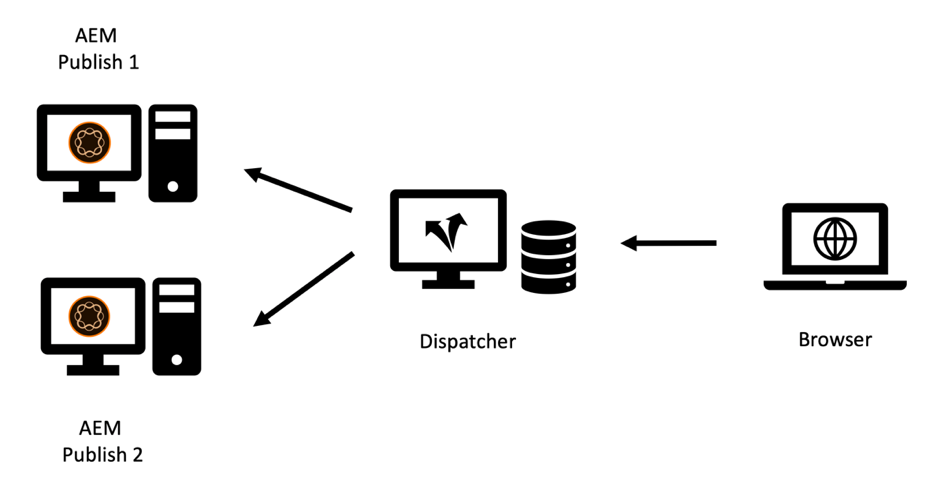
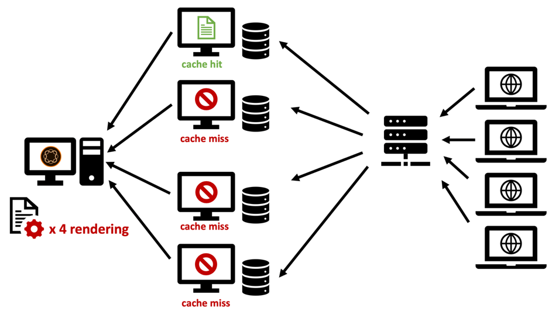

# Kapitel 2 - Infrastruktur

## Konfigurera en cacheinfrastruktur

Vi introducerade den grundläggande topologin i ett publiceringssystem och en dispatcher i kapitel 1 i den här serien. En uppsättning Publish- och Dispatcher-servrar kan konfigureras i många olika variationer, beroende på förväntad belastning, topologin för ditt datacenter och önskade failover-egenskaper.

Vi ska skissa de vanligaste topologierna och beskriva fördelarna och var de håller på att ta slut. Listan - naturligtvis - kan aldrig vara heltäckande. Den enda gränsen är din fantasi.

### &quot;Äldre&quot; inställningar

På den tidiga tiden var antalet potentiella besökare litet, maskinvaran var dyr och webbservrarna ansågs inte vara lika affärskritiska som idag. En vanlig inställning var att ha en Dispatcher som fungerar som belastningsutjämnare och cache framför två eller flera publiceringssystem. Apache-servern i kärnan av Dispatcher var mycket stabil och - i de flesta fall - tillräcklig för att tillgodose en rimlig mängd begäranden.

*&quot;Legacy&quot; Dispatcher Setup - Not very common by today&#39;s standards*

  

Det var här som dispatchern fick sitt namn från: Den skickade i stort sett begäranden. Den här konfigurationen är inte särskilt vanlig längre eftersom den inte kan uppfylla de högre krav på prestanda och stabilitet som krävs idag.

### Multi-Legged-konfiguration

Idag är en något annorlunda topologi vanligare. En topologi med flera ben har en Dispatcher per publiceringsserver. En dedikerad (maskinvarubaserad) belastningsutjämnare placeras framför den AEM infrastrukturen som skickar förfrågningarna till dessa två (eller flera) ben:

*Modern&quot;Standard&quot; Dispatcher - enkel att hantera och underhålla*

  

Här är skälen till den här typen av konfiguration,

1. Webbplatser betjänar i genomsnitt mycket mer trafik än tidigare. Därför finns det ett behov av att skala upp &quot;Apache-infrastrukturen&quot;.

2. &quot;Äldre&quot; inställningar gav ingen redundans på Dispatcher-nivån. Om Apache Server kraschade gick det inte att nå hela webbplatsen.

3. Apache-servrar är billiga. De baseras på öppen källkod och eftersom du har ett virtuellt datacenter kan de etableras mycket snabbt.

4. Den här konfigurationen är ett enkelt sätt att skapa ett&quot;rullande&quot; eller&quot;staggerat&quot; uppdateringsscenario. Du stänger bara av Dispatcher 1 medan du installerar ett nytt programpaket på Publish 1. När installationen är klar, och du har tillräckligt röktestat Publish 1 från det interna nätverket, rensar du cacheminnet på Dispatcher 1 och startar det igen samtidigt som du stänger Dispatcher 2 för att underhålla Publish 2.

5. Cacheogiltigförklaring blir mycket enkelt och deterministiskt i den här konfigurationen. Eftersom endast ett publiceringssystem är anslutet till en Dispatcher finns det bara en Dispatcher som ska göras ogiltig. Ordningen och tidpunkten för ogiltigförklaringen är avgörande.

### Inställningen &quot;Skala ut&quot;

Apache-servrar är billiga och enkla att tillhandahålla, och du bör inte skjuta ut den nivån lite till. Varför inte ha två eller flera utskickare framför varje publiceringsserver?

*Utskalningsinställningar - Har vissa programområden men även begränsningar och kavaats*

  

Det kan du absolut göra! Och det finns många giltiga programscenarier för den konfigurationen. Men det finns också vissa begränsningar och problem som du bör tänka på.

#### Invalidering

Varje publiceringssystem är anslutet till en mängd olika utskicksare, och vart och ett måste ogiltigförklaras när innehållet har ändrats.

#### Underhåll

Det är självklart att den ursprungliga konfigurationen av Dispatcher- och Publish-systemen är lite mer komplex. Men tänk också på att arbetet med en&quot;rullande&quot; release också är lite högre. AEM system kan och måste uppdateras medan de körs. Men det är klokt att inte göra det medan de aktivt betjänar förfrågningar. Vanligtvis vill du bara uppdatera en del av publiceringssystemen - medan de andra fortfarande betjänar trafik och sedan - efter testningen - växla till den andra delen. Om du har tur och har åtkomst till belastningsutjämnaren i din distributionsprocess kan du inaktivera routningen till servrarna under underhåll här. Om du använder en delad belastningsutjämnare utan direktåtkomst vill du helst stänga utskickarna för den publicering som du vill uppdatera. Ju mer det finns, desto mer måste du stänga av. Om det finns ett stort antal uppdateringar som du planerar ofta, rekommenderas viss automatisering. Om du inte har automatiseringsverktyg är det ändå en dålig idé att skala ut.

I ett tidigare projekt använde vi ett annat trick för att ta bort ett publiceringssystem från belastningsutjämningen utan att ha direkt åtkomst till själva belastningsutjämnaren.

Belastningsutjämnaren brukar vara &quot;pings&quot;, en viss sida för att se om servern är igång och körs. Ett enkelt val är vanligtvis att pinga hemsidan. Men om du vill använda ping för att signalera att belastningsutjämnaren inte ska balansera trafiken så väljer du något annat. Du skapar en dedikerad mall eller server som kan konfigureras att svara med `"up"` eller `"down"` (i texten eller som http-svarskod). Svaret på den sidan får förstås inte cachas i dispatchern, så den hämtas alltid från publiceringssystemet. Om du nu konfigurerar belastningsutjämnaren för att kontrollera den här mallen eller servern kan du enkelt låta Publicera&quot;låtsas&quot; den vara nedtryckt. Den skulle inte ingå i lastbalanseringen och kan uppdateras.

#### Worldwide Distribution

&quot;Worldwide Distribution&quot; är en&quot;Scale out&quot;-konfiguration där du har flera utskicksare framför varje publiceringssystem - som nu distribueras över hela världen för att vara närmare kunden och ge bättre prestanda. I det scenariot har du förstås ingen central belastningsutjämnare, utan ett DNS- och geo-IP-baserat belastningsutjämningsschema.

>[!NOTE]
>
>Egentligen bygger du upp ett nätverk för innehållsdistribution (CDN) på det sättet, så du bör överväga att köpa en färdig CDN-lösning istället för att bygga en själv. Att bygga och underhålla ett anpassat CDN är ingen enkel uppgift.

#### Vågrät skalförändring

Till och med i ett lokalt datacenter har en&quot;Scale Out&quot;-topologi med flera utskicksare framför varje publiceringssystem vissa fördelar. Om du ser prestandamässiga flaskhalsar på Apache-servrarna på grund av hög trafik (och en bra cache-träfffrekvens) och du inte längre kan skala upp maskinvaran (genom att lägga till processorer, RAM och snabbare diskar) kan du öka prestandan genom att lägga till Dispatcher. Detta kallas för&quot;vågrät skalförändring&quot;. Detta har dock begränsningar - särskilt när du ofta gör trafik ogiltig. Vi kommer att beskriva effekten i nästa avsnitt.

#### Gränser för utskalningstopologin

Om du lägger till proxyservrar bör prestandan normalt öka. Det finns dock scenarier där du faktiskt kan minska prestandan genom att lägga till servrar. Hur? Tänk dig att du har en nyhetsportal där du kan presentera nya artiklar och sidor varje minut. En Dispatcher blir ogiltig genom&quot;automatisk ogiltigförklaring&quot;: När en sida publiceras blir alla sidor i cachen på samma webbplats ogiltiga. Det här är en användbar funktion - vi gick igenom det här i [Kapitel 1](chapter-1.md) av den här serien - men det innebär också att när du ofta har gjort ändringar på webbplatsen blir cachen ofta ogiltig. Om du bara har en Dispatcher per Publish-instans aktiverar den första besökaren som begär en sida en cachelagring av den sidan. Den andra besökaren hämtar redan den cachelagrade versionen.

Om du har två utskickare har den andra besökaren 50 % chans att sidan inte cachelagras, och då får han en större fördröjning när sidan återges igen. Med ännu fler utskickare per publicering blir allt värre. Vad som händer är att publiceringsservern får mer belastning eftersom den måste återge sidan för varje Dispatcher separat.

*Minskade prestanda i ett utskalningsscenario med täta cachetömningar.*

  

#### Åtgärda problem med överskalning

Du kan överväga att använda en central delad lagring för alla utskickare eller synkronisera filsystemen för Apache-servrarna för att minska problemen. Vi kan bara ge begränsad förstahandsupplevelse, men vi kan vara förberedda på att detta leder till systemets komplexitet och kan ge en helt ny typ av fel.

Vi har experimenterat med NFS - men NFS introducerar stora prestandaproblem på grund av innehållslåsning. Detta minskade faktiskt den totala prestandan.

**Slutsats** - Att dela ett gemensamt filsystem mellan flera utskickare rekommenderas INTE.

Om du har problem med prestandan kan du skala upp Publish och Dispatcher lika för att undvika belastningen på Publisher-instanserna. Det finns ingen gyllene regel om förhållandet mellan publicering och utskick - den beror i hög grad på hur förfrågningarna distribueras och hur ofta publikationer och cacheminnet blir ogiltiga.

Om du också är orolig för den fördröjning en besökare upplever kan du använda ett leveransnätverk, cachelagra omhämtning, förebyggande cachevärmare, ange en respittid enligt beskrivningen i [Kapitel 1](chapter-1.md) i den här serien eller hänvisa till några avancerade idéer i [Del 3](chapter-3.md).

### Konfiguration av &quot;Cross Connected&quot;

En annan inställning som vi har sett tidigare och sedan är den&quot;korsanslutna&quot; konfigurationen: Publiceringsinstanserna har inte dedikerade utskickare, men alla utskickare är anslutna till alla publiceringssystem.

  

*Kopplad topologi: ökad redundans och mer komplexitet.*

I första hand ger detta lite mer redundans för en relativt liten budget. När en av Apache-servrarna är nere kan du fortfarande ha två Publish-system som utför återgivningen. Om ett av publiceringssystemen kraschar har du fortfarande två utskickare som hanterar den cachelagrade inläsningen.

Men det här kostar.

För det första är det ganska krångligt att ta ut ett ben för underhåll. Det är faktiskt det här programmet är avsett för: att vara mer flexibel och hålla sig igång på alla tänkbara sätt. Vi har sett komplicerade underhållsplaner för hur detta ska hanteras. Konfigurera först om Dispatcher 2 och ta bort korsanslutningen. Startar om Dispatcher 2. Stänger av Dispatcher 1, uppdaterar Publish 1, ... och så vidare. Du bör tänka noga på om det skalar upp till mer än två ben. Slutsatsen blir att det faktiskt ökar komplexiteten, kostnaderna och är en fantastisk källa till mänskliga misstag. Det är bäst att automatisera detta. Så kolla om du har de mänskliga resurserna som behövs för att ta med automatiseringsuppgifterna i projektschemat. Även om du kan spara på maskinvarukostnaderna med detta kan du spendera dubbelt så mycket på IT-personalen.

För det andra kanske du kör ett användarprogram på AEM som kräver inloggning. Du använder klibbiga sessioner för att se till att en användare alltid hanteras från samma AEM så att du kan behålla sessionsläget för den instansen. Med den här korsanslutna konfigurationen måste du se till att klisterlappande sessioner fungerar korrekt på belastningsutjämnaren och på utskickarna. Det är inte omöjligt - men du måste vara medveten om det och lägga till extra konfigurations- och testtimmar, vilket - återigen - kan jämna ut de besparingar du planerat genom att spara maskinvara.

### Slutsats

Vi rekommenderar inte att du använder det här anslutningsschemat som standardalternativ. Om du däremot bestämmer dig för att använda programmet bör du noggrant bedöma riskerna och de dolda kostnaderna och planera för att inkludera automatiserad konfiguration i ditt projekt.

## Nästa steg

* [3 - Avancerade Caching-ämnen](chapter-3.md)
