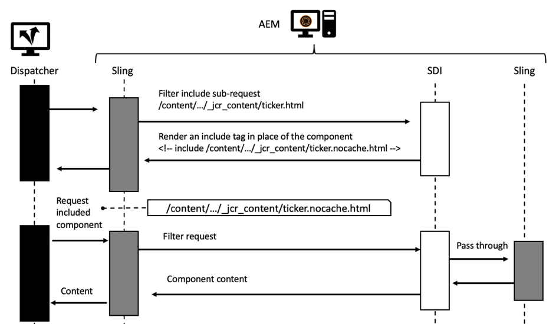

# Kapitel 3 - Avancerade cachelagringsämnen

*&quot;Det finns bara två svåra saker i datavetenskap: cacheogiltigförklaring och namngivning.&quot;*

- PHIL KARLTON

## Ökning

Detta är del 3 av en tredelad serie som cachelagras i AEM. Där de två första delarna fokuserade på vanlig http-cachning i Dispatcher och vilka begränsningar det finns. Här diskuteras några idéer om hur man övervinner dessa begränsningar.

## Cachelagring i allmänhet

[Kapitel 1](chapter-1.md) och [Kapitel 2](chapter-2.md) i den här serien är huvudsakligen inriktade på Dispatcher. Vi har förklarat grunderna, begränsningarna och var ni behöver göra vissa kompromisser.

Cachelagringen av komplexitet och krånglighet är inte något problem som är unikt för Dispatcher. Cachelagring är i allmänhet svår.

Att ha Dispatcher som det enda verktyget i verktygslådan är faktiskt en verklig begränsning.

I det här kapitlet vill vi bredda vår syn på cachelagring ytterligare och utveckla några idéer om hur du kan övervinna några av Dispatcher brister. Det finns ingen silverkula - du måste göra affärer i ditt projekt. Kom ihåg att när det gäller cachning och invalideringskvalitet kommer alltid komplex, och med komplexitet kommer risken för fel.

Du måste göra kompromisser inom dessa områden,

* Prestanda och fördröjning
* Resursförbrukning/CPU-belastning/diskanvändning
* Noggrannhet/valuta/aktualitet/säkerhet
* Enkelhet/komplexitet/kostnad/underhållbarhet/Feltydlighet

De här dimensionerna är sammanlänkade i ett relativt komplext system. Det finns ingen enkel if-this-then-that. Ett enklare system kan göra det snabbare eller långsammare. Det kan sänka utvecklingskostnaderna, men öka kostnaderna för helpdesk, t.ex. om kunderna ser gammalt innehåll eller klagar på en långsam webbplats. Alla dessa faktorer måste beaktas och vägas mot varandra. Men nu bör du redan ha en bra idé, att det inte finns någon silverkula eller en enda bästa metod - bara en massa dåliga rutiner och några bra.

## Målad cachelagring

### Ökning

#### Dataflöde

När du levererar en sida från en server till en kunds webbläsare går det över en mängd olika system och undersystem. Om du tittar noga kan det finnas ett antal humledata som behöver tas från källan till dräneringen, som var och en är en potentiell kandidat för cachelagring.


*Dataflöde för ett typiskt CMS-program*

<br> 

Låt oss påbörja vår resa med en bit data som sitter på en hårddisk och som måste visas i en webbläsare.

#### Maskinvara och operativsystem

För det första har själva hårddisken viss inbyggd cache i maskinvaran. För det andra använder operativsystemet som monterar hårddisken ledigt minne för att cachelagra block som används ofta för att påskynda åtkomsten.

#### Innehållsdatabas

Nästa nivå är CRX eller Oak - dokumentdatabasen som används av AEM. CRX och Oak delar in data i segment som kan cachas i minnet och undviker att åtkomsten till hårddisken blir långsammare.

#### Tredjepartsdata

De flesta större webbinstallationer har även data från tredje part; data från ett produktinformationssystem, ett kundrelationshanteringssystem, en äldre databas eller någon annan godtycklig webbtjänst. Dessa data behöver inte hämtas från källan när de behövs - särskilt inte när det är känt att de ändras inte så ofta. Den kan alltså cachelagras om den inte är synkroniserad i CRX-databasen.

#### Business Layer - App/Model

Vanligtvis återges inte Raw-innehåll som kommer från CRX via JCR-API:t av mallskript. Det troligaste är att du har ett affärslager däremellan som sammanfogar, beräknar och/eller omformar data i ett affärsdomänsobjekt. Gissa vad - om de här åtgärderna är dyra bör du överväga att cachelagra dem.

#### Markeringsfragment

Modellen är nu basen för återgivningen av koden för en komponent. Varför inte cachelagra den återgivna modellen också?

#### Dispatcher, CDN och andra proxy

Av går den renderade HTML-sidan till Dispatcher. Vi har redan diskuterat att huvudsyftet med Dispatcher är att cacha HTML sidor och andra webbresurser (trots dess namn). Innan resurserna når webbläsaren kan en omvänd proxy skickas - som kan cachelagras och ett CDN - som också används för cachelagring. Klienten kan sitta på ett kontor som endast ger webbåtkomst via en proxy - och den proxyn kan bestämma sig för att cache-lagra och spara trafik.

#### Webbläsarcache

Sist men inte minst - webbläsaren cachelagras också. Det här är en enkel förbisedd resurs. Men det är den närmaste och snabbaste cacheminnet du har i cachningskedjan. Tyvärr delas den inte mellan användare, utan fortfarande mellan olika förfrågningar från en användare.

### Var cache ska användas och varför

Det är en lång kedja av potentiella cacher. Och vi har alla haft problem där vi har sett föråldrat innehåll. Men med tanke på hur många steg det finns är det ett mirakel att det mesta av tiden som det fungerar över huvud taget.

Men var i den kedjan är det vettigt att cachelagra över huvud taget? I början? I slutet? Överallt? Det beror på.. och det beror på ett stort antal faktorer. Även två resurser på samma webbplats kanske vill ha ett annat svar på den frågan.

För att ge dig en ungefärlig uppfattning om vilka faktorer du kan tänka dig,

**Dags att leva** - Om objekt har en kort inbyggd livstid (trafikdata kan ha kortare livstid än väderdata) kanske det inte är värt att cachelagra.

**Produktionskostnad -** Hur dyrt (i termer av processorcykler och I/O) är återproduktion och leverans av ett objekt. Om det är billig cachelagring kanske inte behövs.

**Storlek** - Stora objekt kräver fler resurser för att cachelagras. Detta kan vara en begränsande faktor och måste vägas mot nyttan.

**Åtkomstfrekvens** - Om objekt används sällan kanske cachelagring inte fungerar. De blir helt enkelt inaktuella eller ogiltigförklarade innan de får åtkomst till andra gången från cachen. Sådana objekt skulle bara blockera minnesresurser.

**Delad åtkomst** - Data som används av mer än en entitet ska cachelagras ytterligare i kedjan. Egentligen är cachelagringskedjan inte en kedja, utan ett träd. En datadel i databasen kan användas av mer än en modell. Dessa modeller kan i sin tur användas av mer än ett återgivningsskript för att generera fragment i HTML. Dessa fragment finns på flera sidor som distribueras till flera användare med sina privata cacheminnen i webbläsaren. &quot;Delning&quot; innebär alltså inte att man bara delar mellan människor, utan snarare mellan programdelar. Om du vill hitta ett eventuellt delat cacheminne kan du bara spola tillbaka trädet till roten och hitta ett vanligt överordnat objekt - det är där du bör cache-lagra.

**Geospatial distribution** - Om dina användare distribueras över hela världen kan fördröjningen minskas om du använder ett distribuerat nätverk av cacher.

**Nätverksbandbredd och fördröjning** - På tal om latens, vilka är dina kunder och vilken typ av nätverk använder de? Kunderna kanske är mobilkunder i ett underutvecklat land som använder 3G-uppkoppling från äldre smarttelefoner? Du kan skapa mindre objekt och cachelagra dem i webbläsarens cacheminne.

Den här listan är inte heltäckande, men vi tror att du har fått idén vid det här laget.

### Grundregler för kedjad cachelagring

Igen - cachelagring är svår. Låt oss dela några grundregler som vi har extraherat från tidigare projekt som kan hjälpa dig att undvika problem i ditt projekt.

#### Undvik dubbel cachelagring

Var och en av lagren som introducerades i det sista kapitlet innehåller ett visst värde i cachelagringskedjan. Antingen genom att spara datorcykler eller genom att föra data närmare konsumenten. Det är inte fel att cachelagra data i flera steg i kedjan - men du bör alltid tänka på vilka fördelar och kostnader nästa steg innebär. Att cachelagra en hel sida i Publish-systemet ger vanligtvis ingen fördel, vilket redan är fallet i Dispatcher.

#### Blanda invalideringsstrategier

Det finns tre grundläggande strategier för ogiltigförklaring:

* **TTL, Live-tid:** Ett objekt förfaller efter en fast tidsperiod (t.ex. &quot;2 timmar från nu&quot;)
* **Förfallodatum:** Objektet förfaller vid en definierad tidpunkt i framtiden (t.ex. &quot;10 juni 2019 kl. 5:00)
* **Händelsebaserad:** Objektet ogiltigförklaras uttryckligen av en händelse som inträffar på plattformen (t.ex. när en sida ändras och aktiveras)

Nu kan du använda olika strategier på olika cachelager, men det finns några &quot;giftiga&quot; lager.

#### Händelsebaserad invalidering


*Ren händelsebaserad ogiltigförklaring: Ogiltigförklara från den inre cachen till det yttre lagret*

<br> 

Ren händelsebaserad ogiltigförklaring är den enklaste att förstå, enklaste att få den teoretiskt rätta och den mest korrekta.

Kort och gott: cacherna blir ogiltiga en i taget efter att objektet har ändrats.

Du behöver bara tänka på en regel:

Gör alltid cacheminnet ogiltigt från insidan till utsidan. Om du först ogiltigförklarade ett yttre cacheminne kan det cachelagra om inaktuellt innehåll från ett internt. Gör inga antaganden vid vilken tidpunkt ett cacheminne är nytt - kontrollera det. Bäst, genom att aktivera ogiltigförklaringen av den yttre cachen _när_ har gjort den inre ogiltig.

Det är teorin. Men i praktiken finns det ett antal gotchas. Händelserna måste distribueras - eventuellt via ett nätverk. I praktiken är detta det svåraste sättet att införa invalideringssystemet.

#### Auto - Lagning

Med händelsebaserad ogiltigförklaring bör ni ha en beredskapsplan. Vad händer om en invalideringshändelse missas? En enkel strategi kan vara att ogiltigförklara eller tömma efter en viss tid. Så du kanske missade den händelsen och nu kan du leverera gammalt innehåll. Men objekten har också en implicit TTL på flera timmar (dagar). Så till slut lagas systemet automatiskt.

#### Ren TTL-baserad ogiltigförklaring


*Osynkroniserad TTL-baserad ogiltigförklaring*

<br> 

Det är också ett mycket vanligt system. Du staplar flera lager med cacheminnen, där var och en har rätt att hantera ett objekt under en viss tid.

Det är lätt att implementera. Tyvärr är det svårt att förutsäga den effektiva livslängden för en datadel.


*Yttre cache som förlänger ett inre objekts livslängd*

<br> 

Titta på bilden ovan. Varje cachningslager har en TTL på 2 min. Den totala TTL-nivån måste också vara 2 min. Inte riktigt. Om det yttre lagret hämtar objektet precis innan det blir inaktuellt förlängs faktiskt objektets faktiska aktiva tid. I så fall kan den faktiska livstiden vara mellan 2 och 4 minuter. Tänk på att du höll med din företagsavdelning om att en dag är tolererbar - och att du har fyra lager cacher. Den faktiska TTL-värdet i varje lager får inte vara längre än sex timmar... vilket ökar cacheminnets felfrekvens..

Vi säger inte att det är ett dåligt system. Du borde bara veta dess begränsningar. Och det är en trevlig och enkel strategi att börja med. Det är bara om trafiken på din webbplats ökar som du kan tänka dig en mer korrekt strategi.

*Synkroniserar invalideringstid genom att ange ett specifikt datum*

#### Förfallodatumbaserad invalidering

Du får en mer förutsägbar effektiv livstid om du anger ett specifikt datum på det inre objektet och sprider det till de yttre cacherna.


*Synkroniserar förfallodatum*

<br> 

Alla cacheminnen kan dock inte sprida datumen. Och det kan bli otrevligt när den yttre cachen sammanställer två inre objekt med olika förfallodatum.

#### Blandning av händelsebaserad och TTL-baserad ogiltigförklaring


*Blanda händelsebaserade och TTL-baserade strategier*

<br> 

Ett vanligt schema i AEM är också att använda händelsebaserad ogiltigförklaring vid de inre cacheminnen (t.ex. cacheminnen där händelser kan bearbetas i nära realtid) och TTL-baserade cacheminnen utanför - där du kanske inte har tillgång till explicit ogiltigförklaring.

I AEM skulle du ha ett cache-minne för affärsobjekt och fragment i HTML i Publish-systemen, som ogiltigförklaras när de underliggande resurserna ändras och du sprider den här ändringshändelsen till dispatchern som också arbetar händelsebaserat. Därför måste du till exempel ha ett TTL-baserat CDN.

Om du har ett lager (kort) TTL-baserad cachelagring framför en Dispatcher kan du effektivt mjuka upp en tagg som vanligtvis inträffar efter en automatisk ogiltigförklaring.

#### Blandning av TTL - och händelsebaserad invalidering


*Toxic: Blandar TTL - och händelsebaserad invalidering*

<br> 

Denna kombination är giftig. Montera aldrig och händelsebaserad cache efter en TTL- eller förfallobaserad cachelagring. Kommer du ihåg den spridningseffekt som vi hade i strategin med&quot;ren TTL&quot;? Samma effekt kan ses här. Det är bara för att invalideringshändelsen för det yttre cacheminnet redan har inträffat som kanske inte inträffar igen - någonsin kan detta göra det cachelagrade objektets livslängd oändlig.


*TTL-baserad och händelsebaserad kombination: Spill-over to infinity*

<br> 

## Delvis cachelagring och cachelagring i minnet

Du kan ansluta till scenen i återgivningsprocessen för att lägga till cachelagringslager. Från att hämta dataöverföringsobjekt på fjärrbasis eller skapa lokala affärsobjekt till att cachelagra den återgivna koden för en enskild komponent. Vi lämnar konkreta implementeringar till en senare självstudiekurs. Men du kanske redan har implementerat några av dessa cachelagringslager. Så det minsta vi kan göra här är att introducera de grundläggande principerna - och gotchas.

### Varningsord

#### Respect Access Control

Teknikerna som beskrivs här är mycket kraftfulla och _måste-ha_ i varje AEM verktygslåda. Men bli inte för ivrig, använd dem klokt. Genom att lagra ett objekt i ett cacheminne och dela det med andra användare i uppföljningsbegäranden innebär det i själva verket att åtkomstkontrollen kringgås. Det är vanligtvis inte något problem på offentliga webbplatser, men det kan vara det när en användare måste logga in innan han eller hon kan få åtkomst.

Tänk på att du lagrar HTML-koden för en webbplats på huvudmenyn i ett cacheminne för att dela den mellan olika sidor. Det är faktiskt ett perfekt exempel på hur man lagrar delvis återgivna HTML som att skapa en navigering är ofta dyrt eftersom det kräver att man går igenom många sidor.

Du delar inte samma menystruktur mellan alla sidor utan också med alla användare, vilket gör den ännu effektivare. Men vänta ... men det kanske finns några alternativ på menyn som bara är reserverade för en viss grupp användare. I så fall kan cachelagring bli lite mer komplicerad.

#### Cachelagra endast anpassade affärsobjekt

Om det finns något - det är det viktigaste råd vi kan ge dig:

>[!WARNING]
>
>Endast cacheobjekt som är dina, som är oföränderliga, som du själv har skapat, som är ytliga och som inte har någon utgående referens.

Vad betyder det?

1. Du vet inte om den tänkta livscykeln för andra människors objekt. Tänk på att du får en referens till ett begäranobjekt och bestämmer dig för att cachelagra det. Nu är begäran över och serverletsbehållaren vill återvinna objektet för nästa inkommande begäran. I så fall ändrar någon annan innehållet som du trodde att du hade exklusiv kontroll över. Missa inte det - vi har sett något liknande hända i ett projekt. Kunden såg andra kunddata istället för sina egna.

2. Så länge ett objekt refereras av en kedja med andra referenser kan det inte tas bort från heap-objektet. Om du har kvar ett så smått objekt i cacheminnet som refererar till, kan du till exempel få en 4 MB-representation av en bild som du har en bra chans att få problem med att läcka minne. Cacheminnen ska baseras på svaga referenser. Men - svaga referenser fungerar inte som du kan förvänta dig. Det är det absolut bästa sättet att skapa en minnesläcka och sluta med ett minnesfel. Och du vet inte hur stort det kvarvarande minnet av de främmande objekten är, eller hur?

3. I synnerhet i Sling kan du anpassa (nästan) alla objekt efter varandra. Överväg att placera en resurs i cachen. Nästa begäran (med olika åtkomsträttigheter) hämtar den resursen och anpassar den till en resourceResolver eller en session för att komma åt andra resurser som han eller hon inte skulle ha åtkomst till.

4. Även om du skapar en tunn wrapper runt en resurs från AEM får du inte cachelagra den - även om den är din egen och oföränderlig. Det figursatta objektet är en referens (vilket vi förbjuder tidigare) och om vi ser skarpa ut skapas i princip samma problem som beskrivs i det sista objektet.

5. Om du vill cache-lagra kan du skapa egna objekt genom att kopiera primitiva data till dina egna shallo-objekt. Du kanske vill länka mellan dina egna objekt med hjälp av referenser, t.ex. kanske du vill cacha ett träd med objekt. Det är bra - men bara cacheobjekt som du just har skapat i samma begäran - och inga objekt som har begärts någon annanstans (även om det är objektets namnutrymme). _Kopiera objekt_ är nyckeln. Och se till att rensa hela strukturen med länkade objekt samtidigt och undvika inkommande och utgående referenser till strukturen.

6. Ja - och se till att objekten inte kan ändras. Privata egenskaper, endast och inga set-metoder.

Det är många regler, men det är värt att följa dem. Även om du är erfaren och supersmart och har allt under kontroll. Den unga kollegan i ditt projekt har just tagit examen vid universitet. Han känner inte till alla dessa fallgropar. Om det inte finns några fallgropar, finns det inget att undvika. Gör det enkelt och begripligt.

### Verktyg och bibliotek

Den här serien handlar om att förstå koncept och ge dig möjlighet att skapa en arkitektur som bäst passar ditt användningssätt.

Vi marknadsför inte något särskilt verktyg. Men ge er tips om hur ni kan utvärdera dem. AEM har till exempel en enkel inbyggd cache med en fast TTL sedan version 6.0. Ska du använda den? Troligen inte vid publicering där en händelsebaserad cache följer i kedjan (tips: Dispatcher). Men det kan vara ett bra val för en författare. Det finns också ett HTTP-cacheminne av Adobe ACS-kommandon som kan vara värt att överväga.

Eller så skapar du en egen, baserad på ett moget cachelagringsramverk som [Ehcache](https://www.ehcache.org). Detta kan användas för att cachelagra Java-objekt och återgivna markeringar (`String` objekt).

I vissa enkla fall kanske du också är med på att använda samtidiga hash-kartor - här ser du snabbt gränser - antingen i verktyget eller i dina kunskaper. Samtidighet är lika svårt att hantera som namngivning och cachelagring.

#### Referenser

* [ACS-kommandon http-cache](https://adobe-consulting-services.github.io/acs-aem-commons/features/http-cache/index.html)
* [Cache-cachelagringsramverket](https://www.ehcache.org)

### Grundläggande villkor

Vi kommer inte att gå in i cachelagringsteorin för djupt här, men vi känner oss tvungna att ge några ord så att du får en bra början.

#### Cacheavlägsnande

Vi pratade mycket om invalidering och rening. _Cacheavlägsnandet_ är relaterat till dessa termer: Efter en post som avlägsnas är den inte längre tillgänglig. Men vradering sker inte när en post är inaktuell, utan när cachen är full. Nyare eller&quot;viktigare&quot; objekt flyttar äldre eller mindre viktiga objekt ut ur cachen. De tävlingsbidrag du måste offra är ett beslut från fall till fall. Du kanske vill avlägsna de äldsta eller de som har använts mycket sällan eller sist.

#### Preemptive caching

Preemptive Caching betyder att posten återskapas med nytt innehåll i det ögonblick den ogiltigförklaras eller betraktas som inaktuell. Det gör du bara med några resurser, som du är säker på att du kommer åt ofta och omedelbart. Annars skulle du förlora resurser när du skapar cacheposter som kanske aldrig efterfrågas. Genom att skapa cacheposter i förväg kan du minska fördröjningen för den första begäran till en resurs efter cacheogiltigförklaring.

#### Cachevärmare

Cacheuppvärmningen är nära förknippad med förebyggande cachning. Men du skulle inte använda den termen för ett livesystem. Och det är mindre tidsbegränsat än det första. Du cachelagrar inte omedelbart efter ogiltigförklaring, men du fyller så småningom i cacheminnet när tiden är inne.

Du kan till exempel ta ut ett Publish-/Dispatcher-ben från belastningsutjämnaren för att uppdatera det. Innan du integrerar om den crawlar du automatiskt de mest använda sidorna så att de kommer in i cachen igen. När cacheminnet är &quot;varmt&quot; - tillräckligt fyllt integrerar du benet på nytt i belastningsutjämnaren.

Eller så integrerar du benet på en gång, men du stryper trafiken till benet så att det har en chans att värma upp det genom vanlig användning.

Eller så kanske du också vill cachelagra vissa sidor som du inte har så många gånger om datorn är inaktiv för att minska fördröjningen när de faktiskt nås av verkliga begäranden.

#### Cacheobjektets identitet, nyttolast, invalideringsberoende och TTL

Ett cachelagrat objekt eller en post har i allmänhet fem större egenskaper,

#### Nyckel

Detta är identiteten som är den egenskap som du identifierar och objektet med. Antingen för att hämta dess nyttolast eller för att tömma den från cachen. Avsändaren använder till exempel URL:en för en sida som nyckel. Observera att dispatchern inte använder sidsökvägarna. Detta räcker inte för att skilja olika återgivningar åt. Andra cacheminnen kan använda olika nycklar. Vi kommer att se några exempel senare.

#### Värde/nyttolast

Det är objektets skattepass, de data som du vill hämta. När det gäller dispatchern är det filinnehållet. Men det kan också vara ett Java-objektträd.

#### TTL

Vi täckte TTL redan. Den tid efter vilken ett tävlingsbidrag anses vara inaktuellt och inte längre ska levereras.

#### Beroende

Detta gäller händelsebaserad ogiltigförklaring. Vilka ursprungliga data är det objektet beroende av? I del I sade vi redan att en sann och korrekt beroendespårning är alltför komplicerad. Men med våra kunskaper om systemet kan ni approximera beroendena med en enklare modell. Vi gör tillräckligt många objekt ogiltiga för att rensa inaktuellt innehåll.. och kanske av misstag mer än vad som krävs. Men ändå försöker vi hålla oss under&quot;rensa allt&quot;.

Vilka objekt som är beroende av vilka andra som är äkta i respektive program. Vi kommer att ge er några exempel på hur ni kan implementera en beroendestrategi senare.

### Cachelagring av fragment för HTML


*Återanvänder ett återgivet fragment på olika sidor*

<br> 

HTML Fragment Caching är ett kraftfullt verktyg. Tanken är att cachelagra den HTML-kod som har genererats av en komponent i ett cacheminne. Du kan fråga, varför ska jag göra det? Jag cachelagrar hela sidans kod i dispatchern ändå - inklusive den komponentens kod. Vi är överens. Det gör du - men en gång per sida. Du delar inte den markeringen mellan sidorna.

Tänk dig att du återger en navigering ovanpå varje sida. Markeringen ser likadan ut på varje sida. Men du återger det om och om igen för varje sida, det vill säga inte i Dispatcher. Och kom ihåg: Efter automatisk ogiltigförklaring måste alla sidor återges på nytt. Du kör alltså samma kod med samma resultat hundratals gånger.

Enligt vår erfarenhet är det en väldigt dyr uppgift att återge en kapslad toppnavigering. Vanligtvis går du igenom en bra del av dokumentträdet för att generera navigeringsobjekten. Även om du bara behöver navigeringsrubriken och URL-adressen måste sidorna läsas in i minnet. Och här klär de värdefulla resurser. Om och om igen.

Men komponenten delas mellan många sidor. Och att dela något är en indikation på att man använder en cache. Så vad du vill göra är att kontrollera om navigeringskomponenten redan har renderats och cachelagrats, och istället för att rendera om genererar du bara cachevärdet.

Det finns två underbara förekomster av detta system som lätt kan missas:

1. Du cachelagrar en Java-sträng. En sträng har inga utgående referenser och kan inte ändras. Med tanke på varningarna ovan är det här supersäkert.

2. Det är också superenkelt att validera. När något ändras på webbplatsen vill du göra den här cacheposten ogiltig. Återskapande är relativt billigt eftersom det bara behöver utföras en gång och sedan återanvänds av alla hundratals sidor.

Detta är en stor lättnad för dina Publish-servrar.

### Implementering av fragmentcache

#### Egna taggar

På den gamla tiden, där du använde JSP som mallmotor, var det ganska vanligt att använda en anpassad JSP-taggomslutning runt komponentåtergivningskoden.

```
<!-- Pseudo Code -->

<myapp:cache
  key=' ${info.homePagePath} + ${component.path}'
  cache='main-navigation'
  dependency='${info.homePagePath}'>

… original components code ..

</myapp:cache>
```

Den anpassade taggen än skulle hämta dess brödtext och skriva den i cachen eller förhindra körning av brödtexten och i stället mata ut cache-postens nyttolast.

Nyckeln är komponentsökvägen som den skulle ha på hemsidan. Vi använder inte komponentens sökväg på den aktuella sidan eftersom det skulle skapa en cachepost per sida, vilket skulle strida mot vår avsikt att dela den komponenten. Vi använder inte heller bara komponenternas relativa sökväg (`jcr:conten/mainnavigation`) eftersom det skulle hindra oss från att använda olika navigeringskomponenter på olika platser.

&quot;Cache&quot; är en indikator där posten ska lagras. Du har vanligtvis mer än en cache där du lagrar objekt. Var och en av dem kan bete sig lite annorlunda. Så det är bra att skilja ut det som lagras - även om det i slutänden bara är strängar.

&quot;Beroende&quot; är det här cacheposten är beroende av. Cacheminnet för huvudnavigering kan ha en regel som innebär att om det finns någon ändring under noden &quot;beroende&quot; måste posten rensas. Därför måste cacheimplementeringen registreras som en händelseavlyssnare i databasen för att vara medveten om ändringar och sedan tillämpa de cachespecifika reglerna för att ta reda på vad som behöver göras ogiltigt.

Ovanstående var bara ett exempel. Du kan också välja att ha ett träd med cacher. När den första nivån används för att skilja ut webbplatser (eller klientorganisationer) och den andra nivån, delas sedan ut i olika typer av innehåll (till exempel&quot;huvudnavigering&quot;), vilket kan göra att du inte behöver lägga till sökvägen för hemsidor som i exemplet ovan.

Förresten - du kan också använda den här metoden med mer moderna HTML-baserade komponenter. Du skulle då ha en JSP-wrapper runt ditt HTML-skript.

#### Komponentfilter

Men i ett rent HTML-tillvägagångssätt vill du hellre bygga fragmentcachen med ett Sling-komponentfilter. Vi har inte sett det här i naturen än, men det är den strategi vi skulle ta i den frågan.

#### Sling Dynamic Include

Fragmentcachen används om du har något konstant (navigering) i en miljö som förändras (olika sidor).

Men du kan också ha motsatsen, en relativt konstant kontext (en sida som sällan ändras) och några ständigt föränderliga fragment på den sidan (t.ex. en live-ticker).

I det här fallet kan du ge [Sling Dynamic Includes](https://sling.apache.org/documentation/bundles/dynamic-includes.html) en chans. Detta är i själva verket ett komponentfilter som omsluter den dynamiska komponenten och i stället för att återge komponenten på sidan skapas en referens. Referensen kan vara ett Ajax-anrop, så att komponenten inkluderas av webbläsaren och därmed kan den omgivande sidan cachelagras statiskt. Alternativt - Sling Dynamic Include kan generera ett SSI-direktiv (SSI). Det här direktivet skulle köras i Apache-servern. Du kan till och med använda direktiven ESI - Edge Side Include om du använder Varnish eller ett CDN som stöder ESI-skript.



*Sekvensdiagram över en begäran med Sling Dynamic Include*

<br> 

I SDI-dokumentationen anges att du bör inaktivera cachelagring för URL:er som slutar med &quot;*.nocache.html&quot;, vilket är rimligt - när du arbetar med dynamiska komponenter.

Du kan se ett annat alternativ för att använda SDI: Om du _inte_ inaktiverar dispatchercachen för inkluderingarna fungerar Dispatcher som ett fragment-cache som liknar det som beskrivs i det senaste kapitlet: Sidor och komponentfragment cachelagras lika och oberoende av varandra i dispatchern och sammanfogas av SSI-skriptet på Apache-servern när sidan begärs. På så sätt kan du implementera delade komponenter som huvudnavigeringen (förutsatt att du alltid använder samma komponent-URL).

Det borde fungera - i teorin. Men...

Vi rekommenderar att du inte gör det: Du skulle förlora möjligheten att kringgå cacheminnet för de verkliga dynamiska komponenterna. SDI konfigureras globalt och de ändringar du skulle göra för din&quot;stackars-fragment-cache&quot; gäller även för de dynamiska komponenterna.

Vi rekommenderar att du noggrant studerar SDI-dokumentationen. Det finns några andra begränsningar, men SDI är ett värdefullt verktyg i vissa fall.

#### Referenser

* [docs.oracle.com - Skriva egna JSP-taggar](https://docs.oracle.com/cd/E11035_01/wls100/taglib/quickstart.html)
* [Dominik Süß - Skapa och använda komponentfilter](https://www.slideshare.net/connectwebex/prsentation-dominik-suess)
* [sling.apache.org - Sling Dynamic Includes](https://sling.apache.org/documentation/bundles/dynamic-includes.html)
* [helpx.adobe.com - Konfigurera Dynamiska Sling-inkluderingar i AEM](https://helpx.adobe.com/experience-manager/kt/platform-repository/using/sling-dynamic-include-technical-video-setup.html)


#### Modellcachelagring


*Modellbaserad cachelagring: Ett affärsobjekt med två olika renderingar*

<br> 

Låt oss gå igenom ärendet igen med navigeringen. Vi antog att varje sida skulle kräva samma kod för navigeringen.

Men det är kanske inte fallet. Du kanske vill återge olika kod för objektet i navigeringen som representerar den _aktuella sidan_.

```
Travel Destinations

<ul class="maninnav">
  <li class="currentPage">Travel Destinations
    <ul>
      <li>Finland
      <li>Canada
      <li>Norway
    </ul>
  <li>News
  <li>About us
<ul>
```

```
News

<ul class="maninnav">
  <li>Travel Destinations
  <li class="currentPage">News
    <ul>
      <li>Winter is coming>
      <li>Calm down in the wild
    </ul>
  <li>About us
<is
```

Det här är två helt olika återgivningar. Ändå är _business-objektet_ - det fullständiga navigeringsträdet - detsamma.  Det _affärsobjekt_ här skulle vara ett objektdiagram som representerar noderna i trädet. Det här diagrammet kan enkelt lagras i en minnescache. Tänk dock på att det här diagrammet inte får innehålla några objekt eller referenser till objekt som du inte har skapat själv - särskilt nu JCR-noder.

#### Cachelagra i webbläsaren

Vi har redan berört vikten av cachelagring i webbläsaren och det finns många bra självstudiekurser där ute. Slutligen, för webbläsaren, är Dispatcher bara en webbserver som följer HTTP-protokollet.

Men trots teorin har vi samlat ihop några bitar av kunskap som vi inte hittar någon annanstans och som vi vill dela.

Webbläsarcachelagring kan alltså utnyttjas på två olika sätt:

1. Webbläsaren har en cachelagrad resurs som känner till det exakta förfallodatumet. I så fall begär den inte resursen igen.

2. Webbläsaren har en resurs, men det är inte säkert om den fortfarande är giltig. I så fall frågar den webbservern (Dispatcher i vårt fall). Ge mig resursen om den har ändrats sedan du senast levererade den. Om den inte har ändrats svarar servern med &quot;304 - inte ändrat&quot; och bara metadata överfördes.

#### Felsökning

Om du optimerar dina Dispatcher-inställningar för webbläsarcachelagring är det mycket användbart att använda en skrivbordsproxyserver mellan webbläsaren och webbservern. Vi föredrar &quot;Charles Web Debugging Proxy&quot; av Karl von Randow.

Med Charles kan du läsa förfrågningar och svar som skickas till och från servern. Och du kan lära dig mycket om HTTP-protokollet. Moderna webbläsare har också vissa felsökningsfunktioner, men funktionerna i en skrivbordsproxy är helt nya. Ni kan hantera överförda data, begränsa överföringen, spela upp enstaka förfrågningar och mycket annat. Och användargränssnittet är tydligt organiserat och mycket omfattande.

Det mest grundläggande testet är att använda webbplatsen som en vanlig användare - med proxyn däremellan - och checka in proxyn om antalet statiska begäranden (till /etc/..) minskar över tiden - eftersom dessa bör finnas i cachen och inte längre begäras.

En proxy kan ge en tydligare översikt, eftersom cachelagrade begäranden inte visas i loggen medan vissa inbyggda webbläsarfelsökare fortfarande visar dessa begäranden med &quot;0 ms&quot; eller &quot;från disk&quot;. Vilket är ok och korrekt, men skulle kunna fördunkla din vy lite.

Du kan sedan detaljgranska och kontrollera rubrikerna för de överförda filerna för att t.ex. se om http-rubrikerna &quot;Förfaller&quot; är korrekta. Du kan spela upp förfrågningar med om-ändrat-sedan-huvuden inställda för att se om servern svarar korrekt med en 304- eller 200-svarskod. Du kan observera tidpunkten för asynkrona anrop och du kan också testa dina säkerhetsantaganden i en viss grad. Kommer du ihåg att vi sa åt dig att inte acceptera alla väljare som inte uttryckligen förväntas? Här kan du spela upp med URL:en och parametrarna och se om programmet fungerar bra.

Det finns bara en sak vi ber dig att inte göra när du felsöker cachen:

Läs inte in sidorna igen i webbläsaren!

En&quot;webbläsaromläsning&quot;, en _enkel omläsning_ samt en _tvingad omläsning_ (&quot;_shift-reload_&quot;) är inte samma sak som en vanlig sidbegäran. En enkel begäran om omladdning anger ett huvud

```
Cache-Control: max-age=0
```

Och om du håller ned Skift-tangenten när du klickar på knappen för att läsa in igen anges vanligtvis en begäranderubrik

```
Cache-Control: no-cache
```

Båda rubrikerna har liknande men ändå lite annorlunda effekter - men viktigast av allt är att de skiljer sig helt från en vanlig begäran när du öppnar en URL-adress från URL-platsen eller genom att använda länkar på webbplatsen. Vid normal bläddring anges inte rubriker för Cache-Control, utan förmodligen ett om-modified-since-huvud.

Så om du vill felsöka det normala webbläsarbeteendet bör du göra exakt så: _Bläddra normalt_. Det bästa sättet att inte se fel i cachekonfigurationen i din konfiguration är att använda omladdningsknappen i webbläsaren.

Använd din Charles Proxy för att se vad vi pratar om. Ja - och medan du har det öppet kan du spela upp förfrågningarna direkt. Du behöver inte läsa in filen igen från webbläsaren.

## Prestandatestning

Genom att använda en proxy får du en uppfattning om hur sidorna kommer att fungera. Det är förstås inte alls ett prestandatest.  Ett prestandatest skulle kräva ett antal kunder som begär dina sidor parallellt.

Ett vanligt misstag, som vi har sett alltför ofta, är att prestandatestet bara inkluderar ett mycket litet antal sidor och dessa sidor levereras endast från Dispatcher cache.

Om du befordrar ditt program till det aktiva systemet är belastningen helt annorlunda än vad du har testat.

I det aktiva systemet är åtkomstmönstret inte så litet antal lika distribuerade sidor som du har i tester (hemsida och få innehållssidor). Antalet sidor är mycket större och förfrågningarna är mycket ojämnt fördelade. Och - naturligtvis - live-sidor kan inte hanteras till 100 % från cacheminnet: Det finns ogiltigförklaringar från Publish-systemet som automatiskt gör en stor del av dina värdefulla resurser ogiltiga.

Ah yes - och när du återskapar din Dispatcher-cache kommer du att få veta att Publish-systemet också beter sig helt annorlunda, beroende på om du bara begär en handfull sidor - eller ett större antal. Även om alla sidor är lika komplexa spelar deras nummer en roll. Minns du vad vi sa om kedjad cachning? Om du alltid begär samma låga antal sidor är chanserna goda, att de enligt blocken med rådata finns i hårddiskcachen eller att blocken cachas av operativsystemet. Det finns också en bra möjlighet att databasen har cachelagrat segmentet i huvudminnet. Det innebär att återgivningen är betydligt snabbare än när andra sidor vrider varandra nu och sedan från olika cacher.

Cachelagring är svår, och det är också testning av ett system som är beroende av cachning. Så vad kan du göra för att få ett mer korrekt scenario i verkligheten?

Vi tror att du måste göra mer än ett test och att du måste tillhandahålla mer än ett prestandaindex som ett mått på kvaliteten på din lösning.

Om du redan har en befintlig webbplats, mät antalet förfrågningar och hur de distribueras. Försök att modellera ett test som använder en liknande distribution av begäranden. Att lägga till lite slumpmässighet kan inte skada. Du behöver inte simulera en webbläsare som läser in statiska resurser som JS och CSS - de som egentligen inte spelar någon roll. De cachelagras i webbläsaren eller i Dispatcher så småningom och de ökar inte nämnvärt upp till belastningen. Men refererade bilder spelar roll. Hitta också deras distribution i gamla loggfiler och modellera ett liknande begärandemönster.

Gör nu ett test med Dispatcher som inte cachelagras alls. Det är ditt värsta scenario. Ta reda på vilken toppbelastning ditt system blir instabilt under dessa värsta förhållanden. Du kan också förvärra den genom att ta ut några Dispatcher/Publish ben om du vill.

Gör sedan samma test med alla cacheinställningar som krävs till &quot;på&quot;. Rita upp dina parallella förfrågningar långsamt för att värma cacheminnet och se hur mycket systemet kan ta under dessa bästa fallförhållanden.

Ett genomsnittligt scenario skulle vara att köra testet med Dispatcher aktiverat, men också med vissa ogiltigförklaringar. Du kan simulera det genom att trycka på statusfilerna i ett cronjob eller genom att skicka invalideringsbegäranden med oregelbundna intervall till Dispatcher. Glöm inte att rensa bort några av de icke-automatiskt ogiltigförklarade resurserna ibland.

Du kan variera det sista scenariot genom att öka antalet ogiltigförklaringar och genom att öka belastningen.

Det är lite mer komplext än bara ett linjärt laddningstest - men ger mer självförtroende för lösningen.

Du kanske blundar från arbetet. Men om man så önskar ska man göra ett pessimistiskt test på Publish-systemet med ett större antal sidor (jämnt fördelade) för att se systemets begränsningar. Tänk på att tolka numret på det bästa scenariot korrekt och förse systemen med tillräckligt med utrymme.
