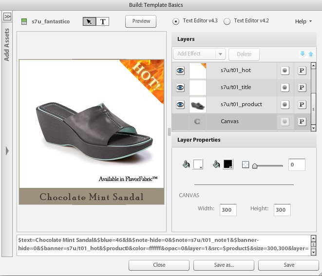

# Introduktion till grundläggande mallar {#basic-templates}

I Dynamic Media Classic-termer är en mall ett dokument som kan ändras dynamiskt via URL:en när mallen har publicerats. Dynamic Media Classic erbjuder grundläggande mallar, bildbaserade mallar som anropas från Image Server och består av bilder och återgiven text.

En av de kraftfullaste aspekterna med mallar är att de har direktintegreringspunkter som gör att du kan koppla dem till databasen. Så du kan inte bara spara en bild och ändra storlek på den, du kan söka efter nya objekt eller försäljningsobjekt i databasen och få bilden att se ut som en övertäckning. Du kan be om en beskrivning av objektet och få det att visas som en etikett i ett teckensnitt som du väljer och en layout. Möjligheterna är obegränsade.

Grundmallar kan implementeras på många olika sätt, från enkla till komplexa. Till exempel:

- Grundläggande marknadsföring. Använder etiketter som&quot;fri frakt&quot; om produkten har fri frakt. Etiketterna är konfigurerade av säljteamet i Photoshop, och webben använder logik för att veta när de ska användas på bilden.
- Avancerad marknadsföring. Varje mall har flera variabler och kan visa mer än ett alternativ samtidigt. Använder en databas, ett lager och affärsregler för att avgöra när en produkt ska visas som&quot;Just In&quot;, på&quot;Clearance&quot; eller&quot;Sold Out&quot;. Du kan också använda genomskinlighet bakom produkten för att visa den på olika bakgrunder, t.ex. i olika rum. Samma mallar och/eller resurser kan återanvändas på produktinformationssidan för att visa en större eller zoombar version av samma produkt på olika bakgrunder.

Det är viktigt att veta att Dynamic Media Classic bara tillhandahåller den visuella delen av dessa mallbaserade program. Dynamic Media Classic företag eller deras integreringspartners måste tillhandahålla affärsregler, databaser och utvecklingskompetens för att skapa programmen. Det finns inget inbyggt mallprogram, designers konfigurerar mallen i Dynamic Media Classic och utvecklare använder URL-anrop för att ändra variablerna i mallen.

I slutet av kursen får du lära dig att:

- Överför en Photoshop PSD till Dynamic Media Classic för att använda den som grund för en mall.
- Skapa en enkel mall som består av bildlager.
- Lägg till textlager och gör dem variabla med hjälp av parametrar.
- Skapa en mall-URL och ändra bilden dynamiskt i webbläsaren.

>[!NOTE]
>
>Alla URL-adresser i det här kapitlet är endast avsedda som illustrationer. De är inte direktlänkar.

## Översikt över grundläggande mallar

Definitionen av en grundläggande mall (eller bara&quot;mall&quot; för kort) är en URL-adresserbar bild med flera lager. Slutresultatet är en bild som kan ändras av URL:en. Det kan bestå av foton, text eller grafik - en valfri kombination av P-TIFF-material i Dynamic Media Classic.

Mallar liknar oftast Photoshop PSD-filer eftersom de har ett liknande arbetsflöde och liknande funktioner.

- Båda består av lager som är som ark av staplad acetat. Du kan sätta samman delvis genomskinliga bilder och se igenom de genomskinliga områdena i ett lager till lagren under.
- Lagren kan flyttas och roteras för att flytta innehållet och opacitets- och blandningslägena kan ändras så att innehållet blir delvis genomskinligt.
- Du kan skapa textbaserade lager. Kvaliteten kan bli mycket hög eftersom Image Server använder samma textmotor som Photoshop och Illustrator.
- Enkla lagerstilar kan användas på varje lager för att skapa specialeffekter som skuggor och glöd.

Till skillnad från Photoshop PSD kan lager vara helt dynamiska och styrda via en URL på bildservern.

- Du kan lägga till variabler i alla mallegenskaper, vilket gör det enkelt att ändra dess komposition direkt.
- Variabler som kallas parametrar gör att du bara kan visa den del av mallen som du vill ändra.

Du behöver bara lägga till en platshållare för varje lager som kan variera i stället för att placera alla lager i en enda fil, som du gör i Photoshop, och visa och dölja dem (men du kan också göra det om du vill).

Med hjälp av en platshållare kan du dynamiskt byta ut innehållet i ett lager mot ett annat publicerat objekt, och det får automatiskt samma egenskaper (till exempel storlek och rotation) som det lager det ersatt.

Eftersom grundläggande mallar vanligtvis utformas i Photoshop men distribueras via en URL-adress, kräver ett mallprojekt en blandning av både design- och teknikkompetens. Vi utgår i allmänhet från att den som arbetar med den kreativa mallen är en Photoshop-designer och att den som implementerar mallen är webbutvecklare. Den kreativa avdelningen och utvecklingsgruppen måste samarbeta nära för att mallen ska bli framgångsrik.

Mallprojekt kan vara relativt enkla eller extremt komplexa beroende på vilka affärsregler och behov programmet har. Grundmallar anropas från Image Server, men på grund av flexibiliteten i Dynamic Media Classic-miljön kan du till och med kapsla mallar i andra mallar, vilket gör att du kan skapa ganska komplexa bilder som kan länkas med vanliga namngivna variabler.

- Läs mer om [Grundläggande om mallar](https://experienceleague.adobe.com/docs/dynamic-media-classic/using/template-basics/quick-start-template-basics.html?lang=sv-SE).
- Lär dig hur du skapar en [grundläggande mall](https://experienceleague.adobe.com/docs/dynamic-media-classic/using/template-basics/creating-template.html?lang=sv-SE#creating_a_template).

## Skapa en grundmall

När du arbetar med en grundläggande mall följer du vanligtvis arbetsflödesstegen i diagrammet nedan. Steg som är markerade med prickade linjer är valfria om du använder dynamiska textlager och anges som &quot;Textarbetsflöde&quot; i instruktionerna nedan. Om du inte använder text följer du bara huvudbanan.

_Arbetsflödet Grundläggande mall._

1. Designa och skapa material. De flesta användare gör detta i Adobe Photoshop. Designa material i exakt den storlek du behöver - om det är en bild med 200 pixlar för en miniatyrsida designar du den med 200 pixlar. Om du behöver zooma in den kan du utforma den med en storlek på cirka 2 000 pixlar. Använd Photoshop (och/eller Illustrator sparat som bitmapp) för att skapa resurserna och använd Dynamic Media Classic för att sammanfoga delarna, hantera lagren och lägga till variabler.
2. När du har utformat grafikresurser överför du dem till Dynamic Media Classic. I stället för att överföra enskilda resurser från PSD rekommenderar vi att du överför hela PSD-filen med lager och låter Dynamic Media Classic skapa en fil per lager genom att använda alternativet **Behåll lager** vid överföring (se nedan för mer information). _Textarbetsflöde: Om du skapar dynamisk text överför du även teckensnitten. Dynamisk text är variabel och styrs via URL:en. Om texten är statisk eller bara har några korta fraser som inte ändras - till exempel taggar som säger&quot;Nytt&quot; eller&quot;Försäljning&quot; i stället för&quot;X% av&quot;, där X är ett variabelt nummer - rekommenderar vi att du återger texten i Photoshop i förväg och överför den som rastrerade lager som bilder. Det är enklare och du kan formatera texten exakt som du vill._
3. Bygg mallen i Dynamic Media Classic med hjälp av mallredigeraren på menyn Skapa och lägg till bildlager. Textarbetsflöde: Skapa textlager i samma redigerare. Det här steget krävs när du skapar en mall manuellt i Dynamic Media Classic. Välj en storlek på arbetsytan som matchar din design, dra och släpp bilder på arbetsytan och ange lageregenskaper (storlek, rotation, opacitet osv.). Du placerar inte alla lager i mallen, bara en platshållare per bildlager. _Textarbetsflöde: Du skapar textlager med textverktyget, ungefär som när du skapar textlager i Photoshop. Du kan välja ett teckensnitt och formatera det med samma alternativ som finns i Photoshop Type-verktyget._ Ett annat arbetsflöde är att överföra en PSD och låta Dynamic Media Classic generera en&quot;kostnadsfri&quot; mall, och kan även återskapa textlager. Detta diskuteras mer ingående senare.
4. När lagren har skapats lägger du till parametrar (variabler) i alla egenskaper i lagret som du vill kontrollera via URL:en, inklusive lagrets källa (själva bilden). _Textarbetsflöde: Du kan också lägga till parametrar i textlager, både för att styra innehållet i själva lagret och dess storlek och position, samt alla formateringsalternativ som teckensnittsfärg, teckenstorlek, vågrät spårning osv._
5. Skapa en bildförinställning som matchar mallens storlek. Vi rekommenderar att du gör detta så att mallen alltid anropas i 1:1-storlek och även lägger till skärpa i stora bildlager som storleksändras för att passa mallen. Om du skapar en mall som ska zoomas är det här steget överflödigt.
6. Publish, kopiera URL:en från Dynamic Media Classic Preview och testa den i en webbläsare.

## Förbereda och överföra din Assets-mall till Dynamic Media Classic

Innan du överför dina mallresurser till Dynamic Media Classic måste du slutföra några förberedande steg.

### Förbereda PSD för överföring

Innan du överför din Photoshop-fil till Dynamic Media Classic bör du förenkla lagren i Photoshop så att det blir enklare att arbeta med och få största möjliga kompatibilitet med Image Server. Din PSD-fil består ofta av många element som Dynamic Media Classic inte känner igen, och du kan också få många små delar som är svåra att hantera. Kom ihåg att spara en säkerhetskopia av PSD om du skulle behöva redigera originalet senare. Du överför den förenklade kopian och inte mallsidan.

1. Förenkla lagerstrukturen genom att sammanfoga/förenkla relaterade lager som behöver slås på/av tillsammans till ett enda lager. Etiketten&quot;NYTT&quot; och den blå banderollen sammanfogas till ett enda lager så att du kan visa eller dölja dem med ett enda klick.
   
2. Vissa lagertyper och lagereffekter stöds inte av Dynamic Media Classic eller Image Server och måste rastreras före överföringen. Annars kan effekterna ignoreras eller lagren ignoreras. Om du rastrerar ett lager innebär det att det går att konvertera om det är redigerbart till icke-redigerbart. Om du vill rastrera lagereffekter eller textlager skapar du ett tomt lager, markerar både och lägger samman med **Lager > Lägg samman lager** eller CTRL + E/CMD + E.

   - Dynamic Media Classic kan inte gruppera eller länka lager. Alla lager i en grupp eller länkad uppsättning konverteras till separata lager som inte längre är grupperade/länkade.
   - Lagermasker konverteras till genomskinlighet vid överföring.
   - Justeringslager stöds inte och ignoreras.
   - Fyllningslager, till exempel heltäckande färglager, rastreras.
   - Smarta objektlager och vektorlager rastreras till normala bilder vid överföring och smarta filter används och rastreras.
   - Textlager rastreras också om du inte använder alternativet Extrahera text - se nedan för mer information.
   - De flesta lagereffekter ignoreras och endast ett fåtal blandningslägen stöds. Om du är osäker kan du lägga till enkla effekter i Dynamic Media Classic (t.ex. inre eller droppskuggor, inre eller yttre glöd) eller använda ett tomt lager för att sammanfoga och rastrera effekten i Photoshop.

### Arbeta med teckensnitt

Du kommer också att överföra och publicera dina teckensnitt om du behöver generera dynamisk text. Det enda teckensnitt som ingår i Dynamic Media Classic är Arial.

Det är varje företags ansvar att skaffa licens för att använda ett teckensnitt på webben - bara ett teckensnitt är installerat på datorn, ger dig inte rätt att använda det kommersiellt på webben, och ditt företag kan råka ut för juridiska åtgärder från teckensnittsutgivaren om de används utan tillstånd. Dessutom varierar licensvillkoren - du kan till exempel behöva separata licenser för utskrift och skärmvisning.

Dynamic Media Classic stöder teckensnitten OTF (Standard OpenType), TrueType (TTF) och Type 1 Postscript. Mac - endast teckensnitt av typen resväska, typsnittsfiler, Windows-systemteckensnitt och egna datorteckensnitt (som teckensnitt som används av gravyrer eller broidery-datorer) stöds inte - du måste konvertera dem till något av standardteckensnittsformaten eller ersätta ett liknande teckensnitt som används i Dynamic Media Classic och på Image Server.

När teckensnitt har överförts till Dynamic Media Classic, precis som andra resurser, måste de också publiceras till Image Server. Ett mycket vanligt mallfel är att glömma att publicera teckensnitten, vilket resulterar i ett bildfel - Image Server ersätter inte något annat teckensnitt. Om du dessutom vill använda alternativet **Extrahera text** när du överför måste du överföra teckensnittsfilerna innan du överför PSD som använder teckensnitten. Funktionen **Extrahera text** kommer att försöka återskapa texten som ett redigerbart textlager och placera den i en Dynamic Media Classic-mall. Detta diskuteras i nästa avsnitt, PSD Options.

Observera att teckensnitt har flera interna namn som ofta skiljer sig från deras externa filnamn. Du kan se alla deras olika namn på detaljsidan för den resursen i Dynamic Media Classic. Här är namnen på teckensnittet Adobe Caslon Pro Semibold, som listas under fliken Metadata i Dynamic Media Classic:

_Fliken Metadata på informationssidan för ett teckensnitt i Dynamic Media Classic._

Dynamic Media Classic använder teckensnittets filnamn (ACaslonPro-Semibold) som sitt resurs-ID, men det är inte det namn som används av mallen. I mallen används RTF-namnet (Rich Text Format), som finns längst ned. RTF är det inbyggda&quot;språket&quot; i Image Server-textmotorn.

Om du behöver ändra teckensnitt via URL:en måste du anropa teckensnittets RTF-namn (inte resurs-ID), annars får du ett felmeddelande. I det här fallet ska teckensnittets namn vara&quot;Adobe Caslon Pro&quot;. Vi diskuterar mer om teckensnitt och RTF i ämnet RTF och textparametrar nedan.

De vanligaste teckensnittsfilformaten som finns i Windows och Mac är OpenType och TrueType. OpenTypen har tillägget .OTF, medan TrueType är .TTF. Båda formaten fungerar lika bra i Dynamic Media Classic.

### Markera alternativ när du överför PSD

Du behöver inte överföra en Photoshop-fil (PSD) för att skapa en mall. En mall kan byggas ut från alla bildresurser i Dynamic Media Classic. Om du överför ett PSD kan det dock bli enklare att redigera, eftersom du vanligtvis redan har dessa resurser i ett PSD med lager. Dessutom genererar Dynamic Media Classic automatiskt en mall när du överför en PSD med lager.

- **Behåll lager.** Det här är det viktigaste alternativet. Detta anger för Dynamic Media Classic att skapa en bildresurs per Photoshop-lager. Om du inte markerar det här alternativet inaktiveras alla andra alternativ och PSD förenklas till en enda bild.
- **Skapa** **mall.** Det här alternativet tar de olika genererade lagren och skapar automatiskt en mall genom att kombinera dem igen. En nackdel med att använda den automatiskt genererade mallen är att Dynamic Media Classic placerar alla lager i en fil, medan vi bara behöver en enda platshållare per lager. Det är lätt nog att ta bort de extra lagren, men om du har många lager går det snabbare att återskapa dem. Byt namn på den nya mallen. Om du inte gör det skrivs den över nästa gång du överför samma PSD.
- **Hämta text.** Detta återskapar textlager i PSD som textlager i mallen med det teckensnitt som du överförde. Det här steget krävs om texten finns på en bana i Photoshop och du vill behålla den sökvägen i mallen. Den här funktionen kräver att du använder alternativet **Skapa mall** eftersom den extraherade texten bara kan skapas av en mall som genereras vid överföringen.
- **Utöka lager till bakgrundsstorlek.** Den här inställningen gör att varje lager får samma storlek som hela arbetsytan i PSD. Det här är mycket användbart för lager som alltid är fasta i positionen. I annat fall kan du behöva flytta dem när du byter bilder till samma lager.
- **Namnge lager.** Detta anger för Dynamic Media Classic hur varje resurs som genereras per lager ska namnges. Vi rekommenderar antingen **Photoshop** **och Layer** **Name** eller Photoshop och **Layer** **Number**. Båda alternativen använder namnet PSD som första del av namnet och lägger antingen till lagernamnet eller siffran i slutet. Om du till exempel har PSD som heter&quot;shirt.psd&quot; och har lager som heter&quot;front&quot;,&quot;sleeves&quot; och&quot;collar&quot;, och om du överför med alternativet **Photoshop och** Layer **Name** , skulle Dynamic Media Classic generera tillgångs-ID:n&quot;shirt_front&quot;,&quot;shireves&quot; och&quot;shirt_collar&quot;. Om du använder något av dessa alternativ är namnet unikt i Dynamic Media Classic.

## Skapa en mall med bildlager

Även om Dynamic Media Classic automatiskt kan skapa en mall från ett PSD med lager bör du veta hur du skapar mallen manuellt. Som förklaras ovan finns det vissa tillfällen när du inte vill använda mallen som skapats av Dynamic Media Classic.

### Användargränssnittet för mallar

Vi börjar med att bekanta oss med redigeringsgränssnittet.

I det vänstra mitten visas arbetsytan med en förhandsvisning av den färdiga mallen. Till höger finns panelerna Lager och Lageregenskaper. Det är här du gör mest jobb.

_Bygg mallsidan Grunderna._

- **Förhandsvisa/Arbetsyta.** Det här är huvudfönstret. Här kan du flytta, ändra storlek på och rotera lager med musen. Lagerkonturer visas som streckade linjer.
- **Lager.** Det här liknar lagerpanelen i Photoshop. När du lägger till lager i mallen visas de här. Lager staplas uppifrån och ned - det översta lagret på panelen Lager visas ovanför de andra under det i listan.
- **Lageregenskaper.** Här kan du justera alla egenskaper för ett lager med hjälp av numeriska kontroller. Markera först ett lager och justera sedan dess egenskaper.
- **Sammansatt** **URL.** Längst ned i användargränssnittet finns området för sammansatt URL. Detta beskrivs inte i det här avsnittet av självstudiekursen, men här ser du hur mallen dekonstrueras som en serie URL-modifierare för bildservering. Det här området är redigerbart - om du är mycket bekant med Image Server-kommandon kan du redigera mallen manuellt här. Men du kan också bryta den. Precis som Photoshop börjar lagernumreringen på 0. Arbetsytan är lager 0 och det första lagret du lägger till själv är lager 1. Blandningslägena avgör hur ett lagers pixlar blandas med de underliggande pixlarna. Du kan skapa en mängd olika specialeffekter med blandningslägen.

#### Använda mallbasredigeraren

Här följer arbetsflödesstegen för att starta den grundläggande mallen:

1. Gå till **Skapa > Grundläggande om mallar** i Dynamic Media Classic. Du kan antingen inte ha något markerat, eller börja med att markera en bild, som blir mallens första lager.
2. Välj en storlek och tryck på **OK**. Den här storleken bör matcha den storlek som du har utformat i Photoshop. Mallredigeraren läses in.
3. Om du inte har markerat någon bild i steg 1 söker du efter eller bläddrar till en bild i resurspanelen till vänster och drar den till arbetsytan.

   - Storleken på bilden ändras automatiskt så att den passar arbetsytans storlek. Om du planerar att byta ut dina högupplösta bilder tar du vanligtvis med dig en av dina stora (2 000 px) P-TIFF-bilder och använder den som platshållare.
   - Det här bör vara det understa lagret i mallen, men du kan ändra ordningen på lagren senare.

4. Ändra storlek på eller flytta lagret direkt på arbetsytan eller genom att justera inställningarna på panelen Lageregenskaper.
5. Dra ytterligare bildlager efter behov. Lägg även till lagereffekter om du vill. Se avsnittet _Lägga till lagereffekter_ nedan.
6. Klicka på **Spara**, välj en plats och ge mallen ett namn. Du kan förhandsvisa, men nu ser mallen ut exakt som en bild i ett lager i Photoshop - den kan inte ändras än.

### Lägga till lagereffekter

Image Server har stöd för några programmatiska lagereffekter - specialeffekter som ändrar utseendet på ett lagers innehåll. De fungerar ungefär som lagereffekter i Photoshop. De är kopplade till ett lager men styrs oberoende av lagret. Du kan justera eller ta bort dem utan att göra en permanent ändring i själva lagret.

- **Skugga**. Använder en skugga utanför lagrets gränser, placerad med en x- och y-pixelförskjutning.
- **Inre skugga**. Använder en skugga innanför lagrets gränser, placerad med en x- och y-pixelförskjutning.
- **Ytterglöd**. Använder en glödeffekt jämnt runt alla kanter i lagret.
- **Inre glöd**. Använder en glödeffekt jämnt innanför alla kanter i lagret.

_Ett lager med och utan skugga_

Om du vill lägga till en effekt klickar du på **Lägg till effekt** och väljer en effekt på menyn. Precis som med vanliga lager kan du markera en effekt på panelen Lager och använda panelen Lageregenskaper för att justera inställningarna.

Skuggeffekter förskjuts vågrätt eller lodrätt från lagret, medan glödeffekter används jämnt i alla riktningar. Innereffekter fungerar ovanpå de ogenomskinliga delarna av lagret, medan yttre effekter bara påverkar de genomskinliga områdena.

Läs mer om [Lägga till lagereffekter](https://experienceleague.adobe.com/docs/dynamic-media-classic/using/template-basics/creating-template.html?lang=sv-SE#using-shadow-and-glow-effects-on-layers).

### Lägga till parametrar

Om allt du gör är att kombinera lager och spara dem blir nettoresultatet inte annorlunda än en förenklad Photoshop-bild. Det som gör mallarna speciella är möjligheten att lägga till parametrar i egenskaperna för varje lager, så att de kan ändras dynamiskt via URL:en.

I Dynamic Media Classic-termer är en parameter en variabel som kan länkas till en mallegenskap så att den kan ändras via en URL. När du lägger till en parameter i ett lager, visar Dynamic Media Classic den egenskapen i URL:en genom att prefixera namnet på parametern med ett dollartecken ($). Om du till exempel skapar en parameter med namnet&quot;size&quot; för att ändra storleken på ett lager, byter Dynamic Media Classic namn på parametern $size.

Om du inte lägger till någon parameter för en egenskap, döljs den egenskapen i Dynamic Media Classic-databasen och visas inte i URL:en.

Utan parametrar blir URL-adresserna ofta mycket längre, särskilt om du också använder dynamisk text. Text lägger till många dussintals extra tecken på varje URL.

Slutligen blir den första parameteruppsättningen standardvärden för egenskaperna i mallen. Om du bygger mallen, lägger till parametrar och sedan anropar URL:en utan parametrar skapas bilden med alla standardvärden som du sparade i mallen. Parametrar behövs bara om du vill ändra en egenskap. Om en egenskap inte behöver ändras behöver du inte ange någon parameter.

#### Skapar parametrar

Det här är arbetsflödet för att skapa parametrar:

1. Klicka på knappen **Parametrar** bredvid namnet på det lager som du vill skapa parametrar för. Skärmen Parametrar öppnas. Varje egenskap i lagret och dess värde visas.
1. Markera alternativet **På** bredvid namnet på varje egenskap som du vill göra till en parameter. Ett standardparameternamn visas. Du kan bara lägga till parametrar till egenskaper som har ändrats från standardläget.

   - Om du t.ex. lägger till ett lager och behåller det vid standardvärdet 0,0 visas inte egenskapen **Position** i Dynamic Media Classic. Om du vill åtgärda det flyttar du lagret minst en pixel. Nu visar Dynamic Media Classic **Position** som en egenskap som du kan parametrisera.
   - Om du vill lägga till en parameter i egenskapen show/hide (vilket aktiverar och inaktiverar lagret) klickar du på ikonen **Visa** eller **Dölj lager** för att inaktivera lagret (du kan aktivera det efteråt om du vill). Dynamic Media Classic visar nu en **Hide** -egenskap som kan parametriseras.

1. Byt namn på standardparameternamnen till något som är enklare att identifiera i URL:en. Om du till exempel vill lägga till en parameter för att ändra banderolllagret ovanpå en bild ändrar du standardnamnet för&quot;layer_2_src&quot; till&quot;banner&quot;.
1. Tryck på **Close** för att avsluta parameterskärmen.
1. Upprepa den här processen för andra lager genom att klicka på knappen **Parametrar** och lägga till och byta namn på parametrar.
1. Spara ändringarna när du är klar.

>[!TIP]
>
>Byt namn på parametrarna till något meningsfullt och skapa en namnkonvention som standardiserar dessa namn. Se till att namngivningskonventionen överenskommits i förväg av både design- och utvecklingsteamen.
>
>Kan du inte lägga till en parameter eftersom du inte ser egenskapen? Ändra bara lagrets egenskap från standardvärdet (genom att flytta, ändra storlek, dölja osv.). Nu ska du se den egenskapen exponerad.

Läs mer om [mallparametrar](https://experienceleague.adobe.com/docs/dynamic-media-classic/using/template-basics/creating-template-parameters.html?lang=sv-SE).

## Skapa en mall med textlager

Nu ska du lära dig hur du skapar en grundläggande mall som innehåller textlager.

### Dynamisk text

Nu vet du hur du skapar en grundläggande mall med hjälp av bildlager. För många program är detta allt du behöver. Som du såg i föregående övning kan lager med enkel text (till exempel&quot;Försäljning&quot; och&quot;Nytt&quot;) rastreras och behandlas som bilder eftersom texten inte behöver ändras.

Men tänk om du behöver:

- Lägg till en etikett som säger&quot;25 % rabatt&quot; med värdet 25 % variabel
- Lägg till en textetikett med namnet på produkten ovanpå bilden
- Anpassa lagren till olika språk beroende på i vilket land mallen visas

I så fall vill du lägga till dynamiska textlager med parametrar som styr texten och/eller formateringen.

Om du vill skapa text måste du överföra vissa teckensnitt, annars används Arial som standard i Dynamic Media Classic. Teckensnitten måste också publiceras på Image Server, annars genereras ett fel när det försöker återge text som använder teckensnittet.

### RTF- och textparametrar

Om du vill lägga till variabler i text med hjälp av mallverktyget måste du förstå hur texten återges. Bildservern genererar text med textmotorn Adobe, samma motor som används av Photoshop och Illustrator, och sätter ihop den som ett lager i den slutliga bilden. För att kommunicera med motorn använder Image Server RTF eller Rich Text Format.

RTF är en filformatsspecifikation som utvecklats av Microsoft för att ange dokumentformatering. Det är ett standardspråk som används av de flesta ordbehandlings- och e-postprogram. Om du skrev till en URL &amp;text=\b1 Hello, skulle bildservern generera en bild med ordet&quot;Hello&quot; i fet stil, eftersom \b1 är RTF-kommandot för att göra texten fet.

Den goda nyheten är att Dynamic Media Classic genererar RTF åt dig. När du skriver text i en mall och lägger till formatering skriver Dynamic Media Classic tyst RTF-koden i mallen automatiskt. Anledningen till att vi nämner det är att du lägger till parametrar direkt till själva RTF-filen, så det är viktigt att du känner till den lite.

#### Skapa textlager

Du kan skapa textlager i en mall i Dynamic Media Classic på följande två sätt:

1. Textverktyget i Dynamic Media Classic. Vi diskuterar den här metoden nedan. I mallbasredigeraren finns ett verktyg som du kan använda för att skapa en textruta, ange text och formatera texten. Dynamic Media Classic genererar RTF efter behov och placerar den i ett separat lager.
2. Extrahera text (vid överföring). Den andra metoden är att skapa textlagret i Photoshop och spara det i PSD som ett vanligt textlager (i stället för att rastrera det som ett bildlager). Du överför sedan filen till Dynamic Media Classic och använder alternativet **Extrahera text**. Dynamic Media Classic konverterar alla Photoshop-textlager till ett bildserverkextlager med RTF-kommandon. Om du använder den här metoden måste du först överföra teckensnitten till Dynamic Media Classic, annars ersätter Dynamic Media Classic ett standardteckensnitt när du laddar upp dem och det finns inget enkelt sätt att ersätta det rätta teckensnittet.

### Textredigeraren

Du skriver text med textredigeraren. Textredigeraren är ett WYSIWYG-gränssnitt där du kan ange och formatera text med formateringskontroller som liknar dem i Photoshop och Illustrator.

_Textredigeraren Grundläggande om mallar._

Du gör merparten av ditt arbete på fliken **Förhandsgranska** där du kan ange text och se den som den kommer att se ut i mallen. Det finns även en **Source**-flik som används för att manuellt redigera RTF-filen, om det behövs.

Det allmänna arbetsflödet är att använda fliken **Förhandsgranska** för att skriva text.

Sedan markerar du texten och väljer viss formatering, t.ex. teckensnittsfärg, teckenstorlek eller justering, med kontrollerna längst upp. När texten har formaterats som du vill kan du klicka på **Använd** för att se den uppdateras i förhandsvisningen av arbetsytan. Sedan stänger du textredigeraren för att gå tillbaka till huvudfönstret i Mallar.

#### Använda textredigeraren

Här följer arbetsflödesstegen för att lägga till text på mallsidan:

1. Klicka på verktygsknappen **Text** högst upp på byggsidan.
2. Dra ut en textruta där du vill att texten ska visas. Textredigeringsfönstret öppnas i ett modalt fönster. I bakgrunden visas mallen, men den kan inte redigeras förrän du är klar med redigeringen av texten.
3. Skriv den exempeltext som du vill ska visas när mallen först läses in. Om du t.ex. skapar en textruta för en anpassad e-postbild kan det stå &quot;Hi Name&quot; i texten. Nu är det dags att spara!&quot; Senare lägger du till en textparameter som ersätter namnet med ett värde som du skickar på URL:en. Texten visas inte i mallen under fönstret förrän du klickar på **Använd**.
4. Om du vill formatera texten markerar du den genom att dra med musen och väljer en formateringskontroll i användargränssnittet.

   - Det finns många formateringsalternativ. Några av de vanligaste är teckensnitt (ansikte), teckenstorlek och teckenfärg, liksom justering av vänster/mitten/höger.
   - Glöm inte att markera texten först. Annars kan du inte använda någon formatering.
   - Om du vill välja ett annat teckensnitt måste du markera texten och öppna teckensnittsmenyn. Redigeraren visar en lista över alla teckensnitt som överförts till Dynamic Media Classic. Om ett teckensnitt också är installerat på datorn visas det i svart. Om den inte är installerad på datorn visas den i rött. Den återges dock fortfarande i förhandsgranskningsfönstret när du klickar på **Använd**. Du behöver bara överföra teckensnitt till Dynamic Media Classic för att göra dem tillgängliga för alla som använder Dynamic Media Classic. När du har publicerat kommer Image Server att använda dessa teckensnitt för att generera texten - användarna behöver inte installera några teckensnitt för att se den text du skapar eftersom den är en del av en bild.
   - Till skillnad från Photoshop och Illustrator kan Image Server justera texten lodrätt i textrutan. Standardvärdet är överkantsjustering. Om du vill ändra detta markerar du texten och väljer **Mitten** eller **Nederst** på menyn **Lodrät justering** .
   - Om du gör texten för stor för rutan (eller om textrutan är för liten) kommer hela eller en del av den att beskäras och försvinna. Minska teckenstorleken eller gör rutan större.

5. Klicka på **Använd** för att se ändringarna börja gälla i arbetsytefönstret. Du måste klicka på **Använd**, annars förlorar du redigeringarna.
6. När du är klar klickar du på **Stäng**. Om du vill gå tillbaka till redigeringsläget dubbelklickar du på textlagret för att öppna textredigeraren igen.

Textredigeraren visar exakt hur stort teckensnittet är om du har teckensnittet installerat lokalt på datorn.

### Om att lägga till parametrar i textlager

Vi följer nu en liknande process för att lägga till textparametrar som vi gjorde för lagerparametrar. Textlager kan också ha lagerparametrar för storlek, position och så vidare. De kan dock ha ytterligare parametrar som gör att du kan styra vilken aspekt som helst av RTF-filen.

Till skillnad från lagerparametrar markerar du bara det värde som du vill ändra och lägger till en parameter i den i stället för att lägga till en parameter till hela egenskapen.

Exempel-RTF:

När du undersöker RTF-filen måste du ta reda på var varje inställning är som du vill ändra. I RTF-filen ovan kan en del av det verka vettigt och du kan se varifrån formateringen kommer.

Du kan se frasen Chocolate Mint Sandal - det är själva texten.

- Det finns en referens till teckensnittet Poor Richard - här väljs teckensnitten.
- Du kan se ett RGB-värde: \red56\green53\blue4 - det här är textfärgen.
- Även om teckensnittsstorleken är 20 ser du inte siffran 20. Det finns emellertid ett kommando \fs40 - av någon udda anledning mäter RTF teckensnitt som halvpunkter. Därför är \fs40 teckensnittsstorleken!

Du har tillräckligt med information för att skapa parametrar, men det finns en fullständig referens till alla RTF-kommandon i dokumentationen för bildservern. Besök [dokumentationen om bildservrar](https://experienceleague.adobe.com/docs/dynamic-media-developer-resources/image-serving-api/image-serving-api/http-protocol-reference/text-formatting/c-text-formatting.html?lang=sv-SE#concept-0d3136db7f6f49668274541cd4b6364c).

#### Lägga till parametrar i textlager

Så här lägger du till parametrar i textlager.

1. Klicka på knappen **Parametrar** (ett P-värde) bredvid namnet på textlagret som du vill skapa parametrar för. Skärmen Parametrar öppnas. Fliken **Allmänt** visar varje egenskap i lagret och dess värde. Här kan du lägga till vanliga lagerparametrar.
1. Klicka på fliken **Text**. Här visas RTF-filen högst upp. De parametrar som du lägger till finns under den.
1. Om du vill lägga till en parameter markerar du det värde du vill ändra och klickar på knappen **Lägg till parameter** . Se till att du bara markerar värdena för kommandona och inte för hela kommandot. Om jag till exempel vill ange en parameter för teckensnittsnamnet i exemplet RTF ovan skulle jag bara markera &quot;Poor Richard&quot; och lägga till en parameter i det, men inte &quot;\f0&quot;. När du klickar på **Lägg till parameter** visas den i listan nedan och parametervärdet visas i rött i RTF-filen medan det fortfarande är markerat. Om du behöver ta bort en parameter klickar du i kryssrutan bredvid **På** för att inaktivera den parametern. Den försvinner.
1. Klicka för att byta namn på parametern till ett mer beskrivande namn.
1. När du är klar markeras RTF-filen i grönt där det finns parametrar, och parameternamn och värden visas nedan.
1. Klicka på **Stäng** om du vill stänga parameterskärmen. Tryck sedan på **Spara** för att spara mallen. Om du är klar med redigeringen trycker du på **Close** för att avsluta mallsidan.
1. Klicka på **Förhandsgranska** för att testa mallen i Dynamic Media Classic. Om du vill testa textparametrarna skriver du ny text eller nya värden i förhandsgranskningsfönstret. Om du vill ändra teckensnittet måste du ange det exakta RTF-namnet för teckensnittet.

>[!TIP]
>
>Om du vill lägga till parametrar i textfärgen lägger du till parametrar för röd, grön och blå separat. Om RTF till exempel är `\red56\green53\blue46` lägger du till separata röda, gröna och blå parametrar för värdena 56, 53 och 46. I URL:en ändrar du färgen genom att anropa alla tre: `&$red=56&$green=53&$blue=46`.

Lär dig hur du [skapar dynamiska textparametrar](https://experienceleague.adobe.com/docs/dynamic-media-classic/using/template-basics/creating-template-parameters.html?lang=sv-SE#creating-dynamic-text-parameters).

## Publicera och skapa mall-URL:er

### Skapa en bildförinställning

Det är inte nödvändigt att skapa en förinställning för mallen. Vi rekommenderar det som en bra metod så att mallen alltid kallas 1:1-storlek och även lägger till skärpa i stora bildlager som storleksändras för att passa mallen. Om du anropar en bild utan en förinställning kan Image Server godtyckligt ändra bildens storlek till standardstorleken (cirka 400 pixlar) och inte använda standardskärpa.

Det finns inget särskilt med en bildförinställning för en mall. Om du redan har en förinställning för en statisk bild med samma storlek kan du använda den i stället.

### Publish

Du måste köra en publicering för att se ändringarna skickas live till Image Server. Tänk på vad som behöver publiceras: de olika bildresurslagren, teckensnitten för dynamisk text och själva mallen. En grundmall är en artificiell konstruktion, precis som andra multimedieresurser från Dynamic Media Classic som Image Sets och Spin Sets. Det är ett radobjekt i databasen som refererar till bilder och teckensnitt med hjälp av en serie kommandon för bildservering. När du publicerar mallen uppdaterar du bara data på Image Server.

Läs mer om [Publicera din mall](https://experienceleague.adobe.com/docs/dynamic-media-classic/using/template-basics/publishing-templates.html?lang=sv-SE).

### Skapa mall-URL

En Basic-mall har samma grundläggande URL-syntax som ett normalt bildanrop, vilket förklaras ovan. En mall har vanligtvis fler modifierare - kommandon avgränsade med ett et-tecken (&amp;) - t.ex. parametrar med värden. Den största skillnaden är dock att du anropar mallen som huvudbild i stället för att anropa en statisk bild.

Till skillnad från bildförinställningar, som har ett dollartecken ($) på var sida om förinställningsnamnet, har parametrar ett dollartecken i början. Placeringen av dollartecknen är viktig.

**Korrekt:**

`$text=46-inch LCD HDTV`

**Felaktigt:**

`$text$=46-inch LCD HDTV`

`$text=46-inch LCD HDTV$`

`text=46-inch LCD HDTV`

Som tidigare nämnts används parametrar för att ändra mallen. Om du anropar mallen utan parametrar återställs standardinställningarna enligt utvecklingsverktyget i Mallar. Om en egenskap inte behöver ändras behöver du inte ange någon parameter.

_Exempel på en mall utan att ange parametrar (ovan) och med parametrar (nedan)._
