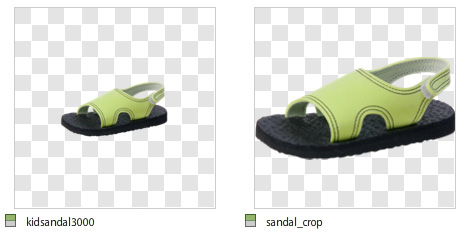
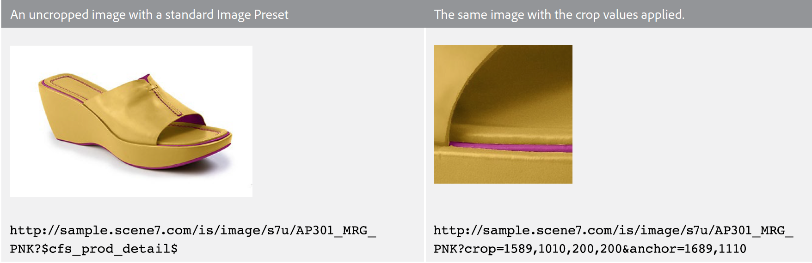
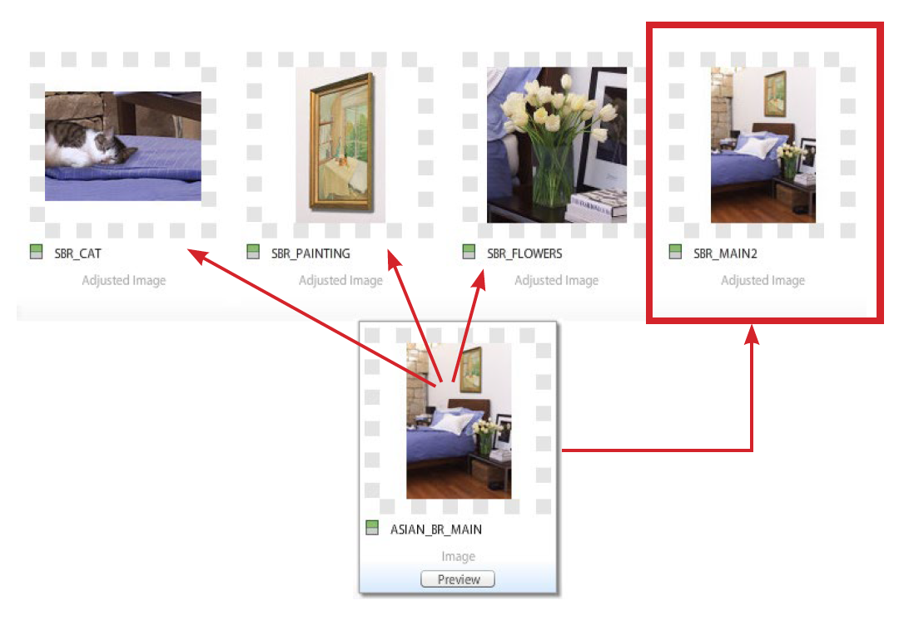

# Beskärning, justerade bilder och zoomningsmål {#crop-adjusted-zoom-targets}

En av de främsta fördelarna med Dynamic Media Classic master image-koncept är att du kan återanvända bildresursen för många användningsområden. Som standard måste du skapa separata, beskurna versioner av varje bild för att visa detaljer eller färgrutor. När du använder Dynamic Media Classic kan du utföra samma uppgifter på en enda mallsida och antingen spara de beskurna versionerna som nya fysiska filer eller som virtuella derivat som inte tar något lagringsutrymme.

I slutet av kursen får du lära dig att:

- Beskär bilder i Dynamic Media Classic och spara som nya huvudfiler eller som virtuella bilder. [Läs mer](https://experienceleague.adobe.com/docs/dynamic-media-classic/using/master-files/cropping-image.html).
- Spara virtuella justerade bilder och använd dem i stället för huvudresurserna. [Läs mer](https://experienceleague.adobe.com/docs/dynamic-media-classic/using/master-files/adjusting-image.html).
- Skapa zoommål för bilderna för att visa upp deras högdagrar. [Läs mer](https://experienceleague.adobe.com/docs/dynamic-media-classic/using/zoom/creating-zoom-targets-guided-zoom.html).

## Beskärning

Dynamic Media Classic har ett antal lättanvända bildredigeringsverktyg i användargränssnittet, bland annat beskärningsverktyget. Det kan finnas flera skäl till att du vill beskära huvudbilden i Dynamic Media Classic. Till exempel:

- Du har inte åtkomst till originalfilen. Du vill visa bilden med en annan beskärnings- eller proportioner, men du har inte originalfilen på datorn eller arbetar hemifrån. I så fall kan du gå till Dynamic Media Classic, hitta bilden, beskära den och spara den eller spara den som en ny version.
- För att ta bort överskottsutrymme. Bilden har fotograferats med för mycket tomt utrymme, vilket gör att produkten ser liten ut. Du vill att miniatyrbilderna ska fylla upp arbetsytan så mycket som möjligt.
- Om du vill skapa justerade bilder, virtuella kopior av bilder som inte tar något diskutrymme. Vissa företag har affärsregler som kräver att de har separata kopior av samma bild, men med ett annat namn. Eller du kanske vill ha en beskuren och obeskuren version av samma bild.
- Skapa nya bilder från en källbild. Du kan till exempel skapa färgrutor eller en detalj av huvudbilden. Du kan göra detta i Adobe Photoshop och överföra separat eller använda beskärningsverktyget i Dynamic Media Classic.

>[!NOTE]
>
>Alla URL:er i följande diskussioner om beskärning är endast avsedda som illustrationer. De är inte direktlänkar.

### Använda beskärningsverktyget

Du kommer åt beskärningsverktyget i Dynamic Media Classic från detaljsidan för en resurs eller genom att klicka på **Redigera** -knappen. Du kan beskära på två sätt med verktyget:

- Standardbeskärningsläget där du drar handtagen för beskärningsfönstret eller skriver värden i rutan Storlek. Lär dig hur [Beskär manuellt](https://experienceleague.adobe.com/docs/dynamic-media-classic/using/master-files/cropping-image.html#select-an-area-to-crop).
- Trimma. Använd det här alternativet om du vill ta bort extra tomt utrymme runt bilden genom att beräkna antalet pixlar som inte matchar bilden. Lär dig hur [Beskär efter trimning](https://experienceleague.adobe.com/docs/dynamic-media-classic/using/master-files/cropping-image.html#crop-to-remove-white-space-around-an-image).

### _Manuell beskärning_

När du sparar en manuellt beskuren version verkar det som om bilden beskärs permanent. Dynamic Media Classic döljer faktiskt pixlarna genom att lägga till en intern URL-modifierare för att beskära bilden. När du publicerar ser det ut som om bilden beskärs, men du kan gå tillbaka till beskärningsredigeraren och ta bort beskärningen vid ett senare tillfälle.

Du kan sedan välja om du vill spara som en ny mallbild eller som en extra vy av mallsidan. En ny mallsida är en ny fysisk fil (som TIFF eller JPEG) som tar upp lagringsutrymme. Ytterligare en vy är en virtuell bild som inte tar upp något serverutrymme. Vi rekommenderar inte att du väljer Ersätt original eftersom det skriver över mallsidan och gör beskärningen permanent. Om du sparar som en ny mall eller som en ytterligare vy måste du välja ett nytt resurs-ID. Precis som andra resurs-ID:n måste detta vara ett unikt namn i Dynamic Media Classic.

### _Beskär beskärning_

Om du överför en bild med för mycket tomt utrymme (extra arbetsyta) runt huvudmotivet i bilden kommer den att se mycket mindre ut på webben när du ändrar storlek. Detta gäller speciellt för miniatyrbilder som är 150 pixlar eller mindre - motivet i fotot kan gå förlorat i allt extra utrymme runt det.

Jämför dessa två versioner av samma bild.

Bilden till höger blir mycket mer framträdande genom att det extra utrymmet runt produkten tas bort. Du kan trimma en bild i taget med beskärningsverktyget eller köra den som en gruppbearbetning när du överför den. Vi rekommenderar att du kör en gruppbearbetning om du vill att alla bilder ska beskäras till huvudmotivet. Beskär beskärningar till markeringsramen - rektangeln som omger bilden.

>[!NOTE]
>
>Trimma skapar inte genomskinlighet runt bilden. Därför måste du bädda in en urklippsbana i bilden och använda **Skapa mask från klippbana** överföringsalternativ.
>
>Om du vill återställa en bild till det ursprungliga läget efter att du har beskurit den när du har använt **Spara** visas bilden i beskärningsredigeraren och väljer **Återställ** -knappen.

### _Beskärning vid överföring_

Som tidigare nämnts kan du även välja att beskära bilderna när du överför dem. Om du vill använda beskärning vid överföring klickar du på **Jobbalternativ** och under Beskärningsalternativ väljer du **Rensa**.

Dynamic Media Classic kommer ihåg det här alternativet för nästa överföring. Du kanske vill beskära bilder för den här överföringen, men du kanske inte vill att de ska beskäras för varje överföring. Ett annat alternativ är att ange ett särskilt schemalagt FTP-överföringsjobb och lägga beskärningsalternativen där. På så sätt körs jobbet bara när du behöver beskära bilderna.

>[!IMPORTANT]
>
>Om du ställer in en beskärning för överföringen lägger Dynamic Media Classic en cookie för att komma ihåg den inställningen nästa gång. Ett tips är att klicka på **Återställ till företagsstandard** före nästa överföring för att ta bort eventuella beskärningsalternativ som finns kvar från den senaste överföringen. I annat fall kan du av misstag beskära nästa grupp med bilder.

### Beskärning efter URL

Även om det inte är uppenbart i Dynamic Media Classic kan du även beskära enbart via webbadressen (eller till och med lägga till beskärning i en bildförinställning).

När du använder beskärningsverktyget visas URL-värdena i fältet längst ned. Du kan använda dessa värden och använda dem direkt på en bild som URL-modifierare.

_Kommandomodifierare för beskärning längst ned i Beskärningsredigeraren_

Eftersom storleken måste beräknas per bild när du använder beskärning genom beskärning, kan den inte automatiseras via webbadressen. Beskärning av beskärning kan endast utföras vid överföring eller genom att använda en bild i taget.

### _Beskära i bildförinställningen_

Bildförinställningar har ett fält där du kan lägga till extra bildserverkommandon. Om du vill lägga till samma beskärning som ovan i bildförinställningen redigerar du förinställningen och klistrar in eller skriver in värdena i fältet URL-modifierare. Spara och publicera sedan.

_Lägg till beskärningskommandon (eller valfritt kommando) i URL-modifierarna för bildförinställningen._

Beskärningen kommer nu att ingå i den förinställda bilden och tillämpas automatiskt varje gång den används. Den här metoden beror förstås på alla bilder som behöver samma beskärningsmängd. Om inte alla bilder är tagna på samma sätt skulle den här metoden inte fungera för dig.

## Justerade bilder

När du använder beskärningsverktyget kan du välja att **Spara som ytterligare vy av mallsida**. När den sparas skapas en ny typ av Dynamic Media Classic-resurs - en justerad bild. En justerad bild, som även kallas en variant, är en virtuell bild. Det är inte en bild alls, utan en databasreferens (som ett alias eller en genväg) till den fysiska huvudbilden.

### Stå upp med den riktiga bilden`?`

Kan du se vilken som är mallsida och vilken bild som är justerad?

Du bör inte kunna se detta utan att titta i Dynamic Media Classic och se resurstypen &quot;Justerad bild&quot; för SBR_MAIN2.

En justerad bild använder inget diskutrymme eftersom den bara finns som ett radobjekt i databasen. Den är också permanent knuten till den ursprungliga resursen. Om originalet tas bort tas även den justerade bilden bort. Den kan bestå av en hel, obeskuren bild eller bara en del av en bild (en beskärning).

Vanligtvis skapar du justerade bilder med beskärningsverktyget, men du kan även skapa dem med andra bildredigeringsprogram - verktygen Justera och Skärpa.

Justerade bilder kräver ett unikt resurs-ID. När de publiceras (du måste publicera som vilken annan resurs som helst) fungerar de som vilken bild som helst och anropas på en URL av deras resurs-ID. På detaljsidan kan du visa justerade bilder som är kopplade till en mallbild under **Byggda och derivat** -fliken.

_Justerade vyer för huvudbilden ASIAN_BR_MAIN_

## Zoommål

Zoommål finns också på **Redigera** meny och **Information** sida i en bild. Med dem kan du ange&quot;aktiveringspunkter&quot; för att framhäva specifika försäljningsfunktioner i en zoombild. I stället för att skapa separata bilder genom att beskära en stor mallsida kan zoomningsvisningsprogrammet visa detaljerna ovanför bilden tillsammans med en kort etikett som du skapar.

Eftersom Zoom Targets i huvudsak är en försäljningsfunktion och kräver kunskap om en produkts försäljningspunkter, så är det normalt en person i Merchandising- eller Product-teamet på ett företag som arbetar med dem.

Processen är mycket enkel - klicka på funktionen, ge den ett beskrivande namn och spara. Målen kan kopieras från en bild till en annan om de liknar varandra, men processen är manuell. I Dynamic Media Classic går det inte att automatisera skapandet av zoommål eftersom varje bild är olika och har olika funktioner.

Ett annat sätt att avgöra om du ska använda zoommål är att välja visningsprogram. Alla visningsprogramtyper kan inte visa zoommål (t.ex. saknar visningsprogrammet stöd för dem).

Lär dig hur [Skapa zoommål](https://experienceleague.adobe.com/docs/dynamic-media-classic/using/zoom/creating-zoom-targets-guided-zoom.html#creating-and-editing-zoom-targets).

### Använda zoommålverktyget

Här är arbetsflödet för att skapa mål i Dynamic Media Classic.

1. Bläddra till bilden och klicka på **Redigera** och välj **Zoommål**.
2. Zoommålredigeraren läses in. Bilden visas i mitten, med några knappar överst och en tom målpanel till höger. I det nedre vänstra hörnet visas en visningsförinställning markerad. Standardvärdet är &quot;Zoom1-Guidad&quot;.
3. Flytta den röda rutan med musen och klicka för att skapa ett nytt mål.

   - Den röda rutan är målområdet. När en användare klickar på det målet zoomas det in i området inuti rutan.
   - Målstorleken bestäms av visningsstorleken i visningsförinställningen. Detta avgör storleken på den huvudsakliga zoombilden. Se _Ange visningsstorlek_, nedan.

4. Målet som du just skapade blir blått och till höger visas en miniatyrversion av målet samt standardnamnet&quot;target-0&quot;.
5. Om du vill byta namn på målet klickar du på dess miniatyrbild och skriver ett nytt **Namn** och klicka **Retur** eller **Tabb** — om du bara klickar på en annan plats sparas inte ditt namn.
6. När målet är markerat har rutan gröna streckade linjer runt sig och du kan ändra storlek på och flytta den. Dra i hörnen för att ändra storlek eller dra i målrutan för att flytta den.

   - Bilden läses in i standardvisningsprogrammet för anpassad zoomning. Kontrollera att visningsförinställningen har stöd för zoomningsmål. I allmänhet har alla standardförinställningar som har ordet&quot;-Guidad&quot; utformats för användning med zoommål. Om du vill använda målen håller du pekaren över målminiatyrbilden (eller hotspot-ikonen) för att visa etiketten och klickar på den för att se visningsprogrammet zooma in på den funktionen.
   - Precis som allt annat arbete du gör i Dynamic Media Classic måste du publicera för att dina zoommål ska kunna publiceras på webben. Om du redan använder ett visningsprogram som har stöd för mål visas de omedelbart (när cachen har rensats). Om du inte använder ett zoommålaktiverat visningsprogram förblir de dock dolda.

     

7. Om du behöver ta bort ett mål markerar du det genom att klicka på dess miniatyrbild och trycker på **Ta bort mål** eller tryck på DELETE på tangentbordet.
8. Fortsätt att klicka för att lägga till nya mål, byta namn och/eller ändra storlek när du har lagt till dem.
9. Klicka på **Spara** och sedan **Förhandsgranska**.

### Ange visningsstorlek i förinställningen för zoomvisningsprogrammet

Låt oss prata lite om var storleken på zoommålen kommer ifrån. I visningsförinställningen för zoomningsvisningsprogrammet finns en inställning som kallas visningsstorlek. Visningsstorleken är storleken på zoombilden i visningsprogrammet. Den skiljer sig från scenstorleken, som är den totala storleken på visningsprogrammet, inklusive gränssnittskomponenter och grafik.

När du skapar ett nytt mål hämtas dess storlek och proportioner från visningsstorleken. Om visningsstorleken till exempel är 200 x 200 kan du bara göra fyrkantiga mål med ett maximalt zoomområde på 200 pixlar. Målen kan vara större än 200 pixlar, men alltid fyrkantiga. Men det innebär också att bilden i zoomvisningsprogrammet bara är 200 pixlar - storleken på zoommålet har en direkt relation till storleken på visningsprogrammet. Du bestämmer alltså först vilken design du ska ha innan du anger mål.

Som standard är visningsstorleken tom (0 x 0) eftersom storleken på huvudvisningsbilden är dynamisk och hämtas automatiskt beroende på scenens storlek. Problemet är att om du inte uttryckligen anger en visningsstorlek i förinställningen så vet inte verktyget Zoommål vilken storlek som ska användas för att skapa målen.

När du läser in zoommålverktyget visas visningsstorleken bredvid namnet på förinställningen. Jämför visningsstorleken mellan den inbyggda förinställningen Zoom1-Guidad och den anpassade förinställningen ZT_AUTHORING.

Den inbyggda förinställningen har storleken 900 x 550, vilket innebär att målet aldrig kan bli mindre än den relativt stora storleken. Det är antagligen för stort - om du har en bild på 2 000 pixlar kan du bara anropa en funktion som är minst 900 pixlar bred. Användaren kan zooma ytterligare manuellt, men du kan inte leda dem närmare. Om du anger en visningsstorlek på 350 x 350 kan du zooma in ganska nära eller ändra storlek på dem. Men om du vill ha en större zoombild i visningsprogrammet måste du skapa en ny förinställning eftersom den är låst på 350 pixlar.

### Skapa eller redigera en visningsförinställning med stöd för zoommål

Om du vill ange visningsstorlek skapar eller redigerar du en visningsförinställning med stöd för zoommål.

1. I visningsförinställningen går du till **Zoominställningar** alternativ.
2. Ange bredd och höjd.
3. Spara förinställningen och stäng den. Om du vill använda den förinställningen på den publicerade webbplatsen måste du även publicera den senare.
4. Gå till zoommålverktyget och välj den förinställning som du redigerade längst ned till vänster. Du kommer omedelbart att se den nya visningsstorleken återspeglas i dina mål.
