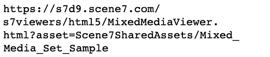

# Bild, Färgruta, Snurra och Blandade medieuppsättningar {#media-sets}

Med Dynamic Media Classic set-samlingar får du en bättre onlineupplevelse, och du kan nu gå steget längre än till enstaka bilder för dynamisk storleksändring och zoomning. I det här avsnittet av självstudiekursen får du lära dig att skapa följande multimedieuppsättningar i Dynamic Media Classic:

- Bilduppsättning
- Uppsättning med färgrutor
- Rotation
- Blandad medieuppsättning

Den visar också hur du använder gruppuppsättningsförinställningar för att automatisera skapandet av uppsättningar via en överföring.

## Allt du alltid vill veta om uppsättningar

Bredvid grundläggande dynamisk storlek och zoomning är uppsättningar förmodligen den mest använda Dynamic Media Classic-underprodukten. Uppsättningar är i princip&quot;virtuella&quot; resurser som inte innehåller några faktiska bilder, men som består av en uppsättning relationer till andra bilder och/eller video. Den största fördelen med scenbilder är att de är miniprogram som är klara &quot;utanför hyllan&quot;. Därför menar vi att varje set-visningsprogram har sin egen logik och sitt eget gränssnitt, så att allt du behöver göra är att anropa dem på webbplatsen. Dessutom krävs det bara att du spårar ett enda resurs-ID per uppsättning, i stället för att du själv måste hantera alla medlemsresurser och relationer.

När du skapar en uppsättning hanteras den som en separat resurs som måste markeras för publicering och publiceras innan den kan hanteras från en URL. Alla medlemsresurser måste också publiceras.

### Typer av uppsättningar

Låt oss lära oss mer om de fyra olika uppsättningar du kan skapa i Dynamic Media Classic: Bild, Färgruta, Snurra och Blandade medieuppsättningar.

## Bilduppsättning

Det här är den vanligaste typen av uppsättning. Du använder det vanligtvis för alternativa vyer av samma objekt. Det består av flera bilder som du läser in i visningsprogrammet genom att klicka på den associerade miniatyrbilden för den bilden.

_Exempel på en bilduppsättning_

URL:en för bilduppsättningen ovan kan se ut som:

- Läs mer om bilduppsättningar med [Snabbstart till bilduppsättningar](https://experienceleague.adobe.com/docs/dynamic-media-classic/using/image-sets/quick-start-image-sets.html).
- Lär dig hur [Skapa en bilduppsättning](https://experienceleague.adobe.com/docs/dynamic-media-classic/using/image-sets/creating-image-set.html#creating-an-image-set).

### Uppsättning med färgrutor

Den här typen av uppsättning används vanligtvis för att visa färgade vyer av samma objekt. Det består av par med bilder och färgrutor.

Den största skillnaden mellan en färgruta och en bilduppsättning är att färgruteuppsättningar använder en annan bild som en klickbar färgruta, medan bilduppsättningar använder en miniatyrversion av originalbilden som kan klickas.

Färgruteuppsättningar färglägger inte bilder (en vanlig missuppfattning). Bilderna byts bara ut, precis som i en bilduppsättning. Minifärgrutebilderna kunde ha skapats med Photoshop, varje färg kunde ha fotograferats separat eller så kunde beskärningsverktyget i Dynamic Media Classic ha använts för att skapa en färgruta av en av färgbilderna.

_Exempel på en färgruteuppsättning_

URL:en för färgruteuppsättningen ovan kan se ut som:

- Läs mer om färgruteuppsättningar med [Snabbstart till färgrutor](https://experienceleague.adobe.com/docs/dynamic-media-classic/using/swatch-sets/quick-start-swatch-sets.html).
- Lär dig hur [Skapa en färgruteuppsättning](https://experienceleague.adobe.com/docs/dynamic-media-classic/using/swatch-sets/creating-swatch-set.html#creating-a-swatch-set).

### Rotation

Den här uppsättningen används vanligtvis för att visa en 360-gradersvy av ett objekt. Precis som för färgruteuppsättningar använder snurra uppsättningar ingen 3D-magi - det verkliga arbetet är att skapa många foton av en bild från alla sidor. Med visningsprogrammet kan du enkelt växla mellan bilderna som en stop-motion-animering.

Snurra uppsättningar kan antingen snurra i en riktning längs en enda axel, eller om de alternativt skapas som en 2D-snurra - snurra på flera axlar. En bil kan till exempel roteras medan alla hjul är på marken och sedan&quot;vändas&quot; och roteras även på bakhjulen. För en korrekt konfigurerad tvådimensionell rotationsuppsättning bör antalet bilder per rad för varje axel vara detsamma. Det innebär att om du snurrar på två axlar behöver du dubbelt så många bilder som ett vinkelintervall.

_Exempel på en snurruppsättning_

URL:en för den ovanstående rotationsuppsättningen kan se ut som:

- Läs mer om snurruppsättningar med [Snabbstart till snurra uppsättningar](https://experienceleague.adobe.com/docs/dynamic-media-classic/using/spin-sets/quick-start-spin-sets.html).
- Lär dig hur [Skapa en snurra uppsättning](https://experienceleague.adobe.com/docs/dynamic-media-classic/using/spin-sets/creating-spin-set.html#creating-a-spin-set).

## Blandad medieuppsättning

Detta är en kombinationsuppsättning. Du kan kombinera alla tidigare uppsättningar samt lägga till video i ett enda visningsprogram. I det här arbetsflödet skapar du först någon av komponentuppsättningarna och sätter sedan ihop dem till en blandad medieuppsättning.

_Exempel på en blandad medieuppsättning_

URL:en för den ovannämnda blandade medieuppsättningen kan se ut som:

- Läs mer om blandade medieuppsättningar med [Snabbstart till blandade medieuppsättningar](https://experienceleague.adobe.com/docs/dynamic-media-classic/using/mixed-media-sets/quick-start-mixed-media-sets.html).

- Lär dig hur [Skapa en blandad medieuppsättning](https://experienceleague.adobe.com/docs/dynamic-media-classic/using/mixed-media-sets/creating-mixed-media-set.html#creating-a-mixed-media-set).

Om du vill visa en bild för zoomning, en uppsättning eller en video på webbplatsen anropar du den i ett Dynamic Media Classic-visningsprogram. Dynamic Media Classic innehåller visningsprogram för mediefiler som färgruteuppsättningar, snurpuppsättningar, video och många andra.

Läs mer om [Tittare för AEM Assets och Dynamic Media Classic](https://experienceleague.adobe.com/docs/dynamic-media-developer-resources/library/viewers-aem-assets-dmc/c-html5-s7-aem-asset-viewers.html).

## Förinställningar för gruppuppsättning

Fram tills nu har vi diskuterat hur du skapar uppsättningar manuellt med funktionen Dynamic Media Classic Build. Det är dock möjligt att automatisera skapandet av bilduppsättningar och snurruppsättningar med en förinställning för gruppuppsättning, förutsatt att du har en standardiserad namnkonvention.

Varje förinställning är en unik, självständig uppsättning instruktioner som definierar hur uppsättningen ska skapas med bilder som matchar de definierade namnkonventionerna. I förinställningen definierar du först namnkonventioner för de resurser som du vill gruppera tillsammans i en uppsättning. En förinställning för gruppuppsättning kan sedan skapas för att referera till dessa bilder.

Du kan skapa förinställningen själv (de finns under **Inställningar > Programinställningar > Gruppera förinställningar** ) bör du som en god praxis låta ditt konsultteam eller din tekniska support konfigurera det åt dig. Här är varför:

- Förinställningar för gruppuppsättningar kan vara komplicerade att konfigurera - de drivs av reguljära uttryck och om du inte är utvecklare kan den här syntaxen vara okänd eller förvirrande.
- När de har skapats aktiveras de som standard. Det finns ingen ångra-funktion. Om du börjar överföra tusentals bilder och din förinställning är felaktigt konfigurerad kan det resultera i hundratals eller tusentals uppsättningar som du måste hitta och ta bort manuellt.

En enkel namnkonvention föreslogs tidigare som skulle vara mycket enkel att bygga in i en förinställning för gruppuppsättning. Eftersom förinställningarna är mycket flexibla kan de hantera komplexa namngivningsstrategier. Kort och gott: bilderna som hör till en uppsättning ska knytas ihop med ett gemensamt namn - ofta är det SKU-numret eller produkt-ID:t. I Dynamic Media Classic kan du ange en standardnamnkonvention för alla dina bilder som ska användas för en förinställning, eller så kan du skapa flera förinställningar med olika namnregler.

Förinställningar för gruppuppsättning används endast vid överföring. De kan inte köras efter att bilderna har överförts. Därför är det viktigt att planera namnkonventionen och få en förinställning byggd innan du börjar läsa in alla dina bilder.

När förinställningarna har skapats kan företagsadministratören välja om de är aktiva eller inaktiva. Aktiva innebär att de visas på överföringssidan under **Jobbalternativ** medan inaktiva förinställningar förblir dolda.

Lär dig hur [Skapa en förinställning för gruppuppsättning](https://experienceleague.adobe.com/docs/dynamic-media-classic/using/setup/application-setup.html#creating-a-batch-set-preset).

### Använda förinställningar för gruppuppsättning vid överföring

Så här använder du gruppuppsättningsförinställningar vid överföring när de har skapats:

1. Klicka **Överför** och välj antingen **Från skrivbordet** eller **Via FTP**.
2. Klicka **Jobbalternativ**.
3. Öppna **Förinställningar för gruppuppsättning** och kontrollera eller avmarkera förinställningen för att använda den vid överföringen.
4. När överföringen är klar letar du efter de färdiga uppsättningarna i mappen.

Läs mer om [Förinställningar för gruppuppsättning](https://experienceleague.adobe.com/docs/dynamic-media-classic/using/setup/application-setup.html#batch-set-presets).
