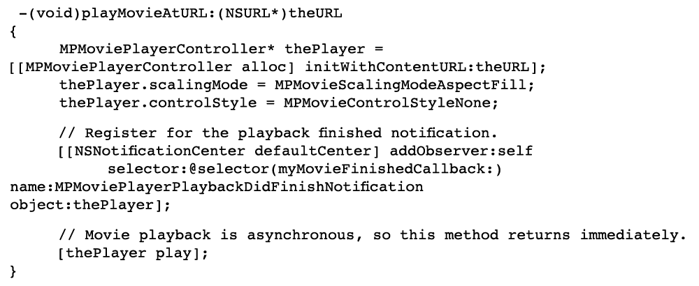

# Videoöversikt {#video-overview}

Dynamic Media Classic innehåller automatisk konvertering av video vid överföring, direktuppspelad video till datorer och mobila enheter samt anpassningsbara videouppsättningar som är optimerade för uppspelning baserat på enhet och bandbredd. En av de viktigaste sakerna med video är att arbetsflödet är enkelt - det är utformat så att alla kan använda det, även om de inte känner till videotekniken.

I slutet av kursen får du lära dig att:

- Överför och koda (transkoda) video till olika storlekar och format
- Välj bland tillgängliga videoförinställningar för överföring
- Lägga till eller redigera en förinställning för videokodning
- Förhandsgranska videoklipp i ett videovisningsprogram
- Distribuera video på webbplatser och mobilsajter
- Lägga till bildtexter och kapitelmarkörer i video
- Anpassa och publicera videovisningsprogram för dator- och mobilanvändare

>[!NOTE]
>
>Alla URL-adresser i det här kapitlet är endast avsedda som illustrationer. De är inte direktlänkar.

## Översikt över Dynamic Media Classic Video

Först får vi en bättre uppfattning om möjligheterna med video med Dynamic Media Classic.

### Funktioner och funktioner

Dynamic Media Classic videoplattform har alla delar av videolösningen - överföring, konvertering och hantering av videor, möjlighet att lägga till bildtexter och kapitelmarkörer i en video samt möjlighet att använda förinställningar för enkel uppspelning.

Det gör det enkelt att publicera högkvalitativ adaptiv video för direktuppspelning på flera skärmar, inklusive datorer, iOS, Android™, BlackBerry® och Windows-enheter. En adaptiv videouppsättning grupperar versioner av samma video som är kodade med olika bithastigheter och format som 400 kbit/s, 800 kbit/s och 1 000 kbit/s. Datorns eller mobilenhetens tillgängliga bandbredd identifieras.

Dessutom ändras videokvaliteten dynamiskt automatiskt om nätverksförhållandena ändras på datorn eller den mobila enheten. Om en kund går över till helskärmsläge på en stationär dator svarar den adaptiva videouppsättningen med en bättre upplösning, vilket förbättrar kundens tittarupplevelse. Med adaptiva videouppsättningar får du bästa möjliga uppspelning för kunder som spelar upp Dynamic Media Classic-video på flera skärmar och enheter.

### Videohantering

Att arbeta med video kan vara mer komplext än att arbeta med stillbilder. Med video hanterar du många format och standarder och osäkerheten om publiken kan spela upp dina klipp. Dynamic Media Classic gör det enkelt att arbeta med video med kraftfulla verktyg&quot;under huven&quot;, men eliminerar komplexiteten i att arbeta med dem.

Dynamic Media Classic känner igen och kan arbeta med många olika källformat. Att läsa videon är dock bara en del av arbetet - du måste också konvertera den till ett webbvänligt format. Dynamic Media Classic tar hand om detta genom att göra det möjligt att konvertera video till H.264-video.

Att konvertera videon själv kan bli komplicerat med de många professionella och entusiastverktygen som finns. Dynamic Media Classic gör det enkelt med enkla förinställningar som är optimerade för olika kvalitetsinställningar. Om du vill ha något mer anpassat kan du även skapa egna förinställningar.

Om du har mycket video kommer du att uppskatta möjligheten att hantera allt material tillsammans med bilder och andra media i Dynamic Media Classic. Du kan ordna, katalogisera och söka efter resurser, inklusive videomaterial, med stöd XMP metadata.

### Videouppspelning

Ungefär som problemet med att konvertera video för att göra den webbvänlig och åtkomlig är problemet med att implementera och distribuera video på webbplatsen. Att välja om du vill köpa en spelare eller skapa en egen, så att den blir kompatibel för olika enheter och skärmar, och sedan underhålla spelarna kan vara en heltidssyssla.

Återigen är Dynamic Media Classic metod att låta dig välja den förinställning och det visningsprogram som passar dina behov. Du har många olika visningsprogramalternativ och ett bibliotek med många förinställningar.

Du kan enkelt leverera video till webben och mobila enheter, eftersom Dynamic Media Classic har stöd för HTML 5-video, vilket innebär att du kan rikta in dig på användare som kör olika webbläsare, liksom på Android™- och iOS-plattformsanvändare. Med direktuppspelad video kan du smidigt spela upp längre eller HD-innehåll, medan progressiv HTML5-video har förinställningar som är optimerade för små skärmar.

Visningsförinställningar för video kan delvis konfigureras beroende på visningsprogramtyp.

Integreringen sker på samma sätt som alla tittare via en enda Dynamic Media Classic-URL per visningsprogram eller video.

>[!NOTE]
>
>Det bästa sättet är att använda videovisningsprogram i Dynamic Media Classic HTML 5. De förinställningar som används i videovisningsprogram för HTML5 är robusta videospelare. Genom att i en enda spelare kombinera möjligheten att utforma uppspelningskomponenterna med HTML 5 och CSS, ha inbäddad uppspelning och använda adaptiv och progressiv strömning beroende på webbläsarens kapacitet, kan du utöka räckvidden för ditt multimedieinnehåll till datorer, surfplattor och mobilanvändare och få en smidig videoupplevelse.

En sista kommentar om Dynamic Media Classic-video som kan gälla vissa kunder: alla företag kanske inte har automatisk konvertering, strömning eller videoförinställningar aktiverade för sitt konto. Om du av någon anledning inte kan komma åt URL:er för direktuppspelad video kan det bero på detta. Du kan överföra och publicera progressivt nedladdad video och ha tillgång till alla videovisningsprogram. Om du vill utnyttja Dynamic Media Classic alla videofunktioner kontaktar du din Account Manager eller Sales Manager för att aktivera de här funktionerna.

Läs mer om [Video i Dynamic Media Classic](https://experienceleague.adobe.com/docs/dynamic-media-classic/using/video/quick-start-video.html?lang=sv-SE).

## Video 101

### Grundläggande videobegrepp och terminologi

Innan vi börjar ska vi diskutera några termer som du bör känna till för att arbeta med video. Dessa koncept är inte specifika för Dynamic Media Classic, och om du ska hantera video för en professionell webbplats är det bäst att du får lite mer utbildning i ämnet. Vi rekommenderar vissa resurser i slutet av det här avsnittet.

- **Kodning/omkodning.** Kodning är processen att tillämpa videokomprimering för att konvertera okomprimerade råvideodata till ett format som gör det enklare att arbeta med. Även om omkodning fungerar på liknande sätt, hänvisar det till konvertering från en kodningsmetod till en annan.

   - De vanligaste videofilerna som skapas med videoredigeringsprogrammet är ofta för stora och har inte rätt format för leverans till onlinedestinationer. De kodas vanligtvis för snabb uppspelning på datorn och för redigering, men inte för leverans via webben.
   - Om du vill konvertera digital video till rätt format och specifikationer för uppspelning på olika skärmar, kodas videofiler om till en mindre, effektiv filstorlek som är optimal för distribution på webben och till mobila enheter.

- **Videokomprimering.** Minskar mängden data som används för att representera digitala videobilder och är en kombination av spatial bildkomprimering och temporal rörelsekompensation.

   - De flesta komprimeringstekniker är förstörande, vilket innebär att de genererar data för att uppnå en mindre storlek.
   - DV-video är till exempel komprimerat relativt lite och gör att du enkelt kan redigera källmaterialet, men det är mycket för stort att använda via webben eller till och med på en dvd.

- **Filformat.** Formatet är en behållare, ungefär som en ZIP-fil, som avgör hur filer ordnas i videofilen, men vanligtvis inte hur de kodas.

   - Vanliga filformat för källvideo är bland annat Windows Media (WMV), QuickTime (MOV), Microsoft® AVI och MPEG. Format som publiceras av Dynamic Media Classic är MP4.
   - En videofil innehåller vanligtvis flera spår - ett videospår (utan ljud) och ett eller flera ljudspår (utan video) - som är sammankopplade och synkroniserade.
   - Videofilformatet avgör hur dessa olika dataspår och metadata ordnas.

- **Kodek.** En videokodek beskriver den algoritm med vilken en video kodas med komprimering. Ljudet kodas också med en ljudkodek.

   - Kodekar minimerar mängden information som krävs för att spela upp video. I stället för information om varje enskild bildruta sparas bara information om skillnaderna mellan en bildruta och nästa.
   - Eftersom de flesta videoklipp inte ändras så mycket från en bildruta till nästa, kan du använda codecenheter för hög komprimeringshastighet, vilket ger mindre filstorlekar.
   - En videospelare avkodar videon enligt dess kodek och visar sedan en serie bilder, eller bildrutor, på skärmen.
   - Vanliga videokodekar är H.264, On2 VP6 och H.263.

- **Upplösning.** Höjd och bredd för videon i pixlar.

   - Storleken på källvideon bestäms av kameran och utdata från redigeringsprogrammet. En HD-kamera skapar högupplöst 1 920 x 1 080-video, men om du vill spela upp mjukt på webben nedsamplar du den (ändrar storlek) till en lägre upplösning, till exempel 1 280 x 720, 640 x 480 eller lägre.
   - Upplösningen har en direkt inverkan på filstorleken och bandbredden som krävs för att spela upp videon.

- **Visa proportioner.** Förhållandet mellan en videos bredd och videons höjd. När videofilens proportioner inte matchar spelarens proportioner kan du se&quot;svarta fält&quot; eller tomt utrymme. Två vanliga proportioner som används för att visa video är:

   - 4:3 (1.33:1). Används för nästan alla tv-sändningar i standardformat.
   - 16:9 (1,78:1). Används för nästan alla HDTV-skärmar och filmer.

- **Bithastighet/datahastighet.** Den datamängd som kodas för att skapa en enda sekund av videouppspelning (i kB per sekund).

   - Ju lägre bithastighet, desto mer önskvärd är den för webben eftersom den kan hämtas snabbare. Det kan dock också betyda att kvaliteten är låg på grund av komprimeringsförluster.
   - En bra kodek bör balansera låg bithastighet med god kvalitet.

- **Bildrutefrekvens (bildrutor per sekund eller fps).** Antalet bildrutor, eller stillbilder, för varje sekund i videon. Normalt sänds nordamerikansk-tv (NTSC) i 29,97 bildrutor/s, europeisk och asiatisk-tv (PAL) i 25 bildrutor/s och film (analog och digital) i allmänhet i 24 (23,976) bildrutor/s.

   - Det finns även progressiva och sammanflätade bildrutor som gör det förvirrande. Varje progressiv bildruta innehåller en hel bildram, medan sammanflätade bildrutor innehåller varannan rad med pixlar i en bildram. Bildrutorna spelas sedan upp snabbt och ser ut att smälta samman. Film använder en progressiv skanningsmetod, medan digital video vanligtvis är sammanflätad.
   - Vanligtvis spelar det ingen roll om källmaterialet är sammanflätat eller inte - Dynamic Media Classic bevarar skanningsmetoden i den konverterade videon.
   - Direktuppspelning/progressiv leverans. Videoströmning är sändning av media i ett kontinuerligt flöde som kan spelas upp när det kommer, medan progressivt nedladdad video laddas ned som vilken annan fil som helst från en server och cachas lokalt i webbläsaren.

Förhoppningsvis hjälper den här introduktionen dig att förstå de olika alternativen som finns när du använder Dynamic Media Classic-video.

## Videoarbetsflöde

När du arbetar med video i Dynamic Media Classic följer du ett grundläggande arbetsflöde som påminner om att arbeta med bilder.

1. Börja med att ladda upp videofiler till Dynamic Media Classic. Det gör du genom att öppna **Verktygsmenyn** längst ned på panelen för Dynamic Media Classic-tillägg och välja **Överför till Dynamic Media Classic > Filer till mappnamn** eller **Överför till Dynamic Media Classic > Mappar till mappnamn**. &quot;Mappnamn&quot; är den mapp som du just nu bläddrar i med tillägget. Videofiler kan vara stora, så vi rekommenderar att du använder FTP för att överföra stora filer. Som en del av överföringen väljer du en eller flera videoförinställningar för kodning av videoklipp. Video kan konverteras till MP4-video vid överföring. Mer information om hur du använder och skapar kodningsförinställningar finns i avsnittet Videoförinställningar nedan. Lär dig mer om [Överföra och koda videor](https://experienceleague.adobe.com/docs/dynamic-media-classic/using/video/uploading-encoding-videos.html?lang=sv-SE).
2. Markera eller markera och ändra en förinställning för visningsprogrammet för video och förhandsgranska videon. Du kan antingen välja en färdig visningsförinställning eller anpassa en egen. Om ni riktar er till mobilanvändare behöver ni inte göra något här, eftersom mobilplattformarna inte kräver ett visningsprogram eller en förinställning. Lär dig mer om [Förhandsgranska videoklipp i en videovisningsprogram](https://experienceleague.adobe.com/docs/dynamic-media-classic/using/video/previewing-videos-video-viewer.html?lang=sv-SE) och [Lägga till eller redigera en förinställning för videovisningsprogram](https://experienceleague.adobe.com/docs/dynamic-media-classic/using/video/previewing-videos-video-viewer.html?lang=sv-SE#adding-or-editing-a-video-viewer-preset).
3. Kör en Video Publish, hämta URL:en och integrera. Den största skillnaden mellan det här steget för videoarbetsflödet jämfört med bildarbetsflödet är att du kör ett särskilt Video Publish istället för (eller kanske) standardpubliceringen för Image Serving. Videovisningsprogramintegrationen på datorn fungerar precis som bildvisningsprogramintegrationen, men för mobila enheter är det ännu enklare - allt du behöver är URL:en till själva videon.

### Om omkodning

Omkodning definierades tidigare som processen att konvertera från en kodningsmetod till en annan. När det gäller Dynamic Media Classic är det processen att konvertera källvideon från det aktuella formatet till MP4. Detta krävs innan videon visas i datorwebbläsaren eller på en mobil enhet.

Dynamic Media Classic kan hantera all transkodning åt dig, en stor fördel. Du kan omkoda videon själv och överföra filer som redan konverterats till MP4, men det kan vara en komplex process som kräver avancerad programvara. Om du inte vet vad du gör får du vanligtvis inga bra resultat vid ditt första försök.

Dynamic Media Classic konverterar inte bara filerna åt dig, det blir också enkelt genom lättanvända förinställningar. Du behöver verkligen inte känna till så mycket om den tekniska sidan av den här processen - allt du bör veta är ungefär den eller de slutliga storlekar som du vill komma ut ur systemet och en uppfattning om den bandbredd som slutanvändarna har.

De färdiga förinställningarna är praktiska och täcker de flesta behov, men ibland vill du ha något mer anpassat. I så fall kan du skapa en egen kodningsförinställning. I Dynamic Media Classic kallas en kodningsförinställning för en videoförinställning. Detta förklaras senare i detta kapitel.

### Om direktuppspelning

En annan viktig funktion som är värd att notera är direktuppspelad video, en standardfunktion i Dynamic Media Classic videoplattform. Direktuppspelningsmedia tas kontinuerligt emot av och presenteras för slutanvändaren medan de levereras. Detta är viktigt och önskvärt av flera skäl.

Strömning kräver vanligtvis mindre bandbredd än progressiv nedladdning eftersom bara den del av videon som bevakas levereras. Dynamic Media Classic videoströmningsserver och visningsprogram använder automatisk bandbreddsidentifiering för att leverera bästa möjliga ström för en användares internetanslutning.

Med direktuppspelning börjar videon spelas upp tidigare än med andra metoder. Den utnyttjar också nätverksresurserna effektivare eftersom bara de delar av videon som visas skickas till klienten.

Den andra leveransmetoden är progressiv hämtning. Jämfört med direktuppspelad video finns det bara en konsekvent fördel med progressiv nedladdning - du behöver ingen direktuppspelningsserver för att kunna leverera videon. Och det är här Dynamic Media Classic kommer in - Dynamic Media Classic har en strömningsserver inbyggd i plattformen, så du behöver inte besväret med att underhålla denna dedikerade maskinvara.

Progressiv nedladdning av video kan göras från vilken webbserver som helst. Detta kan vara bekvämt och potentiellt kostnadseffektivt, men tänk på att progressiva nedladdningar har begränsade sök- och navigeringsmöjligheter och att användarna kan komma åt och återanvända innehållet. I vissa situationer, till exempel uppspelning bakom strikta brandväggar i nätverk, kan direktuppspelningsleverans blockeras. I dessa fall kan det vara önskvärt att återställa till progressiv leverans.

Progressiv nedladdning är ett bra val för amatörer eller webbplatser med låg trafik, om de inte har något emot om deras innehåll cachas på användarens dator, om de bara behöver leverera långfilmer (under 10 minuter) eller om besökarna av någon anledning inte kan ta emot strömmande video.

Du måste strömma videon om du behöver avancerade funktioner och har kontroll över videoleveransen, och/eller om du behöver visa videon för en större publik (till exempel flera 100 samtidiga tittare), spåra och rapportera användning eller visningsstatistik, eller om du vill erbjuda tittarna den bästa interaktiva uppspelningsupplevelsen.

Slutligen, om du är orolig för att skydda dina medier för immateriell egendom eller rättighetshanteringsproblem, ger direktuppspelning säkrare leverans av video eftersom mediet inte sparas i klientens cache när det direktuppspelas.

## Videoförinställningar

När du överför videon väljer du bland en eller flera förinställningar som innehåller inställningarna för konvertering av huvudvideon till ett webbvänligt format via kodning. Videoförinställningar finns i två versioner, Adaptiva videoförinställningar och Encoding Presets.

Se [Tillgängliga videoförinställningar](https://experienceleague.adobe.com/docs/dynamic-media-classic/using/setup/application-setup.html?lang=sv-SE#video-presets-for-encoding-video-files).

Anpassade videoförinställningar aktiveras som standard, vilket betyder att de är tillgängliga för kodning. Om du vill använda en enskild kodningsförinställning måste administratören aktivera den för att den ska visas i listan med videoförinställningar.

Lär dig hur du [aktiverar eller inaktiverar videoförinställningar](https://experienceleague.adobe.com/docs/dynamic-media-classic/using/video/uploading-encoding-videos.html?lang=sv-SE#activating-or-deactivating-video-encoding-presets).

Du kan välja någon av många färdiga förinställningar som medföljer Dynamic Media Classic eller skapa egna, men inga förinställningar väljs för överföring som standard. **Om du inte väljer en videoförinställning vid överföring kommer videon alltså inte att konverteras och kan vara opublicerbar**. Men du kan konvertera videon själv offline och överföra och publicera precis som du vill. Videoförinställningar krävs bara om du vill att Dynamic Media Classic ska göra konverteringen åt dig.

Vid överföring väljer du en videoförinställning genom att välja **Videoalternativ** på panelen Jobbalternativ. Sedan väljer du om du vill koda för Dator, Mobil eller Tablet.

- Datorn är till för persondator. Här finns vanligtvis större förinställningar (till exempel HD) som förbrukar mer bandbredd.
- Mobil och surfplatta skapar MP4-video för enheter som iPhone och Android™-smarttelefoner. Den enda skillnaden mellan Mobile och Tablet är att surfplattans förinställningar vanligtvis har en högre bandbredd eftersom de baseras på WiFi-användning. Mobilförinställningar är optimerade för långsammare 3G-användning.

### Frågor att ställa innan du väljer en förinställning

När du väljer en förinställning bör du känna till målgruppen och källmaterialet. Vad vet ni om era kunder? Hur ser de på videon - med en datorskärm eller en mobil enhet?

Vilken upplösning är din video? Om du väljer en förinställning som är större än originalet kan du få en oskarp/pixeliserad video. Det är bra om videon är större än förinställningen, men välj inte en förinställning som är större än källvideon.

Vad är dess proportioner? Om du ser svarta fält runt den konverterade videon väljer du fel proportioner. Dynamic Media Classic kan inte identifiera dessa inställningar automatiskt eftersom programmet först måste undersöka filen innan den kan överföras.

### Videoalternativ, uppdelning

Videoförinställningarna avgör hur videon kodas genom att ange de här inställningarna. Om du inte är bekant med dessa termer kan du läsa avsnittet Grundläggande videobegrepp och terminologi ovan.

- **Proportioner.** Standard 4:3 eller widescreen 16:9.
- **Storlek.** Detta är samma som visningsupplösningen och mäts i pixlar. Detta är relaterat till proportionerna. I förhållandet 16:9 är en video 432 x 240 pixlar, medan den vid 4:3 är 320 x 240 pixlar.
- **FPS.** Standardbildhastigheten är 30 bildrutor per sekund, 25 bildrutor per sekund eller 24 bildrutor per sekund (fps), beroende på videostandarden - NTSC, PAL eller Film. Den här inställningen spelar ingen roll, eftersom Dynamic Media Classic alltid använder samma bildhastighet som källvideon.
- **Format.** Detta är MP4.
- **Bandbredd.** Det här är den önskade anslutningshastigheten för målanvändaren. Har de en snabb internetuppkoppling eller en långsam? Använder de oftast stationära datorer eller mobila enheter? Detta är också relaterat till upplösning (storlek), eftersom ju större videon är, desto mer bandbredd krävs.

### Bestämma datahastigheten eller bithastigheten för videon

Att beräkna bithastigheten för videon är en av de minst kända faktorerna för att visa videon på webben, men det kan vara den viktigaste eftersom den direkt påverkar användarupplevelsen. Om du anger för hög bithastighet får du hög videokvalitet men sämre prestanda. Användare med långsammare internetanslutningar måste vänta medan videon hela tiden pausas när den spelas upp. Men om du ställer in den för låg blir kvaliteten sämre. I videoförinställningen föreslår Dynamic Media Classic ett dataintervall som är beroende av målbandbredden. Det är en bra utgångspunkt.

Men om du vill komma på det själv behöver du en beräknare av bithastigheten. Det här är ett verktyg som ofta används av videoproffs och entusiaster för att uppskatta hur mycket data som får plats i en viss ström eller media (t.ex. en dvd).

## Skapa en anpassad videoförinställning

Ibland kanske du behöver en speciell videoförinställning som inte matchar inställningarna för de inbyggda videoförinställningarna. Detta kan inträffa om du har en anpassad video med en viss storlek, till exempel en video som skapats från ett 3D-animeringsprogram eller en som har beskurits från sin ursprungliga storlek. Du kanske vill experimentera med olika bandbreddsinställningar för att få en video med högre eller lägre kvalitet. Hur det än är skapar du en anpassad videoförinställning för enskild kodning.

### Arbetsflöde för videoförinställning

1. Videoförinställningarna finns under **Konfigurera > Programinställningar > Videoförinställningar**. Här finns en lista med alla kodningsförinställningar som är tillgängliga för ditt företag.

   - Alla konton för direktuppspelad video har dussintals förinställningar, och om du skapar egna förinställningar kan du även se dem här.
   - Du kan filtrera efter typ med hjälp av den nedrullningsbara menyn. Förinställningarna är uppdelade i Dator, Mobil och Tablet.

     

2. I kolumnen Aktiv kan du välja om du vill visa alla förinställningar vid överföring eller bara de du väljer. Om du är i USA kan du avmarkera de europeiska PAL-förinställningarna och avmarkera NTSC-förinställningarna om du är i Storbritannien/EMEA.
3. Klicka på knappen **Lägg till** för att skapa en anpassad förinställning. Då öppnas panelen Lägg till videoförinställning. Processen här liknar den du gör när du skapar en bildförinställning.
4. Ge den först ett **förinställningsnamn** som ska visas i listan med förinställningar. I exemplet ovan är den här förinställningen för videoklipp med skärmdumpar.
5. **Beskrivning** är valfri, men den ger användarna ett verktygstips som beskriver syftet med den här förinställningen.
6. **Kodningsfilsuffixet** läggs till i slutet av namnet på videon som du skapar här. Kom ihåg att du kommer att ha både en huvudvideo och den här kodade videon, som är en härledd från huvudvideon, och att inga två resurser i Dynamic Media Classic kan ha samma resurs-ID.
7. **Uppspelningsenheten** är den enhet där du väljer vilket videofilformat du vill ha (dator, mobil eller surfplatta). Kom ihåg att Mobile och Tablet har samma MP4-format. Dynamic Media Classic behöver bara veta i vilken kategori förinställningen ska placeras, men den teoretiska skillnaden är att förinställningar för surfplattor vanligtvis är för en snabbare internetanslutning eftersom alla stöder WiFi.
8. **Måldatahastighet** är något du måste räkna ut själv, men du kan se ett föreslaget intervall i bilden nedan. Du kan också dra skjutreglaget till den ungefärliga målbandbredden. För en mer exakt bild använder du en bithastighetskalkylator. Det finns en del testversioner och fel.

   

9. Ange källfilens **proportioner**. Den här inställningen är direkt knuten till storleken nedan. Om du väljer _Egen_ måste du ange både bredd och höjd manuellt.
10. Om du väljer en proportion anger du ett värde för **Upplösningsstorlek** så fyller Dynamic Media Classic automatiskt i det andra värdet. Om du vill ha en anpassad proportion fyller du i båda värdena. Storleken bör överensstämma med datahastigheten. Om du anger en låg datahastighet och en stor storlek förväntar du dig sämre kvalitet.
11. Klicka på **Spara** om du vill spara förinställningen. Till skillnad från alla andra förinställningar behöver du inte publicera just nu, eftersom förinställningarna bara är till för att överföra filer. Senare måste du publicera de kodade videoklippen, men förinställningarna gäller endast för intern Dynamic Media Classic-användning.
12. Gå till **Överför** om du vill verifiera din förinställning för video i överföringslistan. Välj **Jobbalternativ** och expandera **Videoalternativ**. Din förinställning visas i kategorin för den uppspelningsenhet som du väljer (Dator, Mobil eller Surfplatta).

Läs mer om [Lägga till eller redigera en videoförinställning](https://experienceleague.adobe.com/docs/dynamic-media-classic/using/video/uploading-encoding-videos.html?lang=sv-SE#adding-or-editing-a-video-encoding-preset).

## Lägg till bildtexter i videon

Ibland kan det vara praktiskt att lägga till beskrivningar i videon, t.ex. när du behöver visa videon på flera språk, men inte vill duplicera ljudet på ett annat språk eller spela in videon igen på olika språk. Om du lägger till bildtexter blir de som har hörselnedsättning mer tillgängliga och använder undertextning. Dynamic Media Classic gör det enkelt att lägga till bildtexter i videoklipp.

Lär dig hur du [lägger till bildtexter i videon](https://experienceleague.adobe.com/docs/dynamic-media-classic/using/video/adding-captions-video.html?lang=sv-SE).

## Lägg till kapitelmarkörer i videon

För videor med långa format uppskattar de som tittar på videon troligen den bekvämlighet och smidighet som finns genom att navigera i videon med kapitelmarkörer. Med Dynamic Media Classic kan du enkelt lägga till kapitelmarkörer i videon.

Lär dig hur du [lägger till kapitelmarkörer i video](https://experienceleague.adobe.com/docs/dynamic-media-classic/using/video/adding-chapter-markers-video.html?lang=sv-SE).

## Videoimplementeringsämnen

### Publish &amp; Copy URL

Det sista steget i Dynamic Media Classic arbetsflöde är att publicera videoinnehåll. Men videon har ett eget publiceringsjobb, som kallas Video Server-publicering, som finns under Avancerat.

Lär dig hur du [Publish din video](https://experienceleague.adobe.com/docs/dynamic-media-classic/using/video/deploying-video-websites-mobile-sites.html?lang=sv-SE#publishing-video).

När du har kört en videopublicering kan du få en URL-adress för att komma åt dina videor och eventuella förinställningar för Dynamic Media Classic Viewer i en webbläsare. Men om du anpassar eller skapar en egen förinställning för Video Viewer måste du köra en separat Image Server-publicering.

- Lär dig hur du [länkar en URL till en mobilwebbplats eller en webbplats](https://experienceleague.adobe.com/docs/dynamic-media-classic/using/video/deploying-video-websites-mobile-sites.html?lang=sv-SE#linking-a-video-url-to-a-mobile-site-or-a-website).
- Lär dig hur du [bäddar in visningsprogrammet på en webbsida](https://experienceleague.adobe.com/docs/dynamic-media-classic/using/video/deploying-video-websites-mobile-sites.html?lang=sv-SE#embedding-the-video-viewer-on-a-web-page).

Du kan också distribuera videon med en videospelare från tredje part eller med en anpassad videospelare.

Lär dig hur du [distribuerar video med en tredjepartsvideospelare](https://experienceleague.adobe.com/docs/dynamic-media-classic/using/video/deploying-video-websites-mobile-sites.html?lang=sv-SE#deploying-video-using-a-third-party-video-player).

Om du också vill använda videominiatyrbilderna - den bild som extraheras från videon - måste du köra en Image Server-publicering. Det beror på att videons miniatyrbild finns på bildservern, medan videon finns på videoservern. Videominiatyrbilder kan användas i videosökresultat, videouppspelningslistor och kan användas som den inledande&quot;affischbildrutan&quot; som visas i videobildrutan innan videon spelas upp.

Läs mer om [Arbeta med videominiatyrer](https://experienceleague.adobe.com/docs/dynamic-media-classic/using/video/deploying-video-websites-mobile-sites.html?lang=sv-SE#working-with-video-thumbnails).

### Välja och anpassa en visningsförinställning

Processen för att välja och anpassa en visningsförinställning är densamma som för bilder. Du kan antingen skapa en förinställning eller ändra en befintlig förinställning och spara under ett nytt namn, göra redigeringar och köra en Image Serving-publicering. Alla visningsförinställningar publiceras på bildservern, inte bara förinställningar för bilder, och därför måste du köra en bildpublicering för att kunna se dina nya eller ändrade förinställningar.

>[!TIP]
>
>Kör en Image Serving-publicering efter din Video Server-publicering för att publicera miniatyrbilder som är kopplade till dina videor.

## Optimering av videosökmotor

sökmotoroptimering (SEO) är processen att förbättra synligheten för en webbplats eller en webbsida i sökmotorer. Sökmotorer är utmärkta på att samla in information om textbaserat innehåll, men de kan inte hämta in information om video på ett adekvat sätt om de inte får den här informationen. Med Dynamic Media Classic Video SEO kan du använda metadata för att ge sökmotorer beskrivningar av videoklipp. Med funktionen Video SEO kan du skapa videosemappningar och medie-RSS-flöden (mRSS).

- **Webbplatskarta för video**. Informerar Google om exakt var och vad videoinnehållet finns på en webbplats. Därför är videor helt sökbara i Google. En webbplatskarta för video kan till exempel ange körningstid och videokategorier.
- **mRSS-feed**. Används av innehållsutgivare för att skicka mediefiler till Yahoo! Videosökning. Google har stöd för både Video Sitemap och Media RSS-flöden (mRSS) för att skicka information till sökmotorer.

När du skapar videosemappningar och mRSS-flöden bestämmer du vilka metadatafält från videofiler som ska inkluderas. På det här sättet beskriver du videoklipp för sökmotorer så att sökmotorer kan dirigera trafik till videofilmer på din webbplats på ett mer exakt sätt.

När webbplatskartan eller feeden har skapats kan du låta Dynamic Media Classic publicera den automatiskt, publicera den manuellt eller helt enkelt generera en fil som du kan redigera senare. Dessutom kan Dynamic Media Classic automatiskt generera och publicera den här filen varje dag.

När du är klar skickar du filen eller URL-adressen till sökmotorn. Denna uppgift utförs utanför Dynamic Media Classic, men vi diskuterar den kortfattat nedan.

### Krav för platskarta/mRSS-filer

För att Google och andra sökmotorer inte ska kunna avvisa dina filer måste de ha rätt format och innehålla viss information. Dynamic Media Classic genererar en korrekt formaterad fil, men om informationen inte är tillgänglig för vissa videoklipp inkluderas de inte i filen.

De obligatoriska fälten är Landningssida (URL:en för sidan som visar videon, inte URL:en till själva videon), Titel och Beskrivning. Varje video måste ha en post för dessa objekt, annars inkluderas den inte i den genererade filen. Valfria fält är taggar och kategori.

Det finns två andra obligatoriska fält - Innehålls-URL, URL:en till själva videomaterialet och Miniatyrbild, en URL till en miniatyrbild av videon - men Dynamic Media Classic fyller automatiskt i dessa värden åt dig.

Det rekommenderade arbetsflödet är att bädda in dessa data i videoklipp innan de överförs med XMP metadata, och Dynamic Media Classic extraherar dem när de överförs. Du använder ett program som Adobe Bridge - som ingår i alla Adobe Creative Cloud-program - för att fylla i data i standardmetadatafält.

Om du använder den här metoden behöver du inte ange dessa data manuellt med Dynamic Media Classic. Du kan också använda metadataförinställningar i Dynamic Media Classic som ett snabbt sätt att ange samma data varje gång.

Mer information om det ämnet finns i [Visa, lägga till och exportera metadata](https://experienceleague.adobe.com/docs/dynamic-media-classic/using/managing-assets/viewing-adding-exporting-metadata.html?lang=sv-SE).

När metadata har fyllts i kan du se dem i detaljvyn för videomaterialet. Nyckelord kan också finnas, men de finns under fliken Nyckelord.

- Läs mer om [Lägga till nyckelord](https://experienceleague.adobe.com/docs/dynamic-media-classic/using/managing-assets/viewing-adding-exporting-metadata.html?lang=sv-SE#add-or-edit-keywords).
- Läs mer om [Video-SEO](https://experienceleague.adobe.com/docs/dynamic-media-classic/using/setup/video-seo-search-engine-optimization.html?lang=sv-SE).
- Läs mer om [Inställningar för Video SEO](https://experienceleague.adobe.com/docs/dynamic-media-classic/using/setup/video-seo-search-engine-optimization.html?lang=sv-SE#choosing-video-seo-settings).

#### Konfigurera video-SEO

När du konfigurerar Video SEO börjar du med att välja vilken typ av format du vill ha, vilken genereringsmetod och vilka metadatafält som ska placeras i filen.

1. Gå till **Inställningar > Programinställningar > Video SEO > Inställningar**.
2. Välj ett filformat på menyn **Genereringsläge** . Standardvärdet är Av, så om du vill aktivera det väljer du Videosemap, mRSS eller Båda.
3. Välj om du vill generera automatiskt eller manuellt. För enkelhetens skull rekommenderar vi att du ställer in det på **Automatiskt läge**. Om du väljer Automatiskt anger du även alternativet **Markera för Publish** , annars aktiveras inte filerna. Platskarta och RSS-filer är typer av XML-dokument och måste publiceras som alla andra resurser. Använd ett av de manuella lägena om du inte har all information klar just nu eller bara vill göra en engångsgenerering.
4. Fyll i metadatataggar som används i filerna. Det här steget är inte valfritt. Du måste minst inkludera de tre fälten som är markerade med en asterisk (\*): **Startsida** , **Rubrik** och **Beskrivning**. Om du vill använda dina metadata för dessa åtgärder drar och släpper du fälten från panelen Metadata till höger i ett motsvarande fält i formuläret. Dynamic Media Classic fyller automatiskt i platshållarfältet med faktiska data från varje video. Du behöver inte använda metadatafält. Du kan istället skriva en del statisk text här, men samma text visas för varje video.
5. När du har angett information i de tre obligatoriska fälten aktiverar Dynamic Media Classic knapparna **Spara** och **Spara och generera**. Klicka på en för att spara inställningarna. Använd **Spara** om du är i automatiskt läge och vill att Dynamic Media Classic ska generera filerna senare. Använd **Spara och generera** för att skapa filen direkt.

### Testa och publicera din webbplatskarta för video, mRSS-flöden eller båda filer

Genererade filer visas i kontots rotkatalog (bas).

Dessa filer måste publiceras eftersom Video SEO-verktyget inte kan köra en publicering av sig själv. Så länge de är markerade för publicering skickas de till publiceringsservrarna nästa gång en publicering körs.

Efter publiceringen är filerna tillgängliga i det här URL-formatet.

Exempel:

### Skicka till sökmotorer

Det sista steget i processen är att skicka filer och/eller URL:er till sökmotorer. Dynamic Media Classic kan inte göra det här steget åt dig, men om du skickar URL:en och inte själva XML-filen, bör din feed uppdateras nästa gång filen skapas och publiceras.

Hur du skickar till sökmotorn varierar, men för Google använder du Google Webmaster Tools. Gå sedan till **Platskonfiguration > Platskartor** och klicka på knappen **Skicka en platskarta** . Här kan du placera Dynamic Media Classic-URL:en i SEO-filerna.

### SEO-rapport för video

Dynamic Media Classic tillhandahåller en rapport som visar hur många videoklipp som har tagits med i filerna, och ännu viktigare, vilka inte togs med på grund av fel. Gå till **Konfigurera > Programinställningar > Video SEO > Rapport** om du vill komma åt rapporten.

## Mobilimplementering för MP4-video

Dynamic Media Classic innehåller inte visningsförinställningar för mobiler eftersom visningsprogram inte behöver spela upp video på mobila enheter som stöds. Så länge du kodar till H.264 MP4-formatet - antingen genom att konvertera vid överföring eller förkoda på skrivbordet - kan surfplattor och smarttelefoner som stöds spela upp dina videor utan att behöva använda ett visningsprogram. Detta stöds på Android- och iOS-enheter (iPhone och iPad).

Orsaken till att inget visningsprogram krävs är att båda plattformarna har inbyggt H.264-stöd. Du kan antingen bädda in videon på en HTML5-webbsida, eller bädda in videon i själva programmet, så att Android och iOS har en styrenhet som kan spela upp videon.

På grund av detta ger inte Dynamic Media Classic dig en URL till ett visningsprogram för mobila enheter, utan i stället en URL direkt till videon. I förhandsgranskningsfönstret för en MP4-video finns det länkar för Desktop och Mobile. Mobil-URL:en pekar på den publicerade videon.

En viktig sak att tänka på när det gäller publicerad video är att URL:en visar den fullständiga sökvägen till videon, inte bara resurs-ID:t. När du hanterar bilder kan du anropa bilden med dess resurs-ID, oavsett mappstrukturen. För video måste du dock även ange mappstrukturen. I URL:erna ovan lagras videon i sökvägen:

Detta kan också uttryckas som företagsnamn/mappsökväg/namn för videon.

### Metod 1: Webbläsaruppspelning - HTML5-kod

Om du vill bädda in MP4-video på en webbsida använder du videotaggen HTML5.

Den här metoden fungerar även för datorwebben, men du kan råka ut för problem med webbläsarstödet - inte alla webbläsare på datorn stöder H.264-video, inklusive Firefox.

### Metod 2: Appuppspelning på iOS - Media Player Framework

Du kan också bädda in Dynamic Media Classic MP4-videon i din mobilprogramkod. Här är ett generiskt exempel för iOS som använder Media Player-ramverket som endast ges i illustrationssyfte:

## Ytterligare resurser

Titta på [Dynamic Media-kunskapsbyggaren: Video i Dynamic Media Classic](https://seminars.adobeconnect.com/p2ueiaswkuze) on-demand-webbinariet om du vill veta hur du använder videofunktionerna i Dynamic Media Classic.
