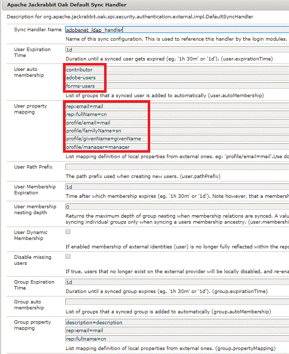

# Använda LDAP med AEM Forms Workflow

Tilldela AEM Forms-arbetsflödesuppgift till den som skickar in formuläret.

När du använder Adaptivt formulär i AEM arbetsflöde vill du dynamiskt tilldela en uppgift till formulärskickarens hanterare. För att uppnå detta måste vi konfigurera AEM med Ldap.

Hur du konfigurerar AEM med LDAP beskrivs i [här.](https://helpx.adobe.com/experience-manager/6-5/sites/administering/using/ldap-config.html)

I den här artikeln bifogas konfigurationsfiler som används för att konfigurera AEM med Adobe Ldap. Dessa filer ingår i paketet som kan importeras med hjälp av pakethanteraren.

På skärmbilden nedan hämtar vi alla användare som tillhör ett visst kostnadsställe. Om du vill hämta alla användare i LDAP kanske du inte använder det extra filtret.


På skärmbilden nedan tilldelar vi grupperna till de användare som hämtas från LDAP till AEM. Observera den formuläranvändargrupp som har tilldelats de importerade användarna. Användaren måste vara medlem i den här gruppen för interaktion med AEM Forms. Vi lagrar även egenskapen manager under noden profile/manager i AEM.



När du har konfigurerat LDAP och importerat användare till AEM, kan vi skapa ett arbetsflöde som tilldelar uppgiften till uppgiftshanteraren. För den här artikeln har vi utvecklat ett enkelt arbetsflöde för godkännande i ett steg.

I det första steget i arbetsflödet anges värdet för initialsteget till Nej. Affärsregeln i det adaptiva formuläret inaktiverar panelen &quot;Information om avsändare&quot; och visar panelen &quot;Godkänd av&quot; baserat på det initiala värdet.

I det andra steget tilldelas uppgiften till den som skickar in formuläret. Vi får inskickarens chef att använda den anpassade koden.


```java
public String getParticipant(WorkItem workItem, WorkflowSession wfSession, MetaDataMap arg2) throws WorkflowException{
resourceResolver = wfSession.adaptTo(ResourceResolver.class);
UserManager userManager = resourceResolver.adaptTo(UserManager.class);
Authorizable workflowInitiator = userManager.getAuthorizable(workItem.getWorkflow().getInitiator());
.
.
String managerPorperty = workflowInitiator.getProperty("profile/manager")[0].getString();
.
.

}
```

Kodfragmentet ansvarar för att hämta hanterar-ID:t och tilldela uppgiften till hanteraren.

Vi får tag i den person som initierade arbetsflödet. Sedan får vi värdet för manager-egenskapen.

Beroende på hur hanteraregenskapen lagras i LDAP kan du behöva göra någon strängändring för att få hanterar-ID:t.

Läs den här artikeln för att implementera din egen [ParticipantChooser .](https://helpx.adobe.com/experience-manager/using/dynamic-steps.html)

Om du vill testa detta på datorn (för anställda på Adobe kan du använda det här exemplet direkt)

* [Hämta och distribuera setvalue-paketet](/help/forms/assets/common-osgi-bundles/SetValueApp.core-1.0-SNAPSHOT.jar). Det här är det anpassade OSGI-paketet för att ställa in chefens egendom.
* [Hämta och installera DevelopingWithServiceUserBundle](/help/forms/assets/common-osgi-bundles/DevelopingWithServiceUser.jar)
* [Importera de resurser som är associerade med den här artikeln till AEM med hjälp av pakethanteraren](assets/aem-forms-ldap.zip).Ingår i detta paket som LDAP-konfigurationsfiler, arbetsflöde och en anpassningsbar form.
* Konfigurera AEM med LDAP med lämpliga LDAP-autentiseringsuppgifter.
* Logga in på AEM med dina LDAP-autentiseringsuppgifter.
* Öppna [timeoffrequestForm](http://localhost:4502/content/dam/formsanddocuments/helpx/timeoffrequestform/jcr:content?wcmmode=disabled)
* Fyll i formuläret och skicka.
* Den som skickar in formuläret bör hämta det för granskning.

>[!NOTE]
>
>Den här anpassade koden för att extrahera hanterarnamnet har testats mot Adobe LDAP. Om du kör den här koden mot en annan LDAP måste du ändra eller skriva en egen getParticipant-implementering för att få fram hanterarens namn.
