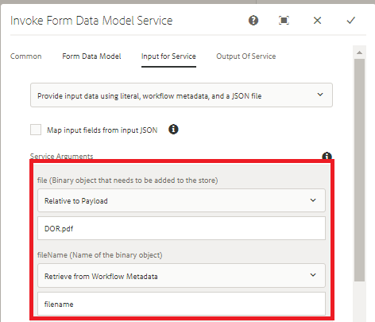

# Bokför binära data med formulärdatamodellen{#using-form-data-model-to-post-binary-data}

Från och med AEM Forms 6.4 har vi nu möjlighet att anropa datamodelltjänsten i form av ett steg i AEM arbetsflöde. I den här artikeln får du hjälp med att skicka ett exempel på hur du kan använda Document of Record med hjälp av Form Data Model Service.

Användningsexemplet är följande:

1. En användare fyller i och skickar ett adaptivt formulär.
1. Det adaptiva formuläret är konfigurerat för att generera arkivdokument.
1. När de här anpassningsbara formulären skickas aktiveras AEM arbetsflöde som använder anrop av datamodelltjänsten för att POST av arkivdokumentet till AEM DAM.

Fliken Formulärdatamodell - Egenskaper

På fliken Service Input mappar vi följande

* file(Det binära objekt som behöver lagras) med egenskapen DOR.pdf i förhållande till nyttolasten. Det innebär att när det adaptiva formuläret skickas, lagras det postdokument som skapas i en fil som heter DOR.pdf i förhållande till arbetsflödets nyttolast.**Kontrollera att den här DOR.pdf-filen är densamma som du anger när du konfigurerar det adaptiva formulärets överföringsegenskap.**

* fileName - Detta är namnet som det binära objektet lagras med i DAM. Du vill alltså att den här egenskapen ska genereras dynamiskt, så att varje fileName blir unikt per sändning. Därför har vi använt processteget i arbetsflödet för att skapa metadataegenskapen filename och ange dess värde till en kombination av medlemsnamn och kontonummer för den person som skickar formuläret. Om personens medlemsnamn till exempel är John Jacobs och kontonumret är 9846 blir filnamnet John Jacobs_9846.pdf

Tjänstindata

>[!NOTE]
>
>Felsökningstips - Om DOR.pdf av någon anledning inte har skapats i DAM återställer du autentiseringsinställningarna för datakällan genom att klicka på [här](http://localhost:4502/mnt/overlay/fd/fdm/gui/components/admin/fdmcloudservice/properties.html?item=%2Fconf%2Fglobal%2Fsettings%2Fcloudconfigs%2Ffdm%2Fpostdortodam). Det här är AEM autentiseringsinställningar, som som standard är admin/admin.

Följ stegen nedan för att testa den här funktionen på servern:

1.[Distribuera Developing with service user bundle](/help/forms/assets/common-osgi-bundles/DevelopingWithServiceUser.jar)

1. [Hämta och distribuera setvalue-paketet](/help/forms/assets/common-osgi-bundles/SetValueApp.core-1.0-SNAPSHOT.jar).Det här anpassade OSGI-paketet används för att skapa metadataegenskapen och ange dess värde från skickade formulärdata.

1. [Importera resurserna](assets/postdortodam.zip) som är kopplad till den här artikeln i AEM med hjälp av pakethanteraren.Du får följande

   1. Arbetsflödesmodell
   1. Anpassat formulär har konfigurerats för att skickas till AEM arbetsflöde
   1. Datakällan har konfigurerats att använda filen PostToDam.JSON
   1. Formulärdatamodell som använder datakällan

1. Peka på [webbläsare som öppnar det adaptiva formuläret](http://localhost:4502/content/dam/formsanddocuments/helpx/timeoffrequestform/jcr:content?wcmmode=disabled)
1. Fyll i formuläret och skicka.
1. Kontrollera Assets-programmet om arkivdokumentet skapas och lagras.

[Swagger-fil](http://localhost:4502/conf/global/settings/cloudconfigs/fdm/postdortodam/jcr:content/swaggerFile) som används för att skapa datakällan är tillgänglig som referens
