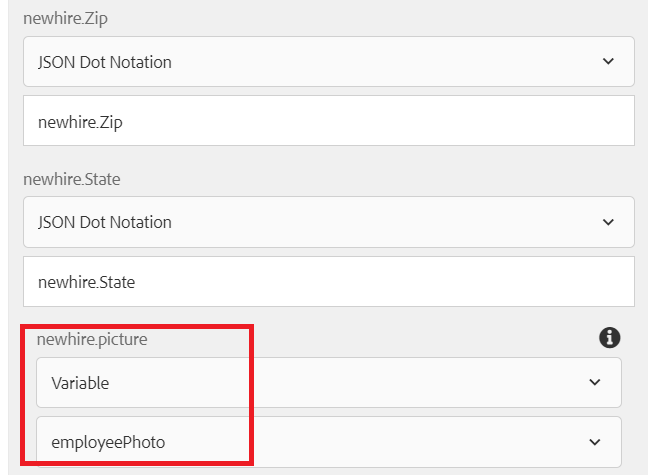

# Infoga formulärbilaga i databas

Den här artikeln går igenom hur du lagrar bifogade formulär i MySQL-databasen.

En vanlig fråga från kunderna är att lagra inhämtade formulärdata och den bifogade formulärfilen i en databastabell.
För att uppnå detta har följande steg utförts:

## Skapa databastabell för formulärdata och bilagor

En tabell som anropades när den skapades för att innehålla formulärdata. Lägg märke till kolumnnamnsbilden av typen **LONGBLOB** för att lagra den bifogade filen


## Skapa formulärdatamodell

En formulärdatamodell skapades för att kommunicera med MySQL-databasen. Du måste skapa följande

* [JDBC-datakälla i AEM](./data-integration-technical-video-setup.md)
* [Formulärdatamodell som bygger på JDBC-datakällan](./jdbc-data-model-technical-video-use.md)

## Skapa arbetsflöde

Om du konfigurerar ditt adaptiva formulär så att det skickas till ett AEM arbetsflöde kan du välja att spara formulärbilagorna i en arbetsflödesvariabel eller spara de bifogade filerna i en angiven mapp under nyttolasten. I det här fallet måste vi spara de bifogade filerna i en arbetsflödesvariabel av typen ArrayList of Document. Från denna ArrayList måste vi extrahera det första objektet och initiera en dokumentvariabel. Arbetsflödesvariablerna anropas **listOfDocuments** och **employeePhoto** skapades.
När det adaptiva formuläret skickas för att utlösa arbetsflödet initierar ett steg i arbetsflödet variabeln employeePhoto med ECMA-skriptet. Följande är ECMA-skriptkoden

```javascript
log.info("executing script now...");
var metaDataMap = graniteWorkItem.getWorkflow().getWorkflowData().getMetaDataMap();
var listOfAttachments = [];
// Make sure you have a workflow variable caled listOfDocuments defined
listOfAttachments = metaDataMap.get("listOfDocuments");
log.info("$$$  got listOfAttachments");
//Make sure you have a workflow variable caled employeePhoto defined
var employeePhoto = listOfAttachments[0];
metaDataMap.put("employeePhoto", employeePhoto);
log.info("Employee Photo updated");
```

Nästa steg i arbetsflödet är att infoga data och den bifogade formuläret i tabellen med hjälp av tjänstkomponenten Anropa formulärdatamodell.

[Hela arbetsflödet med exempelskriptet för eMap kan laddas ned härifrån](assets/add-new-employee.zip).

>[!NOTE]
> Du måste skapa en ny JDBC-baserad formulärdatamodell och använda den formulärdatamodellen i arbetsflödet

## Skapa anpassat formulär

Skapa ett anpassat formulär baserat på formulärdatamodellen som skapades i det tidigare steget. Dra och släpp elementen i formulärdatamodellen i formuläret. Konfigurera formuläröverföringen för att utlösa arbetsflödet och ange följande egenskaper enligt skärmbilden nedan

