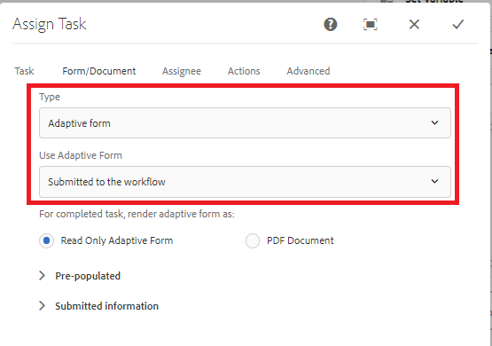

# Skapa återanvändbara AEM Forms-arbetsflödesmodeller{#create-re-usable-aem-forms-workflow-models}

Från och med AEM Forms 6.5 kan vi nu skapa arbetsflödesmodeller som inte är kopplade till ett visst anpassat formulär. Med den här funktionen kan du nu skapa en arbetsflödesmodell som kan anropas för olika formulärinskickade formulär. Med den här funktionen kan du ha ett generiskt arbetsflöde för att hantera alla anpassningsbara formulärinskickat material för granskning och godkännande.

Utför följande steg för att utforma ett sådant arbetsflöde

1. Logga in på AEM
1. Peka webbläsaren på [arbetsflödesmodell](http://localhost:4502/libs/cq/workflow/admin/console/content/models.html)
1. Klicka på __Skapa > Skapa modell__ för att lägga till en arbetsflödesmodell
1. Ange rätt namn och titel för arbetsflödesmodellen och klicka sedan på Klar
1. Öppna den nyskapade modellen i redigeringsläge
1. Dra och släpp Tilldela uppgift-komponenten till arbetsflödesmodellen
1. Öppna konfigurationsegenskaperna för komponenten Tilldela uppgift
1. Fliken Forms och fliken Dokument
1. Välj Typ - Adaptiv form eller Skrivskyddad adaptiv form.

Det finns tre sätt att ange formulärsökvägen

1. Tillgängligt på en absolut sökväg - Det innebär att arbetsflödet är tätt kopplat till adaptiv form. Det är inte vad vi vill här
1. **Skickat till arbetsflödet** - Det innebär att när det adaptiva formuläret skickas, extraherar arbetsflödesmotorn namnet på formuläret från skickade data. Det här alternativet måste väljas
1. Finns på en sökväg i en variabel - Det innebär att det adaptiva formuläret hämtas upp från arbetsflödesvariabeln
På följande skärmbild visas rätt alternativ som du behöver för att välja ett avkopplingsarbetsflöde från ett anpassat formulär

