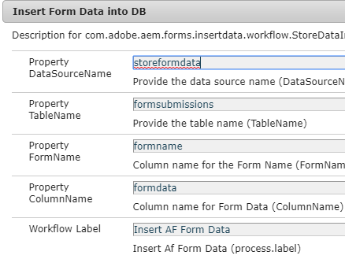

# Lagra inskickade adaptiva formulär i databasen

Det finns många sätt att lagra inskickade formulärdata i den databas du väljer. En JDBC-datakälla kan användas för att lagra data direkt i databasen. Ett anpassat OSGI-paket kan skrivas för att lagra data i databasen. I den här artikeln används anpassade processsteg i AEM arbetsflöde för att lagra data.
Användningsexemplet är att utlösa ett AEM arbetsflöde för att skicka ett adaptivt formulär och ett steg i arbetsflödet lagrar skickade data i databasen.

**Följ stegen nedan för att få det att fungera i ditt system**

* [Ladda ned zip-filen och extrahera innehållet till hårddisken](assets/storeafdataindb.zip)

   * Importera StoreAFInDBWorkflow.zip till AEM med hjälp av pakethanteraren. Paketet har ett exempelarbetsflöde som lagrar AF-data i DB. Öppna arbetsflödesmodellen. Arbetsflödet har bara ett steg. Det här steget anropar koden som är skriven i paketet för att lagra AF-data i databasen. Jag skickar ett argument till processen. Detta är namnet på det adaptiva formulär vars data sparas.
   * Distribuera insertData.core-0.0.1-SNAPSHOT.jar med Felix webbkonsol. Paketet innehåller koden som behövs för att skriva skickade formulärdata till databasen

* Gå till [ConfigMgr](http://localhost:4502/system/console/configMgr)

   * Sök efter JDBC-anslutningspool. Skapa en ny JDBC-anslutningspool för dagskommandon. Ange inställningarna som är specifika för databasen.

   * 
   * Sök efter &quot;**Infoga formulärdata i DB**&quot;
   * Ange egenskaper som är specifika för databasen.
      * DataSourceName:Namn på datakällan som du konfigurerade tidigare.
      * TableName - namnet på den tabell där du vill lagra AF-data
      * FormName - Kolumnnamn som ska innehålla formulärets namn
      * ColumnName - Kolumnnamn som AF-data ska lagras i

   

* Skapa ett adaptivt formulär.

* Associera den adaptiva formen med AEM Workflow(StoreAFValuesinDB) enligt bilden nedan.

* Se till att du anger &quot;data.xml&quot; i sökvägen till datafilen som visas på skärmbilden nedan

   

* Förhandsgranska formuläret och skicka

* Om allt har gått bra bör du se hur formulärdata lagras i tabellen och kolumnen som du anger

