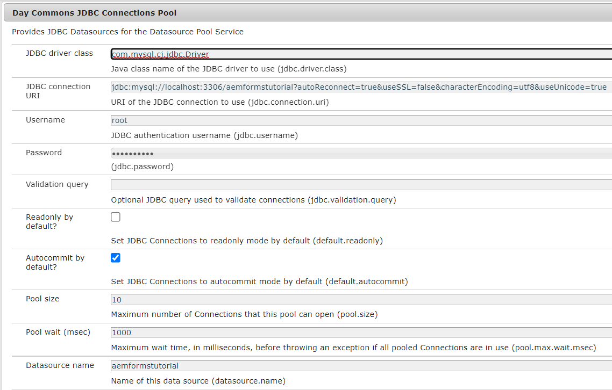

# Lagra inskickade adaptiva formulär i databasen

Det finns många sätt att lagra inskickade formulärdata i den databas du väljer. En JDBC-datakälla kan användas för att lagra data direkt i databasen. Ett anpassat OSGI-paket kan skrivas för att lagra data i databasen. I den här artikeln används anpassade processsteg i AEM arbetsflöde för att lagra data.
Användningsexemplet är att utlösa ett AEM arbetsflöde för att skicka ett adaptivt formulär och ett steg i arbetsflödet lagrar skickade data i databasen.


## JDBC-anslutningspool

* Gå till [ConfigMgr](http://localhost:4502/system/console/configMgr)

   * Sök efter JDBC-anslutningspool. Skapa en ny JDBC-anslutningspool för dagkommentarer. Ange inställningarna som är specifika för databasen.

   * 

## Ange databasinformation

* Sök efter &quot;**Ange databasinformation**&quot;
* Ange egenskaper som är specifika för databasen.
   * DataSourceName:Namn på datakällan som du konfigurerade tidigare.
   * TableName - namnet på den tabell där du vill lagra AF-data
   * FormName - Kolumnnamn som ska innehålla formulärets namn
   * ColumnName - kolumnnamn som AF-data ska lagras i

  


## Kod för OSGi-konfiguration

```java
package com.aemforms.dbsamples.core.insertFormData;

import org.osgi.service.metatype.annotations.AttributeDefinition;
import org.osgi.service.metatype.annotations.ObjectClassDefinition;

@ObjectClassDefinition(name = "Specify Database details", description = "Specify Database details")

public @interface InsertFormDataConfiguration {
  @AttributeDefinition(name = "DataSourceName", description = "Data Source Name configured")
  String dataSourceName() default "";
  @AttributeDefinition(name = "TableName", description = "Name of the table")
  String tableName() default "";
  @AttributeDefinition(name = "FormName", description = "Column Name for form name")
  String formName() default "";
  @AttributeDefinition(name = "columnName", description = "Column Name for form data")
  String columnName() default "";

}
```

## Läs konfigurationsvärden

```java
package com.aemforms.dbsamples.core.insertFormData;
import org.osgi.service.component.annotations.Activate;
import org.osgi.service.component.annotations.Component;
import org.osgi.service.metatype.annotations.Designate;

@Component(service={InsertFormDataConfigurationService.class})
@Designate(ocd=InsertFormDataConfiguration.class)

public class InsertFormDataConfigurationService {
    public String TABLE_NAME;
    public String DATA_SOURCE_NAME;
    public String COLUMN_NAME;
    public String FORM_NAME;
    @Activate      
      protected final void activate(InsertFormDataConfiguration insertFormDataConfiguration)
      {
        TABLE_NAME = insertFormDataConfiguration.tableName();
        DATA_SOURCE_NAME = insertFormDataConfiguration.dataSourceName();
        COLUMN_NAME = insertFormDataConfiguration.columnName();
        FORM_NAME = insertFormDataConfiguration.formName();
      }
    public String getTABLE_NAME()
    {
        return TABLE_NAME;
    }
    public String getDATA_SOURCE_NAME()
    {
        return DATA_SOURCE_NAME;
    }
    public String getCOLUMN_NAME()
    {
        return COLUMN_NAME;
    }
    public String getFORM_NAME()
    {
        return FORM_NAME;
    }
}
```

## Kod som implementerar processteget

```java
package com.aemforms.dbsamples.core.insertFormData;
import java.io.InputStream;
import java.io.StringWriter;
import java.nio.charset.StandardCharsets;
import java.sql.Connection;
import java.sql.PreparedStatement;
import java.sql.SQLException;

import javax.jcr.Node;
import javax.jcr.Session;
import javax.sql.DataSource;

import org.apache.commons.io.IOUtils;
import org.osgi.framework.Constants;
import org.osgi.service.component.annotations.Component;
import org.osgi.service.component.annotations.Reference;
import org.slf4j.Logger;
import org.slf4j.LoggerFactory;

import com.adobe.granite.workflow.WorkflowException;
import com.adobe.granite.workflow.WorkflowSession;
import com.adobe.granite.workflow.exec.WorkItem;
import com.adobe.granite.workflow.exec.WorkflowProcess;
import com.adobe.granite.workflow.metadata.MetaDataMap;
import com.day.commons.datasource.poolservice.DataSourcePool;

@Component(property = {
  Constants.SERVICE_DESCRIPTION + "=Insert Form Data in Database",
  Constants.SERVICE_VENDOR + "=Adobe Systems",
  "process.label" + "=Insert Form Data in Database"
})

public class InsertAfData implements WorkflowProcess {
  @Reference
  InsertFormDataConfigurationService insertFormDataConfig;
  @Reference
  DataSourcePool dataSourcePool;
  private final Logger log = LoggerFactory.getLogger(getClass());
  @Override
  public void execute(WorkItem workItem, WorkflowSession session, MetaDataMap metaDataMap) throws WorkflowException {

    String proccesArgsVals = (String) metaDataMap.get("PROCESS_ARGS", (Object)
      "string");
    String[] values = proccesArgsVals.split(",");
    String AdaptiveFormName = values[0];
    String formDataFile = values[1];
    String payloadPath = workItem.getWorkflowData().getPayload().toString();
    Session jcrSession = (Session) session.adaptTo((Class) Session.class);
    String dataFilePath = payloadPath + "/" + formDataFile + "/jcr:content";
    log.debug("The data file path is " + dataFilePath);
    PreparedStatement ps = null;
    Connection con = null;
    DataSource dbSource = null;

    try {
      dbSource = (DataSource) dataSourcePool.getDataSource(insertFormDataConfig.getDATA_SOURCE_NAME());
      log.debug("Got db source");
      con = dbSource.getConnection();

      Node xmlDataNode = jcrSession.getNode(dataFilePath);
      InputStream xmlDataStream = xmlDataNode.getProperty("jcr:data").getBinary().getStream();
      StringWriter writer = new StringWriter();
      String encoding = StandardCharsets.UTF_8.name();
      IOUtils.copy(xmlDataStream, writer, encoding);
      String queryStmt = "insert into " + insertFormDataConfig.TABLE_NAME + "(" + insertFormDataConfig.COLUMN_NAME + "," + insertFormDataConfig.FORM_NAME + ") values(?,?)";
      log.debug("The query Stmt is " + queryStmt);
      ps = con.prepareStatement(queryStmt);
      ps.setString(1, writer.toString());
      ps.setString(2, AdaptiveFormName);
      ps.executeUpdate();

    } catch (Exception e) {
      log.debug("The error message is " + e.getMessage());
    } finally {
      if (ps != null) {
        try {
          ps.close();
        } catch (SQLException sqlException) {
          log.debug(sqlException.getMessage());
        }
      }
      if (con != null) {
        try {
          con.close();
        } catch (SQLException sqlException) {
          log.error("Unable to close connection to database", sqlException);
        }
      }
    }
  }

}
```

## Distribuera exempelresurserna

* Kontrollera att du har konfigurerat din JDBC-anslutningspool
* Ange databasinformation med configMgr
* [Ladda ned zip-filen och extrahera innehållet till hårddisken](assets/article-assets.zip)

   * Distribuera jar-filen med [AEM webbkonsol](http://localhost:4502/system/console/bundles). Den här jar-filen innehåller koden som används för att lagra formulärdata i databasen.

   * Importera de två ZIP-filerna till [AEM med pakethanteraren](http://localhost:4502/crx/packmgr/index.jsp). Det här ger dig [exempelarbetsflöde](http://localhost:4502/editor.html/conf/global/settings/workflow/models/storeformdata.html) och [exempeladaptiv form](http://localhost:4502/editor.html/content/forms/af/addformdataindb.html) som kommer att utlösa arbetsflödet när formulär skickas. Observera processargumenten i arbetsflödessteget. De här argumenten anger formatnamnet och namnet på datafilen som ska innehålla data från det adaptiva formuläret. Datafilen lagras under nyttolastmappen i crx-databasen. Se hur [adaptiv form](http://localhost:4502/editor.html/content/forms/af/addformdataindb.html) har konfigurerats för att utlösa AEM arbetsflöde vid överföring och datafilskonfigurationen (data.xml)

   * Förhandsgranska och fyll i formuläret och skicka. Du bör se en ny rad som har skapats i databasen

