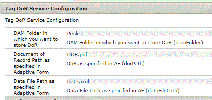

# Tagga och lagra AEM Forms DoR i DAM {#tagging-and-storing-aem-forms-dor-in-dam}

I den här artikeln går vi igenom hur du lagrar och taggar DoR-filer som genererats av AEM Forms i AEM DAM. Dokumentets taggning görs utifrån skickade formulärdata.

En vanlig fråga från kunderna är att lagra och tagga det DoR-dokument (Document of Record) som genererats av AEM Forms i AEM DAM. Dokumentets taggning måste baseras på inskickade data från Adaptive Forms. Om anställningsstatusen i inskickade data till exempel är &quot;Inaktuell&quot;, vill vi tagga dokumentet med taggen &quot;Inaktuell&quot; och lagra dokumentet i DAM.

Användningsexemplet är följande:

* En användare fyller i ett adaptivt formulär. I adaptiv form fångas användarens civilstånd (ex Single) och anställningsstatus (Ex pensionerad).
* När formulär skickas aktiveras ett AEM-arbetsflöde. I det här arbetsflödet taggas dokumentet med civilstånd (Single) och anställningsstatus (pensionerad) och dokumentet sparas i DAM.
* När dokumentet har lagrats i DAM bör administratören kunna söka efter dokumentet med dessa taggar. Om du till exempel söker på En eller Återkallad hämtas rätt DoR-svar.

Ett anpassat processsteg skrevs för att uppfylla detta användningsfall. I det här steget hämtar vi värdena för lämpliga dataelement från skickade data. Sedan konstruerar vi taggplattan med det här värdet. Om värdet för elementet för civilstånd till exempel är &quot;Enskilt&quot; blir taggtiteln **Peak:EmploymentStatus/Single. &#x200B;** Med hjälp av TagManager API hittar vi taggen och använder den på DoR-taggen.

Här följer den fullständiga koden för att tagga och lagra arkiveringsdokumentet i AEM DAM.

```java
package com.aemforms.setvalue.core;
import java.io.InputStream;
import javax.jcr.Node;
import javax.jcr.Session;
import javax.xml.parsers.DocumentBuilder;
import javax.xml.parsers.DocumentBuilderFactory;
import javax.xml.xpath.XPath;
import org.apache.sling.api.resource.Resource;
import org.apache.sling.api.resource.ResourceResolver;
import org.osgi.framework.Constants;
import org.osgi.service.component.annotations.Activate;
import org.osgi.service.component.annotations.Component;
import org.osgi.service.metatype.annotations.Designate;
import org.slf4j.Logger;
import org.slf4j.LoggerFactory;
import org.w3c.dom.Document;
import com.adobe.granite.workflow.WorkflowException;
import com.adobe.granite.workflow.WorkflowSession;
import com.adobe.granite.workflow.exec.WorkItem;
import com.adobe.granite.workflow.exec.WorkflowData;
import com.adobe.granite.workflow.exec.WorkflowProcess;
import com.adobe.granite.workflow.metadata.MetaDataMap;
import com.adobe.granite.workflow.model.WorkflowModel;
import com.day.cq.tagging.Tag;
import com.day.cq.tagging.TagManager;

@Component(property = {
   Constants.SERVICE_DESCRIPTION + "=Tag and Store Dor in DAM",
   Constants.SERVICE_VENDOR + "=Adobe Systems",
   "process.label" + "=Tag and Store Dor in DAM"
})
@Designate(ocd = TagDorServiceConfiguration.class)
public class TagAndStoreDoRinDAM implements WorkflowProcess
{
   private static final Logger log = LoggerFactory.getLogger(TagAndStoreDoRinDAM.class);

   private TagDorServiceConfiguration serviceConfig;
   @Activate
   public void activate(TagDorServiceConfiguration config)
   {
      this.serviceConfig = config;
   }
   @Override
   public void execute(WorkItem workItem, WorkflowSession workflowSession, MetaDataMap arg2) throws WorkflowException
   {
       log.debug("The process arguments passed ..." + arg2.get("PROCESS_ARGS", "string").toString());
      String params = arg2.get("PROCESS_ARGS", "string").toString();
      WorkflowModel wfModel = workflowSession.getModel("/var/workflow/models/dam/update_asset");
      // Read the Tag DoR service configuration
      String damFolder = serviceConfig.damFolder();
      String dorPDFName = serviceConfig.dorPath();
      String dataXmlFile = serviceConfig.dataFilePath();
      log.debug("The Data Xml File is ..." + dataXmlFile + "DorPDFName" + dorPDFName);
      // Read the arguments passed to this workflow step
      String parameters[] = params.split(",");
      log.debug("The %%%% length of parameters is " + parameters.length);
      Tag[] tagArray = new Tag[parameters.length];
      WorkflowData wfData = workItem.getWorkflowData();
      String dorFileName = (String) wfData.getMetaDataMap().get("filename");
      log.debug("The dorFileName is ..." + dorFileName);
      String payloadPath = workItem.getWorkflowData().getPayload().toString();
      String dataFilePath = payloadPath + "/" + dataXmlFile + "/jcr:content";
      String dorDocumentPath = payloadPath + "/" + dorPDFName + "/jcr:content";
      log.debug("Data File Path" + dataFilePath);
      log.debug("Dor File Path" + dorDocumentPath);
      Session session = workflowSession.adaptTo(Session.class);
      ResourceResolver resourceResolver = workflowSession.adaptTo(ResourceResolver.class);
      com.day.cq.dam.api.AssetManager assetMgr = resourceResolver.adaptTo(com.day.cq.dam.api.AssetManager.class);
      DocumentBuilderFactory factory = null;
      DocumentBuilder builder = null;
      Document xmlDocument = null;
      Node xmlDataNode = null;
      Node dorDocumentNode = null;

      try
      {
         // create org.w3c.dom.Document object from submitted form data
         xmlDataNode = session.getNode(dataFilePath);
         log.debug("xml Data Node" + xmlDataNode.getName());
         dorDocumentNode = session.getNode(dorDocumentPath);
         log.debug("DOR Document Node is " + dorDocumentNode.getName());
         InputStream xmlDataStream = xmlDataNode.getProperty("jcr:data").getBinary().getStream();
         InputStream dorInputStream = dorDocumentNode.getProperty("jcr:data").getBinary().getStream();
         XPath xPath = javax.xml.xpath.XPathFactory.newInstance().newXPath();
         factory = DocumentBuilderFactory.newInstance();
         builder = factory.newDocumentBuilder();
         xmlDocument = builder.parse(xmlDataStream);
         String newFile = "/content/dam/" + damFolder + "/" + dorFileName;
         log.debug("the new file is ..." + newFile);
         // Store the DoR in DAM
         assetMgr.createAsset(newFile, dorInputStream, "application/pdf", true);
         WorkflowData wfDataLoad = workflowSession.newWorkflowData("JCR_PATH", newFile);
         log.debug("Wrote the document to DAM" + newFile);
         TagManager tagManager = resourceResolver.adaptTo(TagManager.class);
         Resource pdfDocumentNode = resourceResolver.getResource(newFile);
         Resource metadata = pdfDocumentNode.getChild("jcr:content/metadata");
         // Fetch the xml elements from the xml document
         for (int i = 0; i < parameters.length; i++)
            {
                String tagTitle = parameters[i].split("=")[0];
                log.debug("The tag title is" + tagTitle);
                String nameOfNode = parameters[i].split("=")[1];
                org.w3c.dom.Node xmlElement = (org.w3c.dom.Node) xPath.compile(nameOfNode).evaluate(xmlDocument, javax.xml.xpath.XPathConstants.NODE);
                log.debug("###The value data node is " + xmlElement.getTextContent());
                Tag tagFound = tagManager.resolveByTitle(tagTitle + xmlElement.getTextContent());
                log.debug("The tag found was ..." + tagFound.getPath());
                tagArray[i] = tagFound;
            }
         tagManager.setTags(metadata, tagArray, true);
         workflowSession.startWorkflow(wfModel, wfDataLoad);
         log.debug("Workflow started");
         log.debug("Done setting tags");
         xmlDataStream.close();
         dorInputStream.close();
      } catch (Exception e)
            {
                 log.debug("The error message is " + e.getMessage());
            }

   }

}
```

Följ stegen nedan om du vill att det här exemplet ska fungera i ditt system:
* [Distribuera Developing with service user bundle](/help/forms/assets/common-osgi-bundles/DevelopingWithServiceUser.jar)

* [Hämta och distribuera setvalue-paketet](/help/forms/assets/common-osgi-bundles/SetValueApp.core-1.0-SNAPSHOT.jar). Detta är det anpassade OSGI-paketet som ställer in taggarna från skickade formulärdata.

* [Ladda ned exempelformuläret för adaptiv redigering](assets/tag-and-store-in-dam-adaptive-form.zip)

* [Gå till Forms och dokument](http://localhost:4502/aem/forms.html/content/dam/formsanddocuments)

* Klicka på Skapa | Filöverföring och överföring av taggen-and-store-in-dam-adaptive-form.zip

* [Importera artikelresurserna](assets/tag-and-store-in-dam-assets.zip) med AEM pakethanterare
* Öppna [exempelformuläret i förhandsgranskningsläge](http://localhost:4502/content/dam/formsanddocuments/tagandstoreindam/jcr:content?wcmmode=disabled). **Fyll i alla fält** och skicka formuläret.
* [Navigera till toppmapp i DAM](http://localhost:4502/assets.html/content/dam/Peak). Se DoR i mappen Peak. Kontrollera dokumentets egenskaper. Den bör taggas på lämpligt sätt.
Grattis! Exemplet har installerats på datorn

* Låt oss utforska [arbetsflödet](http://localhost:4502/editor.html/conf/global/settings/workflow/models/TagAndStoreDoRinDAM.html) som aktiveras när formulär skickas.
* Det första steget i arbetsflödet skapar ett unikt filnamn genom att sammanfoga de sökandes namn och land där de bor.
* I det andra steget i arbetsflödet skickas tagghierarkin och de formulärfältselement som måste taggas. Processsteget extraherar värdet från skickade data och skapar den taggtitel som ska tagga dokumentet.
* Om du vill lagra DoR i en annan mapp i DAM anger du mapplatsen med konfigurationsegenskaperna som anges i skärmbilden nedan.

De andra två parametrarna är specifika för DoR och Datafilssökvägen enligt vad som anges i alternativen för att skicka adaptiva formulär. Kontrollera att de värden du anger här matchar de värden du angav i alternativen för att skicka adaptiva formulär.


