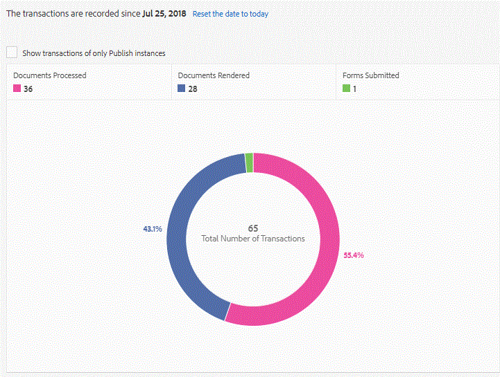

# Använda transaktionsrapportering i AEM Forms{#using-transaction-reporting-in-aem-forms}

Transaktionsrapportering för att fånga upp antalet inskickade formulär, återgivning av dokument med dokumenttjänster och återgivning av interaktiv kommunikation (webben och tryckkanaler) har introducerats i AEM Forms 6.4.1. Den här funktionen är främst avsedd för kunder som vill licensiera programvaran baserat på antalet inskickade formulär och/eller återgivna dokument. Den här funktionen är för närvarande endast tillgänglig i AEM Forms OSGI-stacken.

## Aktiverar transaktionsrapportering {#enabling-transaction-reporting}

Som standard är transaktionsregistrering inaktiverat. Följ stegen nedan för att aktivera transaktionsregistrering:

* [Öppna configMgr](http://localhost:4502/system/console/configMgr)
* Sök efter&quot;Forms Transaction Reporting&quot;
* Markera kryssrutan&quot;Registrera transaktioner&quot;
* Spara ändringarna

När transaktionsrapportering är aktiverat kan du skicka adaptiva Forms-dokument, generera dokument med hjälp av dokumenttjänster eller återge interaktiva kommunikationsdokument för att se hur transaktionsrapporteringen fungerar.

## Visa transaktionsrapport {#viewing-transaction-report}

Om du vill visa transaktionsrapporten loggar du in på AEM Forms som administratör. Endast medlemmar i gruppen fd-Administrator kan visa transaktionsrapporten.

Välj verktyg | Forms | Visa transaktionsrapport

eller visa transaktionsrapporten genom att klicka [här](http://localhost:4502/mnt/overlay/fd/transaction/gui/content/report.html)

På skärmbilden ovan Dokumentbearbetat visas antalet dokument som genererats med hjälp av dokumenttjänster. Återgivna dokument är antalet interaktiva kommunikationsdokument (webb och utskrift) som återges. Forms som skickas in är antalet inskickade anpassade formulär.

En transaktion finns kvar i bufferten under en angiven period (Tömningstid + Omvänd replikeringstid). Som standard tar det ca 90 sekunder för antalet transaktioner att återspeglas i transaktionsrapporten.

Åtgärder som att skicka ett PDF-formulär, använda agentgränssnittet för att förhandsgranska interaktiv kommunikation eller använda icke-standardiserade metoder för att skicka formulär räknas inte som transaktioner. AEM Forms tillhandahåller ett API för att registrera sådana transaktioner. Anropa API:t från dina anpassade implementeringar för att registrera en transaktion.

Om du visar transaktionsrapporten för författarinstansen kontrollerar du att omvänd replikering har konfigurerats för alla publiceringsinstanser.

Om du vill veta mer om transaktionsrapportering [klickar du här](https://helpx.adobe.com/experience-manager/6-4/forms/using/transaction-reports-overview.html)

