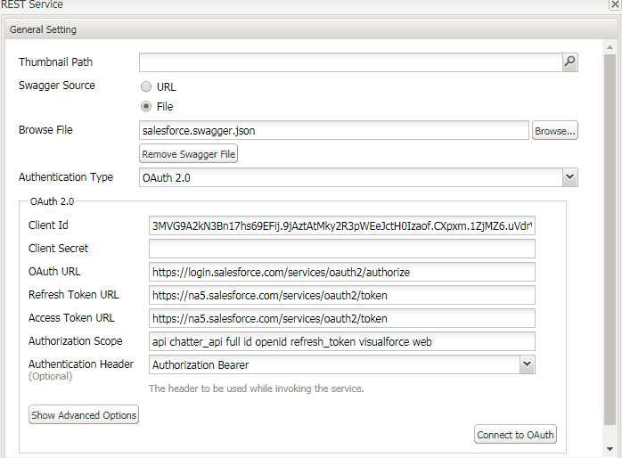

# Konfigurera DataSource med Salesforce i AEM Forms 6.3 och 6.4{#configuring-datasource-with-salesforce-in-aem-forms-and}

## Förutsättningar {#prerequisites}

I den här artikeln går vi igenom processen att skapa datakälla med Salesforce

Krav för den här självstudiekursen:

* Bläddra längst ned på sidan och hämta swagger-filen och spara den på hårddisken.
* AEM Forms med SSL aktiverat

   * [Officiell dokumentation för aktivering av SSL på AEM 6.3](https://helpx.adobe.com/experience-manager/6-3/sites/administering/using/ssl-by-default.html)
   * [Officiell dokumentation för aktivering av SSL på AEM 6.4](https://helpx.adobe.com/experience-manager/6-4/sites/administering/using/ssl-by-default.html)

* Du måste ha Salesforce-konto
* Du måste skapa en ansluten app. Den officiella dokumentationen från Salesforce för att skapa appen visas [här](https://help.salesforce.com/articleView?id=connected_app_create.htm&amp;type=0).
* Ange lämpliga OAuth-scope för appen (jag har valt alla tillgängliga OAuth-scope för testning)
* Ange återanrops-URL. Återanrops-URL:en i mitt fall var

   * Om du använder **AEM Forms 6.3**&#x200B;är återanrops-URL:en https://gbedekar-w7-1:6443/etc/cloudservices/fdm/createlead.html. I den här URL:en är creatlead namnet på min formulärdatamodell.

   * Om du använder** AEM Forms 6.4** är återanrops-URL:en https://gbedekar-w7-:6443/libs/fd/fdm/gui/components/admin/fdmcloudservice/createcloudconfigwizard/cloudservices.html

I det här exemplet är gbedekar -w7-1:6443 namnet på min server och den port som AEM körs på.

När du har skapat anteckningen Kopplad app kan du **Konsumentnyckel och hemlig nyckel**. Du behöver dessa när du skapar datakällan i AEM Forms.

Nu när du har skapat ditt anslutna program måste du skapa en swagger-fil för de åtgärder som du måste utföra i Salesforce. En swagger-exempelfil inkluderas som en del av de hämtningsbara resurserna. Med den här swagger-filen kan du skapa Lead-objekt när du skickar adaptiva formulär. Utforska den här växlingsfilen.

Nästa steg är att skapa en datakälla i AEM Forms. Följ de här stegen enligt din AEM Forms-version

## AEM Forms 6.3 {#aem-forms}

* Logga in på AEM Forms med https-protokollet
* Navigera till molntjänster genom att skriva i https://&lt;servername>:&lt;serverport> /etc/cloudservices.html, till exempel https://gbedekar-w7-1:6443/etc/cloudservices.html
* Bläddra nedåt till &quot;Formulärdatamodell&quot;.
* Klicka på Visa konfigurationer.
* Klicka på&quot;+&quot; för att lägga till ny konfiguration
* Välj &quot;Vila full service&quot;. Ange beskrivande titel och namn för konfigurationen. Till exempel

   * Namn: CreateLeadInSalesForce
   * Titel: CreateLeadInSalesForce

* Klicka på&quot;Skapa&quot;

**På nästa skärm **

* Välj &quot;Arkiv&quot; som alternativ för swagger-källfilen. Bläddra till filen som du hämtade tidigare
* Välj autentiseringstyp som OAuth2.0
* Ange värden för ClientID och Client Secret
* OAuth Url är - **https://login.salesforce.com/services/oauth2/authorize**
* Uppdatera token-URL - **https://na5.salesforce.com/services/oauth2/token**
* **Åtkomsttagg-URL - https://na5.salesforce.com/services/oauth2/token**
* Auktoriseringsomfång: ** api chatter_api full id openid refresh_token visualforce web**
* Autentiseringshanterare: auktoriseringsgranskare
* Klicka på &quot;Anslut till OAUTH&quot;.Om allt fungerar bra bör du inte se några fel

När du har skapat formulärdatamodellen med Salesforce kan du sedan skapa integrering av formulärdata med den datakälla som du just har skapat. Den officiella dokumentationen för att skapa integreringen av formulärdata är [här](https://helpx.adobe.com/aem-forms/6-3/data-integration.html).

Kontrollera att du har konfigurerat formulärdatamodellen så att den omfattar POSTEN för att skapa ett Lead-objekt i SFDC.

Du måste också konfigurera läs- och skrivtjänsten för Lead-objektet. Se skärmbilderna längst ned på sidan.

När du har skapat formulärdatamodellen kan du skapa adaptiv Forms baserat på den här modellen och använda överföringsmetoderna för formulärdatamodellen för att skapa en lead i SFDC.

## AEM Forms 6.4 {#aem-forms-1}

* Skapa datakälla

   * [Navigera till Datakällor](http://localhost:4502/libs/fd/fdm/gui/components/admin/fdmcloudservice/fdm.html/conf/global)

   * Klicka på knappen &quot;Skapa&quot;
   * Ange meningsfulla värden

      * Namn: CreateLeadInSalesForce
      * Titel: CreateLeadInSalesForce
      * Tjänsttyp: RESTful-tjänst

   * Klicka på Nästa
   * Växlingskälla: Fil
   * Bläddra och välj den swagger-fil som du har hämtat i föregående steg
   * Autentiseringstyp: OAuth 2.0. Ange följande värden
   * Ange värden för ClientID och Client Secret
   * OAuth Url är - **https://login.salesforce.com/services/oauth2/authorize**
   * Uppdatera token-URL - **https://na5.salesforce.com/services/oauth2/token**
   * Åtkomsttoken-Ur **l - https://na5.salesforce.com/services/oauth2/token**
   * Auktoriseringsomfång: ** api chatter_api full id openid refresh_token visualforce web**
   * Autentiseringshanterare: auktoriseringsgranskare
   * Klicka på knappen &quot;Anslut till OAuth&quot;. Om du skulle få se några fel bör du gå igenom de föregående stegen för att säkerställa att all information har angetts korrekt.

När du har skapat datakällan med SalesForce kan du skapa integrering av formulärdata med datakällan som du just har skapat. Dokumentationslänken för det är [här](https://helpx.adobe.com/experience-manager/6-4/forms/using/create-form-data-models.html)

Kontrollera att du har konfigurerat formulärdatamodellen så att den omfattar POSTEN för att skapa ett Lead-objekt i SFDC.

Du måste också konfigurera läs- och skrivtjänsten för Lead-objektet. Se skärmbilderna längst ned på sidan.

När du har skapat formulärdatamodellen kan du skapa adaptiv Forms baserat på den här modellen och använda överföringsmetoderna för formulärdatamodellen för att skapa en lead i SFDC.

>[!NOTE]
>
>Kontrollera att URL:en i swagger-filen motsvarar din region. URL:en i exempelfilen är till exempel&quot;na46.salesforce.com&quot; när kontot skapades i Nordamerika. Det enklaste sättet är att logga in på ditt Salesforce-konto och kontrollera webbadressen.

[SampleSwaggerFile](assets/swagger-sales-force-lead.json)
