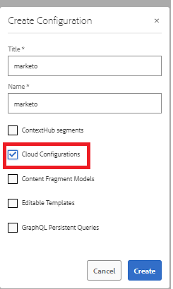

# Skapa data-Source

Marketo REST API:er autentiseras med 2-legged OAuth 2.0. Vi kan enkelt skapa en datakälla med swagger-filen som laddats ned i föregående steg

## Skapa konfigurationsbehållare

* Logga in på AEM.
* Klicka på Verktyg-menyn och sedan **Konfigurationsläsaren** enligt nedan

* 

* Klicka på **Skapa** och ange ett beskrivande namn enligt nedan. Se till att du väljer alternativet för molnkonfigurationer så som visas nedan

* 

## Skapa molntjänster

* Navigera till Verktyg-menyn och klicka sedan på molntjänster -> Datakällor

* 

* Välj den konfigurationsbehållare som skapades i det tidigare steget och klicka på **Skapa** för att skapa en ny datakälla.Ange ett beskrivande namn och välj RESTful-tjänst i listrutan Tjänsttyp och klicka på **Nästa**
* 

* Ladda upp swagger-filen och ange typ, klient-ID, klienthemlighet och åtkomsttoken-URL som är specifik för din Marketo-instans enligt skärmbilden nedan.

* Testa anslutningen och om anslutningen lyckas kontrollerar du att du klickar på den blå **Skapa**-knappen för att slutföra processen med att skapa datakällan.

* 

## Nästa steg

[Skapa formulärdatamodell](./part3.md)
