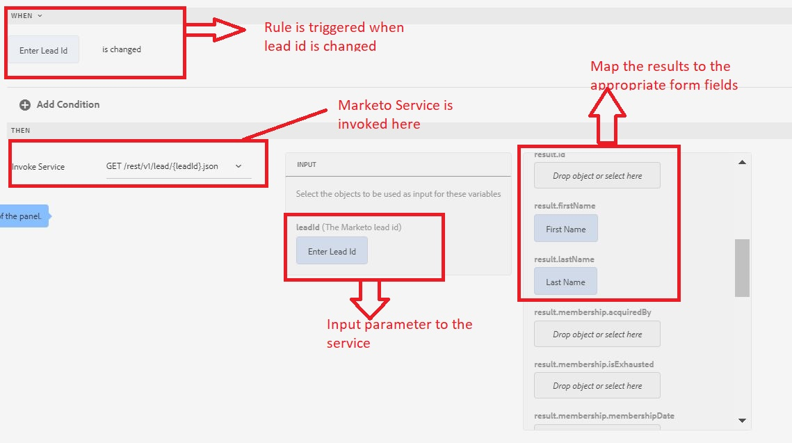

# Testa integreringen

Vi testar integreringen genom att skapa en enkel formulärhämtning och visa ett lead-objekt från Market.
>[!NOTE]
>
>Den här funktionen har testats på formulär baserade på grundkomponenter.

## Skapa anpassat formulär

1. Skapa ett adaptivt formulär och basera det på en tom formulärmall, associera det med den formulärdatamodell som skapades i det tidigare steget.
1. Öppna formuläret i redigeringsläge.
1. Dra och släpp en TextField-komponent och en panelkomponent i det adaptiva formuläret. Ange rubriken för TextField-komponenten &quot;Enter Lead Id&quot; och ställ in dess namn på &quot;LeadId&quot;
1. Dra och släpp två TextField-komponenter till panelkomponenten
1. Ange namn och titel för de två TextField-komponenterna som FirstName och LastName
1. Konfigurera panelkomponenten så att den är en repeterbar komponent genom att ange Minimum till 1 och Maximum till -1. Detta krävs eftersom Marketo-tjänsten returnerar en array med Lead-objekt och du måste ha en upprepningsbar komponent för att kunna visa resultatet. I det här fallet får vi bara tillbaka ett Lead-objekt eftersom vi söker efter Lead-objekt med dess ID.
1. Skapa en regel i fältet LeadId så som visas i bilden nedan
1. Förhandsgranska formuläret och ange ett giltigt lead-ID i fältet LeadID och tabba ut. Fälten Förnamn och Efternamn ska fyllas i med resultatet av serviceanropet.

I följande skärmbild förklaras inställningarna för regelredigeraren

## Grattis

Du har integrerat AEM Forms med Marketo med AEM Forms Form Data Model.