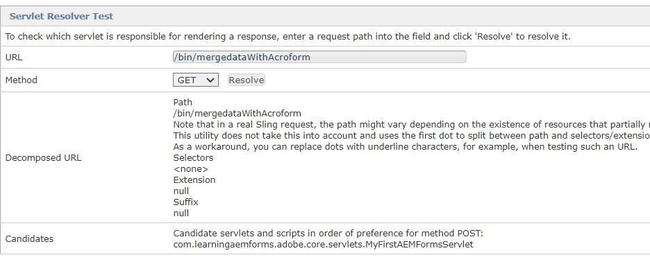

# Sling Servlet

En Servlet är en klass som används för att utöka funktionerna för servrar som är värdar för program som nås via en programmeringsmodell för begäran/svar. För sådana program definierar Servlet-tekniken HTTP-specifika serlet-klasser.
Alla serveringar måste implementera gränssnittet Servlet, som definierar livscykelmetoder.


En AEM kan registreras som OSGi-tjänst: du kan utöka SlingSafeMethodsServlet för skrivskyddad implementering eller SlingAllMethodsServlet för att implementera alla RESTful-åtgärder.

## Servlet Code

```java
package com.mysite.core.servlets;
import javax.servlet.Servlet;
import org.apache.sling.api.SlingHttpServletRequest;
import org.apache.sling.api.SlingHttpServletResponse;
import org.apache.sling.api.servlets.SlingAllMethodsServlet;
import org.osgi.service.component.annotations.Component;
import org.osgi.service.component.annotations.Reference;
import java.io.File;
import com.adobe.aemfd.docmanager.Document;
import com.adobe.fd.forms.api.FormsService;

@Component(service={Servlet.class}, property={"sling.servlet.methods=post", "sling.servlet.paths=/bin/mergedataWithAcroform"})
public class MyFirstAEMFormsServlet extends SlingAllMethodsServlet
{
    
    private static final long serialVersionUID = 1L;
    @Reference
    FormsService formsService;
     protected void doPost(SlingHttpServletRequest request, SlingHttpServletResponse response)
      { 
         String file_path = request.getParameter("save_location");
         
         java.io.InputStream pdf_document_is = null;
         java.io.InputStream xml_is = null;
         javax.servlet.http.Part pdf_document_part = null;
         javax.servlet.http.Part xml_data_part = null;
              try
              {
                 pdf_document_part = request.getPart("pdf_file");
                 xml_data_part = request.getPart("xml_data_file");
                 pdf_document_is = pdf_document_part.getInputStream();
                 xml_is = xml_data_part.getInputStream();
                 Document data_merged_document = formsService.importData(new Document(pdf_document_is), new Document(xml_is));
                 data_merged_document.copyToFile(new File(file_path));
                 
              }
              catch(Exception e)
              {
                  response.sendError(400,e.getMessage());
              }
      }
}
```

## Bygg och driftsätt

Så här skapar du ditt projekt:

* Öppna **kommandotolkfönstret**
* Navigera till `c:\aemformsbundles\mysite\core`
* Kör kommandot `mvn clean install -PautoInstallBundle`
* Kommandot ovan skapar och distribuerar automatiskt paketet till din AEM som körs på localhost:4502

Paketet finns även på följande plats `C:\AEMFormsBundles\mysite\core\target`. Paketet kan också distribueras till AEM med [Felix webbkonsol.](http://localhost:4502/system/console/bundles)


## Testa serverlösaren

Peka webbläsaren mot [URL för servermatchare](http://localhost:4502/system/console/servletresolver?url=%2Fbin%2FmergedataWithAcroform&amp;method=POST). Det här visar vilken server som anropas för en viss sökväg som visas på skärmbilden nedan


## Testa servleten med Postman


## Nästa steg

[Inkludera tredjepartsbehållare](./include-third-party-jars.md)

