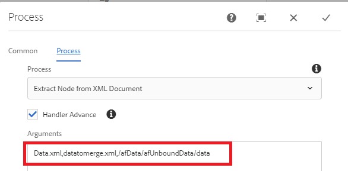

# Extrahera nod från skickad data-xml

Det här anpassade steget är att skapa ett nytt XML-dokument genom att extrahera nod från ett annat XML-dokument. Du måste använda detta när du vill sammanfoga skickade data med xdp-mallen för att generera PDF-filen. När du till exempel skickar ett anpassat formulär finns de data som du behöver sammanfoga med xdp-mallen inuti dataelementet. I det här fallet måste du skapa ett till XML-dokument genom att extrahera rätt dataelement.

I följande skärmbild visas de argument som du behöver skicka till det anpassade steget

Följande parametrar
* Data.xml - XML-filen som du vill extrahera noden från
* datatomerge.xml - Den nya xml-filen som skapas med den extraherade noden
* /afData/afUnboundData/data - Den nod som ska extraheras

På följande skärmbild visas datamerge.xml som skapas under nyttolastmappen

[Det anpassade paketet kan laddas ned härifrån](/help/forms/assets/common-osgi-bundles/SetValueApp.core-1.0-SNAPSHOT.jar)
