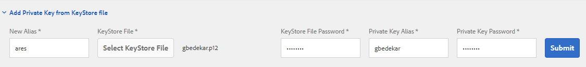

# Certifiera dokument i AEM Forms

Ett certifierat dokument ger PDF-dokument och -formulärmottagare extra garantier för autenticitet och integritet.

Om du vill certifiera ett dokument kan du använda Acrobat DC på skrivbordet eller AEM Forms Document Services som en del av en automatiserad process på en server.

Den här artikeln innehåller exempel på OSGI-paket för att certifiera PDF-dokument med AEM Forms Document Services. Koden som används i exemplet är [tillgänglig här](https://helpx.adobe.com/experience-manager/6-4/forms/using/aem-document-services-programmatically.html)

För att certifiera dokument med AEM Forms måste följande steg följas

## Lägger till certifikat i förtroendearkivet {#adding-certificate-to-trust-store}

Följ stegen nedan för att lägga till certifikatet i nyckelbehållaren i AEM

* [Initiera globalt förtroendearkiv](http://localhost:4502/libs/granite/security/content/truststore.html)
* [Sök efter fd-service](http://localhost:4502/security/users.html)-användare
* **Du måste rulla resultatsidan för att läsa in alla användare för att hitta Fd-service-användaren**
* Dubbelklicka på fd-service-användaren för att öppna fönstret med användarinställningar
* Klicka på Lägg till privat nyckel från nyckelfilen.Ange det alias och lösenord som är specifikt för certifikatet
  
* Spara ändringarna

## Skapar OSGI-tjänst

Du kan skriva ett eget OSGi-paket och använda AEM Forms Client SDK för att implementera en tjänst för att certifiera PDF-dokument. Följande länkar kan vara användbara för att skriva ett eget OSGi-paket

* [Skapar ditt första OSGi-paket](https://helpx.adobe.com/experience-manager/using/maven_arch13.html)
* [Använd API:t för dokumenttjänsten](https://helpx.adobe.com/experience-manager/6-4/forms/using/aem-document-services-programmatically.html)

Du kan också använda exempelpaketet som ingår i den här självstudiekursen.

>[!NOTE]
>
>Exempelpaketet använder alias &quot;ares&quot; för att certifiera dokumenten. Se därför till att ditt alias heter &quot;ares&quot; när du använder det här paketet

## Testa exemplet på din lokala dator

* Hämta och installera [paket med anpassade dokumenttjänster](/help/forms/assets/common-osgi-bundles/AEMFormsDocumentServices.core-1.0-SNAPSHOT.jar)
* Hämta och installera [Developing with Service User Bundle](/help/forms/assets/common-osgi-bundles/DevelopingWithServiceUser.jar)
* [Kontrollera att du har lagt till följande post i användarmappningstjänsten för Apache Sling-tjänsten](http://localhost:4502/system/console/configMgr)
  **DevelopingWithServiceUser.core:getformsresouresolver=fd-service**, vilket visas på skärmbilden nedan
  
* [Importera anpassat exempelformulär](assets/certify-pdf-af.zip)
* [Importera och installera den anpassade överföringen](assets/custom-submit-certify.zip)
* [Öppna det adaptiva formuläret](http://localhost:4502/content/dam/formsanddocuments/certifypdf/jcr:content?wcmmode=disabled)
* Ladda upp PDF-dokument som behöver certifieras
  **valfri** - Ange det signaturfält som du vill använda för att certifiera dokumentet
* Klicka på Skicka.
* Certifierade PDF bör returneras till dig.
