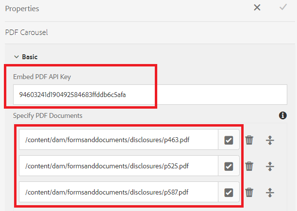

# Visa flera PDF-dokument i en karusell

Ett vanligt användningssätt är att visa flera PDF-dokument för formuläranvändaren som ska granska dem innan formuläret skickas.

Vi har använt [Adobe PDF Embed API](https://www.adobe.io/apis/documentcloud/dcsdk/pdf-embed.html) för att uppnå den här användningen.

[En live-demo av det här exemplet kan visas här.](https://forms.enablementadobe.com/content/dam/formsanddocuments/wefinancecreditcard/jcr:content?wcmmode=disabled)

Följande steg utfördes för att slutföra integreringen

## Skapa en anpassad komponent för att visa flera PDF-dokument

En anpassad komponent (pdf-carousel) skapades för att bläddra igenom PDF-dokument

## Klientbibliotek

Ett klientbibliotek skapades för att visa PDF med hjälp av Adobe PDF Embed API. PDF som ska visas anges i pdf-karusellkomponenterna.

## Skapa anpassat formulär

Skapa ett anpassat formulär baserat på vissa flikar (exemplet har tre flikar)
Lägg till vissa adaptiva formulärkomponenter på de två första flikarna
Lägg till PDF-karusellkomponenten på den tredje fliken
Konfigurera komponenten pdf-carousel enligt skärmbilden nedan

**Bädda in API-nyckel för PDF** - Det här är nyckeln som du kan använda för att bädda in PDF-filen. Den här nyckeln fungerar bara med localhost. Du kan skapa [din egen nyckel](https://www.adobe.io/apis/documentcloud/dcsdk/pdf-embed.html) och associera den med en annan domän.

**Ange PDF-dokument** - Här kan du ange vilka PDF-dokument du vill ska visas i karusellen.

## Distribuera exemplet på servern

Så här testar du detta på den lokala servern:

1. [Importera klientbiblioteket](assets/pdf-carousel-client-lib.zip) till den lokala AEM instansen [med pakethanteraren](http://localhost:4502/crx/packmgr/index.jsp)
1. [Importera PDF-karusellkomponenten](assets/pdf-carousel-component.zip) till den lokala AEM [med hjälp av pakethanteraren](http://localhost:4502/crx/packmgr/index.jsp)
1. [Importera det adaptiva formuläret](assets/adaptive-form-pdf-carousel.zip) till den lokala AEM instansen [med pakethanteraren](http://localhost:4502/crx/packmgr/index.jsp)
1. [Importera exempel-PDF-filer som ska visas](assets/pdf-carousel-sample-documents.zip) i den lokala AEM [med hjälp av länken för överföring av resursfiler](http://localhost:4502/assets.html/content/dam)
1. [Förhandsgranska anpassat formulär](http://localhost:4502/content/dam/formsanddocuments/wefinancecreditcard/jcr:content?wcmmode=disabled)
1. Fliken Dokument att granska. Du bör se tre PDF-dokument i karusellkomponenten.
