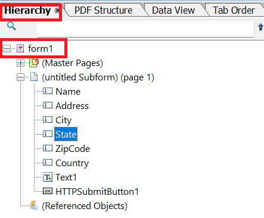

# Hämta interaktiv DoR

Ett vanligt användningsexempel är att kunna ladda ned en interaktiv DoR med data från adaptiva formulär. Den hämtade versionen av DoR kommer sedan att fyllas i med Adobe Acrobat eller Adobe Reader.

## Det anpassade formuläret är inte baserat på XSD-schema

Om ditt XDP- och Adaptiv-formulär inte är baserat på något schema följer du de här stegen för att generera ett interaktivt arkivdokument.

### Skapa anpassat formulär

Skapa ett anpassat formulär och kontrollera att de adaptiva formulärfältsnamnen är identiska med fältnamnen i xdp-mallen.
Anteckna rotelementnamnet för xdp-mallen.


### Klientbibliotek

Följande kod aktiveras när knappen Hämta PDF aktiveras

```javascript
$(document).ready(function() {
    $(".downloadPDF").click(function() {
        window.guideBridge.getDataXML({
            success: function(guideResultObject) {
                var req = new XMLHttpRequest();
                req.open("POST", "/bin/generateinteractivedor", true);
                req.responseType = "blob";
                var postParameters = new FormData();
                postParameters.append("dataXml", guideResultObject.data);
                postParameters.append("xdpName","two.xdp")
                postParameters.append("formBasedOnSchema", "false");
                postParameters.append("xfaRootElement","form1");
                console.log(guideResultObject.data);
                req.send(postParameters);
                req.onreadystatechange = function() {
                    if (req.readyState == 4 && req.status == 200) {
                        download(this.response, "report.pdf", "application/pdf");
                    }


                }
            }
        });

    });
});
```

## Anpassningsbart formulär baserat på XSD-schema

Om xdp-filen inte är baserad på XSD följer du de här stegen för att skapa XSD(schema) som du kan basera ditt adaptiva formulär på

### Generera exempeldata för XDP

* Öppna XDP i AEM Forms Designer.
* Klicka på Arkiv | Formuläregenskaper | Förhandsgranska
* Klicka på Generera förhandsgranskningsdata
* Klicka på Generera
* Ange beskrivande filnamn som&quot;form-data.xml&quot;

### Generera XSD från XML-data

Du kan använda vilket som helst av de kostnadsfria onlineverktygen för att [generera XSD](https://www.freeformatter.com/xsd-generator.html) från de XML-data som genererades i föregående steg.

### Skapa anpassat formulär

Skapa anpassningsbara formulär baserat på XSD från föregående steg. Koppla formuläret till klientens lib &quot;irs&quot;. Det här klientbiblioteket har koden för att göra ett anrop från POSTEN till servern som returnerar PDF till det anropande programmet
Följande kod aktiveras när användaren klickar på PDF _Hämta_

```javascript
$(document).ready(function() {
    $(".downloadPDF").click(function() {
        window.guideBridge.getDataXML({
            success: function(guideResultObject) {
                var req = new XMLHttpRequest();
                req.open("POST", "/bin/generateinteractivedor", true);
                req.responseType = "blob";
                var postParameters = new FormData();
                postParameters.append("dataXml", guideResultObject.data);
                postParameters.append("xdpName","f8918-r14e_redo-barcode_3 2.xdp")
                postParameters.append("formBasedOnSchema", "true");
                postParameters.append("dataNodeToExtract","afData/afBoundData/topmostSubform");
                console.log(guideResultObject.data);
                req.send(postParameters);
                req.onreadystatechange = function() {
                    if (req.readyState == 4 && req.status == 200) {
                        download(this.response, "report.pdf", "application/pdf");
                    }


                }
            }
        });

    });
});
```


## Skapa anpassad servett

Skapa en anpassad servett som sammanfogar data med XDP-mallen och returnerar PDF-filen. Koden för att uppnå detta listas nedan. Den anpassade servern ingår i paketet [AEMFormsDocumentServices.core-1.0-SNAPSHOT](/help/forms/assets/common-osgi-bundles/AEMFormsDocumentServices.core-1.0-SNAPSHOT.jar)).

```java
public class GenerateIInteractiveDor extends SlingAllMethodsServlet {
    private static final long serialVersionUID = 1 L;
    @Reference
    DocumentServices documentServices;
    @Reference
    FormsService formsService;
    private static final Logger log = LoggerFactory.getLogger(GenerateIInteractiveDor.class);

    protected void doGet(SlingHttpServletRequest request, SlingHttpServletResponse response) {
        doPost(request, response);
    }
    protected void doPost(SlingHttpServletRequest request, SlingHttpServletResponse response) {
        String xdpName = request.getParameter("xdpName");

        boolean formBasedOnXSD = Boolean.parseBoolean(request.getParameter("formBasedOnSchema"));

        XPathFactory xfact = XPathFactory.newInstance();
        XPath xpath = xfact.newXPath();
        String dataXml = request.getParameter("dataXml");
        log.debug("The data xml is " + dataXml);
        org.w3c.dom.Document xmlDataDoc = documentServices.w3cDocumentFromStrng(dataXml);
        Document renderedPDF = null;
        try {
            if (!formBasedOnXSD) {
                String xfaRootElement = request.getParameter("xfaRootElement");
                DocumentBuilderFactory dbFactory = DocumentBuilderFactory.newInstance();
                DocumentBuilder dBuilder = dbFactory.newDocumentBuilder();
                org.w3c.dom.Document newXMLDocument = dBuilder.newDocument();
                Element rootElement = newXMLDocument.createElement(xfaRootElement);
                String unboundData = "afData/afUnboundData/data";
                Node dataNode = (Node) xpath.evaluate(unboundData, xmlDataDoc, XPathConstants.NODE);
                NodeList dataChildNodes = dataNode.getChildNodes();
                for (int i = 0; i<dataChildNodes.getLength(); i++) {
                    Node childNode = dataChildNodes.item(i);
                    if (childNode.getNodeType() == 1) {
                        Element newElement = newXMLDocument.createElement(childNode.getNodeName());
                        newElement.setTextContent(childNode.getTextContent());
                        rootElement.appendChild(newElement);
                        log.debug("the node name is  " + childNode.getNodeName() + " and its value is " + childNode.getTextContent());
                    }
                }
                newXMLDocument.appendChild(rootElement);
                Document xmlDataDocument = documentServices.orgw3cDocumentToAEMFDDocument(newXMLDocument);
                String xdpTemplatePath = "crx:///content/dam/formsanddocuments";
                com.adobe.fd.forms.api.PDFFormRenderOptions renderOptions = new com.adobe.fd.forms.api.PDFFormRenderOptions();
                renderOptions.setAcrobatVersion(com.adobe.fd.forms.api.AcrobatVersion.Acrobat_11);
                renderOptions.setContentRoot(xdpTemplatePath);
                renderOptions.setRenderAtClient(com.adobe.fd.forms.api.RenderAtClient.NO);
                renderedPDF = formsService.renderPDFForm(xdpName, xmlDataDocument, renderOptions);

            } else {
                // form is based on xsd
                // get the actual xml data that needs to be merged with the template. This can be made more generic
                String nodeToExtract = request.getParameter("dataNodeToExtract");
                Node dataNode = (Node) xpath.evaluate(nodeToExtract, xmlDataDoc, XPathConstants.NODE);
                StringWriter writer = new StringWriter();
                Transformer transformer = TransformerFactory.newInstance().newTransformer();
                transformer.transform(new DOMSource(dataNode), new StreamResult(writer));
                String xml = writer.toString();
                System.out.println(xml);
                xmlDataDoc = documentServices.w3cDocumentFromStrng(xml);
                Document xmlDataDocument = documentServices.orgw3cDocumentToAEMFDDocument(xmlDataDoc);
                String xdpTemplatePath = "crx:///content/dam/formsanddocuments";
                com.adobe.fd.forms.api.PDFFormRenderOptions renderOptions = new com.adobe.fd.forms.api.PDFFormRenderOptions();
                renderOptions.setAcrobatVersion(com.adobe.fd.forms.api.AcrobatVersion.Acrobat_11);
                renderOptions.setContentRoot(xdpTemplatePath);
                renderOptions.setRenderAtClient(com.adobe.fd.forms.api.RenderAtClient.NO);
                renderedPDF = formsService.renderPDFForm(xdpName, xmlDataDocument, renderOptions);
            }
            InputStream fileInputStream = renderedPDF.getInputStream();
            response.setContentType("application/pdf");
            response.addHeader("Content-Disposition", "attachment; filename=" + xdpName.replace("xdp", "pdf"));
            response.setContentLength((int) fileInputStream.available());
            OutputStream responseOutputStream = response.getOutputStream();
            int bytes;
            while ((bytes = fileInputStream.read()) != -1) {
                responseOutputStream.write(bytes);
            }
            responseOutputStream.flush();
            responseOutputStream.close();

        } catch (XPathExpressionException | TransformerException | FormsServiceException | IOException | ParserConfigurationException e) {
            log.debug(e.getMessage());
        }

    }

}
```

I exempelkoden extraherar vi xdp-namnet och andra parametrar från begäranobjektet. Om formuläret inte är baserat på XSD skapas det XML-dokument som ska sammanfogas med xdp. Om formuläret är baserat på XSD extraherar vi helt enkelt rätt nod från det adaptiva formuläret som har skickats data för att generera XML-dokument som ska sammanfogas med xdp-mallen.

## Distribuera exemplet på servern

Så här testar du detta på den lokala servern:

1. [Hämta och installera paketet DevelopingWithServiceUser](/help/forms/assets/common-osgi-bundles/DevelopingWithServiceUser.jar)
1. Lägg till följande post i användarmappningstjänsten för Apache Sling
DevelopingWithServiceUser.core:getformsresourceReser=fd-service
1. [Hämta och installera det anpassade DocumentServices-paketet](/help/forms/assets/common-osgi-bundles/AEMFormsDocumentServices.core-1.0-SNAPSHOT.jar). Detta har serverutrymmet för att sammanfoga data med XDP-mallen och strömma tillbaka PDF-filen
1. [Importera klientbiblioteket](assets/generate-interactive-dor-client-lib.zip)
1. [Importera artikeln Assets(Adaptiv form, XDP-mallar och XSD)](assets/generate-interactive-dor-sample-assets.zip)
1. [Förhandsgranska anpassat formulär](http://localhost:4502/content/dam/formsanddocuments/f8918complete/jcr:content?wcmmode=disabled)
1. Fyll i några av formulärfälten.
1. Klicka på Hämta PDF för att hämta PDF. Du kanske måste vänta några sekunder på att PDF ska hämta.

>[!NOTE]
>
>Du kan prova samma användningsfall med [icke-xsd-baserat adaptivt formulär](http://localhost:4502/content/dam/formsanddocuments/two/jcr:content?wcmmode=disabled). Se till att du skickar rätt parametrar till slutpunkten för posten i streampdf.js som finns i irs clientlib.
