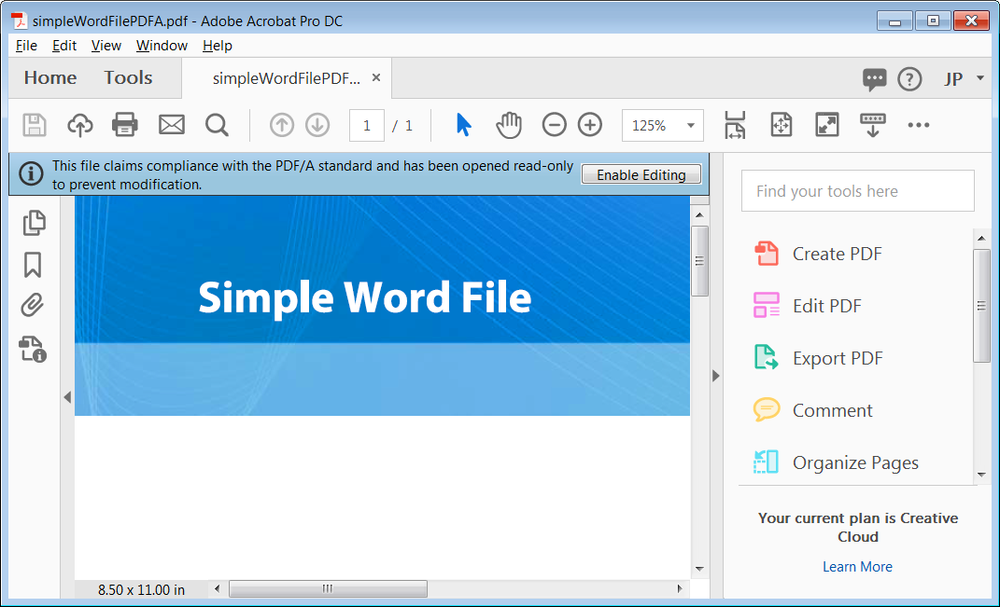

# PDF

PDF (Portable Document Format) är en familj av filformat och den här artikeln beskriver de som är mest relevanta för formulärutvecklare. Många av de tekniska detaljerna och standarderna för olika PDF-typer utvecklas och förändras. Vissa av dessa format och specifikationer är ISO-standarder (International Organization for Standardization) och vissa är specifika immateriella rättigheter som ägs av Adobe.

I den här artikeln beskrivs hur du skapar olika typer av PDF-filer. Det hjälper er att förstå hur och varför ni ska använda varje verktyg. Alla dessa typer fungerar bäst i det främsta klientverktyget för att visa och arbeta med PDF-filer - Adobe Acrobat DC.

Här följer ett exempel på en PDF/A-fil i Acrobat DC.

Exempelfiler kan [hämtas här](assets/pdf-file-types.zip)

## XML Forms Architecture PDF(XFA PDF)

Adobe använder termen XFA PDF-formulär för att hänvisa till den interaktiva och dynamiska Forms du skapar med AEM Forms Designer. Forms och de filer du skapar med Designer är baserade på Adobe XML Forms Architecture (XFA). På många sätt ligger filformatet XFA PDF närmare en HTML-fil än en vanlig PDF-fil. Följande kod visar hur ett enkelt textobjekt ser ut i en XFA PDF-fil.

XFA Forms är XML-baserade. Med detta välstrukturerade och flexibla format kan en AEM Forms Server omvandla dina Designer-filer till olika format, bland annat PDF, PDF/A och HTML. Du kan se hela XML-strukturen för din Forms i Designer genom att välja fliken XML Source i layoutredigeraren. Du kan skapa både statiska och dynamiska XFA-Forms i AEM Forms Designer.

## Statisk PDF

Statisk XFA PDF forms-layout ändras aldrig vid körning, men den kan vara interaktiv för användaren. Nedan följer några fördelar med statisk XFA PDF forms:

* Statisk XFA PDF forms-layout ändras aldrig vid körning, men den kan vara interaktiv för användaren.
* Statiska Forms har stöd för Acrobat kommenterings- och markeringsverktyg.
* Med statiska Forms kan du importera och exportera Acrobat-kommentarer.
* Statiskt Forms-stöd för underinställning av teckensnitt, vilket är en teknik som kan göras på en AEM Forms-server.
* Statisk Forms kan återges med det inbyggda visningsprogrammet för PDF som medföljer moderna webbläsare.

>[!NOTE]
>
> Du kan skapa statiska PDF-filer med AEM Forms Designer genom att spara XDP-filen som ett statiskt Adobe PDF-formulär

### Dynamiska Forms

Dynamiska XFA-PDF-filer kan ändra sin layout vid körning, så kommenterings- och markeringsfunktionerna stöds inte. Dynamiska XFA PDF-filer ger dock följande fördelar:

* Dynamiska formulär har stöd för klientskript som ändrar formulärets layout och sidnumrering. Exempelvis kommer Purchase Order.xdp att expandera och paginera för att rymma en oändlig mängd data om du sparar den som ett dynamiskt formulär
* Dynamiska formulär har stöd för alla egenskaper i formuläret vid körning, medan statiska formulär bara har stöd för en delmängd

* [Mer information om skillnaderna mellan statiska och dynamiska PDF-formulär finns i det här dokumentet](https://experienceleague.adobe.com/docs/experience-manager-learn/forms/document-services/pdf-forms-and-documents.html#:~:text=Dynamic%20forms%20support%20all%20the,forms%20support%20only%20a%20subset)

>[!NOTE]
>
> Du kan skapa dynamiska PDF-filer med AEM Forms Designer genom att spara XDP-filen som ett dynamiskt Adobe XML-formulär

>[!NOTE]
>
> Dynamiska formulär kan inte återges med de inbyggda PDF-visningsprogrammen i de moderna webbläsarna.

### PDF-fil (traditionell PDF)

Ett certifierat dokument förser PDF-dokument och Forms-mottagare med ytterligare garantier för autenticitet och integritet.

Det vanligaste och mest spridda PDF-formatet är den traditionella PDF-filen. Det finns många sätt att skapa en traditionell PDF-fil, bland annat med Acrobat och många tredjepartsverktyg. I Acrobat kan du skapa traditionella PDF-filer på följande sätt: Om du inte har installerat Acrobat kanske du inte ser dessa alternativ på datorn.

* Genom att hämta utskriftsströmmen för ett skrivbordsprogram: Välj kommandot Skriv ut i ett redigeringsprogram och välj Adobe PDF-skrivarikon. I stället för en utskriven kopia av dokumentet har du skapat en PDF-fil av dokumentet
* Genom att använda plugin-programmet Acrobat PDFMaker med Microsoft Office-program: När du installerar Acrobat läggs en Adobe PDF-meny till i Microsoft Office-program och en ikon till Office-menyfliken. Du kan använda de här nya funktionerna för att skapa PDF-filer direkt i Microsoft Office
* Genom att använda Acrobat Distiller för att konvertera Postscript- och Encapsulated Postscript-filer (EPS) till PDF-filer: Distiller används vanligtvis vid trycksakspublicering och andra arbetsflöden som kräver konvertering från Postscript-formatet till PDF-formatet
* Under huven är en traditionell PDF mycket annorlunda än en XFA PDF. Den har inte samma XML-struktur, och eftersom den skapas genom att en fils utskriftsström hämtas är en traditionell PDF en statisk och skrivskyddad fil.

Ett certifierat dokument ger PDF-dokument och -formulärmottagare extra garantier för autenticitet och integritet.

### Acroforms

Acroforms är Adobe äldre interaktiva formulärteknik; de är tillbaka till Acrobat version 3. Adobe tillhandahåller [API-referens för Acrobat Forms](assets/FormsAPIReference.pdf) från maj 2003 med teknisk information om tekniken. Acrobat är en kombination av
följande objekt:

* En traditionell PDF som definierar formulärets statiska layout och grafik.
* Interaktiva formulärfält som markeras ovanpå formulärverktygen i Adobe Acrobat. Dessa formulärverktyg utgör en liten del av vad som finns i AEM Forms Designer.

### PDF/A (PDF för arkiv)

PDF/A (PDF for Archives) bygger vidare på fördelarna med dokumentlagring i traditionella PDF-filer med många specifika detaljer som förbättrar långtidsarkiveringen. Det traditionella filformatet PDF ger många fördelar vid långsiktig dokumentlagring. Tack vare PDF kompakta form är det enkelt att överföra och spara utrymme, och dess välstrukturerade natur möjliggör kraftfulla indexerings- och sökfunktioner. Traditionell PDF har omfattande stöd för metadata och PDF har lång erfarenhet av stöd för olika datormiljöer.

Precis som PDF är PDF/A en ISO-standardspecifikation. Den utvecklades av en arbetsgrupp som innefattade AIIM (Association for Information and Image Management), NPES (National Printing Equipment Association) och de amerikanska domstolarnas administrativa kontor. Eftersom målet för PDF/A-specifikationen är att tillhandahålla ett långsiktigt arkivformat, utelämnas många av PDF funktioner så att filerna kan vara fristående. Nedan följer några viktiga punkter om specifikationen som förbättrar den långsiktiga reproducerbarheten för PDF/A-filen:

* Allt innehåll måste finnas i filen och det kan inte finnas några beroenden till externa källor som hyperlänkar, teckensnitt eller program.
* Alla teckensnitt måste vara inbäddade och de måste vara teckensnitt som har en obegränsad licens för elektroniska dokument.
* JavaScript tillåts inte
* Genomskinlighet tillåts inte
* Kryptering är inte tillåten
* Ljud- och videoinnehåll tillåts inte
* Färgrymder måste definieras på ett enhetsoberoende sätt
* Alla metadata måste följa vissa standarder

### Visa en PDF/A-fil

Två filer i exempelfilerna skapades från samma Microsoft Word-fil. Den ena skapades som en traditionell PDF och den andra som en PDF/A-fil. Öppna dessa två filer i Acrobat Professional:

* simpleWordFile.pdf
* simpleWordFilePDFA.pdf

Dokumenten ser likadana ut, men PDF/A-filen öppnas med ett blått fält längst upp, vilket anger att dokumentet visas i PDF/A-läge. Det här blå fältet är Acrobat dokumentmeddelandefält som visas när du öppnar vissa typer av PDF-filer.

Dokumentets meddelandefält innehåller instruktioner, och eventuellt knappar, som hjälper dig att slutföra en uppgift. Den är färgkodad och du ser den blå färgen när du öppnar särskilda typer av PDF-filer (som den här PDF/A-filen) samt certifierade och digitalt signerade PDF-filer. Fältet ändras till lila för PDF forms och gult när du deltar i en PDF-granskning.

>[!NOTE]
>
> Om du klickar på Aktivera redigering tar du bort det här dokumentet från PDF/A-kompatibilitet.
