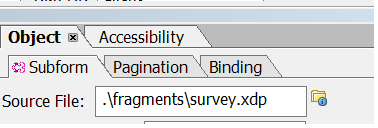

# Generera PDF-dokument med fragment med ECMA-skript{#developing-with-output-and-forms-services-in-aem-forms}


I den här artikeln använder vi utdatatjänsten för att generera PDF-filer med hjälp av xdp-fragment. Den huvudsakliga xdp-filen och fragmenten finns i crx-databasen. Det är viktigt att efterlikna filsystemets mappstruktur i AEM. Om du till exempel använder ett fragment i fragmentmappen i din xdp måste du skapa en mapp med namnet **fragments** under din basmapp i AEM. Basmappen kommer att innehålla din bas-xdp-mall. Om du till exempel har följande struktur i filsystemet
* c:\xdptemplates - Detta kommer att innehålla xdp-basmallen
* c:\xdptemplates\fragments - Den här mappen innehåller fragment och huvudmallen refererar till fragmentet enligt nedan
  .
* Mappens xdpdocuments innehåller din basmall och fragmenten i mappen **fragments**

Du kan skapa den struktur som krävs med hjälp av [formulären och dokumentgränssnittet](http://localhost:4502/aem/forms.html/content/dam/formsanddocuments)

Nedan följer mappstrukturen för exempelkoden xdp som använder 2 fragment


* Utdatatjänst - Vanligtvis används den här tjänsten för att sammanfoga XML-data med xdp-mall eller pdf för att generera sammanlagd pdf. Mer information finns i [javadoc](https://helpx.adobe.com/se/experience-manager/6-5/forms/javadocs/index.html?com/adobe/fd/output/api/OutputService.html) för utdatatjänsten. I det här exemplet använder vi fragment som finns i crx-databasen.


Följande ECMA-skript användes för att generera PDF. Observera att ResourceResolver och ResourceResolverHelper används i koden. ResourceReolver behövs eftersom koden körs utanför användarkontexten.

```java
var inputMap = processorContext.getInputMap();
var itr = inputMap.entrySet().iterator();
var entry = inputMap.entrySet().iterator().next();
var xmlData = inputMap.get(entry.getKey());
log.info("Got XML Data File");

var resourceResolverHelper = sling.getService(Packages.com.adobe.granite.resourceresolverhelper.ResourceResolverHelper);
var aemDemoListings = sling.getService(Packages.com.mergeandfuse.getserviceuserresolver.GetResolver);
log.info("Got service resolver");
var resourceResolver = aemDemoListings.getFormsServiceResolver();
//The ResourceResolverHelper execute's the following code within the context of the resourceResolver 
resourceResolverHelper.callWith(resourceResolver, {call: function()
       {
             //var statement = new Packages.com.adobe.aemfd.docmanager.Document("/content/dam/formsanddocuments/xdpdocuments/main.xdp",resourceResolver);
               var outputService = sling.getService(Packages.com.adobe.fd.output.api.OutputService);
            var pdfOutputOptions = new Packages.com.adobe.fd.output.api.PDFOutputOptions();
            pdfOutputOptions.setContentRoot("crx:///content/dam/formsanddocuments/xdpdocuments");
            pdfOutputOptions.setAcrobatVersion(Packages.com.adobe.fd.output.api.AcrobatVersion.Acrobat_11);
            var dataMergedDocument = outputService.generatePDFOutput("main.xdp",xmlData,pdfOutputOptions);
               //var dataMergedDocument = outputService.generatePDFOutput(statement,xmlData,pdfOutputOptions);
            processorContext.setResult("mergeddocument.pdf",dataMergedDocument);
            log.info("Generated the pdf document with fragments");
      }

 });
```

**Testa exempelpaketet på datorn**
* [Distribuera DevelopingWithServiceUSer-paketet](assets/DevelopingWithServiceUser.jar)
* Lägg till posten **DevelopingWithServiceUser.core:getformsresourceSolver=fd-service** i tillägget för användarmappningstjänsten, vilket visas på skärmbilden nedan
  
* [Hämta och importera xdp-exempelfiler och ECMA-skript](assets/watched-folder-fragments-ecma.zip).
Detta skapar en bevakad mappstruktur i din c:/fragmentsandoutputService-mapp

* [Extrahera exempeldatafilen](assets/usingFragmentsSampleData.zip) och placera den i installationsmappen för den bevakade mappen (c:\fragmentsandoutputservice\install)

* Kontrollera resultatmappen för den bevakade mappkonfigurationen för den genererade PDF-filen
