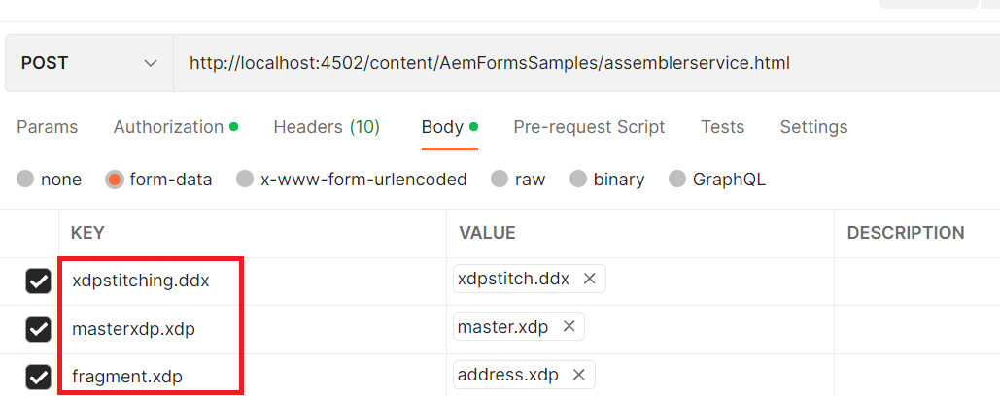

# XDP Stitching using assembler Service

I den här artikeln finns de resurser som du kan använda för att visa möjligheten att sammanfoga xdp-dokument med hjälp av sammansättningstjänsten.
Följande jsp-kod skrevs för att infoga ett delformulär med namnet **address** från xdp-dokumentet med namnet address.xdp i en insättningspunkt med namnet **address** i master.xdp-dokumentet. Den resulterande xdp-filen sparades i rotmappen för din AEM-installation.

Assembler-tjänsten förlitar sig på ett giltigt DDX-dokument för att beskriva manipuleringen av PDF-dokument. Du kan referera till [DDX-referensdokumentet här](assets/ddxRef.pdf).Sidan 40 innehåller information om xdp-sammanfogning.

```java
    javax.servlet.http.Part ddxFile = request.getPart("xdpstitching.ddx");
    System.out.println("Got DDX");
    java.io.InputStream ddxIS = ddxFile.getInputStream();
    com.adobe.aemfd.docmanager.Document ddxDocument = new com.adobe.aemfd.docmanager.Document(ddxIS);
    javax.servlet.http.Part masterXdpPart = request.getPart("masterxdp.xdp");
    System.out.println("Got master xdp");
    java.io.InputStream masterXdpPartIS = masterXdpPart.getInputStream();
    com.adobe.aemfd.docmanager.Document masterXdpDocument = new com.adobe.aemfd.docmanager.Document(masterXdpPartIS);

    javax.servlet.http.Part fragmentXDPPart = request.getPart("fragment.xdp");
    System.out.println("Got fragment.xdp");
    java.io.InputStream fragmentXDPPartIS = fragmentXDPPart.getInputStream();
    com.adobe.aemfd.docmanager.Document fragmentXdpDocument = new com.adobe.aemfd.docmanager.Document(fragmentXDPPartIS);

    java.util.Map < String, Object > mapOfDocuments = new java.util.HashMap < String, Object > ();
    mapOfDocuments.put("master.xdp", masterXdpDocument);
    mapOfDocuments.put("address.xdp", fragmentXdpDocument);
    com.adobe.fd.assembler.service.AssemblerService assemblerService = sling.getService(com.adobe.fd.assembler.service.AssemblerService.class);
    if (assemblerService != null)
      System.out.println("Got assembler service");

    com.adobe.fd.assembler.client.AssemblerOptionSpec aoSpec = new com.adobe.fd.assembler.client.AssemblerOptionSpec();
    aoSpec.setFailOnError(true);

    com.adobe.fd.assembler.client.AssemblerResult assemblerResult = assemblerService.invoke(ddxDocument, mapOfDocuments, aoSpec);
    com.adobe.aemfd.docmanager.Document finalXDP = assemblerResult.getDocuments().get("stitched.xdp");
    finalXDP.copyToFile(new java.io.File("stitched.xdp"));
```

DDX-filen som infogar fragment i en annan xdp visas nedan. DDX infogar delformuläret **address** från address.xdp i insättningspunkten **address** i master.xdp. Det resulterande dokumentet **stitched.xdp** sparas i filsystemet.

```xml
<?xml version="1.0" encoding="UTF-8"?> 
<DDX xmlns="http://ns.adobe.com/DDX/1.0/"> 
        <XDP result="stitched.xdp"> 
           <XDP source="master.xdp"> 
            <XDPContent insertionPoint="address" source="address.xdp" fragment="address"/> 
         </XDP> 
        </XDP>         
</DDX>
```

För att få den här funktionen att fungera på din AEM-server

* Hämta [XDP-titelpaketet](assets/xdp-stitching.zip) till din lokala dator.
* Överför och installera paketet med hjälp av [pakethanteraren](http://localhost:4502/crx/packmgr/index.jsp)
* [Extrahera innehållet i zip-filen](assets/xdp-and-ddx.zip) för att hämta exempelfilen för xdp och DDX

**När du har installerat paketet måste du tillåtslista följande URL:er i Adobe Granite CSRF-filtret.**

1. Följ stegen nedan för att tillåtslista de sökvägar som nämns ovan.
1. [Logga in på configMgr](http://localhost:4502/system/console/configMgr)
1. Sök efter Adobe Granite CSRF-filter
1. Lägg till följande sökväg i de uteslutna avsnitten och spara `/content/AemFormsSamples/assemblerservice`
1. Sök efter filtret &quot;Sling Referrer&quot;
1. Markera kryssrutan Tillåt tomt. (Den här inställningen bör endast användas i testsyfte)
Du kan testa exempelkoden på flera olika sätt. Det snabbaste och enklaste är att använda Postman. Med Postman kan du göra POST-begäranden till servern. Installera Postman-appen på datorn.
Starta programmet och ange följande URL för att testa API:t för exportdata
http://localhost:4502/content/AemFormsSamples/assemblerservice.html

Ange följande indataparametrar enligt skärmbilden. Du kan använda exempeldokumenten som du hämtade tidigare,


>[!NOTE]
>
>Kontrollera att AEM Forms-installationen är klar. Alla paket måste vara i aktivt läge.
>
