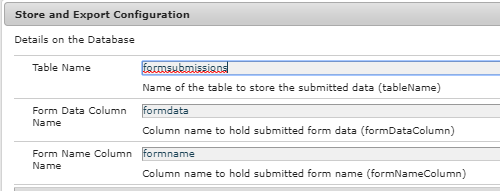

# Introduktion

Kunder vill vanligtvis exportera inskickade formulärdata i CSV-format. I den här artikeln beskrivs stegen som behövs för att exportera formulärdata i CSV-format. I den här artikeln förutsätts att de inskickade formulären lagras i RDBMS-tabellen. Skärmbilden nedan visar den minsta tabellstruktur som krävs för att lagra de inskickade formulären.

>[!NOTE]
>
>Det här exemplet fungerar bara med Adaptiv Forms som inte är baserad på schemat eller formulärdatamodellen


Som du ser är schemats namn en självstudiekurs.I det här schemat är det tabellformat som skickas med följande kolumner definierade

* formulärdata: Den här kolumnen innehåller skickade formulärdata
* formulärnamn: Den här kolumnen innehåller namnet på det skickade formuläret
* id: Det här är primärnyckeln och ställs in på automatisk ökning

Tabellnamnet och namnen på två kolumner visas som OSGi-konfigurationsegenskaper enligt skärmbilden nedan:

Koden läser dessa värden och skapar den SQL-fråga som ska köras. Följande fråga utförs till exempel baserat på värdena ovan

`SELECT formdata FROM aemformstutorial.formsubmissions where formname=timeoffrequestform`

I ovanstående fråga skickas namnet på formuläret(timeoffrequestForm) som request-parameter till serverleten.

## **Skapa OSGi-tjänst**

Följande OSGI-tjänst skapades för att exportera skickade data i CSV-format.

* Rad 37: Vi använder den poolade datakällan för Apache Sling-anslutningen.

* Rad 89: Detta är startpunkten till tjänsten. Metoden `getCSVFile(..)` har formName som indataparameter och hämtar skickade data som gäller det angivna formulärnamnet.

>[!NOTE]
>
>Koden förutsätter att du har definierat en sammanslagen datakälla med namnet&quot;aemformstutorial&quot; i Felix Web Console. Koden förutsätter också att du har ett schema i databasen som kallas aemformstutorial

```java
package com.aemforms.storeandexport.core;

import java.io.IOException;
import java.io.StringReader;
import java.sql.Connection;
import java.sql.PreparedStatement;
import java.sql.ResultSet;
import java.sql.SQLException;
import java.sql.Statement;
import java.util.ArrayList;
import java.util.List;

import javax.sql.DataSource;
import javax.xml.parsers.DocumentBuilder;
import javax.xml.parsers.DocumentBuilderFactory;
import javax.xml.parsers.ParserConfigurationException;
import javax.xml.xpath.XPath;
import javax.xml.xpath.XPathConstants;
import javax.xml.xpath.XPathExpressionException;
import javax.xml.xpath.XPathFactory;

import org.osgi.service.component.annotations.Component;
import org.osgi.service.component.annotations.Reference;
import org.slf4j.Logger;
import org.slf4j.LoggerFactory;
import org.w3c.dom.Document;
import org.w3c.dom.Node;
import org.w3c.dom.NodeList;
import org.xml.sax.InputSource;
import org.xml.sax.SAXException;

@Component(service = StoreAndExport.class)
public class StoreAndExportImpl implements StoreAndExport {

    private final Logger log = LoggerFactory.getLogger(getClass());
    @Reference
    StoreAndExportConfigurationService config;
    @Reference(target = "(&(objectclass=javax.sql.DataSource)(datasource.name=aemformstutorial))")
    private DataSource dataSource;

    private List<String> getRowValues(String row) {
        List<String> rowValues = new ArrayList<String>();
        //API to obtain DOM Document instance
        DocumentBuilderFactory factory = DocumentBuilderFactory.newInstance();
        DocumentBuilder builder = null;
        try {
            builder = factory.newDocumentBuilder();
            Document doc = builder.parse(new InputSource(new StringReader(row)));
            XPathFactory xpf = XPathFactory.newInstance();
            XPath xpath = xpf.newXPath();
            Node dataNode = (Node) xpath.evaluate("//afData/afUnboundData/data", doc, XPathConstants.NODE);
            NodeList dataElements = dataNode.getChildNodes();
            for (int i = 0; i < dataElements.getLength(); i++) {
                log.debug("The name of the node is" + dataElements.item(i).getNodeName() + " the node value is " + dataElements.item(i).getTextContent());
                rowValues.add(i, dataElements.item(i).getTextContent());
            }
            return rowValues;
        } catch (Exception e) {
            log.debug(e.getMessage());
        }
        return null;
    }

    private List<String> getHeaderValues(String row) {
        DocumentBuilderFactory factory = DocumentBuilderFactory.newInstance();
        List<String> rowValues = new ArrayList<String>();
        DocumentBuilder builder = null;
        try {
            //Create DocumentBuilder with default configuration
            builder = factory.newDocumentBuilder();
            Document doc = builder.parse(new InputSource(new StringReader(row)));
            XPathFactory xpf = XPathFactory.newInstance();
            XPath xpath = xpf.newXPath();
            Node dataNode = (Node) xpath.evaluate("//afData/afUnboundData/data", doc, XPathConstants.NODE);
            NodeList dataElements = dataNode.getChildNodes();
            for (int i = 0; i < dataElements.getLength(); i++) {
                rowValues.add(i, dataElements.item(i).getNodeName());
            }
            return rowValues;
        } catch (Exception e) {
            log.debug(e.getMessage());
        }
        return null;

    }

    @Override
    public StringBuilder getCSVFile(String formName) {
        log.debug("In get CSV File");
        String selectStatement = "SELECT " + config.getFORM_DATA_COLUMN() + " FROM aemformstutorial." + config.getTABLE_NAME() + " where " + config.getFORM_NAME_COLUMN() + "='" + formName + "'" + "";
        log.debug("The select statment is " + selectStatement);
        Connection con = getConnection();
        Statement st = null;
        ResultSet rs = null;
        CSVUtils csvUtils = new CSVUtils();
        try {
            st = con.createStatement();
            rs = st.executeQuery(selectStatement);
            log.debug("Got Result Set in getCSVFile");
            StringBuilder sb = new StringBuilder();
            while (rs.next()) {
                if (rs.isFirst()) {
                    sb = csvUtils.writeLine(getHeaderValues(rs.getString(1)), sb);
                }
                sb = csvUtils.writeLine(getRowValues(rs.getString(1)), sb);
                log.debug("$$$$The current strng buffer is " + sb.toString());
            }

            return sb;
        } catch (Exception e) {
            log.debug(e.getMessage());
        } finally {
            try {
                rs.close();
            } catch (Exception e) { /* ignored */ }
            try {
                st.close();
            } catch (Exception e) { /* ignored */ }
            try {
                con.close();
            } catch (Exception e) { /* ignored */ }
        }

        return null;

    }

    private Connection getConnection() {
        log.debug("Getting Connection ");
        Connection con = null;
        try {
            con = dataSource.getConnection();
            log.debug("got connection");
            return con;
        } catch (Exception e) {
            log.debug("not able to get connection ");
            log.debug(e.getMessage());
        }
        return null;
    }
    
    @Override
    public void inserFormData(String formData) {
        String formDataColumn = config.getFORM_DATA_COLUMN();
        String formNameColumn = config.getFORM_NAME_COLUMN();
        String tableName = config.getTABLE_NAME();
        String insertStatement = "Insert into aemformstutorial." + tableName + "(" + formDataColumn + "," + formNameColumn + ") VALUES(?,?)";
        log.debug("The insert statment is" + insertStatement);
        Connection con = getConnection();
        PreparedStatement pstmt = null;
        try {
            DocumentBuilderFactory factory = DocumentBuilderFactory.newInstance();
            DocumentBuilder builder = null;
            builder = factory.newDocumentBuilder();
            Document xmlDoc = builder.parse(new InputSource(new StringReader(formData)));
            XPath xPath = javax.xml.xpath.XPathFactory.newInstance().newXPath();
            org.w3c.dom.Node submittedFormNameNode = (org.w3c.dom.Node) xPath.compile("/afData/afSubmissionInfo/afPath").evaluate(xmlDoc, javax.xml.xpath.XPathConstants.NODE);
            String paths[] = submittedFormNameNode.getTextContent().split("/");
            String formName = paths[paths.length - 1];
            log.debug("The form name submiited is" + formName);
            pstmt = null;
            pstmt = con.prepareStatement(insertStatement);
            pstmt.setString(1, formData);
            pstmt.setString(2, formName);
            log.debug("Executing the insert statment  " + pstmt.execute());
            con.commit();
        } catch (SQLException e) {
            log.debug(e.getMessage());
        } catch (ParserConfigurationException e) {
            log.debug(e.getMessage());
        } catch (SAXException e) {
            log.debug(e.getMessage());
        } catch (IOException e) {
            log.debug(e.getMessage());
        } catch (XPathExpressionException e) {
            log.debug(e.getMessage());
        } finally {
            try {
                pstmt.close();
            } catch (Exception e) { /* ignored */ }
            try {
                con.close();
            } catch (Exception e) { /* ignored */ }
        }
    }
}
```

## Konfigurationstjänst

Vi har exponerat följande tre egenskaper som OSGI-konfigurationsegenskaper. SQL-frågan konstrueras genom att dessa värden läses vid körning.

```java
package com.aemforms.storeandexport.core;

import org.osgi.service.metatype.annotations.AttributeDefinition;
import org.osgi.service.metatype.annotations.ObjectClassDefinition;

@ObjectClassDefinition(name="Store and Export Configuration", description = "Details on the Database ")
public @interface StoreAndExportConfiguration {
    @AttributeDefinition(name = "Table Name", description = "Name of the table to store the submitted data")
    String tableName() default "formsubmissions";

    @AttributeDefinition(name = "Form Data Column Name", description = "Column name to hold submitted form data")
    String formDataColumn() default "formdata";

    @AttributeDefinition(name = "Form Name Column Name", description = "Column name to hold submitted form name")
    String formNameColumn() default "formname";
}
```

## Servlet

Nedan följer serverkoden som anropar tjänstens `getCSVFile(..)`-metod. Tjänsten returnerar StringBuffer-objektet som sedan direktuppspelas tillbaka till det anropande programmet

```java
package com.aemforms.storeandexport.core.servlets;

import java.io.IOException;
import javax.servlet.Servlet;
import javax.servlet.ServletOutputStream;

import org.apache.sling.api.SlingHttpServletRequest;
import org.apache.sling.api.SlingHttpServletResponse;
import org.apache.sling.api.servlets.SlingAllMethodsServlet;
import org.osgi.service.component.annotations.Component;
import org.osgi.service.component.annotations.Reference;
import com.aemforms.storeandexport.core.StoreAndExport;

@Component(
        service = {Servlet.class}, 
        property = {"sling.servlet.methods=get", "sling.servlet.paths=/bin/streamformdata"}
)
public class StreamCSVFile extends SlingAllMethodsServlet {
    private static final long serialVersionUID = -3703364266795135086L;

    @Reference
    StoreAndExport createCSVFile;

    protected void doGet(SlingHttpServletRequest request, SlingHttpServletResponse response) {
        StringBuilder stringToStream = createCSVFile.getCSVFile(request.getParameter("formName"));
        response.setHeader("Content-Type", "text/csv");
        response.setHeader("Content-Disposition", "attachment;filename=\"formdata.csv\"");
        try {
            final ServletOutputStream sout = response.getOutputStream();
            sout.print(stringToStream.toString());
        } catch (IOException e) {
            log.debug(e.getMessage());
        }
    }
}
```

### Distribuera på servern

* Importera [SQL-filen](assets/formsubmissions.sql) till MySQL-servern med MySQL Workbench. Schemat **aemformstutorial** skapas och tabellen **formsending** anropas med exempeldata.
* Distribuera [OSGi Bundle](assets/store-export.jar) med Felix webbkonsol
* [För att hämta TimeOffRequest-överföringar](http://localhost:4502/bin/streamformdata?formName=timeoffrequestform). Du bör få CSV-filen strömmad tillbaka till dig.
